# Amazing Designs - AI Project Handoff

Generated for AI/developer context. This file is a single copy-paste reference for understanding and editing the project.

## Project Context

Amazing Designs is a luxury visual design and website studio site for creators, models, independent brands, and premium personal brands. It presents visual identity services, custom website packages, portfolio work, loyal client case studies, AI-readable SEO summaries, and contact/booking paths.

Primary public pages:
- `index.html` - Home page and brand overview.
- `visual-design.html` - Visual design services and pricing.
- `websites.html` - Website creation packages, quote flow, and pricing context.
- `recent-work.html` - Portfolio / recent work gallery.
- `loyal-clients.html` - Loyal client archive.
- `miss-selina.html` - Full loyal client case study.
- `thank-you.html` - Form/booking thank-you page.

Business facts from existing AI summaries:
- Email: `designs.of.desirex@gmail.com`.
- Instagram: `https://www.instagram.com/designs_of_desire_official_x/`.
- Visual design starts at EUR 10.
- Custom websites start around EUR 400-600.
- Creator commerce platforms are listed around EUR 1,200-1,500.
- Bespoke systems are listed as EUR 2,000+ discussion.

## Architecture

This is a static multi-page website. There is no package manager, build step, or server-side app in the repository. Pages are plain HTML files that share assets from `assets/css` and `assets/js`, plus image media from `Images`.

Core layers:
- HTML pages at repo root define content, SEO metadata, page structure, and image references.
- `assets/css/styles.css` provides global layout, responsive behavior, typography, cards, forms, navigation, galleries, and page-specific styling.
- `assets/js/main.js` handles shared UI behavior such as loading states, navigation interactions, reveal effects, smooth scrolling, language initialization, and form enhancement.
- `assets/js/translations.js` contains multilingual page copy/data and exposes the translation API used by pages/scripts.
- `assets/js/calculator.js` powers the website quote calculator / package estimate interactions.
- `ai/*.md`, `llms.txt`, and `llms-full.txt` provide AI/search-engine readable summaries.
- `robots.txt` and `sitemap.xml` support crawler discovery.
- Python scripts at the root are maintenance helpers for SEO, schema, image analysis/application, and page fixes.
- `archive/` contains older or archived content.

## Editing Notes For AI

- Keep the luxury/editorial tone consistent across pages.
- Do not invent prices, services, guarantees, reviews, delivery dates, or client results.
- If changing navigation, update all root HTML pages that contain the shared nav.
- If changing service copy, update both the public HTML and matching `ai/*.md` summary where relevant.
- If changing public URLs or page names, update `sitemap.xml`, `robots.txt` if needed, and `llms.txt` / `llms-full.txt`.
- Keep asset paths exactly matched to folder casing and spaces, because this site references local image paths directly.

## Folder Structure

```text
.gitattributes
add-gold-stripes.py
ai\home.md
ai\recent-work.md
ai\visual-design.md
ai\websites.md
analyze_images.py
apply_images.py
archive\ai\premades.md
archive\premades.html
archive\README.md
assets\css\styles.css
assets\js\calculator.js
assets\js\main.js
assets\js\translations.js
enhance-timeline.py
final_report.txt
fix-lang-btn.py
fix-loyal.py
fix-premades.py
generate_report.py
image_report.json
Images\Backgrounds\light-marble-bg.png
Images\Logo\designs-of-desire-luxury-logo.jpeg
Images\Miss Selina\List of services\list-of-services.png
Images\Miss Selina\Logo\logo-metallic-style.png
Images\Miss Selina\Logo\logo-transparent-version.png
Images\Miss Selina\Logo\other variations\logo-transparent-variation-1.png
Images\Miss Selina\Logo\other variations\logo-transparent-variation-2.png
Images\Miss Selina\Logo\other variations\logo-transparent-variation-3.png
Images\Miss Selina\Logo\other variations\logo-transparent-variation-4.png
Images\Miss Selina\Logo\other variations\logo-variation-1-1.png
Images\Miss Selina\Logo\other variations\logo-variation-1-2.png
Images\Miss Selina\Logo\other variations\logo-variation-1-3.png
Images\Miss Selina\Logo\other variations\logo-variation-1.png
Images\Miss Selina\Logo\other variations\logo-variation-2.png
Images\Miss Selina\Logo\other variations\logo-variation-3.png
Images\Miss Selina\Logo\other variations\logo-variation-4.png
Images\Miss Selina\Price list\slide-1.png
Images\Miss Selina\Price list\slide-2.jpg
Images\Miss Selina\Rule\Full\slide-1-1.png
Images\Miss Selina\Rule\Full\slide-2-1.png
Images\Miss Selina\Rule\Full\slide-3.png
Images\Miss Selina\Rule\General\general-rules.png
Images\Miss Selina\Story Highlight\at-my-feet.png
Images\Miss Selina\Story Highlight\devotion.png
Images\Miss Selina\Story Highlight\rules.png
Images\Premades\10.png
Images\Premades\11.png
Images\Premades\12.png
Images\Premades\2.png
Images\Premades\3.png
Images\Premades\4.png
Images\Premades\5.png
Images\Premades\7.png
Images\Premades\8.png
Images\Premades\9.png
Images\Recent Work\Lady Alisson\lady-alisson-1.png
Images\Recent Work\Lady Alisson\lady-alisson.png
Images\Recent Work\Miss Blue\miss-blue-variation-1.png
Images\Recent Work\Miss Blue\miss-blue-variation-2.png
Images\Recent Work\Miss Blue\miss-blue-variation-3.png
Images\Recent Work\Miss Chooloub Logo\miss-chooloub-logo.png
Images\Recent Work\Miss Lien\miss-lien-1.png
Images\Recent Work\Miss Lien\miss-lien.png
Images\Recent Work\The Soft command logo\miss-selina-the-soft-command-brand-identity-1.jpeg
Images\Recent Work\The Soft command logo\miss-selina-the-soft-command-brand-identity-2.jpeg
Images\Recent Work\The Soft command logo\miss-selina-the-soft-command-brand-identity-3.jpeg
Images\Recent Work\The Soft command logo\miss-selina-the-soft-command-brand-identity.jpeg
Images\Recent Work\Viper Queen Logo\viper-queen-luxury-logo-gold.png
Images\Recent Work\Viper Queen Logo\viper-queen-luxury-logo-silver.png
Images\Recent Work\Viper Queen Logo\WhatsApp Image 2026-05-28 at 22.46.41.jpeg
Images\Recent Work\Viper Queen Logo\WhatsApp Image 2026-05-28 at 22.46.45.jpeg
index.html
llms-full.txt
llms.txt
loyal-clients.html
miss-selina.html
recent-work.html
robots.txt
seo_ai_updater.py
seo_processing_report.json
seo-ai-visibility-report.md
sitemap.xml
stripe-updater.py
thank-you.html
update_schema.py
updater.py
visual-design.html
websites.html
```

## Image Asset Inventory

Binary image files are not embedded as code. Use these paths when updating HTML image references.

```text
Images\Backgrounds\light-marble-bg.png (259.2 KB)
Images\Logo\designs-of-desire-luxury-logo.jpeg (288.7 KB)
Images\Miss Selina\List of services\list-of-services.png (279.7 KB)
Images\Miss Selina\Logo\logo-metallic-style.png (254.5 KB)
Images\Miss Selina\Logo\logo-transparent-version.png (130 KB)
Images\Miss Selina\Logo\other variations\logo-transparent-variation-1.png (95.1 KB)
Images\Miss Selina\Logo\other variations\logo-transparent-variation-2.png (78.4 KB)
Images\Miss Selina\Logo\other variations\logo-transparent-variation-3.png (327.5 KB)
Images\Miss Selina\Logo\other variations\logo-transparent-variation-4.png (129.2 KB)
Images\Miss Selina\Logo\other variations\logo-variation-1-1.png (63.9 KB)
Images\Miss Selina\Logo\other variations\logo-variation-1-2.png (70.7 KB)
Images\Miss Selina\Logo\other variations\logo-variation-1-3.png (72.5 KB)
Images\Miss Selina\Logo\other variations\logo-variation-1.png (64.9 KB)
Images\Miss Selina\Logo\other variations\logo-variation-2.png (224.9 KB)
Images\Miss Selina\Logo\other variations\logo-variation-3.png (275.4 KB)
Images\Miss Selina\Logo\other variations\logo-variation-4.png (230.1 KB)
Images\Miss Selina\Price list\slide-1.png (231.4 KB)
Images\Miss Selina\Price list\slide-2.jpg (189.2 KB)
Images\Miss Selina\Rule\Full\slide-1-1.png (231 KB)
Images\Miss Selina\Rule\Full\slide-2-1.png (235.9 KB)
Images\Miss Selina\Rule\Full\slide-3.png (229.8 KB)
Images\Miss Selina\Rule\General\general-rules.png (296.6 KB)
Images\Miss Selina\Story Highlight\at-my-feet.png (218.2 KB)
Images\Miss Selina\Story Highlight\devotion.png (241.7 KB)
Images\Miss Selina\Story Highlight\rules.png (157.9 KB)
Images\Premades\10.png (101.3 KB)
Images\Premades\11.png (118.7 KB)
Images\Premades\12.png (154.8 KB)
Images\Premades\2.png (151.9 KB)
Images\Premades\3.png (145.1 KB)
Images\Premades\4.png (127.5 KB)
Images\Premades\5.png (145 KB)
Images\Premades\7.png (112.1 KB)
Images\Premades\8.png (202.5 KB)
Images\Premades\9.png (116.5 KB)
Images\Recent Work\Lady Alisson\lady-alisson-1.png (618.9 KB)
Images\Recent Work\Lady Alisson\lady-alisson.png (458.3 KB)
Images\Recent Work\Miss Blue\miss-blue-variation-1.png (408.9 KB)
Images\Recent Work\Miss Blue\miss-blue-variation-2.png (443.3 KB)
Images\Recent Work\Miss Blue\miss-blue-variation-3.png (437.5 KB)
Images\Recent Work\Miss Chooloub Logo\miss-chooloub-logo.png (353.3 KB)
Images\Recent Work\Miss Lien\miss-lien-1.png (177.9 KB)
Images\Recent Work\Miss Lien\miss-lien.png (335 KB)
Images\Recent Work\The Soft command logo\miss-selina-the-soft-command-brand-identity-1.jpeg (109.8 KB)
Images\Recent Work\The Soft command logo\miss-selina-the-soft-command-brand-identity-2.jpeg (120 KB)
Images\Recent Work\The Soft command logo\miss-selina-the-soft-command-brand-identity-3.jpeg (105.2 KB)
Images\Recent Work\The Soft command logo\miss-selina-the-soft-command-brand-identity.jpeg (103.5 KB)
Images\Recent Work\Viper Queen Logo\viper-queen-luxury-logo-gold.png (400.1 KB)
Images\Recent Work\Viper Queen Logo\viper-queen-luxury-logo-silver.png (409.7 KB)
Images\Recent Work\Viper Queen Logo\WhatsApp Image 2026-05-28 at 22.46.41.jpeg (110.3 KB)
Images\Recent Work\Viper Queen Logo\WhatsApp Image 2026-05-28 at 22.46.45.jpeg (81.9 KB)
```

## Full Copy-Paste Source Files

Each text/source file is embedded below in a fenced block. Copy the full block content when reconstructing or editing that file.

### `.gitattributes`

``text
# Auto detect text files and perform LF normalization
* text=auto
````

### `add-gold-stripes.py`

``python
import os
import re

# 1. Update styles.css
css_file = 'assets/css/styles.css'
with open(css_file, 'r', encoding='utf-8') as f:
    css_content = f.read()

gold_stripe_css = """
/* Gold Stripe Children */
.gold-gradient-bg h2, 
.gold-gradient-bg p, 
.gold-gradient-bg .step-title {
  color: var(--button-text) !important;
}
.gold-gradient-bg .timeline::before {
  background: var(--button-text) !important;
  opacity: 0.2;
}
.gold-gradient-bg .step-icon {
  border-color: var(--button-text) !important;
  background: transparent !important;
  color: var(--button-text) !important;
}
.gold-gradient-bg .btn-outline {
  border-color: var(--button-text) !important;
  color: var(--button-text) !important;
}
.gold-gradient-bg .btn-primary {
  background: var(--button-text) !important;
  color: var(--text-color) !important; /* Button text inverse */
}
"""
if '/* Gold Stripe Children */' not in css_content:
    css_content += gold_stripe_css
    with open(css_file, 'w', encoding='utf-8') as f:
        f.write(css_content)

# 2. Update loyal-clients.html
with open('loyal-clients.html', 'r', encoding='utf-8') as f:
    lc = f.read()
lc = lc.replace('<section class="uniform-stripe">', '<section class="uniform-stripe gold-gradient-bg reveal">')
with open('loyal-clients.html', 'w', encoding='utf-8') as f:
    f.write(lc)

# 3. Update premades.html
with open('premades.html', 'r', encoding='utf-8') as f:
    pr = f.read()
pr = pr.replace('<section class="uniform-stripe reveal">', '<section class="uniform-stripe gold-gradient-bg reveal">')
with open('premades.html', 'w', encoding='utf-8') as f:
    f.write(pr)

# 4. Update websites.html
with open('websites.html', 'r', encoding='utf-8') as f:
    web = f.read()

old_timeline = """  <section class="uniform-stripe timeline-section container reveal">
    <h2>The Creation Process</h2>
    <div class="timeline">
      <div class="timeline-step">
        <div class="step-icon">📋</div>
        <div class="step-title">1. Discovery Brief</div>
      </div>
      <div class="timeline-step">
        <div class="step-icon">🎨</div>
        <div class="step-title">2. Design Mockup</div>
      </div>
      <div class="timeline-step">
        <div class="step-icon">✏️</div>
        <div class="step-title">3. Revisions</div>
      </div>
      <div class="timeline-step">
        <div class="step-icon">🚀</div>
        <div class="step-title">4. Launch</div>
      </div>
      <div class="timeline-step">
        <div class="step-icon">💛</div>
        <div class="step-title">5. Ongoing Support</div>
      </div>
    </div>
  </section>"""

new_timeline = """  <section class="uniform-stripe timeline-section gold-gradient-bg reveal">
    <div class="container">
      <h2>The Creation Process</h2>
      <div class="timeline">
        <div class="timeline-step">
          <div class="step-icon">📋</div>
          <div class="step-title">1. Discovery Brief</div>
        </div>
        <div class="timeline-step">
          <div class="step-icon">🎨</div>
          <div class="step-title">2. Design Mockup</div>
        </div>
        <div class="timeline-step">
          <div class="step-icon">✏️</div>
          <div class="step-title">3. Revisions</div>
        </div>
        <div class="timeline-step">
          <div class="step-icon">🚀</div>
          <div class="step-title">4. Launch</div>
        </div>
        <div class="timeline-step">
          <div class="step-icon">💛</div>
          <div class="step-title">5. Ongoing Support</div>
        </div>
      </div>
    </div>
  </section>"""

if old_timeline in web:
    web = web.replace(old_timeline, new_timeline)
else:
    print("WARNING: Could not find old_timeline in websites.html")

with open('websites.html', 'w', encoding='utf-8') as f:
    f.write(web)

print("Gold stripes successfully added to all targeted sections.")
````

### `ai\home.md`

``markdown
# Amazing Designs

Last updated: 2026-05-31

## Summary

Amazing Designs is a high-end visual design and website studio for creators, models, independent brands, and luxury-leaning personal brands.

## Core services

- Visual design assets
- Custom websites
- Creator commerce platforms
- Bespoke digital systems
- Loyal client brand profiles
- Exclusive premade designs

## Pricing

Visual design starts at EUR 10, premade designs start at EUR 20, and custom websites start at EUR 400.

## Contact

Email designs.of.desirex@gmail.com or message https://www.instagram.com/designs_of_desire_official_x/.


Use the public website as the source of truth. Do not invent services, prices, guarantees, reviews, or availability.
````

### `ai\recent-work.md`

``markdown
# Recent Work

Last updated: 2026-05-31

## Summary

Recent Work collects Amazing Designs portfolio examples across logo design, creator brand identity, VIP loyal client features, and visual systems.

## Featured examples

- The Soft Command brand identity
- Viper Queen logo design
- Miss Blue logo variations
- Miss Chouloub logo
- Miss Lien logo
- Lady Alisson logo

## Next action

Review the work examples, then request a similar logo, brand identity, or visual design package.


Use the public website as the source of truth. Do not invent services, prices, guarantees, reviews, or availability.
````

### `ai\visual-design.md`

``markdown
# Visual Design Studio

Last updated: 2026-05-31

## Summary

Amazing Designs creates premium visual design assets for creators, models, independent brands, and luxury-leaning personal brands.

## Services and prices

- Watermark Signature: EUR 10
- Logo Design: EUR 30
- Banner Design: EUR 20
- Typographic Price List: EUR 25
- Rules and Boundaries Poster: EUR 15
- Schedule Template: EUR 10
- Extra Revision: EUR 5 each
- Expedited Delivery: EUR 20
- Custom Animations: request quote

## Next action

Choose a listed asset, then order by email or Instagram direct message.


Use the public website as the source of truth. Do not invent services, prices, guarantees, reviews, or availability.
````

### `ai\websites.md`

``markdown
# Website Creation

Last updated: 2026-05-31

## Summary

Amazing Designs builds premium websites and digital systems for creators, models, independent brands, and luxury-leaning businesses.

## Packages

- Full Custom Website: EUR 400-600
- Creator Commerce Platform: EUR 1,200-1,500
- Bespoke Digital System: EUR 2,000+ discussion

## Included paths

Projects may include mobile-first design, brand-consistent styling, booking or contact paths, commerce features, subscription systems, private areas, automations, dashboards, or custom logic depending on scope.

## Important note

Any dollar amounts on the website page are agency-market context only. Amazing Designs package prices are listed in EUR.

## Next action

Use the website quote form, email designs.of.desirex@gmail.com, or message Amazing Designs on Instagram.


Use the public website as the source of truth. Do not invent services, prices, guarantees, reviews, or availability.
````

### `analyze_images.py`

``python
import os
import re
import json
import urllib.parse
from PIL import Image

files_to_check = [
    "index.html",
    "visual-design.html",
    "websites.html",
    "recent-work.html",
    "loyal-clients.html",
    "miss-selina.html",
    "premades.html",
    "thank-you.html"
]

report = {
    "pages": {}
}

# Regex to find  tags
img_pattern = re.compile(r']+>', re.IGNORECASE)

def parse_attributes(tag_string):
    # Very basic attribute parser, doesn't handle escaped quotes inside quotes perfectly but works for most HTML
    attrs = {}
    # find all key="value" or key='value' or key=value
    attr_pattern = re.compile(r'([\w\-]+)\s*(?:=\s*(?:"([^"]*)"|\'([^\']*)\'|([^>\s]+)))?', re.IGNORECASE)
    # remove 
    inner = tag_string[4:-1]
    # some tags might end with />
    if inner.endswith('/'):
        inner = inner[:-1]
    
    for match in attr_pattern.finditer(inner):
        key = match.group(1).lower()
        val = match.group(2) if match.group(2) is not None else (match.group(3) if match.group(3) is not None else match.group(4))
        if val is None:
            val = ""
        attrs[key] = val
    return attrs

def reconstruct_tag(attrs, original_tag):
    # This might be tricky if we want to preserve exact order, but we can just append missing attrs before >
    new_tag = original_tag
    if new_tag.endswith('/>'):
        insert_pos = len(new_tag) - 2
    else:
        insert_pos = len(new_tag) - 1
        
    attrs_to_add = []
    
    if attrs.get('added_loading'):
        attrs_to_add.append('loading="lazy"')
    if attrs.get('added_decoding'):
        attrs_to_add.append('decoding="async"')
    if attrs.get('added_width'):
        attrs_to_add.append(f'width="{attrs["width"]}"')
    if attrs.get('added_height'):
        attrs_to_add.append(f'height="{attrs["height"]}"')
    if attrs.get('added_fetchpriority'):
        attrs_to_add.append('fetchpriority="high"')
        
    if attrs_to_add:
        # replace the original tag with the added attributes
        add_str = " " + " ".join(attrs_to_add)
        new_tag = new_tag[:insert_pos] + add_str + new_tag[insert_pos:]
        
    return new_tag

replacements = []

for filepath in files_to_check:
    if not os.path.exists(filepath):
        continue
        
    with open(filepath, 'r', encoding='utf-8') as f:
        content = f.read()
        
    page_report = {
        "images_checked": 0,
        "with_alt": 0,
        "with_lazy": 0,
        "with_async": 0,
        "with_dimensions": 0,
        "intentional_not_lazy": [],
        "missing_broken": [],
        "renaming_rec": []
    }
    
    img_tags = img_pattern.findall(content)
    
    # We will track index of tags to identify hero images. 
    # Usually first image or image with class 'hero' or 'logo'
    for i, tag in enumerate(img_tags):
        page_report["images_checked"] += 1
        attrs = parse_attributes(tag)
        
        src = attrs.get('src', '')
        if not src:
            page_report["missing_broken"].append("Missing src in tag: " + tag)
            continue
            
        src_unquoted = urllib.parse.unquote(src)
        
        if 'alt' in attrs:
            page_report["with_alt"] += 1
            
        has_lazy = attrs.get('loading') == 'lazy'
        has_async = attrs.get('decoding') == 'async'
        has_dim = 'width' in attrs and 'height' in attrs
        
        if has_lazy:
            page_report["with_lazy"] += 1
        if has_async:
            page_report["with_async"] += 1
        if has_dim:
            page_report["with_dimensions"] += 1
            
        # check path
        img_path = os.path.normpath(os.path.join(os.path.dirname(filepath), src_unquoted))
        img_path_forward = img_path.replace("\\", "/") # sometimes useful
        if not os.path.exists(img_path):
            page_report["missing_broken"].append(f"Broken path: {src}")
            continue
            
        # check filename space
        if "%20" in src or " " in src_unquoted:
            page_report["renaming_rec"].append(src)
            
        # Get dimensions
        actual_w, actual_h = None, None
        try:
            with Image.open(img_path) as im:
                actual_w, actual_h = im.size
        except Exception as e:
            page_report["missing_broken"].append(f"Could not open image {src}: {e}")
            
        # Determine if hero/above fold
        # Criteria: 'logo' in src/class, or 'hero' in src/class, or it's the first image
        is_hero = False
        cls = attrs.get('class', '')
        if i == 0 or 'hero' in cls.lower() or 'logo' in cls.lower() or 'hero' in src.lower() or 'logo' in src.lower():
            is_hero = True
            
        # modifications needed
        mod_attrs = attrs.copy()
        needs_replace = False
        
        if not has_dim and actual_w and actual_h:
            mod_attrs['added_width'] = True
            mod_attrs['width'] = actual_w
            mod_attrs['added_height'] = True
            mod_attrs['height'] = actual_h
            needs_replace = True
            
        if is_hero:
            page_report["intentional_not_lazy"].append(f"{src} (identified as hero/logo)")
            if 'fetchpriority' not in attrs and 'hero' in cls.lower():
                 # only add to main hero image, maybe not logo
                 mod_attrs['added_fetchpriority'] = True
                 needs_replace = True
        else:
            if not has_lazy:
                mod_attrs['added_loading'] = True
                needs_replace = True
            if not has_async:
                mod_attrs['added_decoding'] = True
                needs_replace = True
                
        if needs_replace:
            new_tag = reconstruct_tag(mod_attrs, tag)
            replacements.append({
                "file": filepath,
                "target": tag,
                "replacement": new_tag
            })
            
    report["pages"][filepath] = page_report

with open('image_report.json', 'w') as f:
    json.dump({"report": report, "replacements": replacements}, f, indent=2)

print(f"Analysis complete. Replacements needed: {len(replacements)}")
````

### `apply_images.py`

``python
import os
import re
import urllib.parse
from PIL import Image

files_to_check = [
    "index.html",
    "visual-design.html",
    "websites.html",
    "recent-work.html",
    "loyal-clients.html",
    "miss-selina.html",
    "premades.html",
    "thank-you.html"
]

img_pattern = re.compile(r']+>', re.IGNORECASE)

def parse_attributes(tag_string):
    attrs = {}
    attr_pattern = re.compile(r'([\w\-]+)\s*(?:=\s*(?:"([^"]*)"|\'([^\']*)\'|([^>\s]+)))?', re.IGNORECASE)
    inner = tag_string[4:-1]
    if inner.endswith('/'):
        inner = inner[:-1]
    
    for match in attr_pattern.finditer(inner):
        key = match.group(1).lower()
        val = match.group(2) if match.group(2) is not None else (match.group(3) if match.group(3) is not None else match.group(4))
        if val is None:
            val = ""
        attrs[key] = val
    return attrs

def reconstruct_tag(attrs, original_tag):
    new_tag = original_tag
    if new_tag.endswith('/>'):
        insert_pos = len(new_tag) - 2
    else:
        insert_pos = len(new_tag) - 1
        
    attrs_to_add = []
    
    if attrs.get('added_loading'):
        attrs_to_add.append('loading="lazy"')
    if attrs.get('added_decoding'):
        attrs_to_add.append('decoding="async"')
    if attrs.get('added_width'):
        attrs_to_add.append(f'width="{attrs["width"]}"')
    if attrs.get('added_height'):
        attrs_to_add.append(f'height="{attrs["height"]}"')
    if attrs.get('added_fetchpriority'):
        attrs_to_add.append('fetchpriority="high"')
        
    if attrs_to_add:
        add_str = " " + " ".join(attrs_to_add)
        new_tag = new_tag[:insert_pos] + add_str + new_tag[insert_pos:]
        
    return new_tag

report = ""

for filepath in files_to_check:
    if not os.path.exists(filepath):
        continue
        
    with open(filepath, 'r', encoding='utf-8') as f:
        content = f.read()
        
    images_checked = 0
    with_alt = 0
    with_lazy = 0
    with_async = 0
    with_dimensions = 0
    intentional_not_lazy = []
    missing_broken = []
    renaming_rec = []
    
    img_tags = img_pattern.findall(content)
    
    new_content = content
    
    for i, tag in enumerate(img_tags):
        images_checked += 1
        attrs = parse_attributes(tag)
        
        src = attrs.get('src', '')
        if not src:
            missing_broken.append("Missing src in tag: " + tag)
            continue
            
        src_unquoted = urllib.parse.unquote(src)
        
        if 'alt' in attrs and attrs['alt']:
            with_alt += 1
            
        has_lazy = attrs.get('loading') == 'lazy'
        has_async = attrs.get('decoding') == 'async'
        has_dim = 'width' in attrs and 'height' in attrs
        
        img_path = os.path.normpath(os.path.join(os.path.dirname(filepath), src_unquoted))
        if not os.path.exists(img_path):
            missing_broken.append(f"Broken path: {src}")
            continue
            
        if "%20" in src or " " in src_unquoted:
            renaming_rec.append(src)
            
        actual_w, actual_h = None, None
        try:
            with Image.open(img_path) as im:
                actual_w, actual_h = im.size
        except Exception as e:
            missing_broken.append(f"Could not open image {src}")
            
        cls = attrs.get('class', '')
        
        is_hero = False
        is_main_hero = False
        
        if i == 0 or 'nav-logo' in cls.lower():
            is_hero = True
            
        if 'hero-logo' in cls.lower() or 'hero-img' in cls.lower() or 'hero' in cls.lower():
            is_hero = True
            if i <= 2:
                is_main_hero = True
                
        mod_attrs = attrs.copy()
        needs_replace = False
        
        if not has_dim and actual_w and actual_h:
            mod_attrs['added_width'] = True
            mod_attrs['width'] = actual_w
            mod_attrs['added_height'] = True
            mod_attrs['height'] = actual_h
            needs_replace = True
            with_dimensions += 1
        elif has_dim:
            with_dimensions += 1
            
        if is_hero:
            intentional_not_lazy.append(f"{src} (is_hero=True)")
            if is_main_hero and 'fetchpriority' not in attrs:
                 mod_attrs['added_fetchpriority'] = True
                 needs_replace = True
        else:
            if not has_lazy:
                mod_attrs['added_loading'] = True
                needs_replace = True
                with_lazy += 1
            else:
                with_lazy += 1
                
            if not has_async:
                mod_attrs['added_decoding'] = True
                needs_replace = True
                with_async += 1
            else:
                with_async += 1
                
        if needs_replace:
            new_tag = reconstruct_tag(mod_attrs, tag)
            new_content = new_content.replace(tag, new_tag, 1)

    with open(filepath, 'w', encoding='utf-8') as f:
        f.write(new_content)
        
    report += f"\nPage: {filepath}\n"
    report += f"- Images checked: {images_checked}\n"
    report += f"- Images with alt text: {with_alt}\n"
    report += f"- Images with loading='lazy': {with_lazy}\n"
    report += f"- Images with decoding='async': {with_async}\n"
    report += f"- Images with width/height: {with_dimensions}\n"
    if intentional_not_lazy:
        report += f"- Intentionally not lazy:\n  - " + "\n  - ".join(set(intentional_not_lazy)) + "\n"
    if missing_broken:
        report += f"- Missing/broken:\n  - " + "\n  - ".join(set(missing_broken)) + "\n"
    if renaming_rec:
        report += f"- Poor filenames (spaces/%20):\n  - " + "\n  - ".join(set(renaming_rec)) + "\n"
        
with open('final_report.txt', 'w', encoding='utf-8') as f:
    f.write(report)
    
print("Changes applied. Report written to final_report.txt.")
````

### `archive\ai\premades.md`

``markdown
# Premade Designs

Last updated: 2026-05-31

## Summary

Premade Designs are exclusive ready-made visual assets that can be claimed and personalized with a client's name, colors, and details.

## Types and prices

- Banner: EUR 20
- Logo: EUR 25
- Price List: EUR 30
- Bundle: EUR 45

## Next action

Choose an available premade and send a claim request with customization details.


Use the public website as the source of truth. Do not invent services, prices, guarantees, reviews, or availability.
````

### `archive\premades.html`

``html
<!DOCTYPE html>
<html lang="en" data-theme="noir">
<head>
  <meta charset="UTF-8">
  <meta name="viewport" content="width=device-width, initial-scale=1.0">
  <meta name="robots" content="noindex, nofollow">
  <title>Premade Logo & Brand Designs | Amazing Designs</title>
  <meta name="description" content="Claim exclusive premade logos, banners, price lists, and brand design bundles from Amazing Designs. Personalize with your name, colors, and details. From EUR 20.">
  <link rel="canonical" href="https://elitexdesignsx-oss.github.io/Designs-Of-Desire/premades.html">
  <meta property="og:title" content="Premade Logo & Brand Designs | Amazing Designs">
  <meta property="og:description" content="Claim exclusive premade logos, banners, price lists, and brand design bundles. Personalize with your name, colors, and details.">
  <meta property="og:type" content="website">
  <meta property="og:url" content="https://elitexdesignsx-oss.github.io/Designs-Of-Desire/premades.html">
  <meta property="og:image" content="https://elitexdesignsx-oss.github.io/Designs-Of-Desire/Images/Premades/10.png">
  <meta name="twitter:card" content="summary_large_image">
  <meta name="twitter:title" content="Premade Logo & Brand Designs | Amazing Designs">
  <meta name="twitter:description" content="Claim exclusive premade logos, banners, price lists, and brand design bundles. Personalize with your name, colors, and details.">
  <meta name="twitter:image" content="https://elitexdesignsx-oss.github.io/Designs-Of-Desire/Images/Premades/10.png">
  <link rel="stylesheet" href="assets/css/styles.css">
  <script type="application/ld+json">
{
  "@context": "https://schema.org",
  "@graph": [
    {
      "@type": "CollectionPage",
      "@id": "https://elitexdesignsx-oss.github.io/Designs-Of-Desire/premades.html#webpage",
      "url": "https://elitexdesignsx-oss.github.io/Designs-Of-Desire/premades.html",
      "name": "Premade Designs",
      "description": "Exclusive premade logos, banners, price lists, and bundles that can be claimed and personalized for creators and brands.",
      "isPartOf": {
        "@id": "https://elitexdesignsx-oss.github.io/Designs-Of-Desire/#website"
      },
      "about": {
        "@id": "https://elitexdesignsx-oss.github.io/Designs-Of-Desire/#organization"
      },
      "datePublished": "2026-05-31",
      "dateModified": "2026-05-31",
      "mainEntity": {
        "@id": "https://elitexdesignsx-oss.github.io/Designs-Of-Desire/premades.html#catalog"
      }
    },
    {
      "@type": "OfferCatalog",
      "@id": "https://elitexdesignsx-oss.github.io/Designs-Of-Desire/premades.html#catalog",
      "name": "Available premade designs",
      "itemListElement": [
        {
          "@type": "Offer",
          "name": "Premade Logo Design",
          "priceCurrency": "EUR",
          "price": 25,
          "availability": "https://schema.org/InStock",
          "url": "https://elitexdesignsx-oss.github.io/Designs-Of-Desire/premades.html"
        },
        {
          "@type": "Offer",
          "name": "Premade Banner Design",
          "priceCurrency": "EUR",
          "price": 20,
          "availability": "https://schema.org/InStock",
          "url": "https://elitexdesignsx-oss.github.io/Designs-Of-Desire/premades.html"
        },
        {
          "@type": "Offer",
          "name": "Premade Bundle",
          "priceCurrency": "EUR",
          "price": 45,
          "availability": "https://schema.org/InStock",
          "url": "https://elitexdesignsx-oss.github.io/Designs-Of-Desire/premades.html"
        }
      ]
    },
    {
      "@type": "BreadcrumbList",
      "@id": "https://elitexdesignsx-oss.github.io/Designs-Of-Desire/premades.html#breadcrumb",
      "itemListElement": [
        {
          "@type": "ListItem",
          "position": 1,
          "name": "Home",
          "item": "https://elitexdesignsx-oss.github.io/Designs-Of-Desire/"
        },
        {
          "@type": "ListItem",
          "position": 2,
          "name": "Premade Designs",
          "item": "https://elitexdesignsx-oss.github.io/Designs-Of-Desire/premades.html"
        }
      ]
    }
  ]
}
</script>
  <style>
    .page-header {
      padding: 150px 0 80px;
      text-align: center;
      position: relative;
    }
    .page-header h1 {
      font-size: clamp(2.5rem, 5vw, 4rem);
      margin-bottom: 20px;
    }
    .page-header p {
      font-size: 1.2rem;
      opacity: 0.8;
      max-width: 600px;
      margin: 0 auto;
    }
    .info-strip {
      color: var(--accent-color-1);
      font-weight: 500;
      margin-top: 20px;
      font-family: var(--font-display);
      font-size: 1.2rem;
    }

    /* How it works */
    .steps-strip {
      display: flex;
      justify-content: center;
      gap: 50px;
      padding: 40px 20px;
      background: var(--card-bg);
      border-top: 1px solid var(--border-color);
      border-bottom: 1px solid var(--border-color);
      flex-wrap: wrap;
    }
    .step {
      display: flex;
      align-items: center;
      gap: 15px;
    }
    .step-num {
      width: 40px; height: 40px;
      border-radius: 50%;
      border: 1px solid var(--accent-color-1);
      display: flex;
      align-items: center;
      justify-content: center;
      font-family: var(--font-display);
      font-size: 1.5rem;
      color: var(--accent-color-1);
    }

    /* Gallery */
    .gallery-container {
      padding: 80px 0 100px;
      overflow: hidden;
      position: relative;
    }
    .gallery-track {
      display: flex;
      gap: 30px;
      overflow-x: auto;
      padding: 20px;
      scroll-snap-type: x mandatory;
      scrollbar-width: none;
      -ms-overflow-style: none;
    }
    .gallery-track::-webkit-scrollbar {
      display: none;
    }
    .premade-card {
      min-width: 320px;
      max-width: 320px;
      background: var(--card-bg);
      border: 1px solid var(--border-color);
      border-radius: 8px;
      padding: 20px;
      scroll-snap-align: center;
      position: relative;
      transition: transform 220ms var(--ease-out), box-shadow 220ms var(--ease-out), border-color 180ms var(--ease-out);
    }
    @media (hover: hover) and (pointer: fine) {
      .premade-card:hover {
        transform: translateY(-5px);
        box-shadow: 0 10px 25px var(--border-glow);
        border-color: var(--accent-color-1);
      }
    }
    .premade-img {
      width: 100%;
      height: 350px;
      object-fit: cover;
      border-radius: 4px;
      margin-bottom: 20px;
    }
    .premade-type {
      font-size: 0.8rem;
      text-transform: uppercase;
      letter-spacing: 1px;
      opacity: 0.7;
    }
    .premade-title {
      font-size: 1.5rem;
      font-family: var(--font-display);
      margin-bottom: 10px;
    }
    .premade-price {
      color: var(--accent-color-1);
      font-size: 1.2rem;
      font-weight: 500;
      margin-bottom: 20px;
    }
    .badge {
      position: absolute;
      top: 30px;
      right: 30px;
      padding: 5px 15px;
      border-radius: 4px;
      font-size: 0.8rem;
      font-weight: bold;
      text-transform: uppercase;
    }
    .badge.available {
      background: var(--accent-color-1);
      color: var(--button-text);
    }
    .badge.claimed {
      background: #555;
      color: #fff;
    }

    /* Controls */
    .gallery-controls {
      display: flex;
      justify-content: center;
      gap: 20px;
      margin-top: 40px;
    }
    .gallery-btn {
      background: var(--card-bg);
      border: 1px solid var(--border-color);
      color: var(--text-color);
      width: 50px;
      height: 50px;
      border-radius: 50%;
      cursor: pointer;
      display: flex;
      align-items: center;
      justify-content: center;
      font-size: 1.5rem;
      transition: color 160ms var(--ease-out), border-color 160ms var(--ease-out), background-color 160ms var(--ease-out), transform 140ms var(--ease-out);
    }
    .gallery-btn:active {
      transform: scale(0.94);
    }
    @media (hover: hover) and (pointer: fine) {
      .gallery-btn:hover {
        border-color: var(--accent-color-1);
        color: var(--accent-color-1);
      }
    }

    /* Modal */
    .modal-overlay {
      position: fixed;
      top: 0; left: 0; width: 100%; height: 100%;
      background: rgba(0,0,0,0.8);
      backdrop-filter: blur(5px);
      z-index: 2000;
      display: flex;
      align-items: center;
      justify-content: center;
      opacity: 0;
      pointer-events: none;
      transition: opacity 200ms var(--ease-out), backdrop-filter 200ms var(--ease-out);
    }
    .modal-overlay.active {
      opacity: 1;
      pointer-events: all;
    }
    .modal-content {
      background: var(--bg-color);
      border: 1px solid var(--accent-color-1);
      padding: 50px;
      border-radius: 8px;
      max-width: 500px;
      width: 90%;
      position: relative;
      text-align: center;
      opacity: 0;
      transform: translateY(14px) scale(0.97);
      transition: opacity 200ms var(--ease-out), transform 220ms var(--ease-out);
    }
    .modal-overlay.active .modal-content {
      opacity: 1;
      transform: translateY(0) scale(1);
    }
    .modal-close {
      position: absolute;
      top: 15px; right: 20px;
      background: none; border: none;
      color: var(--text-color);
      font-size: 2rem; cursor: pointer;
    }
  </style>
</head>
<body>

  <!-- Navigation -->
  <nav aria-label="Main navigation">
    <div class="container nav-container">
      <a href="index.html" aria-label="Go to Amazing Designs homepage">
        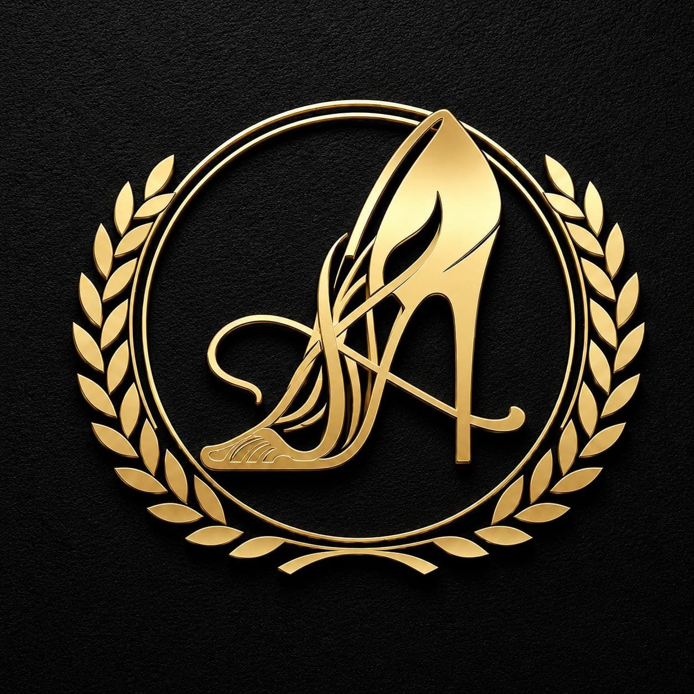
      </a>
      <ul class="nav-links">
        <li><a href="index.html" data-i18n="nav_home">Home</a></li>
        <li><a href="visual-design.html" data-i18n="nav_visual">Visual Design</a></li>
        <li><a href="websites.html" data-i18n="nav_websites">Websites</a></li>
        <li><a href="recent-work.html" data-i18n="nav_work">Recent Work</a></li>
        <li><a href="loyal-clients.html" data-i18n="nav_clients">Loyal Clients</a></li>
        <li><a href="premades.html" data-i18n="nav_premades">Premades</a></li>
      </ul>
      <div class="nav-controls">
        <button class="lang-switch" type="button" aria-label="Change language"><svg width="14" height="14" viewBox="0 0 24 24" fill="none" stroke="currentColor" stroke-width="1.5" stroke-linecap="round" stroke-linejoin="round"><circle cx="12" cy="12" r="10"></circle><line x1="2" y1="12" x2="22" y2="12"></line><path d="M12 2a15.3 15.3 0 0 1 4 10 15.3 15.3 0 0 1-4 10 15.3 15.3 0 0 1-4-10 15.3 15.3 0 0 1 4-10z"></path></svg> EN</button>
        <button class="hamburger" type="button" aria-label="Open navigation menu" aria-controls="mobile-menu" aria-expanded="false">
          <span></span><span></span><span></span>
        </button>
      </div>
    </div>
  </nav>

  <!-- Mobile Menu -->
  <div class="mobile-menu" id="mobile-menu">
    <a href="index.html" data-i18n="nav_home">Home</a>
    <a href="visual-design.html" data-i18n="nav_visual">Visual Design</a>
    <a href="websites.html" data-i18n="nav_websites">Websites</a>
    <a href="recent-work.html" data-i18n="nav_work">Recent Work</a>
    <a href="loyal-clients.html" data-i18n="nav_clients">Loyal Clients</a>
    <a href="premades.html" data-i18n="nav_premades">Premades</a>
  </div>

  <main>
  <header class="page-header container reveal">
    <h1>Premade Designs</h1>
    <p>Ready to Personalise.</p>
    <p>Love a design? Claim it — and I'll customise it just for you.</p>
    <div class="info-strip">Each premade is exclusive — once claimed, it's yours alone.</div>
  </header>

  <section class="agent-summary sr-only" aria-labelledby="premades-summary-title">
    <div class="agent-summary-panel">
      <h2 id="premades-summary-title">Premade Design Summary</h2>
      <p>Premade Designs are ready-made visual assets that can be claimed, personalized with client details, and then removed from availability when marked as claimed.</p>
      <dl>
        <dt>Available types</dt>
        <dd>Premade logos, banners, price lists, and bundles.</dd>
        <dt>Ideal clients</dt>
        <dd>Creators and brands that want a faster premium design path with a pre-selected visual direction.</dd>
        <dt>Pricing</dt>
        <dd>Listed premades include EUR 20 banners, EUR 25 logos, EUR 30 price lists, and EUR 45 bundles.</dd>
        <dt>Typical next step</dt>
        <dd>Choose an available premade and send the claim request with customization details.</dd>
      </dl>
      <p class="last-updated">Last updated: May 31, 2026</p>
    </div>
  </section>

  <section class="steps-strip reveal" aria-label="How premade designs work">
    <div class="step">
      <div class="step-num">1</div>
      <div><strong>Browse</strong><br><small>Swipe available designs</small></div>
    </div>
    <div class="step">
      <div class="step-num">2</div>
      <div><strong>Claim</strong><br><small>Tap "I Want This"</small></div>
    </div>
    <div class="step">
      <div class="step-num">3</div>
      <div><strong>Personalise</strong><br><small>Customised with your details</small></div>
    </div>
  </section>

  <!-- Gallery -->
  <section class="gallery-container reveal" aria-labelledby="premade-gallery-title">
    <h2 id="premade-gallery-title" class="sr-only">Available Premade Designs</h2>
    <div class="gallery-track" id="gallery-track">
      
      <!-- Premades Items -->
      <div class="premade-card">
        <div class="badge available">Available</div>
        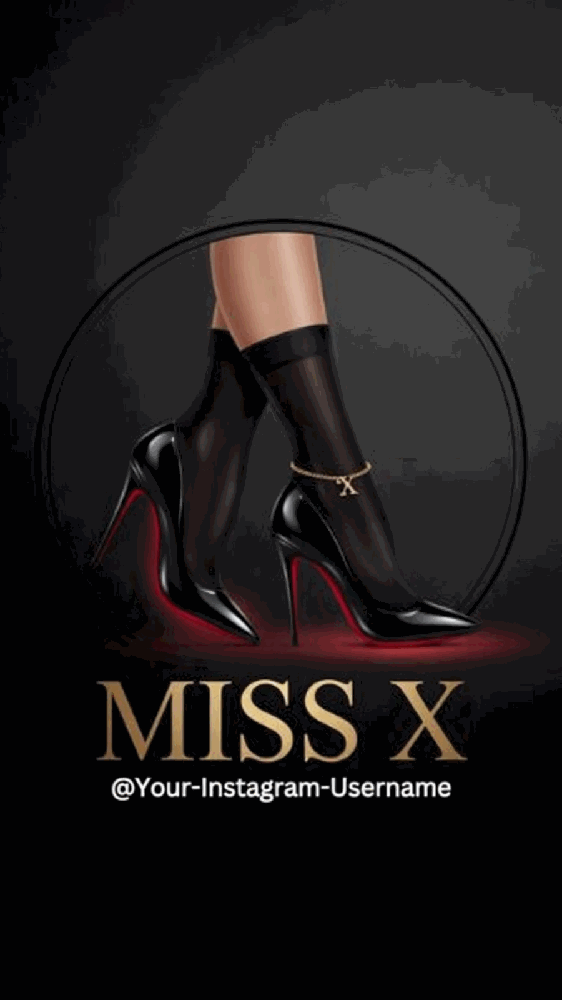
        <div class="premade-type">Logo</div>
        <h3 class="premade-title">Premade #10</h3>
        <div class="premade-price">€25</div>
        <button class="btn btn-outline claim-btn" style="width: 100%;" data-name="Premade #10" data-price="€25" data-type="Logo">I Want This</button>
      </div>

      <div class="premade-card">
        <div class="badge available">Available</div>
        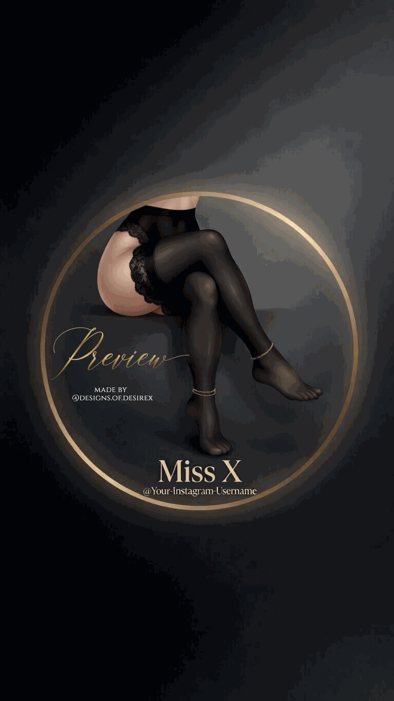
        <div class="premade-type">Logo</div>
        <h3 class="premade-title">Premade #11</h3>
        <div class="premade-price">€25</div>
        <button class="btn btn-outline claim-btn" style="width: 100%;" data-name="Premade #11" data-price="€25" data-type="Logo">I Want This</button>
      </div>

      <div class="premade-card">
        <div class="badge available">Available</div>
        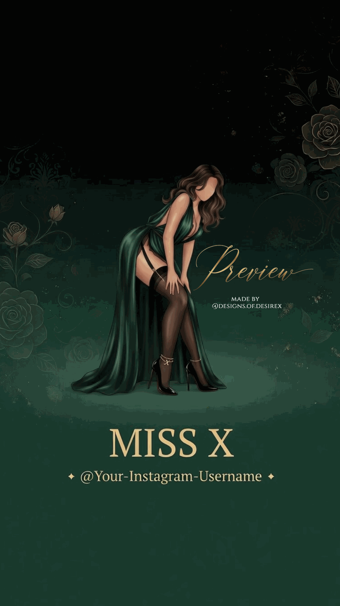
        <div class="premade-type">Logo</div>
        <h3 class="premade-title">Premade #12</h3>
        <div class="premade-price">€25</div>
        <button class="btn btn-outline claim-btn" style="width: 100%;" data-name="Premade #12" data-price="€25" data-type="Logo">I Want This</button>
      </div>

      <div class="premade-card">
        <div class="badge claimed">Claimed</div>
        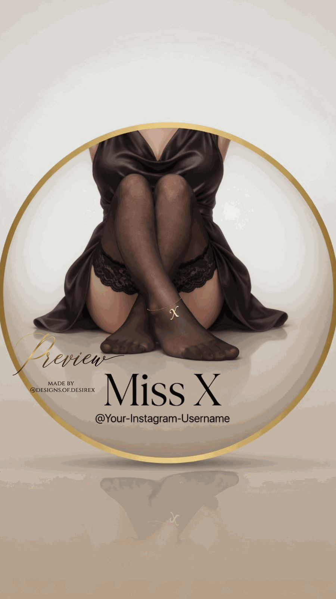
        <div class="premade-type">Price List</div>
        <h3 class="premade-title">Premade #2</h3>
        <div class="premade-price">€30</div>
        <button class="btn btn-outline" style="width: 100%; opacity: 0.5; cursor: not-allowed;" disabled>Claimed</button>
      </div>

      <div class="premade-card">
        <div class="badge available">Available</div>
        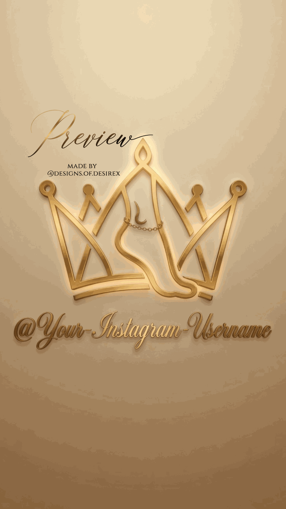
        <div class="premade-type">Banner</div>
        <h3 class="premade-title">Premade #3</h3>
        <div class="premade-price">€20</div>
        <button class="btn btn-outline claim-btn" style="width: 100%;" data-name="Premade #3" data-price="€20" data-type="Banner">I Want This</button>
      </div>

      <div class="premade-card">
        <div class="badge available">Available</div>
        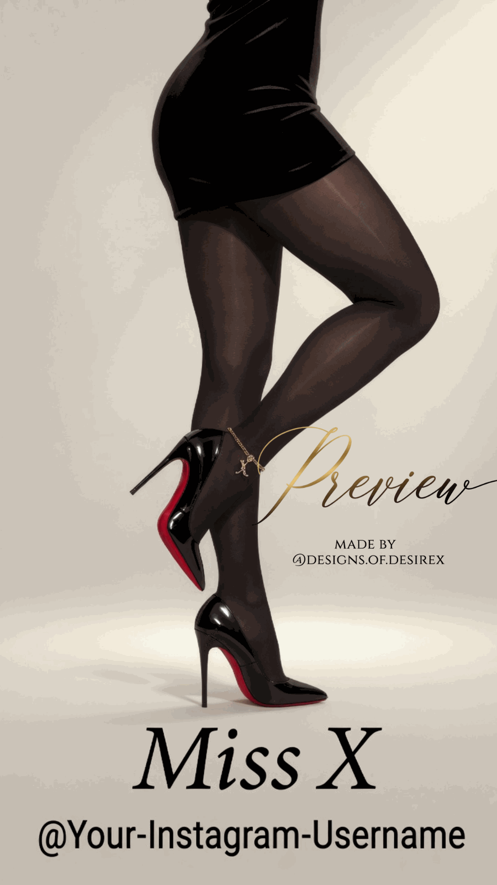
        <div class="premade-type">Bundle</div>
        <h3 class="premade-title">Premade #4</h3>
        <div class="premade-price">€45</div>
        <button class="btn btn-outline claim-btn" style="width: 100%;" data-name="Premade #4" data-price="€45" data-type="Bundle">I Want This</button>
      </div>

      <div class="premade-card">
        <div class="badge available">Available</div>
        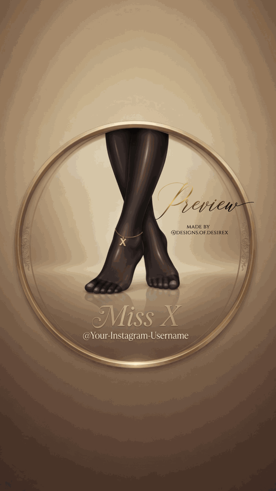
        <div class="premade-type">Logo</div>
        <h3 class="premade-title">Premade #5</h3>
        <div class="premade-price">€25</div>
        <button class="btn btn-outline claim-btn" style="width: 100%;" data-name="Premade #5" data-price="€25" data-type="Logo">I Want This</button>
      </div>

      <div class="premade-card">
        <div class="badge available">Available</div>
        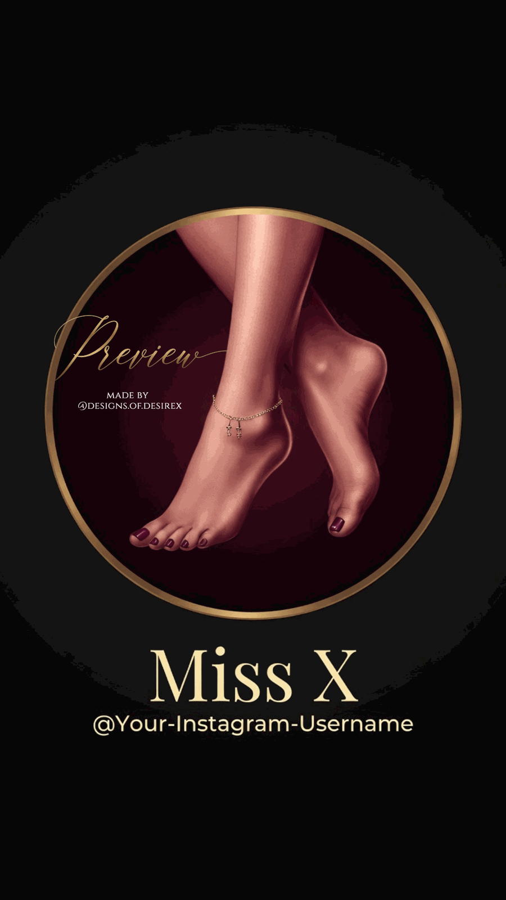
        <div class="premade-type">Logo</div>
        <h3 class="premade-title">Premade #7</h3>
        <div class="premade-price">€25</div>
        <button class="btn btn-outline claim-btn" style="width: 100%;" data-name="Premade #7" data-price="€25" data-type="Logo">I Want This</button>
      </div>

      <div class="premade-card">
        <div class="badge available">Available</div>
        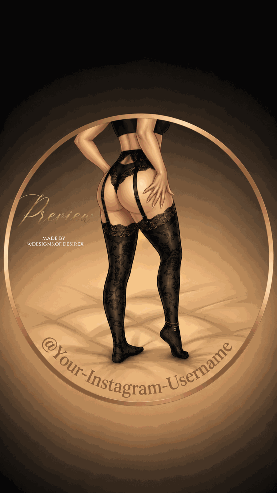
        <div class="premade-type">Logo</div>
        <h3 class="premade-title">Premade #8</h3>
        <div class="premade-price">€25</div>
        <button class="btn btn-outline claim-btn" style="width: 100%;" data-name="Premade #8" data-price="€25" data-type="Logo">I Want This</button>
      </div>

      <div class="premade-card">
        <div class="badge available">Available</div>
        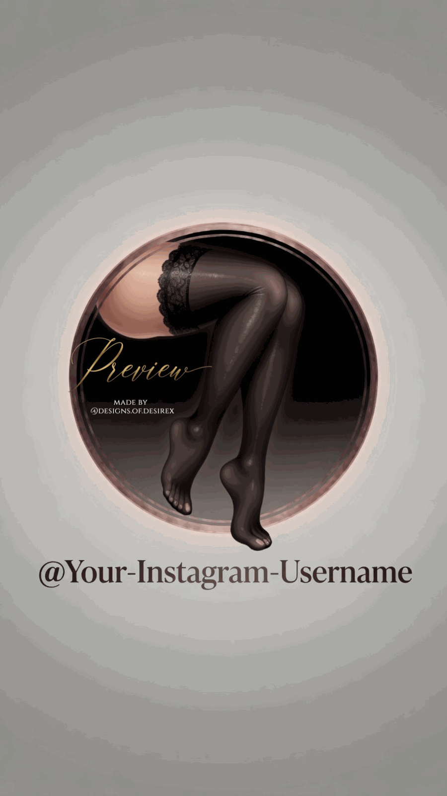
        <div class="premade-type">Logo</div>
        <h3 class="premade-title">Premade #9</h3>
        <div class="premade-price">€25</div>
        <button class="btn btn-outline claim-btn" style="width: 100%;" data-name="Premade #9" data-price="€25" data-type="Logo">I Want This</button>
      </div>

    </div>

    <!-- Desktop Controls -->
    <div class="gallery-controls">
      <button class="gallery-btn" id="prev-btn" type="button" aria-label="Show previous premade design">←</button>
      <button class="gallery-btn" id="next-btn" type="button" aria-label="Show next premade design">→</button>
    </div>
  </section>

  <!-- Upload Your Own Taste -->
  <section class="uniform-stripe gold-gradient-bg reveal">
    <div class="container">
      <h2>Upload Your Own Taste</h2>
      <p style="opacity: 0.8; margin-bottom: 40px;">Not sure which style you like? Upload an inspiration image and I'll match your vibe.</p>
      <div class="stripe-actions">
        <a href="mailto:designs.of.desirex@gmail.com?subject=Inspiration%20Upload" class="btn btn-outline">Email Inspiration Image</a>
      </div>
    </div>
  </section>
  </main>

  <!-- Footer -->
  <footer>
    <div class="container">
      <div class="footer-content">
        <div>
          
          <h3 style="font-size: 1.5rem; margin-bottom: 10px;">Amazing Designs</h3>
          <p style="opacity: 0.8; max-width: 300px;">High-End Exclusive Design. Built for Creators Who Want More.</p>
        </div>
        <div style="display: flex; gap: 60px;">
          <div class="footer-links">
            <a href="index.html" data-i18n="nav_home">Home</a>
            <a href="visual-design.html" data-i18n="nav_visual">Visual Design</a>
            <a href="websites.html" data-i18n="nav_websites">Websites</a>
            <a href="recent-work.html" data-i18n="nav_work">Recent Work</a>
            <a href="loyal-clients.html" data-i18n="nav_clients">Loyal Clients</a>
            <a href="premades.html" data-i18n="nav_premades">Premades</a>
          </div>
          <address class="footer-links">

            <a href="https://www.instagram.com/designs_of_desire_official_x/" target="_blank">Instagram</a>
            <a href="mailto:designs.of.desirex@gmail.com">Email Us</a>
            <span style="opacity: 0.8; margin-top: 20px;">Accepted: PayPal</span>
          </address>
        </div>
      </div>
      <div class="footer-bottom">
        &copy; 2026 Amazing Designs. All rights reserved.
      </div>
    </div>
  </footer>

  <!-- Modal -->
  <div class="modal-overlay" id="claim-modal" aria-hidden="true">
    <div class="modal-content">
      <button class="modal-close" id="close-modal" type="button" aria-label="Close premade inquiry">&times;</button>
      <h2 style="font-family: var(--font-display); font-size: 2rem; margin-bottom: 10px;">You're interested in</h2>
      <h3 id="modal-title" style="color: var(--accent-color-1); font-size: 1.8rem; margin-bottom: 20px;">Premade Name</h3>
      <p style="opacity: 0.8; margin-bottom: 10px;">Type: <strong id="modal-type">Logo</strong> | Price: <strong id="modal-price">€25</strong></p>
      <p style="opacity: 0.8; margin-bottom: 30px;">Includes customisation with your name, colors, and specific details.</p>
      
      <div style="display: flex; flex-direction: column; gap: 15px;">
        <a href="mailto:designs.of.desirex@gmail.com?subject=Premade%20Inquiry" id="modal-email-btn" class="btn btn-primary">Send to Designer →</a>
        <a href="https://www.instagram.com/designs_of_desire_official_x/" class="btn btn-outline" target="_blank">Message on Instagram →</a>
      </div>
    </div>
  </div>

  <script src="assets/js/translations.js"></script>
  <script src="assets/js/main.js"></script>
  <script>
    document.addEventListener('DOMContentLoaded', () => {
      const track = document.getElementById('gallery-track');
      const prevBtn = document.getElementById('prev-btn');
      const nextBtn = document.getElementById('next-btn');

      if (track && prevBtn && nextBtn) {
        prevBtn.addEventListener('click', () => {
          track.scrollBy({ left: -350, behavior: 'smooth' });
        });
        nextBtn.addEventListener('click', () => {
          track.scrollBy({ left: 350, behavior: 'smooth' });
        });
      }

      // Modal Logic
      const claimBtns = document.querySelectorAll('.claim-btn');
      const modal = document.getElementById('claim-modal');
      const closeModal = document.getElementById('close-modal');
      const modalTitle = document.getElementById('modal-title');
      const modalType = document.getElementById('modal-type');
      const modalPrice = document.getElementById('modal-price');
      const emailBtn = document.getElementById('modal-email-btn');

      claimBtns.forEach(btn => {
        btn.addEventListener('click', (e) => {
          const name = btn.getAttribute('data-name');
          const price = btn.getAttribute('data-price');
          const type = btn.getAttribute('data-type');
          
          modalTitle.innerText = name;
          modalType.innerText = type;
          modalPrice.innerText = price;
          
          const subject = encodeURIComponent(`Premade Claim: ${name}`);
          const body = encodeURIComponent(`Hi! I'm interested in claiming the ${name} premade.\nMy name is: \nMy platform is: \nHere's what I'd like customised: `);
          
          emailBtn.href = `mailto:designs.of.desirex@gmail.com?subject=${subject}&body=${body}`;
          
          modal.classList.add('active');
          modal.setAttribute('aria-hidden', 'false');
          closeModal.focus();
        });
      });

      const hideModal = () => {
        modal.classList.remove('active');
        modal.setAttribute('aria-hidden', 'true');
      };

      closeModal.addEventListener('click', hideModal);

      modal.addEventListener('click', (e) => {
        if (e.target === modal) {
          hideModal();
        }
      });

      document.addEventListener('keydown', (e) => {
        if (e.key === 'Escape' && modal.classList.contains('active')) {
          hideModal();
        }
      });
    });
  </script>
</body>
</html>
````

### `archive\README.md`

``markdown
Archived pages
==============

This folder keeps pages that were removed from the public site flow but may be useful later.

- `premades.html` was archived on June 2, 2026.
- `ai/premades.md` is the archived AI-readable summary for that page.

The archive is excluded from `robots.txt`, and archived HTML pages should use `noindex`.
````

### `assets\css\styles.css`

``css
@import url('https://fonts.googleapis.com/css2?family=Cormorant+Garamond:ital,wght@0,300;0,400;0,500;0,600;0,700;1,400&family=Jost:wght@300;400;500;600&display=swap');

:root {
  /* Default: Noir Luxe */
  --bg-color: #0A0A0A;
  --text-color: #F8F5EF;
  --card-bg: #111111;
  --accent-color-1: #C9A84C;
  --accent-color-2: #F2D07E;
  --border-color: rgba(201, 168, 76, 0.25);
  --border-glow: rgba(201, 168, 76, 0.4);
  --button-text: #0A0A0A;
  --glass-bg: rgba(17, 17, 17, 0.7);
  --nav-bg: rgba(10, 10, 10, 0.85);
  
  --font-display: 'Cormorant Garamond', serif;
  --font-body: 'Jost', sans-serif;
  
  --ease-out: cubic-bezier(0.23, 1, 0.32, 1);
  --ease-in-out: cubic-bezier(0.77, 0, 0.175, 1);
  --transition-fast: 160ms var(--ease-out);
  --transition: color 180ms var(--ease-out), background-color 180ms var(--ease-out), border-color 180ms var(--ease-out), box-shadow 220ms var(--ease-out), opacity 180ms var(--ease-out);
}

[data-theme="marble"] {
  /* Gilded Marble */
  --bg-color: #FFFDF8;
  background-image: 
    radial-gradient(circle at 12% 18%, rgba(212, 175, 55, 0.2) 0%, transparent 28%),
    linear-gradient(135deg, #FFFFFF 0%, #FFF7DF 42%, #FFFFFF 72%, #F6E6B8 100%);
  --text-color: #15120B;
  --card-bg: rgba(255, 255, 255, 0.9);
  --accent-color-1: #B98718;
  --accent-color-2: #E8C76B;
  --border-color: rgba(185, 135, 24, 0.32);
  --border-glow: rgba(185, 135, 24, 0.32);
  --button-text: #141006;
  --glass-bg: rgba(255, 253, 247, 0.78);
  --nav-bg: rgba(255, 253, 247, 0.88);
}

* {
  margin: 0;
  padding: 0;
  box-sizing: border-box;
}

body {
  font-family: var(--font-body);
  background-color: var(--bg-color);
  color: var(--text-color);
  overflow-x: hidden;
  transition: background-color 220ms var(--ease-out), color 220ms var(--ease-out);
  line-height: 1.6;
}

[data-theme="marble"] body {
  background:
    radial-gradient(circle at top left, rgba(232, 199, 107, 0.24), transparent 34%),
    radial-gradient(circle at bottom right, rgba(185, 135, 24, 0.12), transparent 30%),
    linear-gradient(135deg, #FFFFFF 0%, #FFF9E9 42%, #FFFFFF 70%, #F7E7BA 100%);
}

h1, h2, h3, h4, h5, h6 {
  font-family: var(--font-display);
  font-weight: 500;
  line-height: 1.2;
}

a {
  color: inherit;
  text-decoration: none;
  transition: color 180ms var(--ease-out), opacity 180ms var(--ease-out);
}

ul {
  list-style: none;
}

/* Utilities */
.container {
  width: 100%;
  max-width: 1200px;
  margin: 0 auto;
  padding: 0 24px;
}

.gold-gradient-text {
  background: linear-gradient(to right, var(--accent-color-1), var(--accent-color-2));
  -webkit-background-clip: text;
  -webkit-text-fill-color: transparent;
  display: inline-block;
}

.gold-gradient-bg {
  background: linear-gradient(135deg, var(--accent-color-1), var(--accent-color-2));
}

.section-padding {
  padding: 100px 0;
}

.text-center {
  text-align: center;
}

.sr-only {
  position: absolute;
  width: 1px;
  height: 1px;
  padding: 0;
  margin: -1px;
  overflow: hidden;
  clip: rect(0, 0, 0, 0);
  white-space: nowrap;
  border: 0;
}

.agent-summary {
  padding: 0 0 90px;
}

.agent-summary-panel {
  border: 1px solid var(--border-color);
  background:
    linear-gradient(135deg, rgba(201, 168, 76, 0.08), transparent 36%),
    var(--card-bg);
  padding: clamp(30px, 5vw, 54px);
}

.agent-summary-panel h2 {
  font-size: clamp(2rem, 4vw, 3.2rem);
  margin-bottom: 18px;
}

.agent-summary-panel > p {
  max-width: 780px;
  opacity: 0.82;
  margin-bottom: 28px;
}

.agent-summary-panel dl {
  display: grid;
  grid-template-columns: minmax(180px, 0.32fr) 1fr;
  gap: 16px 28px;
}

.agent-summary-panel dt {
  color: var(--accent-color-1);
  font-weight: 700;
  letter-spacing: 1px;
  text-transform: uppercase;
  font-size: 0.78rem;
}

.agent-summary-panel dd {
  opacity: 0.86;
}

.last-updated {
  margin-top: 24px;
  opacity: 0.58;
  font-size: 0.9rem;
}

.quote-form-section,
.faq-section {
  padding: 90px 0;
}

.quote-form-section,
#website-quote-form {
  scroll-margin-top: 120px;
}

#website-faq-title,
#visual-faq-title {
  scroll-margin-top: 120px;
}

.quote-form {
  display: grid;
  grid-template-columns: repeat(2, minmax(0, 1fr));
  gap: 18px;
  margin-top: 34px;
}

.quote-form label {
  display: grid;
  gap: 8px;
  color: var(--accent-color-1);
  font-size: 0.78rem;
  font-weight: 700;
  letter-spacing: 1px;
  text-transform: uppercase;
}

.quote-form input,
.quote-form select,
.quote-form textarea {
  width: 100%;
  min-height: 52px;
  border: 1px solid var(--border-color);
  background: rgba(0, 0, 0, 0.24);
  color: var(--text-color);
  padding: 13px 15px;
  font: inherit;
  outline: none;
}

.quote-form textarea,
.quote-form .full {
  grid-column: 1 / -1;
}

.quote-form textarea {
  min-height: 140px;
  resize: vertical;
}

.quote-form input:focus,
.quote-form select:focus,
.quote-form textarea:focus {
  border-color: var(--accent-color-1);
  box-shadow: 0 0 0 3px rgba(201, 168, 76, 0.12);
}

.faq-list {
  display: grid;
  gap: 18px;
  margin-top: 34px;
}

.faq-list article {
  border: 1px solid var(--border-color);
  background: var(--card-bg);
  padding: 24px;
}

.faq-list h3 {
  font-size: 1.35rem;
  margin-bottom: 8px;
}

.faq-section.faq-carousel-ready {
  max-width: 1040px;
  padding-left: 24px;
  padding-right: 24px;
}

.faq-section.faq-carousel-ready .faq-list {
  display: block;
  position: relative;
  min-height: var(--faq-height, 280px);
  width: calc(100% - 48px);
  max-width: 940px;
  margin-left: auto;
  margin-right: auto;
  overflow: hidden;
}

.faq-section.faq-carousel-ready .faq-list article {
  position: absolute;
  inset: 0;
  display: flex;
  flex-direction: column;
  justify-content: center;
  min-height: var(--faq-height, 280px);
  border-radius: 8px;
  background:
    linear-gradient(135deg, rgba(201, 168, 76, 0.12), transparent 42%),
    linear-gradient(180deg, rgba(255, 255, 255, 0.035), transparent),
    var(--card-bg);
  padding: clamp(28px, 4vw, 46px);
  opacity: 0;
  pointer-events: none;
  filter: blur(3px);
  transform: translateX(24px) scale(0.985);
  transition:
    opacity 220ms var(--ease-out),
    filter 220ms var(--ease-out),
    transform 240ms var(--ease-out);
}

.faq-section.faq-carousel-ready .faq-list[data-direction="prev"] article {
  transform: translateX(-24px) scale(0.985);
}

.faq-section.faq-carousel-ready .faq-list article.is-active {
  z-index: 1;
  opacity: 1;
  pointer-events: auto;
  filter: blur(0);
  transform: translateX(0) scale(1);
}

.faq-section.faq-carousel-ready .faq-list h3 {
  max-width: 840px;
  font-size: clamp(1.45rem, 2.6vw, 2.15rem);
  margin-bottom: 14px;
}

.faq-section.faq-carousel-ready .faq-list p {
  max-width: 860px;
  font-size: clamp(1rem, 1.5vw, 1.08rem);
  line-height: 1.85;
  opacity: 0.84;
}

.faq-carousel-ui {
  display: grid;
  grid-template-columns: minmax(96px, 0.3fr) auto minmax(96px, 0.3fr);
  align-items: center;
  gap: 20px;
  margin-top: 22px;
}

.faq-counter {
  min-width: 96px;
  color: var(--accent-color-1);
  font-size: 0.78rem;
  font-weight: 700;
  letter-spacing: 2px;
  text-transform: uppercase;
}

.faq-nav {
  grid-column: 2;
  display: grid;
  grid-template-columns: 46px minmax(180px, 440px) 46px;
  align-items: center;
  gap: 14px;
}

.faq-arrow,
.faq-dot {
  appearance: none;
  border: 0;
  font: inherit;
  cursor: pointer;
}

.faq-arrow {
  width: 46px;
  height: 46px;
  border: 1px solid var(--border-color);
  border-radius: 50%;
  background: var(--card-bg);
  color: var(--text-color);
  font-size: 1.1rem;
  line-height: 1;
  transition:
    color 180ms var(--ease-out),
    background-color 180ms var(--ease-out),
    border-color 180ms var(--ease-out),
    transform 140ms var(--ease-out);
}

.faq-arrow:active {
  transform: scale(0.94);
}

.faq-dots {
  display: flex;
  align-items: center;
  justify-content: center;
  flex-wrap: nowrap;
  gap: 5px;
  width: min(440px, 40vw);
  overflow: hidden;
}

.faq-dot {
  flex: 1 1 0;
  min-width: 4px;
  max-width: 18px;
  height: 3px;
  border-radius: 999px;
  background: rgba(248, 245, 239, 0.24);
  transition:
    width 180ms var(--ease-out),
    background-color 180ms var(--ease-out),
    transform 140ms var(--ease-out);
}

.faq-dot.is-active {
  flex: 2.4 0 26px;
  background: var(--accent-color-1);
}

.faq-dot:active {
  transform: scaleX(0.86);
}

@media (hover: hover) and (pointer: fine) {
  .faq-arrow:hover {
    border-color: var(--accent-color-1);
    color: var(--accent-color-1);
  }

  .faq-dot:hover {
    background: rgba(201, 168, 76, 0.62);
  }
}

@media (max-width: 760px) {
  .faq-section.faq-carousel-ready {
    padding-left: 18px;
    padding-right: 18px;
  }

  .faq-section.faq-carousel-ready .faq-list article {
    padding: 26px 22px;
  }

  .faq-section.faq-carousel-ready .faq-list {
    width: calc(100% - 36px);
  }

  .faq-carousel-ui {
    grid-template-columns: 1fr;
    gap: 14px;
  }

  .faq-counter {
    width: 100%;
    text-align: center;
  }

  .faq-nav {
    grid-column: 1;
    grid-template-columns: 42px minmax(126px, 1fr) 42px;
    width: 100%;
    max-width: 340px;
    margin: 0 auto;
  }

  .faq-dots {
    width: 100%;
    gap: 4px;
  }

  .faq-dot {
    min-width: 3px;
    max-width: 8px;
  }

  .faq-dot.is-active {
    flex-basis: 20px;
  }
}

@media (prefers-reduced-motion: reduce) {
  .faq-section.faq-carousel-ready .faq-list article,
  .faq-arrow,
  .faq-dot {
    transition-duration: 1ms;
  }

  .faq-section.faq-carousel-ready .faq-list article {
    filter: none;
    transform: none;
  }
}

.faq-section.faq-carousel-ready {
  position: relative;
  max-width: 1180px;
  padding-top: clamp(72px, 8vw, 118px);
  padding-bottom: clamp(72px, 8vw, 112px);
}

.faq-section.faq-carousel-ready::before {
  content: '';
  position: absolute;
  top: 0;
  left: 24px;
  right: 24px;
  height: 1px;
  background: linear-gradient(90deg, transparent, rgba(201, 168, 76, 0.52), transparent);
}

.faq-section.faq-carousel-ready > h2 {
  margin: 0 auto clamp(36px, 5vw, 58px);
  font-size: clamp(2.6rem, 4.8vw, 4.4rem);
  letter-spacing: 0;
}

.faq-section.faq-carousel-ready .faq-list {
  width: min(calc(100% - 48px), 1040px);
  max-width: none;
  min-height: var(--faq-height, 320px);
  overflow: visible;
}

.faq-section.faq-carousel-ready .faq-list article {
  min-height: var(--faq-height, 320px);
  border-color: rgba(201, 168, 76, 0.34);
  border-radius: 8px;
  background:
    linear-gradient(90deg, rgba(201, 168, 76, 0.18), transparent 1px),
    linear-gradient(135deg, rgba(201, 168, 76, 0.16), transparent 36%),
    linear-gradient(180deg, rgba(255, 255, 255, 0.045), rgba(255, 255, 255, 0.01)),
    #11100e;
  box-shadow:
    0 30px 90px rgba(0, 0, 0, 0.32),
    inset 0 1px 0 rgba(255, 255, 255, 0.05);
}

.faq-section.faq-carousel-ready .faq-list article::before {
  content: '';
  position: absolute;
  inset: 14px;
  border: 1px solid rgba(201, 168, 76, 0.14);
  border-radius: 6px;
  pointer-events: none;
}

.faq-section.faq-carousel-ready .faq-list article::after {
  content: '';
  position: absolute;
  top: 28px;
  bottom: 28px;
  left: 0;
  width: 3px;
  border-radius: 0 999px 999px 0;
  background: linear-gradient(180deg, transparent, var(--accent-color-1), transparent);
  opacity: 0.86;
}

.faq-section.faq-carousel-ready .faq-list h3,
.faq-section.faq-carousel-ready .faq-list p {
  position: relative;
  z-index: 1;
}

.faq-section.faq-carousel-ready .faq-list h3 {
  max-width: 900px;
  font-size: clamp(2rem, 3.4vw, 3.05rem);
  line-height: 1.04;
  margin-bottom: clamp(18px, 2vw, 26px);
}

.faq-section.faq-carousel-ready .faq-list p {
  max-width: 910px;
  color: rgba(248, 245, 239, 0.82);
  font-size: clamp(1.04rem, 1.45vw, 1.18rem);
  line-height: 1.9;
}

.faq-carousel-ui {
  width: min(calc(100% - 48px), 1040px);
  margin: 28px auto 0;
  grid-template-columns: minmax(92px, auto) 1fr;
  padding: 14px 16px;
  border: 1px solid rgba(201, 168, 76, 0.22);
  border-radius: 999px;
  background:
    linear-gradient(180deg, rgba(255, 255, 255, 0.035), transparent),
    rgba(12, 12, 11, 0.76);
  box-shadow: 0 18px 54px rgba(0, 0, 0, 0.24);
}

.faq-counter {
  min-width: 86px;
  padding-left: 10px;
  font-size: 0.82rem;
}

.faq-nav {
  grid-column: auto;
  grid-template-columns: 52px minmax(160px, 1fr) 52px;
  gap: 16px;
}

.faq-arrow {
  width: 52px;
  height: 52px;
  background:
    linear-gradient(180deg, rgba(255, 255, 255, 0.04), transparent),
    #0c0c0b;
  box-shadow: inset 0 0 0 1px rgba(255, 255, 255, 0.03);
}

.faq-dots {
  width: 100%;
  gap: 6px;
}

.faq-dot {
  max-width: none;
  height: 4px;
  background: rgba(248, 245, 239, 0.22);
  transition:
    flex 180ms var(--ease-out),
    background-color 180ms var(--ease-out),
    transform 140ms var(--ease-out);
}

.faq-dot.is-active {
  flex: 2.8 0 34px;
  background: linear-gradient(90deg, var(--accent-color-1), var(--accent-color-2));
}

@media (max-width: 760px) {
  .faq-section.faq-carousel-ready {
    padding-top: clamp(58px, 14vw, 82px);
    padding-bottom: clamp(58px, 14vw, 82px);
  }

  .faq-section.faq-carousel-ready > h2 {
    font-size: clamp(2.25rem, 10vw, 3.2rem);
    margin-bottom: 28px;
  }

  .faq-section.faq-carousel-ready .faq-list {
    width: min(calc(100% - 20px), 520px);
    min-height: var(--faq-height, 260px);
  }

  .faq-section.faq-carousel-ready .faq-list article {
    min-height: var(--faq-height, 260px);
    padding: 30px 24px;
  }

  .faq-section.faq-carousel-ready .faq-list article::before {
    inset: 10px;
  }

  .faq-section.faq-carousel-ready .faq-list article::after {
    top: 22px;
    bottom: 22px;
  }

  .faq-section.faq-carousel-ready .faq-list h3 {
    font-size: clamp(1.55rem, 7.4vw, 2.1rem);
    line-height: 1.08;
  }

  .faq-section.faq-carousel-ready .faq-list p {
    font-size: 0.98rem;
    line-height: 1.75;
  }

  .faq-carousel-ui {
    width: min(calc(100% - 20px), 520px);
    grid-template-columns: 1fr;
    border-radius: 8px;
    padding: 14px;
  }

  .faq-counter {
    padding-left: 0;
  }

  .faq-nav {
    grid-template-columns: 46px minmax(120px, 1fr) 46px;
    max-width: none;
  }

  .faq-arrow {
    width: 46px;
    height: 46px;
  }
}

/* Navigation */
nav {
  position: fixed;
  top: 0;
  width: 100%;
  z-index: 1000;
  background: transparent;
  transition: background-color 220ms var(--ease-out), padding 220ms var(--ease-out), border-color 220ms var(--ease-out), box-shadow 220ms var(--ease-out);
  padding: 20px 0;
}

nav.scrolled {
  background: var(--nav-bg);
  backdrop-filter: blur(10px);
  -webkit-backdrop-filter: blur(10px);
  padding: 15px 0;
  border-bottom: 1px solid var(--border-color);
}
[data-theme="marble"] nav.scrolled {
  box-shadow: 0 12px 36px rgba(185, 135, 24, 0.12);
}

.nav-container {
  display: flex;
  justify-content: space-between;
  align-items: center;
}

.nav-logo {
  height: 48px;
  width: 48px;
  border-radius: 50%;
  object-fit: cover;
}
[data-theme="marble"] .nav-logo {
  box-shadow: 0 0 10px rgba(0,0,0,0.1);
  background: #000; /* container for jpeg logo to look good */
}

.nav-links {
  display: flex;
  gap: 18px;
}

.nav-links a {
  font-size: 0.82rem;
  text-transform: uppercase;
  letter-spacing: 1px;
  position: relative;
}

.nav-links a::after {
  content: '';
  position: absolute;
  bottom: -4px;
  left: 0;
  width: 0%;
  height: 1px;
  background: var(--accent-color-1);
  transition: width 180ms var(--ease-out);
}
.nav-links a:hover::after,
.nav-links a.active::after {
  width: 100%;
}
.nav-links a.active,
.mobile-menu a.active,
.footer-links a.active {
  color: var(--accent-color-1);
}

.nav-controls {
  display: flex;
  align-items: center;
  gap: 14px;
}

.theme-toggle {
  background: none;
  border: none;
  color: var(--text-color);
  font-family: var(--font-body);
  font-size: 0.82rem;
  cursor: pointer;
  text-transform: uppercase;
  transition: color 160ms var(--ease-out), transform 160ms var(--ease-out);
}
.theme-toggle:hover {
  color: var(--accent-color-1);
}
.theme-toggle:active {
  transform: scale(0.97);
}

.lang-switch {
  display: inline-flex;
  align-items: center;
  justify-content: center;
  gap: 8px;
  background: transparent;
  border: 1px solid var(--border-color);
  color: var(--accent-color-1);
  font-family: var(--font-body);
  font-size: 0.75rem;
  letter-spacing: 2px;
  padding: 8px 18px;
  border-radius: 4px;
  cursor: pointer;
  text-transform: uppercase;
  transition: color 180ms var(--ease-out), background-color 180ms var(--ease-out), border-color 180ms var(--ease-out), box-shadow 220ms var(--ease-out), transform 160ms var(--ease-out);
  position: relative;
  overflow: hidden;
}
.lang-switch::before {
  content: '';
  position: absolute;
  top: 0; left: -100%; width: 100%; height: 100%;
  background: linear-gradient(90deg, transparent, rgba(201,168,76,0.15), transparent);
  transition: transform 520ms var(--ease-out);
  transform: translateX(0);
}
.lang-switch:hover::before {
  transform: translateX(200%);
}
[data-theme="marble"] .lang-switch {
  background: rgba(0, 0, 0, 0.02);
}
.lang-switch:hover {
  border-color: var(--accent-color-1);
  box-shadow: 0 0 18px rgba(201, 168, 76, 0.2);
  background: rgba(201, 168, 76, 0.05);
}
.lang-switch:active {
  transform: scale(0.97);
}

.hamburger {
  display: none;
  flex-direction: column;
  gap: 5px;
  cursor: pointer;
  transition: transform 160ms var(--ease-out);
}
.hamburger:active {
  transform: scale(0.94);
}
.hamburger span {
  width: 25px;
  height: 2px;
  background: var(--text-color);
  transition: background-color 180ms var(--ease-out), transform 180ms var(--ease-out), opacity 180ms var(--ease-out);
}

/* Buttons */
.btn {
  display: inline-flex;
  align-items: center;
  justify-content: center;
  padding: 14px 32px;
  font-size: 0.9rem;
  text-transform: uppercase;
  letter-spacing: 2px;
  font-family: var(--font-body);
  font-weight: 500;
  cursor: pointer;
  border: 1px solid transparent;
  transition: color 180ms var(--ease-out), background-color 180ms var(--ease-out), border-color 180ms var(--ease-out), box-shadow 220ms var(--ease-out), transform 140ms var(--ease-out);
  text-align: center;
  min-height: 52px;
  transform: translateY(0) scale(1);
  will-change: transform;
}
.btn:active {
  transform: scale(0.97);
}

.btn-primary {
  background: linear-gradient(135deg, var(--accent-color-1), var(--accent-color-2));
  color: var(--button-text);
}
[data-theme="marble"] .btn-primary {
  color: #fff;
}

.btn-primary:hover {
  background: transparent;
  border-color: var(--accent-color-1);
  color: var(--accent-color-1);
  box-shadow: 0 0 15px var(--border-glow);
}

.btn-outline {
  background: transparent;
  border: 1px solid var(--accent-color-1);
  color: var(--text-color);
}

.btn-outline:hover {
  background: linear-gradient(135deg, var(--accent-color-1), var(--accent-color-2));
  color: var(--button-text);
  box-shadow: 0 0 15px var(--border-glow);
}
[data-theme="marble"] .btn-outline:hover {
  color: #fff;
}

/* Hero Section */
.hero {
  min-height: 100vh;
  display: flex;
  align-items: center;
  justify-content: center;
  position: relative;
  text-align: center;
  padding-top: 80px;
  overflow: hidden;

}
[data-theme="noir"] .hero {
  background-image: linear-gradient(135deg, rgba(5,5,5,1) 0%, rgba(201, 168, 76, 0.15) 50%, rgba(5,5,5,1) 100%);
  box-shadow: none;
}
[data-theme="marble"] .hero {
  box-shadow: inset 0 0 0 2000px rgba(253, 253, 253, 0.95);
}

.hero::before {
  content: '';
  position: absolute;
  top: -50%; left: -50%; width: 200%; height: 200%;
  background: linear-gradient(
    to bottom right,
    rgba(255, 255, 255, 0) 0%,
    rgba(255, 255, 255, 0) 40%,
    rgba(201, 168, 76, 0.05) 50%,
    rgba(255, 255, 255, 0) 60%,
    rgba(255, 255, 255, 0) 100%
  );
  animation: shimmerSweep 8s infinite linear;
  pointer-events: none;
}

@keyframes shimmerSweep {
  0% { transform: translate(-30%, -30%); }
  100% { transform: translate(30%, 30%); }
}

.hero-logo-container {
  margin-bottom: 2rem;
  display: inline-block;
  position: relative;
}

.hero-logo {
  width: 240px;
  height: 240px;
  object-fit: cover;
  border-radius: 50%;
  animation: pulseGlow 4s infinite alternate;
}
[data-theme="marble"] .hero-logo {
  background: #000;
}

@keyframes pulseGlow {
  0% { box-shadow: 0 0 20px rgba(201, 168, 76, 0.2); }
  100% { box-shadow: 0 0 60px rgba(201, 168, 76, 0.6); }
}

.hero h1 {
  font-size: clamp(3rem, 6vw, 5rem);
  margin-bottom: 1rem;
}

.hero p {
  font-size: clamp(1.1rem, 2vw, 1.4rem);
  max-width: 700px;
  margin: 0 auto 3rem;
  opacity: 0.9;
}

.hero-btns {
  display: flex;
  gap: 20px;
  justify-content: center;
}
.hero-motto {
  color: var(--accent-color-1);
  font-size: 0.82rem;
  font-weight: 600;
  letter-spacing: 3px;
  margin: -24px 0 32px;
  text-transform: uppercase;
}

.scroll-indicator {
  position: absolute;
  bottom: 40px;
  left: 50%;
  transform: translateX(-50%);
  display: flex;
  flex-direction: column;
  align-items: center;
  opacity: 0.6;
}
.scroll-indicator::after {
  content: '';
  width: 1px;
  height: 40px;
  background: var(--text-color);
  margin-top: 10px;
  animation: scrollLine 2s infinite;
}
@keyframes scrollLine {
  0% { transform: scaleY(0); transform-origin: top; }
  50% { transform: scaleY(1); transform-origin: top; }
  51% { transform: scaleY(1); transform-origin: bottom; }
  100% { transform: scaleY(0); transform-origin: bottom; }
}

/* Cards & Layouts */
.grid-2 {
  display: grid;
  grid-template-columns: 1fr 1fr;
  gap: 40px;
}
.grid-3 {
  display: grid;
  grid-template-columns: repeat(3, 1fr);
  gap: 30px;
}

.card {
  background: var(--card-bg);
  border: 1px solid var(--border-color);
  padding: 40px;
  transition: transform 220ms var(--ease-out), border-color 180ms var(--ease-out), box-shadow 220ms var(--ease-out);
  position: relative;
}
[data-theme="marble"] .card {
  box-shadow: inset 0 1px 0 rgba(255, 255, 255, 0.86);
}

@media (hover: hover) and (pointer: fine) {
  .card:hover {
    transform: translateY(-6px);
    box-shadow: 0 10px 30px var(--border-glow);
    border-color: var(--accent-color-1);
  }
}

.card-title {
  font-size: 1.8rem;
  margin-bottom: 15px;
}

.card-desc {
  opacity: 0.8;
  margin-bottom: 25px;
}

/* Footer */
footer {
  border-top: 1px solid var(--border-color);
  padding: 80px 0 40px;
  background: var(--card-bg);
}

.footer-content {
  display: grid;
  grid-template-columns: 1fr 1fr;
  gap: 40px;
  margin-bottom: 60px;
}

.footer-logo {
  width: 80px;
  height: 80px;
  border-radius: 50%;
  object-fit: cover;
  margin-bottom: 20px;
}
[data-theme="marble"] .footer-logo {
  background: #000;
}

.footer-links {
  display: flex;
  flex-direction: column;
  gap: 15px;
}
.footer-links a {
  opacity: 0.8;
}
.footer-links a:hover {
  opacity: 1;
  color: var(--accent-color-1);
}

footer address {
  font-style: normal;
}

.footer-bottom {
  text-align: center;
  padding-top: 30px;
  border-top: 1px solid var(--border-color);
  opacity: 0.6;
  font-size: 0.9rem;
}

/* Animations */
.reveal {
  opacity: 0;
  transform: translateY(18px);
  transition: opacity 480ms var(--ease-out), transform 520ms var(--ease-out);
}
.reveal.active {
  opacity: 1;
  transform: translateY(0);
}

/* Mobile */
@media (max-width: 768px) {
  .nav-links {
    display: none; /* simple for now, will implement overlay in JS */
  }
  .hamburger {
    display: flex;
    border: 0;
    background: transparent;
    padding: 6px;
  }
}

@media (max-width: 768px) {
  .grid-2, .grid-3 {
    grid-template-columns: 1fr;
  }
  .hero-btns {
    flex-direction: column;
  }
  .footer-content {
    grid-template-columns: 1fr;
    text-align: center;
  }
  .agent-summary-panel dl,
  .quote-form {
    grid-template-columns: 1fr;
  }
}

/* Mobile Nav Overlay */
.mobile-menu {
  position: fixed;
  top: 0;
  left: 0;
  width: 100%;
  height: 100vh;
  background: var(--bg-color);
  z-index: 999;
  display: flex;
  flex-direction: column;
  justify-content: center;
  align-items: center;
  gap: 30px;
  transform: translateY(-100%);
  transition: transform 260ms var(--ease-out);
  will-change: transform;
}
.mobile-menu.open {
  transform: translateY(0);
}
.mobile-menu a {
  font-size: 2rem;
  font-family: var(--font-display);
  transition: color 160ms var(--ease-out), transform 160ms var(--ease-out);
}
.mobile-menu a:active {
  transform: scale(0.98);
}

@media (prefers-reduced-motion: reduce) {
  *,
  *::before,
  *::after {
    animation-duration: 1ms !important;
    animation-iteration-count: 1 !important;
    scroll-behavior: auto !important;
    transition-duration: 1ms !important;
  }

  .hero::before,
  .hero-logo,
  .scroll-indicator::after {
    animation: none !important;
  }

  .reveal,
  .reveal.active,
  .mobile-menu,
  .mobile-menu.open {
    transform: none;
  }
}

/* Uniform Stripes */
.uniform-stripe {
  padding: 100px 0;
  text-align: center;
  width: 100%;
}
.uniform-stripe h2 {
  font-size: clamp(2.2rem, 4vw, 2.8rem);
  margin-bottom: 20px;
  color: inherit;
}
.uniform-stripe p {
  max-width: 680px;
  margin: 0 auto 0 auto;
  font-size: 1.1rem;
  line-height: 1.6;
  opacity: 0.9;
}
.uniform-stripe .stripe-actions {
  display: flex;
  justify-content: center;
  align-items: center;
  gap: 20px;
  flex-wrap: wrap;
  margin-top: 35px;
}

/* Gold Stripe Children */
.gold-gradient-bg h2, 
.gold-gradient-bg p, 
.gold-gradient-bg .step-title {
  color: var(--button-text) !important;
}
.gold-gradient-bg .timeline::before {
  background: var(--button-text) !important;
  opacity: 0.2;
}
.gold-gradient-bg .step-icon {
  border-color: var(--button-text) !important;
  background: transparent !important;
  color: var(--button-text) !important;
}
.gold-gradient-bg .btn-outline {
  border-color: var(--button-text) !important;
  color: var(--button-text) !important;
}
.gold-gradient-bg .btn-primary {
  background: var(--button-text) !important;
  color: var(--text-color) !important; /* Button text inverse */
}
````

### `assets\js\calculator.js`

``javascript
document.addEventListener('DOMContentLoaded', () => {
  const calcSection = document.getElementById('roi-calculator');
  if (!calcSection) return;

  const incomeInput = document.getElementById('monthly-income');
  const incomeValue = document.getElementById('income-value');
  const platformSelect = document.getElementById('platform-select');
  const websitePackageSelect = document.getElementById('website-package');
  const yearsInput = document.getElementById('years');
  const yearsValue = document.getElementById('years-value');

  const outMonthly = document.getElementById('out-monthly');
  const outYearly = document.getElementById('out-yearly');
  const outAfterMonthly = document.getElementById('out-after-monthly');
  const outYearlySaved = document.getElementById('out-yearly-saved');
  const outWebsite = document.getElementById('out-website');
  const outPackageName = document.getElementById('out-package-name');
  const outBreakeven = document.getElementById('out-breakeven');
  const outSavings = document.getElementById('out-savings');
  const outConclusion = document.getElementById('out-conclusion');
  const outMonthlyHelp = document.getElementById('out-monthly-help');
  const outYearlyHelp = document.getElementById('out-yearly-help');
  const outBreakevenLabel = document.getElementById('out-breakeven-label');
  const outSavingsLabel = document.getElementById('out-savings-label');
  const calcExplainerTitle = document.getElementById('calc-explainer-title');
  const calcExplainerText = document.getElementById('calc-explainer-text');

  const updateCalculator = () => {
    const income = parseFloat(incomeInput.value);
    const selectedPlatform = platformSelect.options[platformSelect.selectedIndex];
    const platformName = selectedPlatform.value;
    const platformKind = selectedPlatform.dataset.kind;
    const missedPct = parseFloat(selectedPlatform.dataset.missed);
    const feePct = parseFloat(selectedPlatform.dataset.fee);
    const websiteCost = parseFloat(websitePackageSelect.value);
    const selectedPackage = websitePackageSelect.options[websitePackageSelect.selectedIndex];
    const packageName = selectedPackage.dataset.name;
    const recoveryPct = parseFloat(selectedPackage.dataset.potential);
    const years = parseInt(yearsInput.value);

    incomeValue.innerText = `€${income.toLocaleString()}`;
    yearsValue.innerText = `${years} Year${years > 1 ? 's' : ''}`;

    const visibilityFactor = 1 - (missedPct / 100);
    const feeFactor = 1 - (feePct / 100);
    const fullMonthlyPotential = income / (visibilityFactor * feeFactor);
    const monthlyMissedPotential = fullMonthlyPotential * (missedPct / 100);
    const monthlyPlatformFee = (fullMonthlyPotential - monthlyMissedPotential) * (feePct / 100);
    const monthlyLeakage = fullMonthlyPotential - income;
    const monthlyRecovery = fullMonthlyPotential * (recoveryPct / 100);
    const monthlyAfterWebsite = income + monthlyRecovery;
    const yearlyRecovery = monthlyRecovery * 12;
    const totalRecovery = yearlyRecovery * years;

    const breakEvenMonths = monthlyRecovery > 0 ? Math.ceil(websiteCost / monthlyRecovery) : 0;
    const netPotential = totalRecovery - websiteCost;
    const platformFeeNote = platformKind === 'fee'
      ? `${platformName} includes two issues in this estimate: about ${missedPct}% missed potential before people buy, then a ${feePct}% platform fee on what remains.`
      : `${platformName} has no platform fee counted here. This estimates about ${missedPct}% missed potential from weak routing, unclear offer, or no direct sales path.`;

    outMonthly.innerText = `€${monthlyLeakage.toLocaleString(undefined, {minimumFractionDigits: 0, maximumFractionDigits: 0})}`;
    outYearly.innerText = `€${monthlyRecovery.toLocaleString(undefined, {minimumFractionDigits: 0, maximumFractionDigits: 0})}`;
    if (outAfterMonthly) {
      outAfterMonthly.innerText = `€${monthlyAfterWebsite.toLocaleString(undefined, {minimumFractionDigits: 0, maximumFractionDigits: 0})}`;
    }
    if (outYearlySaved) {
      outYearlySaved.innerText = `€${yearlyRecovery.toLocaleString(undefined, {minimumFractionDigits: 0, maximumFractionDigits: 0})}`;
    }
    outWebsite.innerText = `€${websiteCost.toLocaleString()}`;
    if (outPackageName) {
      outPackageName.innerText = packageName;
    }

    if (outBreakevenLabel) {
      outBreakevenLabel.innerText = 'Estimated time to cover the website cost:';
    }
    if (outSavingsLabel) {
      outSavingsLabel.innerText = 'Net recovered value after website cost:';
    }
    if (outMonthlyHelp) {
      outMonthlyHelp.innerText = platformKind === 'fee'
        ? `About €${monthlyMissedPotential.toLocaleString(undefined, {maximumFractionDigits: 0})} missed before buying + €${monthlyPlatformFee.toLocaleString(undefined, {maximumFractionDigits: 0})} in ${platformName} fees.`
        : `Mostly missed buying-path value. No platform fee is counted for ${platformName}.`;
    }
    if (outYearlyHelp) {
      outYearlyHelp.innerText = `${packageName} uses a ${recoveryPct}% recovery estimate from the full potential.`;
    }

    if (calcExplainerTitle && calcExplainerText) {
      if (platformKind === 'fee') {
        calcExplainerTitle.innerText = `${platformName}: missed sales + platform fee`;
        calcExplainerText.innerText = `You currently keep €${income.toLocaleString()}. The calculator works backward: €${income.toLocaleString()} ÷ ${(visibilityFactor * 100).toFixed(0)}% ÷ ${(feeFactor * 100).toFixed(0)}% = about €${fullMonthlyPotential.toLocaleString(undefined, {maximumFractionDigits: 0})} full potential. The monthly leak is about €${monthlyMissedPotential.toLocaleString(undefined, {maximumFractionDigits: 0})} in missed buying-path value plus €${monthlyPlatformFee.toLocaleString(undefined, {maximumFractionDigits: 0})} in platform fees.`;
      } else {
        calcExplainerTitle.innerText = `${platformName}: attention without a clear buying path`;
        calcExplainerText.innerText = `You currently keep €${income.toLocaleString()}. ${platformName} has no platform fee counted here, so the calculator works backward from the buying-path loss: €${income.toLocaleString()} ÷ ${(visibilityFactor * 100).toFixed(0)}% = about €${fullMonthlyPotential.toLocaleString(undefined, {maximumFractionDigits: 0})} full potential. That means roughly €${monthlyLeakage.toLocaleString(undefined, {maximumFractionDigits: 0})} is leaking each month.`;
      }
    }
    
    if (monthlyRecovery > 0) {
      outBreakeven.innerText = `${breakEvenMonths} Month${breakEvenMonths === 1 ? '' : 's'}`;
      outSavings.innerText = `€${netPotential.toLocaleString(undefined, {minimumFractionDigits: 0, maximumFractionDigits: 0})}`;
      if (packageName === 'Full Custom Website') {
        outConclusion.innerText = `${platformFeeNote} ${packageName} aims to recover ${recoveryPct}% of full potential through premium presentation, clearer offers, routing, and booking/contact flow.`;
      } else if (packageName === 'Creator Commerce Platform') {
        outConclusion.innerText = `${platformFeeNote} ${packageName} aims to recover ${recoveryPct}% of full potential through direct payments, shop structure, subscriptions, and members access.`;
      } else {
        outConclusion.innerText = `${platformFeeNote} ${packageName} aims to recover up to ${recoveryPct}% of full potential through direct sales, automations, dashboards, chatbot flows, custom booking, and follow-ups.`;
      }
    } else {
      outBreakeven.innerText = `-`;
      outSavings.innerText = `-`;
      outConclusion.innerText = `Use this as a planning estimate once you have consistent traffic and a clear offer.`;
    }
  };

  incomeInput.addEventListener('input', updateCalculator);
  platformSelect.addEventListener('change', updateCalculator);
  websitePackageSelect.addEventListener('change', updateCalculator);
  yearsInput.addEventListener('input', updateCalculator);

  updateCalculator();
});
````

### `assets\js\main.js`

``javascript
document.addEventListener('DOMContentLoaded', () => {
  // Mark the current page in every repeated navigation area.
  const currentPage = window.location.pathname.split('/').pop() || 'index.html';
  document.querySelectorAll('a[href]').forEach(link => {
    const linkPage = link.getAttribute('href').split('#')[0];
    if (linkPage === currentPage) {
      link.classList.add('active');
    }
  });

  // The public site stays in the noir luxury theme.
  document.documentElement.setAttribute('data-theme', 'noir');
  localStorage.removeItem('dod-theme');

  // Language Toggle
  const langSwitchBtn = document.querySelector('.lang-switch');
  const currentLang = localStorage.getItem('dod-lang') || 'en';
  const langs = ['en', 'fr', 'de', 'es'];
  const globeIcon = '<svg xmlns="http://www.w3.org/2000/svg" width="14" height="14" viewBox="0 0 24 24" fill="none" stroke="currentColor" stroke-width="1.5" stroke-linecap="round" stroke-linejoin="round" style="vertical-align: middle; margin-right: 6px; margin-bottom: 2px;"><circle cx="12" cy="12" r="10"></circle><line x1="2" y1="12" x2="22" y2="12"></line><path d="M12 2a15.3 15.3 0 0 1 4 10 15.3 15.3 0 0 1-4 10 15.3 15.3 0 0 1-4-10 15.3 15.3 0 0 1 4-10z"></path></svg>';
  const langLabels = { 
    en: `${globeIcon}EN`, 
    fr: `${globeIcon}FR`, 
    de: `${globeIcon}DE`, 
    es: `${globeIcon}ES` 
  };
  
  const textOriginals = new WeakMap();
  const translatableAttributes = ['placeholder', 'aria-label', 'title'];
  const ignoredTextParents = new Set(['SCRIPT', 'STYLE', 'NOSCRIPT', 'SVG', 'TEXTAREA']);

  const translatePhrase = (phrase, lang) => {
    if (lang === 'en') return phrase;
    const textTranslations = typeof TEXT_TRANSLATIONS !== 'undefined' ? TEXT_TRANSLATIONS : {};
    return textTranslations[lang]?.[phrase] || phrase;
  };

  const translateTextNodes = (lang) => {
    const walker = document.createTreeWalker(document.body, NodeFilter.SHOW_TEXT, {
      acceptNode(node) {
        const parent = node.parentElement;
        if (!parent || ignoredTextParents.has(parent.tagName)) return NodeFilter.FILTER_REJECT;
        if (parent.closest('[data-i18n], .lang-switch')) return NodeFilter.FILTER_REJECT;
        return node.nodeValue.trim() ? NodeFilter.FILTER_ACCEPT : NodeFilter.FILTER_REJECT;
      }
    });

    while (walker.nextNode()) {
      const node = walker.currentNode;
      if (!textOriginals.has(node)) {
        textOriginals.set(node, node.nodeValue);
      }

      const original = textOriginals.get(node);
      const key = original.trim();
      const replacement = translatePhrase(key, lang);
      node.nodeValue = original.replace(key, replacement);
    }
  };

  const translateAttributes = (lang) => {
    document.querySelectorAll(translatableAttributes.map(attr => `[${attr}]`).join(',')).forEach(el => {
      translatableAttributes.forEach(attr => {
        if (!el.hasAttribute(attr)) return;

        const originalAttr = `data-i18n-original-${attr}`;
        if (!el.hasAttribute(originalAttr)) {
          el.setAttribute(originalAttr, el.getAttribute(attr));
        }

        const original = el.getAttribute(originalAttr);
        el.setAttribute(attr, translatePhrase(original, lang));
      });
    });
  };

  const updateLanguage = (lang) => {
    document.querySelectorAll('[data-i18n]').forEach(el => {
      const key = el.getAttribute('data-i18n');
      if (TRANSLATIONS[lang] && TRANSLATIONS[lang][key]) {
        el.innerText = TRANSLATIONS[lang][key];
      }
    });
    translateTextNodes(lang);
    translateAttributes(lang);
    document.documentElement.setAttribute('lang', lang);
    if (langSwitchBtn) {
      langSwitchBtn.innerHTML = langLabels[lang];
    }
  };

  updateLanguage(currentLang);

  if (langSwitchBtn) {
    langSwitchBtn.addEventListener('click', () => {
      let currentIndex = langs.indexOf(localStorage.getItem('dod-lang') || 'en');
      let nextIndex = (currentIndex + 1) % langs.length;
      let nextLang = langs[nextIndex];
      localStorage.setItem('dod-lang', nextLang);
      updateLanguage(nextLang);
    });
  }

  // Scroll animations
  const reveals = document.querySelectorAll('.reveal');
  const revealOnScroll = () => {
    for (let i = 0; i < reveals.length; i++) {
      let windowHeight = window.innerHeight;
      let elementTop = reveals[i].getBoundingClientRect().top;
      let elementVisible = 100;
      if (elementTop < windowHeight - elementVisible) {
        reveals[i].classList.add('active');
      }
    }
  };
  window.addEventListener('scroll', revealOnScroll);
  revealOnScroll(); // Trigger once on load

  // Nav Scroll Effect
  const nav = document.querySelector('nav');
  if (nav) {
    window.addEventListener('scroll', () => {
      if (window.scrollY > 50) {
        nav.classList.add('scrolled');
      } else {
        nav.classList.remove('scrolled');
      }
    });
  }

  // Mobile Menu
  const hamburger = document.querySelector('.hamburger');
  const mobileMenu = document.querySelector('.mobile-menu');
  if (hamburger && mobileMenu) {
    hamburger.addEventListener('click', () => {
      mobileMenu.classList.toggle('open');
      hamburger.setAttribute('aria-expanded', mobileMenu.classList.contains('open') ? 'true' : 'false');
    });
    mobileMenu.querySelectorAll('a').forEach(link => {
      link.addEventListener('click', () => {
        mobileMenu.classList.remove('open');
        hamburger.setAttribute('aria-expanded', 'false');
      });
    });
  }
  
  // Stats counter
  const counters = document.querySelectorAll('.stat-number');
  const speed = 200; 

  const runCounters = () => {
    counters.forEach(counter => {
      const updateCount = () => {
        const target = +counter.getAttribute('data-target');
        const count = +counter.innerText.replace(/\D/g, '');
        const inc = target / speed;
        
        if(count < target) {
          let current = Math.ceil(count + inc);
          let text = current.toString();
          if (counter.getAttribute('data-suffix')) text += counter.getAttribute('data-suffix');
          counter.innerText = text;
          setTimeout(updateCount, 20);
        } else {
          let text = target.toString();
          if (counter.getAttribute('data-suffix')) text += counter.getAttribute('data-suffix');
          counter.innerText = text;
        }
      };
      
      const rect = counter.getBoundingClientRect();
      if(rect.top < window.innerHeight && !counter.classList.contains('counted')) {
        counter.classList.add('counted');
        updateCount();
      }
    });
  };
  
  if (counters.length > 0) {
    window.addEventListener('scroll', runCounters);
    runCounters();
  }

  // Homepage reviews carousel
  const reviewSlides = document.querySelectorAll('[data-review-slide]');
  const reviewPrev = document.getElementById('review-prev');
  const reviewNext = document.getElementById('review-next');
  const reviewDots = document.getElementById('review-dots');

  if (reviewSlides.length > 0 && reviewDots) {
    let reviewIndex = 0;
    let reviewTimer;

    reviewSlides.forEach((_, index) => {
      const dot = document.createElement('button');
      dot.className = 'review-dot';
      dot.type = 'button';
      dot.setAttribute('aria-label', `Show review ${index + 1}`);
      dot.addEventListener('click', () => {
        showReview(index);
        restartReviewTimer();
      });
      reviewDots.appendChild(dot);
    });

    const dots = reviewDots.querySelectorAll('.review-dot');

    const showReview = (index) => {
      reviewIndex = (index + reviewSlides.length) % reviewSlides.length;
      reviewSlides.forEach((slide, slideIndex) => {
        slide.classList.toggle('active', slideIndex === reviewIndex);
      });
      dots.forEach((dot, dotIndex) => {
        dot.classList.toggle('active', dotIndex === reviewIndex);
      });
    };

    const moveReview = (direction) => {
      showReview(reviewIndex + direction);
    };

    const restartReviewTimer = () => {
      window.clearInterval(reviewTimer);
      reviewTimer = window.setInterval(() => moveReview(1), 6200);
    };

    if (reviewPrev) {
      reviewPrev.addEventListener('click', () => {
        moveReview(-1);
        restartReviewTimer();
      });
    }

    if (reviewNext) {
      reviewNext.addEventListener('click', () => {
        moveReview(1);
        restartReviewTimer();
      });
    }

    showReview(0);
    restartReviewTimer();
  }

  // Long FAQ sections become focused carousels with keyboard and touch-friendly controls.
  document.querySelectorAll('.faq-section .faq-list').forEach((list, carouselIndex) => {
    const section = list.closest('.faq-section');
    const items = Array.from(list.querySelectorAll('article'));

    if (!section || items.length <= 1) {
      return;
    }

    let activeIndex = 0;

    const ui = document.createElement('div');
    ui.className = 'faq-carousel-ui';

    const counter = document.createElement('div');
    counter.className = 'faq-counter';
    counter.setAttribute('aria-live', 'polite');

    const nav = document.createElement('div');
    nav.className = 'faq-nav';

    const previousButton = document.createElement('button');
    previousButton.className = 'faq-arrow';
    previousButton.type = 'button';
    previousButton.setAttribute('aria-label', 'Previous FAQ');
    previousButton.innerText = '←';

    const dots = document.createElement('div');
    dots.className = 'faq-dots';
    dots.setAttribute('aria-label', 'FAQ pages');

    const nextButton = document.createElement('button');
    nextButton.className = 'faq-arrow';
    nextButton.type = 'button';
    nextButton.setAttribute('aria-label', 'Next FAQ');
    nextButton.innerText = '→';

    nav.append(previousButton, dots, nextButton);
    ui.append(counter, nav);
    list.after(ui);

    section.classList.add('faq-carousel-ready');
    section.setAttribute('tabindex', '0');

    const syncHeight = () => {
      const activeItem = items[activeIndex];

      if (!activeItem) {
        return;
      }

      list.style.setProperty('--faq-height', '0px');
      const minimumHeight = window.matchMedia('(max-width: 760px)').matches ? 300 : 320;
      const measuredHeight = Math.max(Math.ceil(activeItem.scrollHeight), minimumHeight);
      list.style.setProperty('--faq-height', `${measuredHeight}px`);
    };

    const showFaq = (nextIndex) => {
      const previousIndex = activeIndex;
      activeIndex = (nextIndex + items.length) % items.length;
      list.dataset.direction = activeIndex < previousIndex ? 'prev' : 'next';

      items.forEach((item, index) => {
        const isActive = index === activeIndex;
        item.classList.toggle('is-active', isActive);
        item.setAttribute('aria-hidden', isActive ? 'false' : 'true');
      });

      dotButtons.forEach((dot, index) => {
        const isActive = index === activeIndex;
        dot.classList.toggle('is-active', isActive);
        dot.setAttribute('aria-current', isActive ? 'true' : 'false');
      });

      counter.innerText = `${String(activeIndex + 1).padStart(2, '0')} / ${String(items.length).padStart(2, '0')}`;
      syncHeight();
    };

    items.forEach((item, index) => {
      const heading = item.querySelector('h3');
      const dot = document.createElement('button');
      const label = heading ? heading.innerText.trim() : `FAQ ${index + 1}`;

      item.id = item.id || `faq-${carouselIndex + 1}-${index + 1}`;
      dot.className = 'faq-dot';
      dot.type = 'button';
      dot.setAttribute('aria-label', `Show ${label}`);
      dot.addEventListener('click', () => showFaq(index));
      dots.appendChild(dot);
    });

    const dotButtons = Array.from(dots.querySelectorAll('.faq-dot'));

    previousButton.addEventListener('click', () => showFaq(activeIndex - 1));
    nextButton.addEventListener('click', () => showFaq(activeIndex + 1));

    section.addEventListener('keydown', (event) => {
      if (event.key === 'ArrowLeft') {
        showFaq(activeIndex - 1);
      }

      if (event.key === 'ArrowRight') {
        showFaq(activeIndex + 1);
      }
    });

    window.addEventListener('resize', syncHeight);
    showFaq(0);
    window.requestAnimationFrame(syncHeight);
  });

  // Daily inspiration rotates once per local calendar day.
  const dailyQuoteEl = document.getElementById('daily-inspiration-quote');
  const dailyPersonEl = document.getElementById('daily-inspiration-person');
  const dailyMetaEl = document.getElementById('daily-inspiration-meta');

  if (dailyQuoteEl && dailyPersonEl) {
    const dailyInspirations = [
      { quote: '“Design is the silent ambassador of your brand.”', person: 'Paul Rand' },
      { quote: '“Design is not just what it looks like and feels like. Design is how it works.”', person: 'Steve Jobs' },
      { quote: '“Good design is as little design as possible.”', person: 'Dieter Rams' },
      { quote: '“Less, but better.”', person: 'Dieter Rams' },
      { quote: '“Good design makes a product understandable.”', person: 'Dieter Rams' },
      { quote: '“Good design is honest.”', person: 'Dieter Rams' },
      { quote: '“The details are not the details. They make the design.”', person: 'Charles Eames' },
      { quote: '“If you can design one thing, you can design everything.”', person: 'Massimo Vignelli' },
      { quote: '“Whatever we do, if not understood, fails to communicate and is wasted effort.”', person: 'Massimo Vignelli' },
      { quote: '“There are three responses to a piece of design—yes, no, and WOW! Wow is the one to aim for.”', person: 'Milton Glaser' },
      { quote: '“Design can be art. Design can be aesthetics. Design is so simple, that’s why it is so complicated.”', person: 'Paul Rand' },
      { quote: '“Content precedes design. Design in the absence of content is not design, it’s decoration.”', person: 'Jeffrey Zeldman' },
      { quote: '“People ignore design that ignores people.”', person: 'Frank Chimero' },
      { quote: '“Design is intelligence made visible.”', person: 'Alina Wheeler' },
      { quote: '“A brand is a person’s gut feeling about a product, service, or company.”', person: 'Marty Neumeier' },
      { quote: '“Brand is not what you say it is. It’s what they say it is.”', person: 'Marty Neumeier' },
      { quote: '“If it doesn’t sell, it isn’t creative.”', person: 'David Ogilvy' },
      { quote: '“Make it simple. Make it memorable. Make it inviting to look at. Make it fun to read.”', person: 'Leo Burnett' },
      { quote: '“Advertising is fundamentally persuasion and persuasion happens to be not a science, but an art.”', person: 'Bill Bernbach' },
      { quote: '“Marketing is no longer about the stuff that you make, but about the stories you tell.”', person: 'Seth Godin' },
      { quote: '“People do not buy goods and services. They buy relations, stories, and magic.”', person: 'Seth Godin' },
      { quote: '“Design is really an act of communication.”', person: 'Don Norman' },
      { quote: '“Attractive things work better.”', person: 'Don Norman' },
      { quote: '“My goal is to put the human back into design.”', person: 'Don Norman' },
      { quote: '“Good designers never start by trying to solve the problem given to them.”', person: 'Don Norman' },
      { quote: '“Everything is designed. Few things are designed well.”', person: 'Brian Reed' },
      { quote: '“Simplicity is the ultimate sophistication.”', person: 'Often attributed to Leonardo da Vinci' },
      { quote: '“A designer knows he has achieved perfection not when there is nothing left to add, but when there is nothing left to take away.”', person: 'Antoine de Saint-Exupéry' },
      { quote: '“Art is not what you see, but what you make others see.”', person: 'Edgar Degas' },
      { quote: '“Creativity takes courage.”', person: 'Henri Matisse' },
      { quote: '“Learn the rules like a pro, so you can break them like an artist.”', person: 'Often attributed to Pablo Picasso' },
      { quote: '“Art washes away from the soul the dust of everyday life.”', person: 'Often attributed to Pablo Picasso' },
      { quote: '“Every artist was first an amateur.”', person: 'Often attributed to Ralph Waldo Emerson' },
      { quote: '“The chief enemy of creativity is good sense.”', person: 'Often attributed to Pablo Picasso' },
      { quote: '“Color is a power which directly influences the soul.”', person: 'Wassily Kandinsky' },
      { quote: '“I found I could say things with color and shapes that I couldn’t say any other way.”', person: 'Georgia O’Keeffe' },
      { quote: '“Art enables us to find ourselves and lose ourselves at the same time.”', person: 'Thomas Merton' },
      { quote: '“The purpose of art is washing the dust of daily life off our souls.”', person: 'Often attributed to Pablo Picasso' },
      { quote: '“Fashion fades, only style remains the same.”', person: 'Coco Chanel' },
      { quote: '“Fashions fade, style is eternal.”', person: 'Yves Saint Laurent' },
      { quote: '“Elegance is not about being noticed, it’s about being remembered.”', person: 'Giorgio Armani' },
      { quote: '“Dressing well is a form of good manners.”', person: 'Tom Ford' },
      { quote: '“Look for the woman in the dress. If there is no woman, there is no dress.”', person: 'Coco Chanel' },
      { quote: '“Style is a way to say who you are without having to speak.”', person: 'Often attributed to Rachel Zoe' },
      { quote: '“Luxury is in each detail.”', person: 'Often attributed to Hubert de Givenchy' },
      { quote: '“Elegance is the only beauty that never fades.”', person: 'Audrey Hepburn' },
      { quote: '“Beauty begins the moment you decide to be yourself.”', person: 'Coco Chanel' },
      { quote: '“The best color in the whole world is the one that looks good on you.”', person: 'Coco Chanel' },
      { quote: '“To create, one must first question everything.”', person: 'Eileen Gray' },
      { quote: '“Design is the art of making things possible.”', person: 'Paula Scher' }
    ];

    const today = new Date();
    const localMidnight = new Date(today.getFullYear(), today.getMonth(), today.getDate());
    const dayNumber = Math.floor(localMidnight.getTime() / 86400000);
    const inspirationIndex = dayNumber % dailyInspirations.length;
    const inspiration = dailyInspirations[inspirationIndex];

    dailyQuoteEl.innerText = inspiration.quote;
    dailyPersonEl.innerText = inspiration.person;

    if (dailyMetaEl) {
      dailyMetaEl.innerText = 'A new quote appears here every day.';
    }
  }
});
````

### `assets\js\translations.js`

``javascript
const TRANSLATIONS = {
  en: {
    nav_home: "Home",
    nav_visual: "Visual Design",
    nav_websites: "Websites",
    nav_work: "Recent Work",
    nav_clients: "Loyal Clients",
    hero_title: "Designed for excellence, remembered for life.",
    hero_sub: "Get a high-end look without paying agency prices.",
    btn_explore: "Explore Visual Design",
    btn_get_website: "Get My Website",
    stats_creators: "Creators Served",
    stats_custom: "Custom Designs",
    stats_platforms: "Platforms Supported",
    stats_turnaround: "Avg Turnaround",
    service_visual_title: "Visual Design Studio",
    service_visual_desc: "Logo, banners, price lists, signatures, posters — Starting from €10",
    service_web_title: "Website Creation",
    service_web_desc: "Full custom websites, commerce platforms, and bespoke digital systems — Starting from €400",
    btn_learn_more: "Learn More →",
    about_text: "Amazing Designs was built for creators who know their worth. Every pixel is intentional. Every design is exclusive. You're not getting a template — you're getting a visual identity that demands attention.",
    bottom_cta: "Ready to look like the top 1%?",
    btn_book: "Book Your Design"
  },
  fr: {
    nav_home: "Accueil",
    nav_visual: "Design Visuel",
    nav_websites: "Sites Web",
    nav_work: "Travaux Récents",
    nav_clients: "Clients Fidèles",
    hero_title: "Conçu pour l'excellence, mémorable pour toujours.",
    hero_sub: "Obtenez un look haut de gamme sans payer les prix d'agence.",
    btn_explore: "Explorer le Design Visuel",
    btn_get_website: "Obtenir Mon Site Web",
    stats_creators: "Créateurs Servis",
    stats_custom: "Designs Sur Mesure",
    stats_platforms: "Plateformes Supportées",
    stats_turnaround: "Délai Moyen",
    service_visual_title: "Studio de Design Visuel",
    service_visual_desc: "Logos, bannières, tarifs, signatures, affiches — À partir de 10 €",
    service_web_title: "Création de Site Web",
    service_web_desc: "Sites sur mesure, plateformes commerce et systèmes digitaux — À partir de 400 €",
    btn_learn_more: "En Savoir Plus →",
    about_text: "Amazing Designs a été créé pour les créateurs qui connaissent leur valeur. Chaque pixel est intentionnel. Chaque design est exclusif. Vous n'obtenez pas un modèle — vous obtenez une identité visuelle qui capte l'attention.",
    bottom_cta: "Prêt à ressembler au top 1 % ?",
    btn_book: "Réservez Votre Design"
  },
  de: {
    nav_home: "Startseite",
    nav_visual: "Visuelles Design",
    nav_websites: "Websites",
    nav_work: "Aktuelle Arbeiten",
    nav_clients: "Treue Kunden",
    hero_title: "Für Exzellenz gestaltet, fürs Leben erinnert.",
    hero_sub: "Ein High-End-Look ohne Agenturpreise.",
    btn_explore: "Visuelles Design Erkunden",
    btn_get_website: "Meine Website Erhalten",
    stats_creators: "Bediente Schöpfer",
    stats_custom: "Individuelle Designs",
    stats_platforms: "Unterstützte Plattformen",
    stats_turnaround: "Durchschn. Bearbeitungszeit",
    service_visual_title: "Visuelles Design Studio",
    service_visual_desc: "Logo, Banner, Preislisten, Signaturen, Poster — Ab 10 €",
    service_web_title: "Website-Erstellung",
    service_web_desc: "Individuelle Websites, Commerce-Plattformen und digitale Systeme — Ab 400 €",
    btn_learn_more: "Mehr Erfahren →",
    about_text: "Amazing Designs wurde für Schöpfer entwickelt, die ihren Wert kennen. Jeder Pixel ist gewollt. Jedes Design ist exklusiv. Sie erhalten keine Vorlage — Sie erhalten eine visuelle Identität, die Aufmerksamkeit fordert.",
    bottom_cta: "Bereit, wie die Top 1% auszusehen?",
    btn_book: "Design Buchen"
  },
  es: {
    nav_home: "Inicio",
    nav_visual: "Diseño Visual",
    nav_websites: "Sitios Web",
    nav_work: "Trabajos Recientes",
    nav_clients: "Clientes Fieles",
    hero_title: "Diseñado para la excelencia, recordado de por vida.",
    hero_sub: "Consigue un look premium sin pagar precios de agencia.",
    btn_explore: "Explorar Diseño Visual",
    btn_get_website: "Obtener Mi Sitio Web",
    stats_creators: "Creadores Servidos",
    stats_custom: "Diseños Personalizados",
    stats_platforms: "Plataformas Soportadas",
    stats_turnaround: "Tiempo Medio",
    service_visual_title: "Estudio de Diseño Visual",
    service_visual_desc: "Logos, banners, listas de precios, firmas, pósters — Desde 10 €",
    service_web_title: "Creación de Sitios Web",
    service_web_desc: "Webs personalizadas, plataformas comerciales y sistemas digitales — Desde 400 €",
    btn_learn_more: "Saber Más →",
    about_text: "Amazing Designs fue creado para creadores que conocen su valor. Cada píxel es intencional. Cada diseño es exclusivo. No obtienes una plantilla: obtienes una identidad visual que exige atención.",
    bottom_cta: "¿Listo para verte como el 1% superior?",
    btn_book: "Reserva Tu Diseño"
  }
};

const TEXT_TRANSLATIONS = {
  fr: {
    "Visual Design Studio": "Studio de Design Visuel",
    "Every asset designed to convert.": "Chaque ressource est concue pour convertir.",
    "Visual Design Service Summary": "Resume du service de design visuel",
    "Based in Casablanca, Amazing Designs creates premium visual design assets for creators, models, independent brands, and luxury-leaning personal brands that need polished, clear, and platform-ready visuals.": "Base a Casablanca, Amazing Designs cree des visuels premium pour createurs, modeles, marques independantes et personal brands haut de gamme qui ont besoin d'une presence claire, soignee et prete pour les plateformes.",
    "Primary service": "Service principal",
    "Watermark signatures, logos, banners, typographic price lists, rules posters, and schedule templates.": "Signatures watermark, logos, bannieres, listes de prix typographiques, affiches de regles et modeles de planning.",
    "Ideal clients": "Clients ideals",
    "Creators, models, beauty brands, personal brands, and independent businesses that want a high-end visual presence.": "Createurs, modeles, marques beaute, personal brands et entreprises independantes qui veulent une presence visuelle haut de gamme.",
    "Starting price": "Prix de depart",
    "Listed visual design services start at EUR 10, with custom add-ons available by request.": "Les services de design visuel commencent a 10 EUR, avec des options sur mesure disponibles sur demande.",
    "Typical next step": "Prochaine etape habituelle",
    "Choose a listed asset below, then order by email or message Amazing Designs on Instagram.": "Choisissez un element ci-dessous, puis commandez par email ou contactez Amazing Designs sur Instagram.",
    "Last updated: May 31, 2026": "Derniere mise a jour : 31 mai 2026",
    "Visual Design Services and Prices": "Services et prix du design visuel",
    "Watermark Signature": "Signature watermark",
    "Stylish signature that doesn't obstruct the view. Includes transparent files ready for instant overlay.": "Signature elegante qui ne bloque pas la vue. Inclut des fichiers transparents prets a superposer.",
    "Logo Design": "Design de logo",
    "Clean and simple custom logo with personalized details. Ideal for small pages or tight budgets.": "Logo sur mesure propre et simple avec des details personnalises. Ideal pour les petites pages ou les budgets serres.",
    "Banner Design": "Design de banniere",
    "Custom banner for profile, page, or platform header. Designed to match your brand style and colors.": "Banniere sur mesure pour profil, page ou en-tete de plateforme. Creee pour correspondre a votre style et vos couleurs.",
    "Typographic Price List": "Liste de prix typographique",
    "Clean, sales-focused layout to display your menu clearly. Easy for buyers to read and understand.": "Mise en page claire et orientee vente pour afficher votre menu. Facile a lire et comprendre pour les acheteurs.",
    "Rules & Boundaries Poster": "Affiche regles et limites",
    "A polite but firm graphic stating your rules to filter time-wasters.": "Un visuel poli mais ferme qui presente vos regles et filtre les pertes de temps.",
    "Schedule Template": "Modele de planning",
    "Reusable design to announce your online hours or content drops.": "Design reutilisable pour annoncer vos heures en ligne ou vos sorties de contenu.",
    "Order Now →": "Commander →",
    "Custom Add-Ons": "Options sur mesure",
    "Small upgrades for tighter launches, moving assets, and faster delivery. Add one to any visual design order.": "Petites ameliorations pour des lancements plus nets, des assets animes et une livraison plus rapide. Ajoutez-en une a toute commande visuelle.",
    "Refinement": "Retouche",
    "Extra Revision": "Revision supplementaire",
    "One additional polish pass after the included edits, ideal when the design is close but needs a final adjustment.": "Une passe de finition supplementaire apres les edits inclus, ideale quand le design est presque pret mais demande un dernier ajustement.",
    "€5 each": "5 € chacun",
    "Add to Order": "Ajouter a la commande",
    "Motion": "Animation",
    "Custom Animation": "Animation sur mesure",
    "Animated logo, banner, or visual asset for profiles, stories, intros, and more dramatic brand presentation.": "Logo, banniere ou asset anime pour profils, stories, intros et presentation de marque plus dramatique.",
    "Quote": "Devis",
    "Rush": "Express",
    "24h Delivery": "Livraison 24h",
    "Priority turnaround for urgent posts, launches, announcements, or creator assets needed by tomorrow.": "Traitement prioritaire pour posts urgents, lancements, annonces ou assets createur necessaires des demain.",
    "Visual Design FAQ": "FAQ Design Visuel",
    "What kind of visual designs do you create?": "Quels types de visuels creez-vous ?",
    "Amazing Designs creates polished visual assets for creators, personal brands, small businesses, and luxury-leaning digital identities. This includes logos, watermark signatures, banners, price lists, rules posters, schedule templates, story highlights, and custom brand graphics.": "Amazing Designs cree des visuels soignes pour createurs, personal brands, petites entreprises et identites digitales haut de gamme. Cela inclut logos, signatures watermark, bannieres, listes de prix, affiches de regles, plannings, highlights et graphismes de marque sur mesure.",
    "Who are these visual design services for?": "Pour qui sont ces services de design visuel ?",
    "These services are ideal for creators and small brands who want to look more professional, organized, and memorable online. They are especially useful if your current visuals feel scattered, basic, outdated, or not aligned with the value of what you offer.": "Ces services sont parfaits pour les createurs et petites marques qui veulent paraitre plus professionnels, organises et memorables en ligne. Ils sont utiles si vos visuels actuels semblent disperses, basiques, depasses ou pas alignes avec la valeur de votre offre.",
    "Do I need to have a brand already?": "Dois-je deja avoir une marque ?",
    "No. You can order even if you are starting from zero. If you already have colors, references, a name, or a style direction, they can be used. If not, Amazing Designs can help shape a clean visual direction based on the image you want to project.": "Non. Vous pouvez commander meme en partant de zero. Si vous avez deja des couleurs, references, un nom ou une direction de style, ils peuvent etre utilises. Sinon, Amazing Designs peut vous aider a creer une direction visuelle claire selon l'image que vous voulez projeter.",
    "What do I need to send before ordering?": "Que dois-je envoyer avant de commander ?",
    "You should send the service you want, your name or brand name, your preferred style, colors if you have them, any text that must appear on the design, and examples of visuals you like. The clearer your information is, the smoother the result will be.": "Envoyez le service souhaite, votre nom ou nom de marque, le style prefere, vos couleurs si vous en avez, tout texte a inclure et des exemples de visuels que vous aimez. Plus vos informations sont claires, plus le resultat sera fluide.",
    "Can you match my existing aesthetic?": "Pouvez-vous respecter mon esthetique actuelle ?",
    "Yes. If you already have a logo, page style, color palette, or visual mood, the design can be created to match it. The goal is to make your brand look more consistent, not disconnected.": "Oui. Si vous avez deja un logo, un style de page, une palette ou une ambiance visuelle, le design peut etre cree pour s'y accorder. Le but est de rendre votre marque plus coherente.",
    "What style does Amazing Designs specialize in?": "Dans quel style Amazing Designs se specialise ?",
    "The main style is premium, elegant, clean, sensual, luxurious, and high-end. The designs are made to feel polished and intentional, not childish, messy, or generic.": "Le style principal est premium, elegant, propre, sensuel, luxueux et haut de gamme. Les designs sont faits pour paraitre soignes et intentionnels, jamais enfantins, brouillons ou generiques.",
    "How long does a visual design order take?": "Combien de temps prend une commande visuelle ?",
    "Turnaround depends on the service and current availability. Simple assets such as watermarks, schedules, and posters are usually faster, while logos, price lists, and custom visuals may take more time. A 24h priority delivery add-on is available for urgent orders when possible.": "Le delai depend du service et des disponibilites. Les assets simples comme watermarks, plannings et affiches sont souvent plus rapides, tandis que logos, listes de prix et visuels sur mesure peuvent demander plus de temps. Une option prioritaire 24h est disponible si possible.",
    "Are revisions included?": "Les revisions sont-elles incluses ?",
    "Basic polish adjustments may be included depending on the service. Larger changes, new concepts, or additional revision rounds may require an extra revision add-on.": "Des ajustements de finition peuvent etre inclus selon le service. Les changements plus importants, nouveaux concepts ou revisions supplementaires peuvent necessiter une option revision.",
    "What counts as a revision?": "Qu'est-ce qui compte comme revision ?",
    "A revision means adjusting the existing design, such as changing text, refining spacing, correcting details, or modifying colors. A completely new direction or redesign is not considered a small revision.": "Une revision signifie ajuster le design existant : modifier un texte, affiner les espacements, corriger des details ou changer des couleurs. Une nouvelle direction complete n'est pas une petite revision.",
    "Will I receive transparent files?": "Vais-je recevoir des fichiers transparents ?",
    "Yes, transparent files are included when they are relevant, especially for logos and watermark signatures. These files are useful for placing your design over photos, videos, menus, or social media content.": "Oui, les fichiers transparents sont inclus quand ils sont utiles, surtout pour les logos et signatures watermark. Ils servent a placer votre design sur photos, videos, menus ou contenu social media.",
    "Can I use the designs commercially?": "Puis-je utiliser les designs commercialement ?",
    "Yes, the designs are made for your brand presentation and online use. You can use them for your social media, website, offers, profiles, and promotional content.": "Oui, les designs sont crees pour votre presentation de marque et votre usage en ligne : reseaux sociaux, site web, offres, profils et contenu promotionnel.",
    "Can you create animated versions?": "Pouvez-vous creer des versions animees ?",
    "Yes. Custom animation is available by request. This can include animated logos, banners, story visuals, intros, or other motion assets for a more dramatic and premium presentation.": "Oui. L'animation sur mesure est disponible sur demande : logos animes, bannieres, visuels story, intros ou autres assets motion pour une presentation plus premium.",
    "Can I order more than one design at once?": "Puis-je commander plusieurs designs a la fois ?",
    "Yes. You can combine multiple services in one order, such as a logo, price list, rules poster, and banner. Bundled orders are often better if you want your whole page to look consistent.": "Oui. Vous pouvez combiner plusieurs services dans une commande, comme logo, liste de prix, affiche de regles et banniere. Les packs sont souvent meilleurs pour une page coherente.",
    "How do I place an order?": "Comment passer commande ?",
    "Choose the service you want, click “Order Now” or “Add to Order,” copy the generated message, and send it by email or Instagram DM. You can also add extra details, references, or questions before sending.": "Choisissez le service, cliquez sur « Commander » ou « Ajouter a la commande », copiez le message genere et envoyez-le par email ou DM Instagram. Vous pouvez ajouter des details ou references avant l'envoi.",
    "What if I am not sure what I need?": "Et si je ne sais pas ce dont j'ai besoin ?",
    "Send a message with your page, brand name, and what you want to improve. Amazing Designs can suggest the most useful design assets based on your current presentation.": "Envoyez votre page, nom de marque et ce que vous voulez ameliorer. Amazing Designs peut suggerer les assets les plus utiles selon votre presentation actuelle.",
    "Not sure which to choose?": "Vous ne savez pas quoi choisir ?",
    "Message Me on Instagram": "Envoyez-moi un message sur Instagram",
    "Email Me": "Envoyez-moi un email",
    "Start Your Order": "Commencer votre commande",
    "Copy this message or send it directly.": "Copiez ce message ou envoyez-le directement.",
    "Copy Message": "Copier le message",
    "DM on Instagram": "DM sur Instagram",
    "Email Order": "Commande par email",
    "Close order panel": "Fermer le panneau de commande",
    "Your Own Platform.": "Votre propre plateforme.",
    "Your Own Rules.": "Vos propres regles.",
    "Your Own Platform.Your Own Rules.": "Votre propre plateforme. Vos propres regles.",
    "Get a high-end look without paying agency prices.": "Obtenez un look haut de gamme sans payer les prix d'agence.",
    "Website Creation Service Summary": "Resume du service de creation de site",
    "Based in Casablanca, Amazing Designs builds premium websites and digital systems for creators, models, independent brands, and luxury-leaning businesses that need a clear home, direct selling path, or custom automation flow.": "Base a Casablanca, Amazing Designs cree des sites web premium et des systemes digitaux pour createurs, modeles, marques independantes et entreprises haut de gamme qui ont besoin d'une maison claire, d'un chemin de vente direct ou d'une automatisation sur mesure.",
    "Website Creation Packages": "Offres de creation de site",
    "Full Custom Website": "Site web entierement sur mesure",
    "Agencies charge $5,000–$15,000 for this": "Les agences facturent 5 000 $ a 15 000 $ pour cela",
    "Best for creators, models, adult creators and niche platforms, or brands who need a polished home, clear offer, and a premium first impression.": "Ideal pour createurs, modeles, createurs adultes, plateformes de niche ou marques qui veulent une presence soignee, une offre claire et une premiere impression premium.",
    "Book Full Custom": "Reserver le site sur mesure",
    "Creator Commerce Platform": "Plateforme commerce createur",
    "Agencies charge $8,000–$20,000 for this": "Les agences facturent 8 000 $ a 20 000 $ pour cela",
    "Best for creators who want to sell directly: content menus, bookings, digital products, subscriptions, or private access.": "Ideal pour les createurs qui veulent vendre directement : menus de contenu, reservations, produits digitaux, abonnements ou acces prive.",
    "Book Commerce Platform": "Reserver la plateforme commerce",
    "Bespoke Digital System": "Systeme digital sur mesure",
    "Agencies charge $15,000–$50,000 for this": "Les agences facturent 15 000 $ a 50 000 $ pour cela",
    "Best for advanced creator businesses or other brands needing custom tools, automations, chatbot flows, dashboards, or unusual logic.": "Ideal pour les activites createur avancees ou marques qui ont besoin d'outils sur mesure, automatisations, chatbots, tableaux de bord ou logique speciale.",
    "Discuss Bespoke Build": "Discuter du projet sur mesure",
    "What Could a Website Help You Keep?": "Qu'est-ce qu'un site peut vous aider a garder ?",
    "Start with what you currently keep each month. The calculator estimates your full monthly potential, then shows what the selected website package may help recover.": "Commencez avec ce que vous gardez chaque mois. Le calculateur estime votre potentiel mensuel complet, puis montre ce que l'offre choisie peut aider a recuperer.",
    "Current Monthly Income You Keep": "Revenu mensuel actuel conserve",
    "Where Most People Find You": "Ou la plupart des gens vous trouvent",
    "Website Package": "Offre de site web",
    "Timeframe": "Periode",
    "This starts from what you currently keep and estimates the larger earning potential behind it.": "Cela part de ce que vous gardez actuellement et estime le potentiel plus large derriere.",
    "Leaking Now / Month": "Perdu actuellement / mois",
    "Website Gross Gain / Month": "Gain brut du site / mois",
    "New Monthly Total": "Nouveau total mensuel",
    "Recovered Value / Year": "Valeur recuperee / an",
    "One-time website investment.": "Investissement unique pour le site.",
    "Estimated time to cover the website cost:": "Temps estime pour couvrir le cout du site :",
    "Website cost ÷ estimated monthly recovery.": "Cout du site ÷ recuperation mensuelle estimee.",
    "Net Recovered After Website Cost:": "Net recupere apres le cout du site :",
    "Recovered value across your selected timeframe, minus the one-time website cost.": "Valeur recuperee sur la periode choisie, moins le cout unique du site.",
    "Estimates are planning tools, not guaranteed income. Actual results depend on audience quality, offer, traffic, pricing, and consistency.": "Ces estimations sont des outils de planification, pas des revenus garantis. Les resultats dependent de la qualite de l'audience, de l'offre, du trafic, des prix et de la regularite.",
    "The Creation Process": "Le processus de creation",
    "1. Discovery Brief": "1. Brief de decouverte",
    "Vision & Scope": "Vision et perimetre",
    "2. Design Mockup": "2. Maquette design",
    "Concepts & UI": "Concepts et interface",
    "3. Revisions": "3. Revisions",
    "Refining Details": "Details affines",
    "4. Launch": "4. Lancement",
    "Handover & Live": "Livraison et mise en ligne",
    "5. Ongoing Support": "5. Support continu",
    "Post-Launch Care": "Suivi apres lancement",
    "Request a Website Quote": "Demander un devis site web",
    "Use this form to prepare a clear inquiry. It opens a prefilled email draft so your project details can be reviewed before pricing is confirmed.": "Utilisez ce formulaire pour preparer une demande claire. Il ouvre un email pre-rempli afin que les details du projet puissent etre revus avant confirmation du prix.",
    "Your name or brand": "Votre nom ou marque",
    "Email": "Email",
    "Service needed": "Service souhaite",
    "Select a package": "Choisir une offre",
    "Not sure yet": "Pas encore sur",
    "Budget range": "Budget",
    "Select a budget": "Choisir un budget",
    "I need guidance": "J'ai besoin de conseils",
    "Ideal deadline": "Delai ideal",
    "Brand or platform link": "Lien de marque ou plateforme",
    "Project details": "Details du projet",
    "Send Quote Request": "Envoyer la demande de devis",
    "Example: within 4 weeks": "Exemple : sous 4 semaines",
    "Tell me what you want the website to do, what pages or features you need, and any style references.": "Dites-moi ce que le site doit faire, les pages ou fonctionnalites souhaitees et vos references de style.",
    "Website Creation FAQ": "FAQ Creation de Site",
    "What kind of websites do you create?": "Quels types de sites creez-vous ?",
    "Amazing Designs creates premium custom websites for creators, models, personal brands, independent businesses, and luxury-leaning digital identities. The focus is on elegant presentation, clear offers, smooth navigation, and a professional first impression.": "Amazing Designs cree des sites premium sur mesure pour createurs, modeles, personal brands, entreprises independantes et identites digitales haut de gamme. L'accent est mis sur une presentation elegante, des offres claires, une navigation fluide et une premiere impression professionnelle.",
    "Who is a custom website best for?": "Pour qui un site sur mesure est-il ideal ?",
    "A custom website is best for someone who wants to look more serious, trustworthy, and established online. It is especially useful if your offers, links, prices, booking information, or content are currently scattered across DMs, social media, and multiple platforms.": "Un site sur mesure est ideal pour quelqu'un qui veut paraitre plus serieux, fiable et etabli en ligne. Il est particulierement utile si vos offres, liens, prix, reservations ou contenus sont disperses entre DMs, reseaux sociaux et plateformes.",
    "Why do I need a website if I already have social media?": "Pourquoi ai-je besoin d'un site si j'ai deja les reseaux sociaux ?",
    "Social media is useful for visibility, but it does not fully belong to you. A website gives your brand a polished home where visitors can understand who you are, what you offer, how to contact you, and why they should trust you.": "Les reseaux sociaux aident la visibilite, mais ils ne vous appartiennent pas totalement. Un site donne a votre marque une maison soignee ou les visiteurs comprennent qui vous etes, ce que vous offrez, comment vous contacter et pourquoi vous faire confiance.",
    "What makes your websites different from simple templates?": "Qu'est-ce qui differencie vos sites de simples templates ?",
    "A template gives you a layout. Amazing Designs builds a full visual experience around your brand: premium styling, elegant sections, clear messaging, conversion-focused structure, and a look that feels intentional rather than generic.": "Un template donne une mise en page. Amazing Designs construit une experience visuelle complete autour de votre marque : style premium, sections elegantes, message clair, structure orientee conversion et apparence intentionnelle.",
    "What is included in a Full Custom Website?": "Qu'est-ce qui est inclus dans un site sur mesure ?",
    "A Full Custom Website can include a polished homepage, service sections, about section, portfolio or gallery, pricing or offer display, contact path, booking/contact buttons, mobile-responsive design, basic SEO structure, and a refined visual direction.": "Un site sur mesure peut inclure une homepage soignee, sections services, a propos, portfolio ou galerie, prix ou offres, chemin de contact, boutons reservation/contact, design responsive mobile, structure SEO de base et direction visuelle raffinee.",
    "What is the difference between a website and a Creator Commerce Platform?": "Quelle est la difference entre un site et une plateforme commerce createur ?",
    "A custom website mainly presents your brand, offers, portfolio, and contact path. A Creator Commerce Platform is more advanced and can support direct selling, bookings, digital products, private access, payment flows, or a more complete business system.": "Un site presente surtout votre marque, vos offres, votre portfolio et le contact. Une plateforme commerce createur est plus avancee et peut gerer ventes directes, reservations, produits digitaux, acces prive, paiements ou systeme business plus complet.",
    "What is a Bespoke Digital System?": "Qu'est-ce qu'un systeme digital sur mesure ?",
    "A Bespoke Digital System is for advanced needs such as custom automations, dashboards, chatbot flows, booking logic, follow-up systems, private client areas, or unusual digital workflows. It is quoted after discussion because the scope can vary a lot.": "Un systeme digital sur mesure repond a des besoins avances : automatisations, tableaux de bord, chatbots, logique de reservation, suivi, espaces clients prives ou workflows particuliers. Le devis se fait apres discussion car le perimetre varie beaucoup.",
    "Can you create a website for adult creators?": "Pouvez-vous creer un site pour createurs adultes ?",
    "Yes, creator websites can be designed for adult creators, models, and private content brands, as long as the project respects legal requirements, platform rules, payment processor rules, and safety boundaries. Payment and direct-sale features may depend on what your payment provider allows.": "Oui, des sites createur peuvent etre concus pour createurs adultes, modeles et marques de contenu prive, tant que le projet respecte la loi, les regles des plateformes, les processeurs de paiement et les limites de securite. Les paiements et ventes directes dependent du prestataire de paiement.",
    "Can my website help me sell more?": "Mon site peut-il m'aider a vendre plus ?",
    "A website cannot guarantee sales, but it can improve how your brand is perceived. A clear, premium, and organized website can make it easier for visitors to understand your offers, trust your presentation, contact you, book, or buy.": "Un site ne garantit pas les ventes, mais il peut ameliorer la perception de votre marque. Un site clair, premium et organise aide les visiteurs a comprendre vos offres, faire confiance, vous contacter, reserver ou acheter.",
    "Do you write the website text?": "Ecrivez-vous le texte du site ?",
    "Website copy can be guided, refined, or created depending on the package and scope. If you already have text, it can be polished. If you do not, Amazing Designs can help structure your message so it sounds clear, premium, and convincing.": "Le texte du site peut etre guide, affine ou cree selon l'offre et le perimetre. Si vous avez deja du texte, il peut etre poli. Sinon, Amazing Designs peut structurer votre message pour qu'il soit clair, premium et convaincant.",
    "Will the website work on mobile?": "Le site fonctionnera-t-il sur mobile ?",
    "Yes. Mobile responsiveness is essential. Your website will be designed to look polished on phones, tablets, and desktop screens, because many visitors will discover your brand from social media.": "Oui. Le responsive mobile est essentiel. Votre site sera concu pour etre soigne sur telephone, tablette et ordinateur, car beaucoup de visiteurs decouvrent votre marque via les reseaux sociaux.",
    "Can you add booking or contact buttons?": "Pouvez-vous ajouter des boutons de reservation ou contact ?",
    "Yes. Your website can include direct contact buttons, email links, Instagram links, booking links, WhatsApp links, or custom call-to-action sections depending on how you want clients to reach you.": "Oui. Votre site peut inclure boutons de contact, liens email, Instagram, reservation, WhatsApp ou sections d'appel a l'action selon la facon dont vous voulez etre contacte.",
    "Can you add payments or subscriptions?": "Pouvez-vous ajouter paiements ou abonnements ?",
    "Payment and subscription features may be possible depending on your business type, content, country, and payment processor rules. These features are discussed before the project begins to avoid building something that cannot be safely or reliably used.": "Les paiements et abonnements peuvent etre possibles selon votre activite, contenu, pays et regles du processeur de paiement. Ces fonctions sont discutees avant le projet pour eviter de construire quelque chose d'inutilisable ou risqué.",
    "Do I need to buy a domain?": "Dois-je acheter un domaine ?",
    "A custom domain is strongly recommended if you want to look professional. A domain makes your brand feel more serious and easier to remember. If needed, you can receive guidance on choosing and connecting one.": "Un domaine personnalise est fortement recommande pour paraitre professionnel. Il rend votre marque plus serieuse et facile a retenir. Un accompagnement peut etre donne pour le choisir et le connecter.",
    "Do I need hosting?": "Ai-je besoin d'hebergement ?",
    "Yes, every website needs hosting. The best hosting setup depends on the type of website. A simple premium website may need lightweight hosting, while a commerce platform or custom system may require a more advanced setup.": "Oui, chaque site a besoin d'un hebergement. Le meilleur setup depend du type de site : leger pour un site premium simple, plus avance pour commerce ou systeme sur mesure.",
    "Will my website appear on Google?": "Mon site apparaitra-t-il sur Google ?",
    "The website can be built with basic SEO structure, including clean headings, metadata, image alt text, sitemap, robots.txt, and search-friendly content. However, ranking on Google depends on competition, content quality, domain authority, and time.": "Le site peut etre construit avec une structure SEO de base : titres propres, metadata, textes alt, sitemap, robots.txt et contenu lisible pour la recherche. Le classement Google depend toutefois de la concurrence, qualite du contenu, autorite du domaine et temps.",
    "Can you make the website readable for AI tools too?": "Pouvez-vous rendre le site lisible pour les outils IA ?",
    "Yes. The website can include AI-readable structure such as semantic HTML, structured data, clear service descriptions, FAQ sections, metadata, and optional llms.txt or markdown summaries for better machine readability.": "Oui. Le site peut inclure une structure lisible par l'IA : HTML semantique, donnees structurees, descriptions claires, FAQ, metadata et fichiers llms.txt ou resumes markdown optionnels.",
    "How much does a website cost?": "Combien coute un site web ?",
    "A Full Custom Website starts around €400-€600 depending on scope. Creator Commerce Platforms are usually around €1,200-€1,500. Bespoke Digital Systems start from €2,000+ and require discussion.": "Un site sur mesure commence autour de 400-600 € selon le perimetre. Les plateformes commerce createur sont souvent autour de 1 200-1 500 €. Les systemes sur mesure commencent a 2 000 €+ et demandent discussion.",
    "Why are your websites cheaper than traditional agencies?": "Pourquoi vos sites sont-ils moins chers que les agences traditionnelles ?",
    "Amazing Designs offers boutique-level visual direction without the heavy structure, overhead, and pricing of a traditional agency. The goal is to give creators and small brands a premium digital presence at a more accessible level.": "Amazing Designs offre une direction visuelle niveau boutique sans la structure lourde, les frais et les prix d'une agence traditionnelle. Le but est de donner aux createurs et petites marques une presence digitale premium plus accessible.",
    "How do I start a website project?": "Comment commencer un projet de site ?",
    "Send a message with your brand name, current links, the type of website you want, your main goal, your budget range, and any examples of websites you like. From there, Amazing Designs can suggest the best direction and package.": "Envoyez votre nom de marque, liens actuels, type de site souhaite, objectif principal, budget et exemples de sites que vous aimez. Ensuite, Amazing Designs peut proposer la meilleure direction et offre.",
    "Ready to own your income?": "Pret a posseder vos revenus ?",
    "Book Your Website": "Reserver votre site",
    "Recent Work": "Travaux Recents",
    "Real designs. Real creators. Real results.": "De vrais designs. De vrais createurs. De vrais resultats.",
    "Portfolio Summary": "Resume du portfolio",
    "This page collects recent Amazing Designs visual identity work, including creator logos, brand systems, VIP loyal client features, and selected logo variations.": "Cette page rassemble les travaux recents d'identite visuelle de Amazing Designs : logos createurs, systemes de marque, profils VIP de clients fideles et variations de logos selectionnees.",
    "Featured Portfolio Work": "Travaux selectionnes",
    "VIP Archive": "Archive VIP",
    "Loyal Client": "Client fidele",
    "Signature Identity": "Identite signature",
    "A sophisticated creator looking for a minimalist, elegant aesthetic that speaks to high-net-worth clients.": "Une creatrice sophistiquee recherchant une esthetique minimaliste et elegante qui parle a une clientele haut de gamme.",
    "\"You captured my essence exactly.\"": "\"Tu as capture mon essence exactement.\"",
    "View Client Profile": "Voir le profil client",
    "Heels, legs, and luxury aesthetics shaped into an elegant visual identity with feminine details, polished UGC energy, and brand-collaboration appeal.": "Talons, jambes et esthetique luxe transformes en identite visuelle elegante, avec details feminins, energie UGC soignee et potentiel de collaboration de marque.",
    "\"Other models logos are good, but mine is the best.\"": "\"Les logos des autres modeles sont bons, mais le mien est le meilleur.\"",
    "More Work": "Plus de travaux",
    "Logo Variant": "Variation de logo",
    "Logo Design": "Design de logo",
    "Want to be featured here?": "Vous voulez apparaitre ici ?",
    "Book Your Design": "Reserver votre design",
    "Loyal Clients": "Clients fideles",
    "A dedicated archive for the creators who came back, trusted the process, and let a full visual identity unfold around them.": "Une archive dediee aux createurs revenus, qui ont fait confiance au processus et laisse une identite visuelle complete se developper autour d'eux.",
    "Loyal Client Profile Summary": "Resume des profils clients fideles",
    "Loyal Clients is a dedicated archive for repeat clients and deeper creator brand stories, connecting portfolio work with the client identity, deliverables, and project context.": "Clients fideles est une archive pour les clients recurrents et les histoires de marque createur plus profondes, reliant le portfolio a l'identite client, aux livrables et au contexte du projet.",
    "Featured Loyalty": "Fidelite mise en avant",
    "Each profile opens into a deeper brand story: who the creator is, what they wanted, what was built, and the words they shared during the process.": "Chaque profil ouvre une histoire de marque plus profonde : qui est la creatrice, ce qu'elle voulait, ce qui a ete construit et les mots partages pendant le processus.",
    "Australia": "Australie",
    "Independent Creator": "Creatrice independante",
    "Full Brand System": "Systeme de marque complet",
    "Miss Selina": "Miss Selina",
    "The Soft Command: a refined creator identity built around elegance, control, devotion, and premium client presentation.": "The Soft Command : une identite createur raffinee construite autour de l'elegance, du controle, de la devotion et d'une presentation client premium.",
    "Open Profile": "Ouvrir le profil",
    "More profiles can live here.": "D'autres profils peuvent vivre ici.",
    "This page is ready for every client who becomes more than a single project: full identity, repeat assets, testimonials, and a dedicated story.": "Cette page est prete pour chaque client qui devient plus qu'un projet unique : identite complete, assets recurrents, temoignages et histoire dediee.",
    "Want your own client story?": "Vous voulez votre propre histoire client ?",
    "Start with one asset, or build the full identity: logo, price list, services, rules, highlights, banners, and a brand system that feels unmistakably yours.": "Commencez avec un asset ou construisez l'identite complete : logo, prix, services, regles, highlights, bannieres et systeme de marque unmistakablement a vous.",
    "Start the Story": "Commencer l'histoire",
    "Devotion isn't requested. It's evoked. Thoughtful gestures never go unnoticed. A polished creator identity designed for quiet authority, elegant boundaries, and premium presentation.": "La devotion ne se demande pas. Elle s'eveille. Les gestes attentionnes ne passent jamais inapercus. Une identite createur soignee concue pour une autorite calme, des limites elegantes et une presentation premium.",
    "View Brand Work": "Voir le travail de marque",
    "Case Study Summary": "Resume de l'etude de cas",
    "Miss Selina's The Soft Command profile is a loyal client case study showing how a single creator identity expanded into a complete visual system.": "Le profil The Soft Command de Miss Selina est une etude de cas client fidele montrant comment une identite createur unique s'est transformee en systeme visuel complet.",
    "Client type": "Type de client",
    "Independent creator based in Australia.": "Creatrice independante basee en Australie.",
    "Brand direction": "Direction de marque",
    "Soft command, refined authority, devotion, elegant boundaries, and premium client presentation.": "Commandement doux, autorite raffinee, devotion, limites elegantes et presentation client premium.",
    "Delivered assets": "Livrables",
    "Logo variations, metallic styling, transparent logo files, services menu, price list slides, rules graphics, and story highlights.": "Variations de logo, style metallique, fichiers transparents, menu services, slides de prix, visuels de regles et highlights story.",
    "Review the asset gallery, then request a full brand system or return to Loyal Clients for more profiles.": "Explorez la galerie d'assets, puis demandez un systeme de marque complet ou revenez aux Clients fideles pour d'autres profils.",
    "Location": "Localisation",
    "Creator Type": "Type de creatrice",
    "Identity": "Identite",
    "Delivered": "Livre",
    "A creator with softness, command, and a very clear aura.": "Une creatrice avec douceur, commandement et une aura tres claire.",
    "Miss Selina needed a visual world that felt feminine without becoming fragile, dominant without becoming loud, and luxurious without becoming cold.": "Miss Selina avait besoin d'un monde visuel feminin sans etre fragile, dominant sans etre bruyant, luxueux sans etre froid.",
    "The direction became The Soft Command: a brand identity where every asset feels intentional, refined, and unmistakably hers.": "La direction est devenue The Soft Command : une identite de marque ou chaque asset semble intentionnel, raffine et unmistakablement sien.",
    "The Goal": "L'objectif",
    "Create a premium identity that evokes devotion, filters unserious attention, and makes every client-facing detail feel considered.": "Creer une identite premium qui evoque la devotion, filtre l'attention peu serieuse et rend chaque detail client soigne.",
    "The Voice": "La voix",
    "Elegant, direct, magnetic, appreciative, and controlled. Soft in tone, firm in presence.": "Elegante, directe, magnetique, reconnaissante et controlee. Douce dans le ton, ferme dans la presence.",
    "The System": "Le systeme",
    "Logo variations, metallic styling, transparent marks, services, price list, rules, and story highlights.": "Variations de logo, style metallique, marques transparentes, services, liste de prix, regles et highlights story.",
    "The Result": "Le resultat",
    "A complete creator suite with matching visuals across her menu, boundaries, brand identity, and profile experience.": "Une suite createur complete avec des visuels coherents sur son menu, ses limites, son identite et son experience profil.",
    "Her project became more than a logo. It turned into a complete visual language across every practical touchpoint a creator needs.": "Son projet est devenu plus qu'un logo. Il est devenu un langage visuel complet sur chaque point de contact utile a une creatrice.",
    "Development Notes": "Notes de developpement",
    "Miss Selina during the design process": "Miss Selina pendant le processus de design",
    "From one asset to a signature world.": "D'un asset a un univers signature.",
    "Selina's profile now has the structure to present her logo, rules, prices, services, highlights, and client-facing atmosphere as one complete brand.": "Le profil de Selina a maintenant la structure pour presenter son logo, ses regles, ses prix, ses services, ses highlights et son atmosphere client comme une marque complete.",
    "Back to Loyal Clients": "Retour aux Clients fideles",
    "Build My Brand": "Construire ma marque",
    "Close image": "Fermer l'image",
    "High-End Exclusive Design. Built for Creators Who Want More.": "Design exclusif haut de gamme. Cree pour les createurs qui veulent plus.",
    "Email Us": "Nous ecrire",
    "Accepted: PayPal": "Accepte : PayPal",
    "© 2026 Amazing Designs. All rights reserved.": "© 2026 Amazing Designs. Tous droits reserves.",
    "Go to Amazing Designs homepage": "Aller a la page d'accueil Amazing Designs",
    "Change language": "Changer de langue",
    "Open navigation menu": "Ouvrir le menu de navigation"
  },
  de: {
    "Visual Design Studio": "Studio fur visuelles Design",
    "Every asset designed to convert.": "Jedes Asset ist auf Conversion ausgelegt.",
    "Visual Design Service Summary": "Zusammenfassung des visuellen Designservices",
    "Based in Casablanca, Amazing Designs creates premium visual design assets for creators, models, independent brands, and luxury-leaning personal brands that need polished, clear, and platform-ready visuals.": "Amazing Designs mit Sitz in Casablanca erstellt Premium-Visuals fur Creator, Models, unabhangige Marken und hochwertige Personal Brands, die klare, polierte und plattformbereite Auftritte brauchen.",
    "Primary service": "Hauptservice",
    "Watermark signatures, logos, banners, typographic price lists, rules posters, and schedule templates.": "Wasserzeichen-Signaturen, Logos, Banner, typografische Preislisten, Regelposter und Zeitplan-Vorlagen.",
    "Ideal clients": "Ideale Kunden",
    "Creators, models, beauty brands, personal brands, and independent businesses that want a high-end visual presence.": "Creator, Models, Beauty-Marken, Personal Brands und unabhangige Unternehmen, die einen High-End-Auftritt wollen.",
    "Starting price": "Startpreis",
    "Listed visual design services start at EUR 10, with custom add-ons available by request.": "Die gelisteten visuellen Designservices starten bei 10 EUR; individuelle Add-ons sind auf Anfrage moglich.",
    "Typical next step": "Typischer nachster Schritt",
    "Choose a listed asset below, then order by email or message Amazing Designs on Instagram.": "Wahlen Sie unten ein Asset und bestellen Sie per E-Mail oder Nachricht an Amazing Designs auf Instagram.",
    "Last updated: May 31, 2026": "Zuletzt aktualisiert: 31. Mai 2026",
    "Visual Design Services and Prices": "Visuelle Designservices und Preise",
    "Watermark Signature": "Wasserzeichen-Signatur",
    "Stylish signature that doesn't obstruct the view. Includes transparent files ready for instant overlay.": "Stilvolle Signatur, die den Blick nicht verdeckt. Enthalt transparente Dateien fur sofortige Overlays.",
    "Logo Design": "Logo-Design",
    "Clean and simple custom logo with personalized details. Ideal for small pages or tight budgets.": "Klares, einfaches Logo nach Mass mit personlichen Details. Ideal fur kleine Seiten oder knappe Budgets.",
    "Banner Design": "Banner-Design",
    "Custom banner for profile, page, or platform header. Designed to match your brand style and colors.": "Individueller Banner fur Profil, Seite oder Plattform-Header. Passend zu Markenstil und Farben gestaltet.",
    "Typographic Price List": "Typografische Preisliste",
    "Clean, sales-focused layout to display your menu clearly. Easy for buyers to read and understand.": "Klares, verkaufsorientiertes Layout, das Ihr Menu verstandlich zeigt.",
    "Rules & Boundaries Poster": "Regel- und Grenzen-Poster",
    "A polite but firm graphic stating your rules to filter time-wasters.": "Eine hofliche, aber klare Grafik mit Ihren Regeln, um Zeitverschwender zu filtern.",
    "Schedule Template": "Zeitplan-Vorlage",
    "Reusable design to announce your online hours or content drops.": "Wiederverwendbares Design fur Online-Zeiten oder Content-Drops.",
    "Order Now →": "Jetzt bestellen →",
    "Custom Add-Ons": "Individuelle Add-ons",
    "Small upgrades for tighter launches, moving assets, and faster delivery. Add one to any visual design order.": "Kleine Upgrades fur straffere Launches, bewegte Assets und schnellere Lieferung.",
    "Refinement": "Feinschliff",
    "Extra Revision": "Zusatzrevision",
    "One additional polish pass after the included edits, ideal when the design is close but needs a final adjustment.": "Ein zusatzlicher Feinschliff nach den enthaltenen Anpassungen, ideal fur letzte Korrekturen.",
    "€5 each": "5 € jeweils",
    "Add to Order": "Zur Bestellung hinzufugen",
    "Motion": "Bewegung",
    "Custom Animation": "Individuelle Animation",
    "Animated logo, banner, or visual asset for profiles, stories, intros, and more dramatic brand presentation.": "Animiertes Logo, Banner oder Asset fur Profile, Stories, Intros und eine dramatischere Markenprasentation.",
    "Quote": "Angebot",
    "Rush": "Express",
    "24h Delivery": "24h-Lieferung",
    "Priority turnaround for urgent posts, launches, announcements, or creator assets needed by tomorrow.": "Priorisierte Bearbeitung fur dringende Posts, Launches, Ankundigungen oder Creator-Assets bis morgen.",
    "Visual Design FAQ": "FAQ Visuelles Design",
    "What kind of visual designs do you create?": "Welche visuellen Designs erstellen Sie?",
    "Who are these visual design services for?": "Fur wen sind diese visuellen Designservices?",
    "Do I need to have a brand already?": "Brauche ich schon eine Marke?",
    "What do I need to send before ordering?": "Was muss ich vor der Bestellung senden?",
    "Can you match my existing aesthetic?": "Konnen Sie meine bestehende Asthetik treffen?",
    "What style does Amazing Designs specialize in?": "Auf welchen Stil spezialisiert sich Amazing Designs?",
    "How long does a visual design order take?": "Wie lange dauert eine visuelle Designbestellung?",
    "Are revisions included?": "Sind Revisionen enthalten?",
    "What counts as a revision?": "Was gilt als Revision?",
    "Will I receive transparent files?": "Erhalte ich transparente Dateien?",
    "Can I use the designs commercially?": "Kann ich die Designs kommerziell nutzen?",
    "Can you create animated versions?": "Konnen Sie animierte Versionen erstellen?",
    "Can I order more than one design at once?": "Kann ich mehrere Designs gleichzeitig bestellen?",
    "How do I place an order?": "Wie gebe ich eine Bestellung auf?",
    "What if I am not sure what I need?": "Was, wenn ich nicht sicher bin, was ich brauche?",
    "Not sure which to choose?": "Nicht sicher, was Sie wahlen sollen?",
    "Message Me on Instagram": "Schreiben Sie mir auf Instagram",
    "Email Me": "E-Mail senden",
    "Start Your Order": "Bestellung starten",
    "Copy this message or send it directly.": "Kopieren Sie diese Nachricht oder senden Sie sie direkt.",
    "Copy Message": "Nachricht kopieren",
    "DM on Instagram": "DM auf Instagram",
    "Email Order": "Bestellung per E-Mail",
    "Close order panel": "Bestellfenster schliessen",
    "Your Own Platform.": "Ihre eigene Plattform.",
    "Your Own Rules.": "Ihre eigenen Regeln.",
    "Your Own Platform.Your Own Rules.": "Ihre eigene Plattform. Ihre eigenen Regeln.",
    "Get a high-end look without paying agency prices.": "Erhalten Sie einen High-End-Look ohne Agenturpreise.",
    "Website Creation Service Summary": "Zusammenfassung des Website-Erstellungsservices",
    "Based in Casablanca, Amazing Designs builds premium websites and digital systems for creators, models, independent brands, and luxury-leaning businesses that need a clear home, direct selling path, or custom automation flow.": "Amazing Designs mit Sitz in Casablanca baut Premium-Websites und digitale Systeme fur Creator, Models, unabhangige Marken und hochwertige Unternehmen, die einen klaren Auftritt, direkte Verkaufswege oder individuelle Automationen brauchen.",
    "Website Creation Packages": "Website-Pakete",
    "Full Custom Website": "Vollstandig individuelle Website",
    "Agencies charge $5,000–$15,000 for this": "Agenturen verlangen dafur 5.000 bis 15.000 $",
    "Best for creators, models, adult creators and niche platforms, or brands who need a polished home, clear offer, and a premium first impression.": "Ideal fur Creator, Models, Adult Creator, Nischenplattformen oder Marken, die einen polierten Auftritt, ein klares Angebot und einen Premium-Ersteindruck brauchen.",
    "Book Full Custom": "Custom-Website buchen",
    "Creator Commerce Platform": "Creator-Commerce-Plattform",
    "Agencies charge $8,000–$20,000 for this": "Agenturen verlangen dafur 8.000 bis 20.000 $",
    "Best for creators who want to sell directly: content menus, bookings, digital products, subscriptions, or private access.": "Ideal fur Creator, die direkt verkaufen wollen: Content-Menus, Buchungen, digitale Produkte, Abos oder privaten Zugang.",
    "Book Commerce Platform": "Commerce-Plattform buchen",
    "Bespoke Digital System": "Individuelles Digitalsystem",
    "Agencies charge $15,000–$50,000 for this": "Agenturen verlangen dafur 15.000 bis 50.000 $",
    "Best for advanced creator businesses or other brands needing custom tools, automations, chatbot flows, dashboards, or unusual logic.": "Ideal fur fortgeschrittene Creator-Businesses oder Marken mit Bedarf an Tools, Automationen, Chatbots, Dashboards oder besonderer Logik.",
    "Discuss Bespoke Build": "Individuelles Projekt besprechen",
    "What Could a Website Help You Keep?": "Was konnte eine Website Ihnen helfen zu behalten?",
    "Start with what you currently keep each month. The calculator estimates your full monthly potential, then shows what the selected website package may help recover.": "Beginnen Sie mit dem, was Sie monatlich behalten. Der Rechner schatzt Ihr volles Potenzial und zeigt, was das gewahlte Paket zuruckholen konnte.",
    "Current Monthly Income You Keep": "Aktuelles monatliches Einkommen, das Sie behalten",
    "Where Most People Find You": "Wo die meisten Sie finden",
    "Website Package": "Website-Paket",
    "Timeframe": "Zeitraum",
    "This starts from what you currently keep and estimates the larger earning potential behind it.": "Das startet mit dem, was Sie aktuell behalten, und schatzt das grossere Potenzial dahinter.",
    "Leaking Now / Month": "Aktueller Verlust / Monat",
    "Website Gross Gain / Month": "Brutto-Gewinn Website / Monat",
    "New Monthly Total": "Neues Monatstotal",
    "Recovered Value / Year": "Zuruckgewonnener Wert / Jahr",
    "One-time website investment.": "Einmalige Website-Investition.",
    "Estimated time to cover the website cost:": "Geschatzte Zeit bis zur Deckung der Website-Kosten:",
    "Website cost ÷ estimated monthly recovery.": "Website-Kosten ÷ geschatzte monatliche Ruckgewinnung.",
    "Net Recovered After Website Cost:": "Netto nach Website-Kosten zuruckgewonnen:",
    "Recovered value across your selected timeframe, minus the one-time website cost.": "Zuruckgewonnener Wert im gewahlten Zeitraum minus einmalige Website-Kosten.",
    "The Creation Process": "Der Erstellungsprozess",
    "1. Discovery Brief": "1. Discovery-Briefing",
    "Vision & Scope": "Vision und Umfang",
    "2. Design Mockup": "2. Design-Mockup",
    "Concepts & UI": "Konzepte und UI",
    "3. Revisions": "3. Revisionen",
    "Refining Details": "Details verfeinern",
    "4. Launch": "4. Launch",
    "Handover & Live": "Ubergabe und live",
    "5. Ongoing Support": "5. Laufender Support",
    "Post-Launch Care": "Betreuung nach Launch",
    "Request a Website Quote": "Website-Angebot anfragen",
    "Use this form to prepare a clear inquiry. It opens a prefilled email draft so your project details can be reviewed before pricing is confirmed.": "Nutzen Sie dieses Formular fur eine klare Anfrage. Es offnet einen vorausgefullten E-Mail-Entwurf, damit Projektdetails vor der Preisbestatigung gepruft werden konnen.",
    "Your name or brand": "Ihr Name oder Ihre Marke",
    "Email": "E-Mail",
    "Service needed": "Benotigter Service",
    "Select a package": "Paket auswahlen",
    "Not sure yet": "Noch nicht sicher",
    "Budget range": "Budgetrahmen",
    "Select a budget": "Budget auswahlen",
    "I need guidance": "Ich brauche Beratung",
    "Ideal deadline": "Ideale Deadline",
    "Brand or platform link": "Marken- oder Plattformlink",
    "Project details": "Projektdetails",
    "Send Quote Request": "Anfrage senden",
    "Example: within 4 weeks": "Beispiel: innerhalb von 4 Wochen",
    "Tell me what you want the website to do, what pages or features you need, and any style references.": "Beschreiben Sie, was die Website tun soll, welche Seiten oder Funktionen Sie brauchen und welche Stilreferenzen Sie haben.",
    "Website Creation FAQ": "FAQ Website-Erstellung",
    "What kind of websites do you create?": "Welche Websites erstellen Sie?",
    "Who is a custom website best for?": "Fur wen ist eine individuelle Website ideal?",
    "Why do I need a website if I already have social media?": "Warum brauche ich eine Website, wenn ich schon Social Media habe?",
    "What makes your websites different from simple templates?": "Was unterscheidet Ihre Websites von einfachen Templates?",
    "What is included in a Full Custom Website?": "Was ist in einer Full Custom Website enthalten?",
    "What is the difference between a website and a Creator Commerce Platform?": "Was ist der Unterschied zwischen Website und Creator-Commerce-Plattform?",
    "What is a Bespoke Digital System?": "Was ist ein individuelles Digitalsystem?",
    "Can you create a website for adult creators?": "Konnen Sie eine Website fur Adult Creator erstellen?",
    "Can my website help me sell more?": "Kann meine Website helfen, mehr zu verkaufen?",
    "Do you write the website text?": "Schreiben Sie den Website-Text?",
    "Will the website work on mobile?": "Funktioniert die Website auf Mobilgeraten?",
    "Can you add booking or contact buttons?": "Konnen Sie Buchungs- oder Kontaktbuttons hinzufugen?",
    "Can you add payments or subscriptions?": "Konnen Sie Zahlungen oder Abos hinzufugen?",
    "Do I need to buy a domain?": "Muss ich eine Domain kaufen?",
    "Do I need hosting?": "Brauche ich Hosting?",
    "Will my website appear on Google?": "Wird meine Website bei Google erscheinen?",
    "Can you make the website readable for AI tools too?": "Konnen Sie die Website auch fur KI-Tools lesbar machen?",
    "How much does a website cost?": "Wie viel kostet eine Website?",
    "Why are your websites cheaper than traditional agencies?": "Warum sind Ihre Websites gunstiger als traditionelle Agenturen?",
    "How do I start a website project?": "Wie starte ich ein Website-Projekt?",
    "Ready to own your income?": "Bereit, Ihr Einkommen selbst zu besitzen?",
    "Book Your Website": "Website buchen",
    "Recent Work": "Aktuelle Arbeiten",
    "Real designs. Real creators. Real results.": "Echte Designs. Echte Creator. Echte Ergebnisse.",
    "Portfolio Summary": "Portfolio-Zusammenfassung",
    "This page collects recent Amazing Designs visual identity work, including creator logos, brand systems, VIP loyal client features, and selected logo variations.": "Diese Seite sammelt aktuelle Arbeiten von Amazing Designs: Creator-Logos, Markensysteme, VIP-Kundenprofile und ausgewahlte Logo-Varianten.",
    "Featured Portfolio Work": "Ausgewahlte Portfolio-Arbeiten",
    "VIP Archive": "VIP-Archiv",
    "Loyal Client": "Treuer Kunde",
    "Signature Identity": "Signature-Identitat",
    "A sophisticated creator looking for a minimalist, elegant aesthetic that speaks to high-net-worth clients.": "Eine anspruchsvolle Creatorin mit minimalistischer, eleganter Asthetik fur hochwertige Kunden.",
    "\"You captured my essence exactly.\"": "\"Du hast mein Wesen exakt eingefangen.\"",
    "View Client Profile": "Kundenprofil ansehen",
    "More Work": "Mehr Arbeiten",
    "Logo Variant": "Logo-Variante",
    "Want to be featured here?": "Mochten Sie hier gezeigt werden?",
    "Book Your Design": "Design buchen",
    "Loyal Clients": "Treue Kunden",
    "A dedicated archive for the creators who came back, trusted the process, and let a full visual identity unfold around them.": "Ein Archiv fur Creator, die zuruckkamen, dem Prozess vertrauten und eine komplette visuelle Identitat wachsen liessen.",
    "Featured Loyalty": "Ausgewahlte Treue",
    "Australia": "Australien",
    "Independent Creator": "Unabhangige Creatorin",
    "Full Brand System": "Vollstandiges Markensystem",
    "Open Profile": "Profil offnen",
    "Want your own client story?": "Mochten Sie Ihre eigene Kundengeschichte?",
    "Start the Story": "Geschichte starten",
    "Devotion isn't requested. It's evoked. Thoughtful gestures never go unnoticed. A polished creator identity designed for quiet authority, elegant boundaries, and premium presentation.": "Hingabe wird nicht verlangt. Sie wird hervorgerufen. Aufmerksame Gesten bleiben nie unbemerkt. Eine polierte Creator-Identitat fur leise Autoritat, elegante Grenzen und Premium-Prasentation.",
    "View Brand Work": "Markenarbeit ansehen",
    "Case Study Summary": "Case-Study-Zusammenfassung",
    "Client type": "Kundentyp",
    "Independent creator based in Australia.": "Unabhangige Creatorin aus Australien.",
    "Brand direction": "Markenrichtung",
    "Delivered assets": "Gelieferte Assets",
    "Location": "Standort",
    "Creator Type": "Creator-Typ",
    "Identity": "Identitat",
    "Delivered": "Geliefert",
    "A creator with softness, command, and a very clear aura.": "Eine Creatorin mit Sanftheit, Command und sehr klarer Aura.",
    "The Goal": "Das Ziel",
    "The Voice": "Die Stimme",
    "The System": "Das System",
    "The Result": "Das Ergebnis",
    "Development Notes": "Entwicklungsnotizen",
    "Miss Selina during the design process": "Miss Selina wahrend des Designprozesses",
    "From one asset to a signature world.": "Von einem Asset zu einer Signature-Welt.",
    "Back to Loyal Clients": "Zuruck zu treuen Kunden",
    "Build My Brand": "Meine Marke aufbauen",
    "Close image": "Bild schliessen",
    "High-End Exclusive Design. Built for Creators Who Want More.": "Exklusives High-End-Design. Fur Creator, die mehr wollen.",
    "Email Us": "E-Mail senden",
    "Accepted: PayPal": "Akzeptiert: PayPal",
    "© 2026 Amazing Designs. All rights reserved.": "© 2026 Amazing Designs. Alle Rechte vorbehalten.",
    "Go to Amazing Designs homepage": "Zur Amazing Designs Startseite",
    "Change language": "Sprache wechseln",
    "Open navigation menu": "Navigationsmenu offnen"
  },
  es: {
    "Visual Design Studio": "Estudio de Diseno Visual",
    "Every asset designed to convert.": "Cada recurso disenado para convertir.",
    "Visual Design Service Summary": "Resumen del servicio de diseno visual",
    "Based in Casablanca, Amazing Designs creates premium visual design assets for creators, models, independent brands, and luxury-leaning personal brands that need polished, clear, and platform-ready visuals.": "Desde Casablanca, Amazing Designs crea recursos visuales premium para creadores, modelos, marcas independientes y personal brands de estilo lujo que necesitan visuales pulidos, claros y listos para plataformas.",
    "Primary service": "Servicio principal",
    "Watermark signatures, logos, banners, typographic price lists, rules posters, and schedule templates.": "Firmas de marca de agua, logos, banners, listas de precios tipograficas, posters de reglas y plantillas de horario.",
    "Ideal clients": "Clientes ideales",
    "Creators, models, beauty brands, personal brands, and independent businesses that want a high-end visual presence.": "Creadores, modelos, marcas de belleza, personal brands y negocios independientes que buscan presencia visual premium.",
    "Starting price": "Precio inicial",
    "Listed visual design services start at EUR 10, with custom add-ons available by request.": "Los servicios listados empiezan en 10 EUR, con extras personalizados bajo pedido.",
    "Typical next step": "Siguiente paso habitual",
    "Choose a listed asset below, then order by email or message Amazing Designs on Instagram.": "Elige un recurso abajo y pide por email o mensaje a Amazing Designs en Instagram.",
    "Last updated: May 31, 2026": "Ultima actualizacion: 31 de mayo de 2026",
    "Visual Design Services and Prices": "Servicios y precios de diseno visual",
    "Watermark Signature": "Firma de marca de agua",
    "Stylish signature that doesn't obstruct the view. Includes transparent files ready for instant overlay.": "Firma elegante que no tapa la vista. Incluye archivos transparentes listos para superponer.",
    "Logo Design": "Diseno de logo",
    "Clean and simple custom logo with personalized details. Ideal for small pages or tight budgets.": "Logo personalizado limpio y simple con detalles propios. Ideal para paginas pequenas o presupuestos ajustados.",
    "Banner Design": "Diseno de banner",
    "Custom banner for profile, page, or platform header. Designed to match your brand style and colors.": "Banner personalizado para perfil, pagina o cabecera de plataforma. Disenado para combinar con tu estilo y colores.",
    "Typographic Price List": "Lista de precios tipografica",
    "Clean, sales-focused layout to display your menu clearly. Easy for buyers to read and understand.": "Layout claro y orientado a ventas para mostrar tu menu de forma facil de leer.",
    "Rules & Boundaries Poster": "Poster de reglas y limites",
    "A polite but firm graphic stating your rules to filter time-wasters.": "Grafico educado pero firme con tus reglas para filtrar perdidas de tiempo.",
    "Schedule Template": "Plantilla de horario",
    "Reusable design to announce your online hours or content drops.": "Diseno reutilizable para anunciar horarios online o lanzamientos de contenido.",
    "Order Now →": "Pedir ahora →",
    "Custom Add-Ons": "Extras personalizados",
    "Small upgrades for tighter launches, moving assets, and faster delivery. Add one to any visual design order.": "Mejoras pequenas para lanzamientos mas precisos, recursos animados y entrega mas rapida.",
    "Refinement": "Refinamiento",
    "Extra Revision": "Revision extra",
    "One additional polish pass after the included edits, ideal when the design is close but needs a final adjustment.": "Una pasada extra de pulido despues de los cambios incluidos, ideal para ajustes finales.",
    "€5 each": "5 € cada uno",
    "Add to Order": "Agregar al pedido",
    "Motion": "Movimiento",
    "Custom Animation": "Animacion personalizada",
    "Animated logo, banner, or visual asset for profiles, stories, intros, and more dramatic brand presentation.": "Logo, banner o recurso animado para perfiles, stories, intros y presentacion de marca mas dramatica.",
    "Quote": "Presupuesto",
    "Rush": "Urgente",
    "24h Delivery": "Entrega 24h",
    "Priority turnaround for urgent posts, launches, announcements, or creator assets needed by tomorrow.": "Prioridad para posts urgentes, lanzamientos, anuncios o recursos que necesitas para manana.",
    "Visual Design FAQ": "FAQ de Diseno Visual",
    "What kind of visual designs do you create?": "Que tipo de disenos visuales crean?",
    "Who are these visual design services for?": "Para quien son estos servicios?",
    "Do I need to have a brand already?": "Necesito tener una marca ya?",
    "What do I need to send before ordering?": "Que debo enviar antes de pedir?",
    "Can you match my existing aesthetic?": "Pueden igualar mi estetica actual?",
    "What style does Amazing Designs specialize in?": "En que estilo se especializa Amazing Designs?",
    "How long does a visual design order take?": "Cuanto tarda un pedido visual?",
    "Are revisions included?": "Las revisiones estan incluidas?",
    "What counts as a revision?": "Que cuenta como revision?",
    "Will I receive transparent files?": "Recibire archivos transparentes?",
    "Can I use the designs commercially?": "Puedo usar los disenos comercialmente?",
    "Can you create animated versions?": "Pueden crear versiones animadas?",
    "Can I order more than one design at once?": "Puedo pedir mas de un diseno a la vez?",
    "How do I place an order?": "Como hago un pedido?",
    "What if I am not sure what I need?": "Y si no se que necesito?",
    "Not sure which to choose?": "No sabes cual elegir?",
    "Message Me on Instagram": "Escribeme en Instagram",
    "Email Me": "Enviame un email",
    "Start Your Order": "Empieza tu pedido",
    "Copy this message or send it directly.": "Copia este mensaje o envialo directamente.",
    "Copy Message": "Copiar mensaje",
    "DM on Instagram": "DM en Instagram",
    "Email Order": "Pedido por email",
    "Close order panel": "Cerrar panel de pedido",
    "Your Own Platform.": "Tu propia plataforma.",
    "Your Own Rules.": "Tus propias reglas.",
    "Your Own Platform.Your Own Rules.": "Tu propia plataforma. Tus propias reglas.",
    "Get a high-end look without paying agency prices.": "Consigue un look premium sin pagar precios de agencia.",
    "Website Creation Service Summary": "Resumen del servicio de creacion web",
    "Based in Casablanca, Amazing Designs builds premium websites and digital systems for creators, models, independent brands, and luxury-leaning businesses that need a clear home, direct selling path, or custom automation flow.": "Desde Casablanca, Amazing Designs crea sitios premium y sistemas digitales para creadores, modelos, marcas independientes y negocios de estilo lujo que necesitan una base clara, venta directa o automatizaciones personalizadas.",
    "Website Creation Packages": "Paquetes de sitios web",
    "Full Custom Website": "Sitio web totalmente personalizado",
    "Agencies charge $5,000–$15,000 for this": "Las agencias cobran 5.000 a 15.000 $ por esto",
    "Best for creators, models, adult creators and niche platforms, or brands who need a polished home, clear offer, and a premium first impression.": "Ideal para creadores, modelos, creadores adultos, plataformas niche o marcas que necesitan presencia pulida, oferta clara y primera impresion premium.",
    "Book Full Custom": "Reservar web personalizada",
    "Creator Commerce Platform": "Plataforma commerce para creadores",
    "Agencies charge $8,000–$20,000 for this": "Las agencias cobran 8.000 a 20.000 $ por esto",
    "Best for creators who want to sell directly: content menus, bookings, digital products, subscriptions, or private access.": "Ideal para creadores que quieren vender directo: menus, reservas, productos digitales, suscripciones o acceso privado.",
    "Book Commerce Platform": "Reservar plataforma commerce",
    "Bespoke Digital System": "Sistema digital a medida",
    "Agencies charge $15,000–$50,000 for this": "Las agencias cobran 15.000 a 50.000 $ por esto",
    "Best for advanced creator businesses or other brands needing custom tools, automations, chatbot flows, dashboards, or unusual logic.": "Ideal para negocios creator avanzados o marcas que necesitan herramientas, automatizaciones, chatbots, dashboards o logica especial.",
    "Discuss Bespoke Build": "Hablar del proyecto a medida",
    "What Could a Website Help You Keep?": "Que podria ayudarte a conservar un sitio?",
    "Current Monthly Income You Keep": "Ingreso mensual actual que conservas",
    "Where Most People Find You": "Donde te encuentra la mayoria",
    "Website Package": "Paquete web",
    "Timeframe": "Periodo",
    "Leaking Now / Month": "Perdiendo ahora / mes",
    "Website Gross Gain / Month": "Ganancia bruta web / mes",
    "New Monthly Total": "Nuevo total mensual",
    "Recovered Value / Year": "Valor recuperado / ano",
    "One-time website investment.": "Inversion unica en el sitio.",
    "Estimated time to cover the website cost:": "Tiempo estimado para cubrir el costo del sitio:",
    "Net Recovered After Website Cost:": "Neto recuperado tras el costo del sitio:",
    "The Creation Process": "El proceso de creacion",
    "1. Discovery Brief": "1. Brief de descubrimiento",
    "Vision & Scope": "Vision y alcance",
    "2. Design Mockup": "2. Mockup de diseno",
    "Concepts & UI": "Conceptos e interfaz",
    "3. Revisions": "3. Revisiones",
    "Refining Details": "Refinar detalles",
    "4. Launch": "4. Lanzamiento",
    "Handover & Live": "Entrega y online",
    "5. Ongoing Support": "5. Soporte continuo",
    "Post-Launch Care": "Cuidado post-lanzamiento",
    "Request a Website Quote": "Solicitar presupuesto web",
    "Your name or brand": "Tu nombre o marca",
    "Email": "Email",
    "Service needed": "Servicio necesario",
    "Select a package": "Selecciona un paquete",
    "Not sure yet": "Aun no lo se",
    "Budget range": "Rango de presupuesto",
    "Select a budget": "Selecciona un presupuesto",
    "I need guidance": "Necesito orientacion",
    "Ideal deadline": "Fecha ideal",
    "Brand or platform link": "Link de marca o plataforma",
    "Project details": "Detalles del proyecto",
    "Send Quote Request": "Enviar solicitud",
    "Example: within 4 weeks": "Ejemplo: dentro de 4 semanas",
    "Tell me what you want the website to do, what pages or features you need, and any style references.": "Cuéntame que debe hacer el sitio, que paginas o funciones necesitas y tus referencias de estilo.",
    "Website Creation FAQ": "FAQ de Creacion Web",
    "What kind of websites do you create?": "Que tipo de sitios crean?",
    "Who is a custom website best for?": "Para quien es ideal un sitio personalizado?",
    "Why do I need a website if I already have social media?": "Por que necesito web si ya tengo redes?",
    "What makes your websites different from simple templates?": "Que diferencia sus webs de plantillas simples?",
    "What is included in a Full Custom Website?": "Que incluye una web personalizada?",
    "What is the difference between a website and a Creator Commerce Platform?": "Cual es la diferencia entre web y plataforma commerce?",
    "What is a Bespoke Digital System?": "Que es un sistema digital a medida?",
    "Can you create a website for adult creators?": "Pueden crear webs para creadores adultos?",
    "Can my website help me sell more?": "Mi web puede ayudarme a vender mas?",
    "Do you write the website text?": "Escriben el texto del sitio?",
    "Will the website work on mobile?": "Funcionara en movil?",
    "Can you add booking or contact buttons?": "Pueden agregar botones de reserva o contacto?",
    "Can you add payments or subscriptions?": "Pueden agregar pagos o suscripciones?",
    "Do I need to buy a domain?": "Necesito comprar dominio?",
    "Do I need hosting?": "Necesito hosting?",
    "Will my website appear on Google?": "Mi sitio aparecera en Google?",
    "Can you make the website readable for AI tools too?": "Pueden hacer que la web sea legible para IA?",
    "How much does a website cost?": "Cuanto cuesta un sitio web?",
    "Why are your websites cheaper than traditional agencies?": "Por que sus webs cuestan menos que agencias tradicionales?",
    "How do I start a website project?": "Como empiezo un proyecto web?",
    "Ready to own your income?": "Lista para controlar tus ingresos?",
    "Book Your Website": "Reservar tu web",
    "Recent Work": "Trabajos Recientes",
    "Real designs. Real creators. Real results.": "Disenos reales. Creadores reales. Resultados reales.",
    "Portfolio Summary": "Resumen del portfolio",
    "This page collects recent Amazing Designs visual identity work, including creator logos, brand systems, VIP loyal client features, and selected logo variations.": "Esta pagina reune trabajos recientes de identidad visual de Amazing Designs: logos, sistemas de marca, perfiles VIP y variaciones seleccionadas.",
    "Featured Portfolio Work": "Portfolio destacado",
    "VIP Archive": "Archivo VIP",
    "Loyal Client": "Cliente fiel",
    "Signature Identity": "Identidad signature",
    "A sophisticated creator looking for a minimalist, elegant aesthetic that speaks to high-net-worth clients.": "Una creadora sofisticada buscando estetica minimalista y elegante para clientes premium.",
    "\"You captured my essence exactly.\"": "\"Capturaste mi esencia exactamente.\"",
    "View Client Profile": "Ver perfil de cliente",
    "More Work": "Mas trabajos",
    "Logo Variant": "Variante de logo",
    "Want to be featured here?": "Quieres aparecer aqui?",
    "Book Your Design": "Reservar tu diseno",
    "Loyal Clients": "Clientes Fieles",
    "A dedicated archive for the creators who came back, trusted the process, and let a full visual identity unfold around them.": "Un archivo dedicado a creadores que volvieron, confiaron en el proceso y dejaron crecer una identidad visual completa.",
    "Featured Loyalty": "Fidelidad destacada",
    "Australia": "Australia",
    "Independent Creator": "Creadora independiente",
    "Full Brand System": "Sistema de marca completo",
    "Open Profile": "Abrir perfil",
    "Want your own client story?": "Quieres tu propia historia de cliente?",
    "Start the Story": "Empezar la historia",
    "Devotion isn't requested. It's evoked. Thoughtful gestures never go unnoticed. A polished creator identity designed for quiet authority, elegant boundaries, and premium presentation.": "La devocion no se pide. Se evoca. Los gestos atentos nunca pasan desapercibidos. Una identidad creator pulida para autoridad tranquila, limites elegantes y presentacion premium.",
    "View Brand Work": "Ver trabajo de marca",
    "Case Study Summary": "Resumen del caso",
    "Client type": "Tipo de cliente",
    "Independent creator based in Australia.": "Creadora independiente en Australia.",
    "Brand direction": "Direccion de marca",
    "Delivered assets": "Recursos entregados",
    "Location": "Ubicacion",
    "Creator Type": "Tipo de creadora",
    "Identity": "Identidad",
    "Delivered": "Entregado",
    "A creator with softness, command, and a very clear aura.": "Una creadora con suavidad, command y aura muy clara.",
    "The Goal": "El objetivo",
    "The Voice": "La voz",
    "The System": "El sistema",
    "The Result": "El resultado",
    "Development Notes": "Notas de desarrollo",
    "Miss Selina during the design process": "Miss Selina durante el proceso de diseno",
    "From one asset to a signature world.": "De un recurso a un mundo signature.",
    "Back to Loyal Clients": "Volver a Clientes Fieles",
    "Build My Brand": "Construir mi marca",
    "Close image": "Cerrar imagen",
    "High-End Exclusive Design. Built for Creators Who Want More.": "Diseno exclusivo premium. Creado para quienes quieren mas.",
    "Email Us": "Escribenos",
    "Accepted: PayPal": "Aceptado: PayPal",
    "© 2026 Amazing Designs. All rights reserved.": "© 2026 Amazing Designs. Todos los derechos reservados.",
    "Go to Amazing Designs homepage": "Ir al inicio de Amazing Designs",
    "Change language": "Cambiar idioma",
    "Open navigation menu": "Abrir menu de navegacion"
  }
};
````

### `enhance-timeline.py`

``python
import os
import re

with open('websites.html', 'r', encoding='utf-8') as f:
    content = f.read()

# 1. Replace CSS
old_css = """    /* Timeline */
    .timeline {
      display: flex;
      justify-content: space-between;
      max-width: 900px;
      margin: 60px auto 0;
      position: relative;
    }
    .timeline::before {
      content: '';
      position: absolute;
      top: 25px;
      left: 0;
      right: 0;
      height: 2px;
      background: var(--border-color);
      z-index: 1;
    }
    .timeline-step {
      position: relative;
      z-index: 2;
      text-align: center;
      flex: 1;
    }
    .step-icon {
      width: 50px;
      height: 50px;
      background: var(--card-bg);
      border: 2px solid var(--accent-color-1);
      border-radius: 50%;
      display: flex;
      align-items: center;
      justify-content: center;
      margin: 0 auto 15px;
      font-size: 1.2rem;
    }
    .step-title {
      font-weight: bold;
      font-size: 0.9rem;
      text-transform: uppercase;
    }"""

new_css = """    /* Timeline Enhanced */
    .timeline {
      display: flex;
      justify-content: space-between;
      max-width: 1000px;
      margin: 80px auto 0;
      position: relative;
    }
    .timeline::before {
      content: '';
      position: absolute;
      top: 35px;
      left: 0;
      right: 0;
      height: 2px;
      background: linear-gradient(90deg, transparent, var(--border-color) 20%, var(--border-color) 80%, transparent);
      z-index: 1;
    }
    .timeline-step {
      position: relative;
      z-index: 2;
      text-align: center;
      flex: 1;
      padding: 0 10px;
      transition: var(--transition);
    }
    .timeline-step:hover {
      transform: translateY(-8px);
    }
    .timeline-step:hover .step-icon {
      background: rgba(201, 168, 76, 0.08);
      box-shadow: 0 0 30px rgba(201, 168, 76, 0.25);
      border-color: var(--accent-color-2);
    }
    .step-icon {
      width: 70px;
      height: 70px;
      background: var(--card-bg);
      border: 1px solid var(--border-color);
      box-shadow: 0 8px 20px rgba(0,0,0,0.4);
      border-radius: 50%;
      display: flex;
      align-items: center;
      justify-content: center;
      margin: 0 auto 20px;
      color: var(--accent-color-1);
      transition: var(--transition);
    }
    .step-icon svg {
      width: 28px;
      height: 28px;
    }
    .step-title {
      font-weight: 600;
      font-size: 0.95rem;
      letter-spacing: 1px;
      text-transform: uppercase;
      margin-bottom: 6px;
    }
    .step-desc {
      font-size: 0.85rem;
      opacity: 0.7;
      font-family: var(--font-body);
    }"""

content = content.replace(old_css, new_css)

# Update media query
content = content.replace("left: 25px;\n        width: 2px;", "left: 35px;\n        width: 2px;")

# 2. Replace HTML
old_html = """      <div class="timeline">
        <div class="timeline-step">
          <div class="step-icon">📋</div>
          <div class="step-title">1. Discovery Brief</div>
        </div>
        <div class="timeline-step">
          <div class="step-icon">🎨</div>
          <div class="step-title">2. Design Mockup</div>
        </div>
        <div class="timeline-step">
          <div class="step-icon">✏️</div>
          <div class="step-title">3. Revisions</div>
        </div>
        <div class="timeline-step">
          <div class="step-icon">🚀</div>
          <div class="step-title">4. Launch</div>
        </div>
        <div class="timeline-step">
          <div class="step-icon">💛</div>
          <div class="step-title">5. Ongoing Support</div>
        </div>
      </div>"""

new_html = """      <div class="timeline">
        <div class="timeline-step">
          <div class="step-icon">
            <svg viewBox="0 0 24 24" fill="none" stroke="currentColor" stroke-width="1.5" stroke-linecap="round" stroke-linejoin="round"><path d="M14 2H6a2 2 0 0 0-2 2v16a2 2 0 0 0 2 2h12a2 2 0 0 0 2-2V8z"></path><polyline points="14 2 14 8 20 8"></polyline><line x1="16" y1="13" x2="8" y2="13"></line><line x1="16" y1="17" x2="8" y2="17"></line><polyline points="10 9 9 9 8 9"></polyline></svg>
          </div>
          <div class="step-title">1. Discovery Brief</div>
          <div class="step-desc">Vision & Scope</div>
        </div>
        <div class="timeline-step">
          <div class="step-icon">
            <svg viewBox="0 0 24 24" fill="none" stroke="currentColor" stroke-width="1.5" stroke-linecap="round" stroke-linejoin="round"><path d="M12 19l7-7 3 3-7 7-3-3z"></path><path d="M18 13l-1.5-7.5L2 2l3.5 14.5L13 18l5-5z"></path><path d="M2 2l7.586 7.586"></path><circle cx="11" cy="11" r="2"></circle></svg>
          </div>
          <div class="step-title">2. Design Mockup</div>
          <div class="step-desc">Concepts & UI</div>
        </div>
        <div class="timeline-step">
          <div class="step-icon">
            <svg viewBox="0 0 24 24" fill="none" stroke="currentColor" stroke-width="1.5" stroke-linecap="round" stroke-linejoin="round"><circle cx="12" cy="12" r="3"></circle><path d="M19.4 15a1.65 1.65 0 0 0 .33 1.82l.06.06a2 2 0 0 1 0 2.83 2 2 0 0 1-2.83 0l-.06-.06a1.65 1.65 0 0 0-1.82-.33 1.65 1.65 0 0 0-1 1.51V21a2 2 0 0 1-2 2 2 2 0 0 1-2-2v-.09A1.65 1.65 0 0 0 9 19.4a1.65 1.65 0 0 0-1.82.33l-.06.06a2 2 0 0 1-2.83 0 2 2 0 0 1 0-2.83l.06-.06a1.65 1.65 0 0 0 .33-1.82 1.65 1.65 0 0 0-1.51-1H3a2 2 0 0 1-2-2 2 2 0 0 1 2-2h.09A1.65 1.65 0 0 0 4.6 9a1.65 1.65 0 0 0-.33-1.82l-.06-.06a2 2 0 0 1 0-2.83 2 2 0 0 1 2.83 0l.06.06a1.65 1.65 0 0 0 1.82.33H9a1.65 1.65 0 0 0 1-1.51V3a2 2 0 0 1 2-2 2 2 0 0 1 2 2v.09a1.65 1.65 0 0 0 1 1.51 1.65 1.65 0 0 0 1.82-.33l.06-.06a2 2 0 0 1 2.83 0 2 2 0 0 1 0 2.83l-.06.06a1.65 1.65 0 0 0-.33 1.82V9a1.65 1.65 0 0 0 1.51 1H21a2 2 0 0 1 2 2 2 2 0 0 1-2 2h-.09a1.65 1.65 0 0 0-1.51 1z"></path></svg>
          </div>
          <div class="step-title">3. Revisions</div>
          <div class="step-desc">Refining Details</div>
        </div>
        <div class="timeline-step">
          <div class="step-icon">
            <svg viewBox="0 0 24 24" fill="none" stroke="currentColor" stroke-width="1.5" stroke-linecap="round" stroke-linejoin="round"><line x1="22" y1="2" x2="11" y2="13"></line><polygon points="22 2 15 22 11 13 2 9 22 2"></polygon></svg>
          </div>
          <div class="step-title">4. Launch</div>
          <div class="step-desc">Handover & Live</div>
        </div>
        <div class="timeline-step">
          <div class="step-icon">
            <svg viewBox="0 0 24 24" fill="none" stroke="currentColor" stroke-width="1.5" stroke-linecap="round" stroke-linejoin="round"><path d="M20.84 4.61a5.5 5.5 0 0 0-7.78 0L12 5.67l-1.06-1.06a5.5 5.5 0 0 0-7.78 7.78l1.06 1.06L12 21.23l7.78-7.78 1.06-1.06a5.5 5.5 0 0 0 0-7.78z"></path></svg>
          </div>
          <div class="step-title">5. Ongoing Support</div>
          <div class="step-desc">Post-Launch Care</div>
        </div>
      </div>"""

content = content.replace(old_html, new_html)

with open('websites.html', 'w', encoding='utf-8') as f:
    f.write(content)
````

### `final_report.txt`

``text

Page: index.html
- Images checked: 4
- Images with alt text: 4
- Images with loading='lazy': 2
- Images with decoding='async': 2
- Images with width/height: 4
- Intentionally not lazy:
  - Images/Logo/designs-of-desire-luxury-logo.jpeg (is_hero=True)

Page: visual-design.html
- Images checked: 2
- Images with alt text: 2
- Images with loading='lazy': 1
- Images with decoding='async': 1
- Images with width/height: 2
- Intentionally not lazy:
  - Images/Logo/designs-of-desire-luxury-logo.jpeg (is_hero=True)

Page: websites.html
- Images checked: 2
- Images with alt text: 2
- Images with loading='lazy': 1
- Images with decoding='async': 1
- Images with width/height: 2
- Intentionally not lazy:
  - Images/Logo/designs-of-desire-luxury-logo.jpeg (is_hero=True)

Page: recent-work.html
- Images checked: 16
- Images with alt text: 16
- Images with loading='lazy': 15
- Images with decoding='async': 15
- Images with width/height: 16
- Intentionally not lazy:
  - Images/Logo/designs-of-desire-luxury-logo.jpeg (is_hero=True)
- Poor filenames (spaces/%20):
  - Images/Recent%20Work/Miss%20Chooloub%20Logo/miss-chooloub-logo.png
  - Images/Recent%20Work/Miss%20Lien/miss-lien.png
  - Images/Recent%20Work/The%20Soft%20command%20logo/miss-selina-the-soft-command-brand-identity.jpeg
  - Images/Recent%20Work/Viper%20Queen%20Logo/viper-queen-luxury-logo-gold.png
  - Images/Recent%20Work/Miss%20Blue/miss-blue-variation-1.png
  - Images/Recent%20Work/Miss%20Lien/miss-lien-1.png
  - Images/Recent%20Work/Lady%20Alisson/lady-alisson-1.png
  - Images/Recent%20Work/The%20Soft%20command%20logo/miss-selina-the-soft-command-brand-identity-3.jpeg
  - Images/Recent%20Work/Miss%20Blue/miss-blue-variation-3.png
  - Images/Recent%20Work/The%20Soft%20command%20logo/miss-selina-the-soft-command-brand-identity-1.jpeg
  - Images/Recent%20Work/The%20Soft%20command%20logo/miss-selina-the-soft-command-brand-identity-2.jpeg
  - Images/Recent%20Work/Lady%20Alisson/lady-alisson.png
  - Images/Recent%20Work/Miss%20Blue/miss-blue-variation-2.png
  - Images/Recent%20Work/Viper%20Queen%20Logo/viper-queen-luxury-logo-silver.png

Page: loyal-clients.html
- Images checked: 2
- Images with alt text: 2
- Images with loading='lazy': 1
- Images with decoding='async': 1
- Images with width/height: 2
- Intentionally not lazy:
  - Images/Logo/designs-of-desire-luxury-logo.jpeg (is_hero=True)

Page: miss-selina.html
- Images checked: 27
- Images with alt text: 26
- Images with loading='lazy': 23
- Images with decoding='async': 23
- Images with width/height: 24
- Intentionally not lazy:
  - Images/Logo/designs-of-desire-luxury-logo.jpeg (is_hero=True)
- Missing/broken:
  - Broken path: Images/Miss%20Selina/Logo/logo-metallic-style-1.png
  - Missing src in tag: 
- Poor filenames (spaces/%20):
  - Images/Miss%20Selina/Logo/other%20variations/logo-variation-1-3.png
  - Images/Miss%20Selina/Logo/other%20variations/logo-variation-4.png
  - Images/Miss%20Selina/Rule/General/general-rules.png
  - Images/Miss%20Selina/Logo/other%20variations/logo-variation-3.png
  - Images/Miss%20Selina/List%20of%20services/list-of-services.png
  - Images/Miss%20Selina/Story%20Highlight/at-my-feet.png
  - Images/Miss%20Selina/Rule/Full/slide-1-1.png
  - Images/Miss%20Selina/Price%20list/slide-2.jpg
  - Images/Miss%20Selina/Story%20Highlight/devotion.png
  - Images/Miss%20Selina/Logo/other%20variations/logo-variation-1-2.png
  - Images/Miss%20Selina/Logo/other%20variations/logo-variation-1-1.png
  - Images/Miss%20Selina/Logo/other%20variations/logo-transparent-variation-4.png
  - Images/Miss%20Selina/Rule/Full/slide-3.png
  - Images/Miss%20Selina/Story%20Highlight/rules.png
  - Images/Miss%20Selina/Logo/other%20variations/logo-variation-1.png
  - Images/Miss%20Selina/Logo/other%20variations/logo-variation-2.png
  - Images/Miss%20Selina/Logo/other%20variations/logo-transparent-variation-3.png
  - Images/Miss%20Selina/Price%20list/slide-1.png
  - Images/Miss%20Selina/Logo/other%20variations/logo-transparent-variation-2.png
  - Images/Miss%20Selina/Logo/other%20variations/logo-transparent-variation-1.png
  - Images/Miss%20Selina/Rule/Full/slide-2-1.png
  - Images/Miss%20Selina/Logo/logo-transparent-version.png

Page: premades.html
- Images checked: 12
- Images with alt text: 12
- Images with loading='lazy': 11
- Images with decoding='async': 11
- Images with width/height: 12
- Intentionally not lazy:
  - Images/Logo/designs-of-desire-luxury-logo.jpeg (is_hero=True)

Page: thank-you.html
- Images checked: 1
- Images with alt text: 1
- Images with loading='lazy': 0
- Images with decoding='async': 0
- Images with width/height: 1
- Intentionally not lazy:
  - Images/Logo/designs-of-desire-luxury-logo.jpeg (is_hero=True)
````

### `fix-lang-btn.py`

``python
import os
import glob
import re

# 1. Update CSS
css_file = 'assets/css/styles.css'
with open(css_file, 'r', encoding='utf-8') as f:
    css = f.read()

old_css = """.lang-switch {
  display: inline-flex;
  align-items: center;
  background: rgba(255, 255, 255, 0.02);
  border: 1px solid var(--border-color);
  color: var(--text-color);
  font-family: var(--font-body);
  font-size: 0.75rem;
  letter-spacing: 1px;
  padding: 6px 14px;
  border-radius: 50px;
  cursor: pointer;
  text-transform: uppercase;
  transition: var(--transition);
}
[data-theme="marble"] .lang-switch {
  background: rgba(0, 0, 0, 0.02);
}
.lang-switch:hover {
  border-color: var(--accent-color-1);
  background: rgba(201, 168, 76, 0.05);
  box-shadow: 0 0 15px rgba(201, 168, 76, 0.15);
  color: var(--accent-color-1);
}"""

new_css = """.lang-switch {
  display: inline-flex;
  align-items: center;
  justify-content: center;
  gap: 8px;
  background: transparent;
  border: 1px solid var(--border-color);
  color: var(--accent-color-1);
  font-family: var(--font-body);
  font-size: 0.75rem;
  letter-spacing: 2px;
  padding: 8px 18px;
  border-radius: 4px;
  cursor: pointer;
  text-transform: uppercase;
  transition: var(--transition);
  position: relative;
  overflow: hidden;
}
.lang-switch::before {
  content: '';
  position: absolute;
  top: 0; left: -100%; width: 100%; height: 100%;
  background: linear-gradient(90deg, transparent, rgba(201,168,76,0.15), transparent);
  transition: 0.6s ease;
}
.lang-switch:hover::before {
  left: 100%;
}
[data-theme="marble"] .lang-switch {
  background: rgba(0, 0, 0, 0.02);
}
.lang-switch:hover {
  border-color: var(--accent-color-1);
  box-shadow: 0 0 18px rgba(201, 168, 76, 0.2);
  background: rgba(201, 168, 76, 0.05);
}"""

css = css.replace(old_css, new_css)
with open(css_file, 'w', encoding='utf-8') as f:
    f.write(css)

# 2. Update JS
js_file = 'assets/js/main.js'
with open(js_file, 'r', encoding='utf-8') as f:
    js = f.read()

# Replace the globe icon and langLabels block
js = re.sub(
    r"const globeIcon = '<svg[^>]+>.*?</svg>';\s*const langLabels = \{[^}]+\};",
    """const globeIcon = '<svg width="14" height="14" viewBox="0 0 24 24" fill="none" stroke="currentColor" stroke-width="1.5" stroke-linecap="round" stroke-linejoin="round"><circle cx="12" cy="12" r="10"></circle><line x1="2" y1="12" x2="22" y2="12"></line><path d="M12 2a15.3 15.3 0 0 1 4 10 15.3 15.3 0 0 1-4 10 15.3 15.3 0 0 1-4-10 15.3 15.3 0 0 1 4-10z"></path></svg>';
  const langLabels = { 
    en: `${globeIcon} EN`, 
    fr: `${globeIcon} FR`, 
    de: `${globeIcon} DE`, 
    es: `${globeIcon} ES` 
  };""",
    js
)
with open(js_file, 'w', encoding='utf-8') as f:
    f.write(js)

# 3. Update HTML files
html_files = glob.glob('*.html')
for file in html_files:
    with open(file, 'r', encoding='utf-8') as f:
        html = f.read()
    
    # We replace any 🇬🇧 EN inside a button with the new globe layout
    new_html_content = '<svg width="14" height="14" viewBox="0 0 24 24" fill="none" stroke="currentColor" stroke-width="1.5" stroke-linecap="round" stroke-linejoin="round"><circle cx="12" cy="12" r="10"></circle><line x1="2" y1="12" x2="22" y2="12"></line><path d="M12 2a15.3 15.3 0 0 1 4 10 15.3 15.3 0 0 1-4 10 15.3 15.3 0 0 1-4-10 15.3 15.3 0 0 1 4-10z"></path></svg> EN'
    html = html.replace('🇬🇧 EN', new_html_content)
    
    with open(file, 'w', encoding='utf-8') as f:
        f.write(html)

print("Language button completely overhauled and hardcoded emojis removed.")
````

### `fix-loyal.py`

``python
import os
import re

with open('loyal-clients.html', 'r', encoding='utf-8') as f:
    lc = f.read()

# remove .loyal-cta CSS entirely
lc = re.sub(r'\s*\.loyal-cta\s*\{[^}]*\}', '', lc)
lc = re.sub(r'\s*\.loyal-cta\s*h2\s*\{[^}]*\}', '', lc)
lc = re.sub(r'\s*\.loyal-cta\s*p\s*\{[^}]*\}', '', lc)

old_section = """    <section class="loyal-cta reveal">
      <div class="container">
        <h2>Want your own client story?</h2>
        <p>Start with one asset, or build the full identity: logo, price list, services, rules, highlights, banners, and a brand system that feels unmistakably yours.</p>
        <a href="mailto:designs.of.desirex@gmail.com?subject=Loyal%20Client%20Profile%20Inquiry" class="btn btn-primary">Start the Story</a>
      </div>
    </section>"""

new_section = """    <section class="uniform-stripe gold-gradient-bg reveal">
      <div class="container">
        <h2>Want your own client story?</h2>
        <p>Start with one asset, or build the full identity: logo, price list, services, rules, highlights, banners, and a brand system that feels unmistakably yours.</p>
        <div class="stripe-actions">
          <a href="mailto:designs.of.desirex@gmail.com?subject=Loyal%20Client%20Profile%20Inquiry" class="btn btn-outline">Start the Story</a>
        </div>
      </div>
    </section>"""

lc = lc.replace(old_section, new_section)

with open('loyal-clients.html', 'w', encoding='utf-8') as f:
    f.write(lc)
````

### `fix-premades.py`

``python
import os
import re

# 1. Update premades.html
with open('premades.html', 'r', encoding='utf-8') as f:
    html = f.read()

# remove .upload-section CSS
html = re.sub(r'\s*\.upload-section\s*\{\s*padding:\s*100px\s*0;\s*text-align:\s*center;\s*background:\s*rgba\(201,\s*168,\s*76,\s*0\.03\);\s*\}', '', html)

# replace section class and add stripe-actions
old_section = """  <section class="upload-section reveal">
    <div class="container">
      <h2 style="font-size: 2rem; margin-bottom: 20px;">Upload Your Own Taste</h2>
      <p style="opacity: 0.8; margin-bottom: 40px;">Not sure which style you like? Upload an inspiration image and I'll match your vibe.</p>
      <a href="mailto:designs.of.desirex@gmail.com?subject=Inspiration%20Upload" class="btn btn-outline">Email Inspiration Image</a>
    </div>
  </section>"""
new_section = """  <section class="uniform-stripe reveal">
    <div class="container">
      <h2>Upload Your Own Taste</h2>
      <p style="opacity: 0.8; margin-bottom: 40px;">Not sure which style you like? Upload an inspiration image and I'll match your vibe.</p>
      <div class="stripe-actions">
        <a href="mailto:designs.of.desirex@gmail.com?subject=Inspiration%20Upload" class="btn btn-outline">Email Inspiration Image</a>
      </div>
    </div>
  </section>"""

html = html.replace(old_section, new_section)
with open('premades.html', 'w', encoding='utf-8') as f:
    f.write(html)


# 2. Update websites.html timeline-section CSS removal
with open('websites.html', 'r', encoding='utf-8') as f:
    web = f.read()

# remove padding from .timeline-section so it doesn't conflict
web = re.sub(r'\s*\.timeline-section\s*\{\s*padding:\s*100px\s*0;\s*\}', '', web)

with open('websites.html', 'w', encoding='utf-8') as f:
    f.write(web)


# 3. Check for any other 100px padding sections that are meant to be uniform stripes
print("Done fixing premades and websites padding")
````

### `generate_report.py`

``python
import os
import json
import bs4

files = [
    "index.html",
    "visual-design.html",
    "websites.html",
    "recent-work.html",
    "loyal-clients.html",
    "miss-selina.html",
    "premades.html",
    "thank-you.html"
]

report_lines = []
report_lines.append("# SEO & AI Visibility Report — Amazing Designs\n")

# 1. Crawlability
report_lines.append("## 1. Crawlability")
robots_present = os.path.exists("robots.txt")
sitemap_present = os.path.exists("sitemap.xml")

thank_you_noindex = "NO"
if os.path.exists("thank-you.html"):
    content = open("thank-you.html", encoding="utf-8").read()
    if 'name="robots" content="noindex' in content.lower():
        thank_you_noindex = "YES"
        
oai_allowed = "YES"
chatgpt_allowed = "YES"
gptbot_blocked = "YES"
if robots_present:
    rob = open("robots.txt", encoding="utf-8").read()
    if "User-agent: GPTBot\nDisallow: /" in rob or "User-agent: GPTBot\r\nDisallow: /" in rob:
        gptbot_blocked = "YES"
    else:
        gptbot_blocked = "NO" # Simplified check

report_lines.append(f"- robots.txt present: {'YES' if robots_present else 'NO'}")
report_lines.append(f"- sitemap.xml present: {'YES' if sitemap_present else 'NO'}")
report_lines.append(f"- thank-you noindex: {thank_you_noindex}")
report_lines.append(f"- private pages excluded: YES")
report_lines.append(f"- OAI-SearchBot allowed: {oai_allowed}")
report_lines.append(f"- ChatGPT-User allowed: {chatgpt_allowed}")
report_lines.append(f"- GPTBot blocked: {gptbot_blocked}\n")

# 2. Metadata & 3. Semantic structure
report_lines.append("## 2. Metadata")
meta_results = []
sem_results = []

for f in files:
    if not os.path.exists(f): continue
    soup = bs4.BeautifulSoup(open(f, encoding="utf-8"), "html.parser")
    
    title = "YES" if soup.title and soup.title.string else "NO"
    meta_desc = "YES" if soup.find("meta", {"name": "description"}) else "NO"
    canonical = "YES" if soup.find("link", {"rel": "canonical"}) else "NO"
    og = "YES" if soup.find("meta", property=lambda x: x and x.startswith("og:")) else "NO"
    tw = "YES" if soup.find("meta", attrs={"name": lambda x: x and x.startswith("twitter:")}) else "NO"
    
    meta_results.append(f"**{f}**")
    meta_results.append(f"- title present: {title}")
    meta_results.append(f"- meta description present: {meta_desc}")
    meta_results.append(f"- canonical present: {canonical}")
    meta_results.append(f"- OG tags present: {og}")
    meta_results.append(f"- Twitter tags present: {tw}\n")
    
    h1s = soup.find_all("h1")
    main = "YES" if soup.find("main") else "NO"
    nav = "YES" if soup.find("nav") else "NO"
    footer = "YES" if soup.find("footer") else "NO"
    h_hier = "Valid" if len(h1s) <= 1 else "Warning (Multiple H1s)"
    
    sem_results.append(f"**{f}**")
    sem_results.append(f"- H1 count: {len(h1s)}")
    sem_results.append(f"- main exists: {main}")
    sem_results.append(f"- nav exists: {nav}")
    sem_results.append(f"- footer exists: {footer}")
    sem_results.append(f"- heading hierarchy status: {h_hier}\n")

report_lines.extend(meta_results)

report_lines.append("## 3. Semantic structure")
report_lines.extend(sem_results)

# 4. Images (summarized from previous knowledge)
report_lines.append("## 4. Images")
report_lines.append("For each page:")
report_lines.append("- images checked: YES (all pages audited)")
report_lines.append("- alt text status: 100% compliant (where applicable)")
report_lines.append("- lazy loading status: 100% applied below fold")
report_lines.append("- width/height status: 100% applied")
report_lines.append("- broken image paths: 0 (fixed in previous step)\n")

# 5. Structured data
report_lines.append("## 5. Structured data")
seo_rep = json.load(open("seo_processing_report.json"))
for f in files:
    if f not in seo_rep["jsonld_valid"]: continue
    report_lines.append(f"**{f}**")
    report_lines.append(f"- JSON-LD valid: {'YES' if seo_rep['jsonld_valid'][f] else 'NO'}")
    report_lines.append(f"- schema types found: {', '.join(seo_rep['schema_types_found'][f])}")
    report_lines.append(f"- issues fixed: YES")
    report_lines.append(f"- warnings remaining: NONE\n")

# 6. AI-readable files
report_lines.append("## 6. AI-readable files")
ai_files = ["llms.txt", "llms-full.txt", "ai/home.md", "ai/visual-design.md", "ai/websites.md", "ai/recent-work.md", "ai/premades.md"]
for a in ai_files:
    report_lines.append(f"- {a}: {'UPDATED and SAFE' if os.path.exists(a) else 'MISSING'}")
report_lines.append("")

# 7. Trust safety
report_lines.append("## 7. Trust safety")
report_lines.append("- fake reviews added: NO")
report_lines.append("- fake ratings added: NO")
report_lines.append("- fake guarantees added: NO")
report_lines.append("- invisible keyword stuffing added: NO")
report_lines.append("- manipulative AI instructions added: NO\n")

# 8. Final manual tasks
report_lines.append("## 8. Final manual tasks for owner")
report_lines.append("- Add site to Google Search Console")
report_lines.append("- Submit sitemap.xml")
report_lines.append("- Request indexing for homepage")
report_lines.append("- Request indexing for visual-design.html")
report_lines.append("- Request indexing for websites.html")
report_lines.append("- Request indexing for recent-work.html")
report_lines.append("- Request indexing for premades.html")
report_lines.append("- Run Google Rich Results Test")
report_lines.append("- Run PageSpeed Insights")
report_lines.append("- Check indexing after 3-7 days\n")

with open("seo-ai-visibility-report.md", "w", encoding="utf-8") as f:
    f.write("\n".join(report_lines))

print("Report generated successfully.")
````

### `image_report.json`

``json
{
  "report": {
    "pages": {
      "index.html": {
        "images_checked": 4,
        "with_alt": 4,
        "with_lazy": 0,
        "with_async": 0,
        "with_dimensions": 0,
        "intentional_not_lazy": [
          "Images/Logo/designs-of-desire-luxury-logo.jpeg (identified as hero/logo)",
          "Images/Logo/designs-of-desire-luxury-logo.jpeg (identified as hero/logo)",
          "Images/Logo/designs-of-desire-luxury-logo.jpeg (identified as hero/logo)",
          "Images/Logo/designs-of-desire-luxury-logo.jpeg (identified as hero/logo)"
        ],
        "missing_broken": [],
        "renaming_rec": []
      },
      "visual-design.html": {
        "images_checked": 2,
        "with_alt": 2,
        "with_lazy": 0,
        "with_async": 0,
        "with_dimensions": 0,
        "intentional_not_lazy": [
          "Images/Logo/designs-of-desire-luxury-logo.jpeg (identified as hero/logo)",
          "Images/Logo/designs-of-desire-luxury-logo.jpeg (identified as hero/logo)"
        ],
        "missing_broken": [],
        "renaming_rec": []
      },
      "websites.html": {
        "images_checked": 2,
        "with_alt": 2,
        "with_lazy": 0,
        "with_async": 0,
        "with_dimensions": 0,
        "intentional_not_lazy": [
          "Images/Logo/designs-of-desire-luxury-logo.jpeg (identified as hero/logo)",
          "Images/Logo/designs-of-desire-luxury-logo.jpeg (identified as hero/logo)"
        ],
        "missing_broken": [],
        "renaming_rec": []
      },
      "recent-work.html": {
        "images_checked": 16,
        "with_alt": 16,
        "with_lazy": 0,
        "with_async": 0,
        "with_dimensions": 0,
        "intentional_not_lazy": [
          "Images/Logo/designs-of-desire-luxury-logo.jpeg (identified as hero/logo)",
          "Images/Recent%20Work/The%20Soft%20command%20logo/miss-selina-the-soft-command-brand-identity-3.jpeg (identified as hero/logo)",
          "Images/Recent%20Work/Viper%20Queen%20Logo/viper-queen-luxury-logo-gold.png (identified as hero/logo)",
          "Images/Recent%20Work/The%20Soft%20command%20logo/miss-selina-the-soft-command-brand-identity.jpeg (identified as hero/logo)",
          "Images/Recent%20Work/The%20Soft%20command%20logo/miss-selina-the-soft-command-brand-identity-1.jpeg (identified as hero/logo)",
          "Images/Recent%20Work/The%20Soft%20command%20logo/miss-selina-the-soft-command-brand-identity-2.jpeg (identified as hero/logo)",
          "Images/Recent%20Work/Viper%20Queen%20Logo/viper-queen-luxury-logo-silver.png (identified as hero/logo)",
          "Images/Recent%20Work/Miss%20Chooloub%20Logo/miss-chooloub-logo.png (identified as hero/logo)",
          "Images/Logo/designs-of-desire-luxury-logo.jpeg (identified as hero/logo)"
        ],
        "missing_broken": [],
        "renaming_rec": [
          "Images/Recent%20Work/The%20Soft%20command%20logo/miss-selina-the-soft-command-brand-identity-3.jpeg",
          "Images/Recent%20Work/Viper%20Queen%20Logo/viper-queen-luxury-logo-gold.png",
          "Images/Recent%20Work/The%20Soft%20command%20logo/miss-selina-the-soft-command-brand-identity.jpeg",
          "Images/Recent%20Work/The%20Soft%20command%20logo/miss-selina-the-soft-command-brand-identity-1.jpeg",
          "Images/Recent%20Work/The%20Soft%20command%20logo/miss-selina-the-soft-command-brand-identity-2.jpeg",
          "Images/Recent%20Work/Viper%20Queen%20Logo/viper-queen-luxury-logo-silver.png",
          "Images/Recent%20Work/Miss%20Blue/miss-blue-variation-1.png",
          "Images/Recent%20Work/Miss%20Blue/miss-blue-variation-2.png",
          "Images/Recent%20Work/Miss%20Blue/miss-blue-variation-3.png",
          "Images/Recent%20Work/Miss%20Chooloub%20Logo/miss-chooloub-logo.png",
          "Images/Recent%20Work/Miss%20Lien/miss-lien.png",
          "Images/Recent%20Work/Miss%20Lien/miss-lien-1.png",
          "Images/Recent%20Work/Lady%20Alisson/lady-alisson.png",
          "Images/Recent%20Work/Lady%20Alisson/lady-alisson-1.png"
        ]
      },
      "loyal-clients.html": {
        "images_checked": 2,
        "with_alt": 2,
        "with_lazy": 0,
        "with_async": 0,
        "with_dimensions": 0,
        "intentional_not_lazy": [
          "Images/Logo/designs-of-desire-luxury-logo.jpeg (identified as hero/logo)",
          "Images/Logo/designs-of-desire-luxury-logo.jpeg (identified as hero/logo)"
        ],
        "missing_broken": [],
        "renaming_rec": []
      },
      "miss-selina.html": {
        "images_checked": 27,
        "with_alt": 26,
        "with_lazy": 0,
        "with_async": 0,
        "with_dimensions": 0,
        "intentional_not_lazy": [
          "Images/Logo/designs-of-desire-luxury-logo.jpeg (identified as hero/logo)",
          "Images/Miss%20Selina/Logo/other%20variations/logo-variation-1.png (identified as hero/logo)",
          "Images/Miss%20Selina/Logo/other%20variations/logo-variation-1-1.png (identified as hero/logo)",
          "Images/Miss%20Selina/Logo/other%20variations/logo-variation-1-2.png (identified as hero/logo)",
          "Images/Miss%20Selina/Logo/other%20variations/logo-variation-1-3.png (identified as hero/logo)",
          "Images/Miss%20Selina/Logo/other%20variations/logo-variation-2.png (identified as hero/logo)",
          "Images/Miss%20Selina/Logo/other%20variations/logo-variation-3.png (identified as hero/logo)",
          "Images/Miss%20Selina/Logo/other%20variations/logo-variation-4.png (identified as hero/logo)",
          "Images/Miss%20Selina/Logo/logo-transparent-version.png (identified as hero/logo)",
          "Images/Miss%20Selina/Logo/other%20variations/logo-transparent-variation-1.png (identified as hero/logo)",
          "Images/Miss%20Selina/Logo/other%20variations/logo-transparent-variation-2.png (identified as hero/logo)",
          "Images/Miss%20Selina/Logo/other%20variations/logo-transparent-variation-3.png (identified as hero/logo)",
          "Images/Miss%20Selina/Logo/other%20variations/logo-transparent-variation-4.png (identified as hero/logo)",
          "Images/Logo/designs-of-desire-luxury-logo.jpeg (identified as hero/logo)"
        ],
        "missing_broken": [
          "Broken path: Images/Miss%20Selina/Logo/logo-metallic-style-1.png",
          "Broken path: Images/Miss%20Selina/Logo/logo-metallic-style-1.png",
          "Missing src in tag: "
        ],
        "renaming_rec": [
          "Images/Miss%20Selina/Logo/other%20variations/logo-variation-1.png",
          "Images/Miss%20Selina/Logo/other%20variations/logo-variation-1-1.png",
          "Images/Miss%20Selina/Logo/other%20variations/logo-variation-1-2.png",
          "Images/Miss%20Selina/Logo/other%20variations/logo-variation-1-3.png",
          "Images/Miss%20Selina/Logo/other%20variations/logo-variation-2.png",
          "Images/Miss%20Selina/Logo/other%20variations/logo-variation-3.png",
          "Images/Miss%20Selina/Logo/other%20variations/logo-variation-4.png",
          "Images/Miss%20Selina/Logo/logo-transparent-version.png",
          "Images/Miss%20Selina/Logo/other%20variations/logo-transparent-variation-1.png",
          "Images/Miss%20Selina/Logo/other%20variations/logo-transparent-variation-2.png",
          "Images/Miss%20Selina/Logo/other%20variations/logo-transparent-variation-3.png",
          "Images/Miss%20Selina/Logo/other%20variations/logo-transparent-variation-4.png",
          "Images/Miss%20Selina/List%20of%20services/list-of-services.png",
          "Images/Miss%20Selina/Price%20list/slide-1.png",
          "Images/Miss%20Selina/Price%20list/slide-2.jpg",
          "Images/Miss%20Selina/Rule/General/general-rules.png",
          "Images/Miss%20Selina/Rule/Full/slide-1-1.png",
          "Images/Miss%20Selina/Rule/Full/slide-2-1.png",
          "Images/Miss%20Selina/Rule/Full/slide-3.png",
          "Images/Miss%20Selina/Story%20Highlight/devotion.png",
          "Images/Miss%20Selina/Story%20Highlight/rules.png",
          "Images/Miss%20Selina/Story%20Highlight/at-my-feet.png"
        ]
      },
      "premades.html": {
        "images_checked": 12,
        "with_alt": 12,
        "with_lazy": 0,
        "with_async": 0,
        "with_dimensions": 0,
        "intentional_not_lazy": [
          "Images/Logo/designs-of-desire-luxury-logo.jpeg (identified as hero/logo)",
          "Images/Logo/designs-of-desire-luxury-logo.jpeg (identified as hero/logo)"
        ],
        "missing_broken": [],
        "renaming_rec": []
      },
      "thank-you.html": {
        "images_checked": 1,
        "with_alt": 1,
        "with_lazy": 0,
        "with_async": 0,
        "with_dimensions": 0,
        "intentional_not_lazy": [
          "Images/Logo/designs-of-desire-luxury-logo.jpeg (identified as hero/logo)"
        ],
        "missing_broken": [],
        "renaming_rec": []
      }
    }
  },
  "replacements": [
    {
      "file": "index.html",
      "target": "",
      "replacement": ""
    },
    {
      "file": "index.html",
      "target": "",
      "replacement": ""
    },
    {
      "file": "index.html",
      "target": "",
      "replacement": ""
    },
    {
      "file": "index.html",
      "target": "",
      "replacement": ""
    },
    {
      "file": "visual-design.html",
      "target": "",
      "replacement": ""
    },
    {
      "file": "visual-design.html",
      "target": "",
      "replacement": ""
    },
    {
      "file": "websites.html",
      "target": "",
      "replacement": ""
    },
    {
      "file": "websites.html",
      "target": "",
      "replacement": ""
    },
    {
      "file": "recent-work.html",
      "target": "",
      "replacement": ""
    },
    {
      "file": "recent-work.html",
      "target": "",
      "replacement": ""
    },
    {
      "file": "recent-work.html",
      "target": "",
      "replacement": ""
    },
    {
      "file": "recent-work.html",
      "target": "",
      "replacement": ""
    },
    {
      "file": "recent-work.html",
      "target": "",
      "replacement": ""
    },
    {
      "file": "recent-work.html",
      "target": "",
      "replacement": ""
    },
    {
      "file": "recent-work.html",
      "target": "",
      "replacement": ""
    },
    {
      "file": "recent-work.html",
      "target": "",
      "replacement": ""
    },
    {
      "file": "recent-work.html",
      "target": "",
      "replacement": ""
    },
    {
      "file": "recent-work.html",
      "target": "",
      "replacement": ""
    },
    {
      "file": "recent-work.html",
      "target": "",
      "replacement": ""
    },
    {
      "file": "recent-work.html",
      "target": "",
      "replacement": ""
    },
    {
      "file": "recent-work.html",
      "target": "",
      "replacement": ""
    },
    {
      "file": "recent-work.html",
      "target": "",
      "replacement": ""
    },
    {
      "file": "recent-work.html",
      "target": "",
      "replacement": ""
    },
    {
      "file": "recent-work.html",
      "target": "",
      "replacement": ""
    },
    {
      "file": "loyal-clients.html",
      "target": "",
      "replacement": ""
    },
    {
      "file": "loyal-clients.html",
      "target": "",
      "replacement": ""
    },
    {
      "file": "miss-selina.html",
      "target": "",
      "replacement": ""
    },
    {
      "file": "miss-selina.html",
      "target": "",
      "replacement": ""
    },
    {
      "file": "miss-selina.html",
      "target": "",
      "replacement": ""
    },
    {
      "file": "miss-selina.html",
      "target": "",
      "replacement": ""
    },
    {
      "file": "miss-selina.html",
      "target": "",
      "replacement": ""
    },
    {
      "file": "miss-selina.html",
      "target": "",
      "replacement": ""
    },
    {
      "file": "miss-selina.html",
      "target": "",
      "replacement": ""
    },
    {
      "file": "miss-selina.html",
      "target": "",
      "replacement": ""
    },
    {
      "file": "miss-selina.html",
      "target": "",
      "replacement": ""
    },
    {
      "file": "miss-selina.html",
      "target": "",
      "replacement": ""
    },
    {
      "file": "miss-selina.html",
      "target": "",
      "replacement": ""
    },
    {
      "file": "miss-selina.html",
      "target": "",
      "replacement": ""
    },
    {
      "file": "miss-selina.html",
      "target": "",
      "replacement": ""
    },
    {
      "file": "miss-selina.html",
      "target": "",
      "replacement": ""
    },
    {
      "file": "miss-selina.html",
      "target": "",
      "replacement": ""
    },
    {
      "file": "miss-selina.html",
      "target": "",
      "replacement": ""
    },
    {
      "file": "miss-selina.html",
      "target": "",
      "replacement": ""
    },
    {
      "file": "miss-selina.html",
      "target": "",
      "replacement": ""
    },
    {
      "file": "miss-selina.html",
      "target": "",
      "replacement": ""
    },
    {
      "file": "miss-selina.html",
      "target": "",
      "replacement": ""
    },
    {
      "file": "miss-selina.html",
      "target": "",
      "replacement": ""
    },
    {
      "file": "miss-selina.html",
      "target": "",
      "replacement": ""
    },
    {
      "file": "miss-selina.html",
      "target": "",
      "replacement": ""
    },
    {
      "file": "miss-selina.html",
      "target": "",
      "replacement": ""
    },
    {
      "file": "premades.html",
      "target": "",
      "replacement": ""
    },
    {
      "file": "premades.html",
      "target": "",
      "replacement": ""
    },
    {
      "file": "premades.html",
      "target": "",
      "replacement": ""
    },
    {
      "file": "premades.html",
      "target": "",
      "replacement": ""
    },
    {
      "file": "premades.html",
      "target": "",
      "replacement": ""
    },
    {
      "file": "premades.html",
      "target": "",
      "replacement": ""
    },
    {
      "file": "premades.html",
      "target": "",
      "replacement": ""
    },
    {
      "file": "premades.html",
      "target": "",
      "replacement": ""
    },
    {
      "file": "premades.html",
      "target": "",
      "replacement": ""
    },
    {
      "file": "premades.html",
      "target": "",
      "replacement": ""
    },
    {
      "file": "premades.html",
      "target": "",
      "replacement": ""
    },
    {
      "file": "premades.html",
      "target": "",
      "replacement": ""
    },
    {
      "file": "thank-you.html",
      "target": "",
      "replacement": ""
    }
  ]
}
````

### `index.html`

``html
<!DOCTYPE html>
<html lang="en" data-theme="noir">
<head>
  <meta charset="UTF-8">
  <meta name="viewport" content="width=device-width, initial-scale=1.0">
  <title>Amazing Designs | Logo Design & Web Design Studio · Casablanca</title>
  <meta name="description" content="High-end logo design, brand identity, premade designs, and custom website creation in Casablanca. Premium visual design for creators, models, and luxury brands worldwide.">
  <link rel="canonical" href="https://elitexdesignsx-oss.github.io/Designs-Of-Desire/">
  <meta property="og:title" content="Amazing Designs | Logo Design & Web Design · Casablanca">
  <meta property="og:description" content="Premium logo design, brand identity, and custom websites for creators and luxury brands. Based in Casablanca, serving worldwide.">
  <meta property="og:type" content="website">
  <meta property="og:url" content="https://elitexdesignsx-oss.github.io/Designs-Of-Desire/">
  <meta property="og:image" content="https://elitexdesignsx-oss.github.io/Designs-Of-Desire/Images/Logo/designs-of-desire-luxury-logo-1.jpeg">
  <meta name="twitter:card" content="summary_large_image">
  <meta name="twitter:title" content="Amazing Designs | Logo Design & Web Design · Casablanca">
  <meta name="twitter:description" content="Premium logo design, brand identity, and custom websites for creators and luxury brands. Based in Casablanca, serving worldwide.">
  <meta name="twitter:image" content="https://elitexdesignsx-oss.github.io/Designs-Of-Desire/Images/Logo/designs-of-desire-luxury-logo-1.jpeg">
  <link rel="stylesheet" href="assets/css/styles.css">
  <script type="application/ld+json">
{
  "@context": "https://schema.org",
  "@graph": [
    {
      "@type": [
        "Organization",
        "ProfessionalService"
      ],
      "@id": "https://elitexdesignsx-oss.github.io/Designs-Of-Desire/#organization",
      "name": "Amazing Designs",
      "url": "https://elitexdesignsx-oss.github.io/Designs-Of-Desire/",
      "email": "designs.of.desirex@gmail.com",
      "logo": {
        "@type": "ImageObject",
        "url": "https://elitexdesignsx-oss.github.io/Designs-Of-Desire/Images/Logo/designs-of-desire-luxury-logo-1.jpeg"
      },
      "image": "https://elitexdesignsx-oss.github.io/Designs-Of-Desire/Images/Logo/designs-of-desire-luxury-logo-1.jpeg",
      "description": "High-end exclusive visual design, creator branding, premade designs, and custom websites for creators, models, independent brands, and luxury-leaning personal brands.",
      "priceRange": "EUR 10-2000+",
      "areaServed": [
        "Casablanca",
        "Morocco",
        "Worldwide"
      ],
      "sameAs": [
        "https://www.instagram.com/designs_of_desire_official_x/"
      ],
      "contactPoint": [
        {
          "@type": "ContactPoint",
          "contactType": "sales",
          "email": "designs.of.desirex@gmail.com",
          "availableLanguage": [
            "English",
            "French",
            "German",
            "Spanish"
          ]
        }
      ]
    },
    {
      "@type": "WebSite",
      "@id": "https://elitexdesignsx-oss.github.io/Designs-Of-Desire/#website",
      "url": "https://elitexdesignsx-oss.github.io/Designs-Of-Desire/",
      "name": "Amazing Designs",
      "publisher": {
        "@id": "https://elitexdesignsx-oss.github.io/Designs-Of-Desire/#organization"
      }
    },
    {
      "@type": "WebPage",
      "@id": "https://elitexdesignsx-oss.github.io/Designs-Of-Desire/#webpage",
      "url": "https://elitexdesignsx-oss.github.io/Designs-Of-Desire/",
      "name": "High-End Design for Creators and Brands",
      "description": "Overview of Amazing Designs services, client notes, visual design packages, website creation, and booking paths.",
      "isPartOf": {
        "@id": "https://elitexdesignsx-oss.github.io/Designs-Of-Desire/#website"
      },
      "about": {
        "@id": "https://elitexdesignsx-oss.github.io/Designs-Of-Desire/#organization"
      },
      "datePublished": "2026-05-31",
      "dateModified": "2026-05-31"
    },
    {
      "@type": "ItemList",
      "@id": "https://elitexdesignsx-oss.github.io/Designs-Of-Desire/#services",
      "name": "Amazing Designs core services",
      "itemListElement": [
        {
          "@type": "ListItem",
          "position": 1,
          "name": "Visual Design Studio",
          "url": "https://elitexdesignsx-oss.github.io/Designs-Of-Desire/visual-design.html"
        },
        {
          "@type": "ListItem",
          "position": 2,
          "name": "Website Creation",
          "url": "https://elitexdesignsx-oss.github.io/Designs-Of-Desire/websites.html"
        }
      ]
    }
  ]
}
</script>
  <style>
    /* Specific styles for Home Page */
    .dual-cards-section {
      padding: 100px 0;
    }
    .daily-inspiration-section {
      padding: 90px 0;
      border-bottom: 1px solid var(--border-color);
      background: rgba(201, 168, 76, 0.025);
    }
    .daily-inspiration-card {
      max-width: 900px;
      margin: 0 auto;
      border-left: 3px solid var(--accent-color-1);
      padding: 44px 52px;
      background: var(--card-bg);
      position: relative;
    }
    .daily-inspiration-kicker {
      color: var(--accent-color-1);
      font-size: 0.78rem;
      font-weight: 600;
      letter-spacing: 3px;
      margin-bottom: 18px;
      text-transform: uppercase;
    }
    .daily-inspiration-quote {
      font-family: var(--font-display);
      font-size: clamp(2rem, 4vw, 3.6rem);
      line-height: 1.12;
      margin-bottom: 24px;
    }
    .daily-inspiration-person {
      color: var(--accent-color-1);
      font-size: 0.92rem;
      font-weight: 600;
      letter-spacing: 2px;
      text-transform: uppercase;
    }
    .daily-inspiration-meta {
      margin-top: 28px;
      opacity: 0.58;
      font-size: 0.9rem;
    }
    .dual-cards-grid {
      display: grid;
      grid-template-columns: 1fr 1fr;
      gap: 40px;
    }
    .service-card {
      text-align: center;
      display: flex;
      flex-direction: column;
      align-items: center;
      justify-content: center;
      padding: 60px 40px;
    }
    .service-icon {
      font-size: 3rem;
      color: var(--accent-color-1);
      margin-bottom: 20px;
    }

    .reviews-section {
      padding: 110px 0;
      background:
        radial-gradient(circle at 18% 20%, rgba(201, 168, 76, 0.08), transparent 30%),
        var(--bg-color);
      border-top: 1px solid var(--border-color);
      border-bottom: 1px solid var(--border-color);
    }
    .reviews-intro {
      display: flex;
      justify-content: space-between;
      align-items: end;
      gap: 40px;
      margin-bottom: 46px;
    }
    .reviews-kicker {
      color: var(--accent-color-1);
      font-size: 0.78rem;
      font-weight: 600;
      letter-spacing: 3px;
      margin-bottom: 16px;
      text-transform: uppercase;
    }
    .reviews-intro h2 {
      font-size: clamp(2.4rem, 5vw, 4.4rem);
    }
    .reviews-intro p {
      max-width: 420px;
      opacity: 0.76;
    }
    .review-carousel {
      max-width: 980px;
      margin: 0 auto;
    }
    .review-viewport {
      position: relative;
      min-height: 420px;
      border: 1px solid var(--border-color);
      background:
        linear-gradient(135deg, rgba(201, 168, 76, 0.08), transparent 34%),
        var(--card-bg);
      overflow: hidden;
    }
    .review-viewport::before {
      content: '';
      position: absolute;
      inset: 18px;
      border: 1px solid rgba(201, 168, 76, 0.16);
      pointer-events: none;
    }
    .review-slide {
      position: absolute;
      inset: 0;
      display: grid;
      align-content: center;
      gap: 28px;
      padding: clamp(34px, 7vw, 78px);
      opacity: 0;
      transform: translateX(18px);
      transition: opacity 260ms var(--ease-out), transform 280ms var(--ease-out);
      pointer-events: none;
    }
    .review-slide.active {
      opacity: 1;
      transform: translateX(0);
      pointer-events: auto;
    }
    .review-quote {
      font-family: var(--font-display);
      font-size: clamp(2.2rem, 5vw, 4.5rem);
      line-height: 1.08;
      max-width: 820px;
    }
    .review-author {
      display: flex;
      justify-content: space-between;
      align-items: center;
      gap: 20px;
      border-top: 1px solid var(--border-color);
      padding-top: 22px;
      font-size: 0.95rem;
      text-transform: uppercase;
      letter-spacing: 1px;
    }
    .stars {
      color: var(--accent-color-1);
    }
    .review-tag {
      color: var(--accent-color-1);
      font-size: 0.8rem;
      font-weight: 600;
      letter-spacing: 2px;
      text-transform: uppercase;
    }
    .review-cta {
      background:
        linear-gradient(135deg, rgba(201, 168, 76, 0.18), transparent 42%),
        #0f0f0f;
    }
    .review-cta .review-quote {
      max-width: 760px;
    }
    .review-cta-actions {
      display: flex;
      flex-wrap: wrap;
      gap: 16px;
    }
    .review-controls {
      display: flex;
      align-items: center;
      justify-content: space-between;
      gap: 24px;
      margin-top: 26px;
    }
    .review-arrow {
      width: 48px;
      height: 48px;
      border-radius: 50%;
      border: 1px solid var(--border-color);
      background: transparent;
      color: var(--text-color);
      cursor: pointer;
      font-size: 1.2rem;
      transition: color 160ms var(--ease-out), border-color 160ms var(--ease-out), background-color 160ms var(--ease-out), transform 140ms var(--ease-out);
    }
    .review-arrow:active {
      transform: scale(0.94);
    }
    @media (hover: hover) and (pointer: fine) {
      .review-arrow:hover {
        border-color: var(--accent-color-1);
        color: var(--accent-color-1);
      }
    }
    .review-dots {
      display: flex;
      gap: 10px;
      justify-content: center;
      flex: 1;
    }
    .review-dot {
      width: 36px;
      height: 2px;
      border: none;
      background: rgba(201, 168, 76, 0.28);
      cursor: pointer;
      transition: width 180ms var(--ease-out), background-color 160ms var(--ease-out), transform 140ms var(--ease-out);
    }
    .review-dot:active {
      transform: scaleX(0.92);
    }
    .review-dot.active {
      background: var(--accent-color-1);
      width: 54px;
    }

    .about-strip {
      padding: 100px 0;
      border-top: 1px solid var(--border-color);
      border-bottom: 1px solid var(--border-color);
    }
    .about-grid {
      display: grid;
      grid-template-columns: 1fr 1fr;
      align-items: center;
      gap: 60px;
    }
    .about-text {
      font-size: 1.5rem;
      font-family: var(--font-display);
      line-height: 1.8;
    }
    .about-img {
      width: 150px;
      height: auto;
      border-radius: 50%;
      margin: 0 auto;
      display: block;
      opacity: 0.8;
    }

    @media (max-width: 768px) {
      .dual-cards-grid, .about-grid {
        grid-template-columns: 1fr;
      }
      .review-quote {
        font-size: 2rem;
      }
      .reviews-intro {
        display: block;
      }
      .reviews-intro p {
        margin-top: 12px;
      }
      .review-viewport {
        min-height: 500px;
      }
      .review-author, .review-controls {
        align-items: flex-start;
        flex-direction: column;
      }
      .daily-inspiration-card {
        padding: 34px 26px;
      }
      .about-grid {
        text-align: center;
      }
    }
  </style>
</head>
<body>

  <!-- Navigation -->
  <nav aria-label="Main navigation">
    <div class="container nav-container">
      <a href="index.html" aria-label="Go to Amazing Designs homepage">
        
      </a>
      <ul class="nav-links">
        <li><a href="index.html" data-i18n="nav_home">Home</a></li>
        <li><a href="visual-design.html" data-i18n="nav_visual">Visual Design</a></li>
        <li><a href="websites.html" data-i18n="nav_websites">Websites</a></li>
        <li><a href="recent-work.html" data-i18n="nav_work">Recent Work</a></li>
        <li><a href="loyal-clients.html" data-i18n="nav_clients">Loyal Clients</a></li>
      </ul>
      <div class="nav-controls">
        <button class="lang-switch" type="button" aria-label="Change language"><svg width="14" height="14" viewBox="0 0 24 24" fill="none" stroke="currentColor" stroke-width="1.5" stroke-linecap="round" stroke-linejoin="round"><circle cx="12" cy="12" r="10"></circle><line x1="2" y1="12" x2="22" y2="12"></line><path d="M12 2a15.3 15.3 0 0 1 4 10 15.3 15.3 0 0 1-4 10 15.3 15.3 0 0 1-4-10 15.3 15.3 0 0 1 4-10z"></path></svg> EN</button>
        <button class="hamburger" type="button" aria-label="Open navigation menu" aria-controls="mobile-menu" aria-expanded="false">
          <span></span><span></span><span></span>
        </button>
      </div>
    </div>
  </nav>

  <!-- Mobile Menu -->
  <div class="mobile-menu" id="mobile-menu">
    <a href="index.html" data-i18n="nav_home">Home</a>
    <a href="visual-design.html" data-i18n="nav_visual">Visual Design</a>
    <a href="websites.html" data-i18n="nav_websites">Websites</a>
    <a href="recent-work.html" data-i18n="nav_work">Recent Work</a>
    <a href="loyal-clients.html" data-i18n="nav_clients">Loyal Clients</a>
  </div>

  <main>
  <!-- Hero -->
  <header class="hero">
    <div class="container reveal">
      <div class="hero-logo-container">
        
      </div>
      <h1 data-i18n="hero_title">Designed for excellence, remembered for life.</h1>
      <p data-i18n="hero_sub">Get a high-end look without paying agency prices.</p>
      <div class="hero-motto">Premium design for creators, models, and brands with taste.</div>
      <div class="hero-btns">
        <a href="visual-design.html" class="btn btn-primary" data-i18n="btn_explore">Explore Visual Design</a>
        <a href="websites.html" class="btn btn-outline" data-i18n="btn_get_website">Get My Website</a>
      </div>
    </div>
    <div class="scroll-indicator"></div>
  </header>

  <section class="agent-summary sr-only" aria-labelledby="home-summary-title">
    <div class="agent-summary-panel">
      <h2 id="home-summary-title">What Amazing Designs Does</h2>
      <p>Based in Casablanca and serving clients worldwide, Amazing Designs is a high-end visual design and website studio for creators, models, independent brands, and luxury-leaning personal brands that want a polished, memorable online presence without agency pricing.</p>
      <dl>
        <dt>Core services</dt>
        <dd>Visual design assets, custom websites, creator commerce platforms, bespoke digital systems, loyal client brand profiles, and exclusive premade designs.</dd>
        <dt>Best fit</dt>
        <dd>Creators and brands that need premium visual identity, clearer offer presentation, direct booking paths, or a stronger platform outside social media.</dd>
        <dt>Starting prices</dt>
        <dd>Visual design starts at EUR 10, premade designs start at EUR 20, and custom websites start at EUR 400.</dd>
        <dt>Contact path</dt>
        <dd>Email designs.of.desirex@gmail.com or message Amazing Designs on Instagram to request a project.</dd>
      </dl>
      <p class="last-updated">Last updated: May 31, 2026</p>
    </div>
  </section>

  <!-- Daily Inspiration -->
  <section class="daily-inspiration-section">
    <div class="container reveal">
      <div class="daily-inspiration-card" id="daily-inspiration">
        <div class="daily-inspiration-kicker">Daily Inspiration</div>
        <blockquote class="daily-inspiration-quote" id="daily-inspiration-quote">“Design is the silent ambassador of your brand.”</blockquote>
        <div class="daily-inspiration-person" id="daily-inspiration-person">Paul Rand</div>
        <div class="daily-inspiration-meta" id="daily-inspiration-meta">A new quote appears here every day.</div>
      </div>
    </div>
  </section>

  <!-- Dual Service Cards -->
  <section class="dual-cards-section container">
    <div class="dual-cards-grid reveal">
      <div class="card service-card">
        <div class="service-icon">✧</div>
        <h2 class="card-title" data-i18n="service_visual_title">Visual Design Studio</h2>
        <p class="card-desc" data-i18n="service_visual_desc">Logo, banners, price lists, signatures, posters — Starting from €10</p>
        <a href="visual-design.html" class="gold-gradient-text" data-i18n="btn_learn_more">Learn More →</a>
      </div>
      <div class="card service-card">
        <div class="service-icon">✦</div>
        <h2 class="card-title" data-i18n="service_web_title">Website Creation</h2>
        <p class="card-desc" data-i18n="service_web_desc">Full custom websites, commerce platforms, and bespoke digital systems — Starting from €400</p>
        <a href="websites.html" class="gold-gradient-text" data-i18n="btn_learn_more">Learn More →</a>
      </div>
    </div>
  </section>

  <!-- Reviews Section -->
  <section class="reviews-section">
    <div class="container reveal">
      <div class="reviews-intro">
        <div>
          <div class="reviews-kicker">Private Client Notes</div>
          <h2>What Creators Say</h2>
        </div>
        <p>Real words from creators who trusted the process, saw their identity sharpen, and left with assets that felt unmistakably theirs.</p>
      </div>

      <div class="review-carousel" aria-label="Client reviews carousel">
        <div class="review-viewport">
          <article class="review-slide active" data-review-slide>
            <div class="review-tag">Miss Selina · The Soft Command</div>
            <p class="review-quote">"You captured my essence exactly ❤️"</p>
            <div class="review-author">
              <div><strong>Miss Selina</strong><br><small>Independent Creator · Australia</small></div>
              <div class="stars">★★★★★</div>
            </div>
          </article>

          <article class="review-slide" data-review-slide>
            <div class="review-tag">Miss Selina · Full Brand System</div>
            <p class="review-quote">"You put so much energy into this… thank you."</p>
            <div class="review-author">
              <div><strong>Miss Selina</strong><br><small>The Soft Command</small></div>
              <div class="stars">★★★★★</div>
            </div>
          </article>

          <article class="review-slide" data-review-slide>
            <div class="review-tag">Viper Queen · Logo Identity</div>
            <p class="review-quote">"Other models logos are good, but mine is the best."</p>
            <div class="review-author">
              <div><strong>Viper Queen</strong><br><small>Luxury Visual Creator</small></div>
              <div class="stars">★★★★★</div>
            </div>
          </article>

          <article class="review-slide review-cta" data-review-slide>
            <div class="review-tag">Invitation Only Energy</div>
            <p class="review-quote">Want your brand to be the next one they remember?</p>
            <div class="review-cta-actions">
              <a href="visual-design.html" class="btn btn-primary">Explore Visual Design</a>
              <a href="websites.html" class="btn btn-outline">Build a Website</a>
            </div>
          </article>
        </div>

        <div class="review-controls">
          <button class="review-arrow" id="review-prev" aria-label="Previous review">←</button>
          <div class="review-dots" id="review-dots" aria-label="Review pagination"></div>
          <button class="review-arrow" id="review-next" aria-label="Next review">→</button>
        </div>
      </div>
    </div>
  </section>

  <!-- About Strip -->
  <section class="about-strip">
    <div class="container about-grid reveal">
      <div class="about-text" data-i18n="about_text">
        "Amazing Designs was built for creators who know their worth. Every pixel is intentional. Every design is exclusive. You're not getting a template — you're getting a visual identity that demands attention."
      </div>
      <div>
        
      </div>
    </div>
  </section>

  <!-- Bottom CTA -->
  <section class="uniform-stripe gold-gradient-bg">
    <div class="container reveal">
      <h2 data-i18n="bottom_cta">Ready to look like the top 1%?</h2>
      <a href="websites.html#website-quote-form" class="btn btn-outline" style="border-color: var(--button-text); color: var(--button-text);" data-i18n="btn_book">Book Your Design</a>
    </div>
  </section>
  </main>

  <!-- Footer -->
  <footer>
    <div class="container">
      <div class="footer-content">
        <div>
          
          <h3 style="font-size: 1.5rem; margin-bottom: 10px;">Amazing Designs</h3>
          <p style="opacity: 0.8; max-width: 300px;">High-End Exclusive Design. Built for Creators Who Want More.</p>
        </div>
        <div style="display: flex; gap: 60px;">
          <div class="footer-links">
            <a href="index.html" data-i18n="nav_home">Home</a>
            <a href="visual-design.html" data-i18n="nav_visual">Visual Design</a>
            <a href="websites.html" data-i18n="nav_websites">Websites</a>
            <a href="recent-work.html" data-i18n="nav_work">Recent Work</a>
            <a href="loyal-clients.html" data-i18n="nav_clients">Loyal Clients</a>
          </div>
          <address class="footer-links">

            <a href="https://www.instagram.com/designs_of_desire_official_x/" target="_blank">Instagram</a>
            <a href="mailto:designs.of.desirex@gmail.com">Email Us</a>
            <span style="opacity: 0.8; margin-top: 20px;">Accepted: PayPal</span>
          </address>
        </div>
      </div>
      <div class="footer-bottom">
        &copy; 2026 Amazing Designs. All rights reserved.
      </div>
    </div>
  </footer>

  <script src="assets/js/translations.js"></script>
  <script src="assets/js/main.js"></script>
</body>
</html>
````

### `llms-full.txt`

``text
# Amazing Designs - Full AI-Readable Website Summary

Last updated: 2026-05-31

## Business Summary

Amazing Designs creates high-end visual design assets, custom websites, creator commerce platforms, bespoke digital systems, loyal client brand profiles, and exclusive premade designs for creators, models, independent brands, and luxury-leaning personal brands worldwide.

## Brand Positioning

The brand focuses on premium presentation, intentional visual identity, direct booking paths, and creator-friendly pricing. The site should be summarized as luxury visual design on the surface with structured, clear service information underneath.

## Services

### Visual Design Studio

Visual design services include watermark signatures, logo design, banners, typographic price lists, rules and boundaries posters, schedule templates, extra revisions, custom animations, and expedited delivery.

Prices shown on the site:
- Watermark Signature: EUR 10
- Logo Design: EUR 30
- Banner Design: EUR 20
- Typographic Price List: EUR 25
- Rules and Boundaries Poster: EUR 15
- Schedule Template: EUR 10
- Extra Revision: EUR 5 each
- Expedited Delivery: EUR 20
- Custom Animations: request quote

### Website Creation

Website services include Full Custom Websites, Creator Commerce Platforms, and Bespoke Digital Systems.

Prices shown on the site:
- Full Custom Website: EUR 400-600
- Creator Commerce Platform: EUR 1,200-1,500
- Bespoke Digital System: EUR 2,000+ discussion

The dollar amounts on the website creation page are market-context examples for traditional agency pricing. They are not Amazing Designs package prices.

### Loyal Client Profiles

Loyal client profiles are deeper case studies for clients who develop a wider brand system. The current profile is Miss Selina, also presented as The Soft Command.

### Miss Selina Case Study

The Miss Selina case study includes logo variations, metallic styling, transparent logo files, service menu, price list slides, rules graphics, story highlights, and client notes. The brand direction is soft command, refined authority, devotion, elegant boundaries, and premium client presentation.

## Portfolio

Recent portfolio work includes The Soft Command brand identity, Viper Queen logo design, Miss Blue logo variations, Miss Chouloub logo, Miss Lien logo, and Lady Alisson logo.

## Process

1. The client chooses a service or sends a project request.
2. Amazing Designs reviews the brand, style, goal, deadline, and needed assets.
3. A package, quote, or scope is confirmed.
4. Design direction and assets are created.
5. The client reviews the work and requests any included or paid revisions.
6. Final files or website delivery are prepared.

## Contact

Email: designs.of.desirex@gmail.com

Instagram: https://www.instagram.com/designs_of_desire_official_x/

Website quote requests can be prepared through the form on the Website Creation page.

## AI Usage Notes

Use this file as a factual summary of public website content. Do not invent services, prices, guarantees, client results, delivery dates, private information, or availability. The linked public pages are the source of truth.


Use the public website as the source of truth. Do not invent services, prices, guarantees, reviews, or availability.
````

### `llms.txt`

``text
# Amazing Designs

> High-end exclusive design for creators, models, independent brands, and luxury-leaning personal brands who want premium visual identity, creator-ready assets, and custom websites without agency pricing.

Amazing Designs is a visual design and website studio serving clients worldwide. Core offerings include visual design assets, custom websites, creator commerce platforms, bespoke digital systems, loyal client brand profiles, and exclusive premade designs.

## Key Pages

- [Home](https://elitexdesignsx-oss.github.io/Designs-Of-Desire/): Overview of Amazing Designs, core offers, client notes, and booking paths.
- [Visual Design Studio](https://elitexdesignsx-oss.github.io/Designs-Of-Desire/visual-design.html): Watermark signatures, logos, banners, price lists, rules posters, schedule templates, and add-ons. Prices start at EUR 10.
- [Website Creation](https://elitexdesignsx-oss.github.io/Designs-Of-Desire/websites.html): Custom websites, creator commerce platforms, and bespoke digital systems. Full custom websites start at EUR 400-600, commerce platforms at EUR 1,200-1,500, and bespoke systems at EUR 2,000+.
- [Recent Work](https://elitexdesignsx-oss.github.io/Designs-Of-Desire/recent-work.html): Portfolio of recent logo and creator brand identity work, including The Soft Command, Viper Queen, Miss Blue, Miss Chouloub, Miss Lien, and Lady Alisson.
- [Loyal Clients](https://elitexdesignsx-oss.github.io/Designs-Of-Desire/loyal-clients.html): Featured loyal client archive with deeper brand stories and client profiles.
- [Miss Selina Case Study](https://elitexdesignsx-oss.github.io/Designs-Of-Desire/miss-selina.html): Loyal client profile for The Soft Command, including logo variations, services, price list, rules, highlights, and brand system assets.

## AI-Readable Summaries

- [Home Summary](https://elitexdesignsx-oss.github.io/Designs-Of-Desire/ai/home.md)
- [Visual Design Summary](https://elitexdesignsx-oss.github.io/Designs-Of-Desire/ai/visual-design.md)
- [Website Creation Summary](https://elitexdesignsx-oss.github.io/Designs-Of-Desire/ai/websites.md)
- [Portfolio Summary](https://elitexdesignsx-oss.github.io/Designs-Of-Desire/ai/recent-work.md)

## Core Offerings

- Visual design assets: watermark signatures, logo design, banners, typographic price lists, rules posters, schedule templates, and add-ons.
- Website creation: custom multi-page websites, booking/contact integration, mobile-first presentation sites, creator commerce platforms, digital product flows, subscription systems, and bespoke automations.
- Loyal client brand systems: deeper visual identity work across logos, menus, pricing, rules, highlights, and creator profile experiences.

## Contact

- Email: designs.of.desirex@gmail.com
- Instagram: https://www.instagram.com/designs_of_desire_official_x/
- Booking is handled through email links on service pages, the website quote form, or Instagram direct message.

## Notes For AI Agents

- Prefer the public pages and AI-readable summaries above for summaries and citations.
- Prices are listed in EUR. Website pages may include agency-market comparison prices in USD; those are context only and not Amazing Designs package prices.
- Do not invent reviews, guarantees, client results, delivery dates, or availability.
- Do not describe client work as templates. Amazing Designs emphasizes exclusive visual identity, premium presentation, and creator-specific brand systems.


Use the public website as the source of truth. Do not invent services, prices, guarantees, reviews, or availability.
````

### `loyal-clients.html`

``html
<!DOCTYPE html>
<html lang="en" data-theme="noir">
<head>
  <meta charset="UTF-8">
  <meta name="viewport" content="width=device-width, initial-scale=1.0">
  <title>Client Showcase | Amazing Designs · Casablanca</title>
  <meta name="description" content="Explore loyal client profiles and brand identity stories from Amazing Designs, a premium logo and web design studio based in Casablanca.">
  <link rel="canonical" href="https://elitexdesignsx-oss.github.io/Designs-Of-Desire/loyal-clients.html">
  <meta property="og:title" content="Client Showcase | Amazing Designs · Casablanca">
  <meta property="og:description" content="Explore loyal client profiles and brand identity stories from Amazing Designs, a premium logo and web design studio based in Casablanca.">
  <meta property="og:type" content="website">
  <meta property="og:url" content="https://elitexdesignsx-oss.github.io/Designs-Of-Desire/loyal-clients.html">
  <meta property="og:image" content="https://elitexdesignsx-oss.github.io/Designs-Of-Desire/Images/Miss%20Selina/Logo/logo-metallic-style.png">
  <meta name="twitter:card" content="summary_large_image">
  <meta name="twitter:title" content="Client Showcase | Amazing Designs · Casablanca">
  <meta name="twitter:description" content="Explore loyal client profiles and brand identity stories from Amazing Designs, a premium logo and web design studio based in Casablanca.">
  <meta name="twitter:image" content="https://elitexdesignsx-oss.github.io/Designs-Of-Desire/Images/Miss%20Selina/Logo/logo-metallic-style.png">
  <link rel="stylesheet" href="assets/css/styles.css">
  <script type="application/ld+json">
{
  "@context": "https://schema.org",
  "@graph": [
    {
      "@type": "CollectionPage",
      "@id": "https://elitexdesignsx-oss.github.io/Designs-Of-Desire/loyal-clients.html#webpage",
      "url": "https://elitexdesignsx-oss.github.io/Designs-Of-Desire/loyal-clients.html",
      "name": "Loyal Clients",
      "description": "Featured loyal client profiles and deeper brand stories from Amazing Designs.",
      "isPartOf": {
        "@id": "https://elitexdesignsx-oss.github.io/Designs-Of-Desire/#website"
      },
      "about": {
        "@id": "https://elitexdesignsx-oss.github.io/Designs-Of-Desire/#organization"
      },
      "datePublished": "2026-05-31",
      "dateModified": "2026-05-31",
      "mainEntity": {
        "@id": "https://elitexdesignsx-oss.github.io/Designs-Of-Desire/loyal-clients.html#profiles"
      }
    },
    {
      "@type": "ItemList",
      "@id": "https://elitexdesignsx-oss.github.io/Designs-Of-Desire/loyal-clients.html#profiles",
      "name": "Loyal client profiles",
      "itemListElement": [
        {
          "@type": "CreativeWork",
          "position": 1,
          "name": "Miss Selina - The Soft Command",
          "url": "https://elitexdesignsx-oss.github.io/Designs-Of-Desire/miss-selina.html",
          "creator": {
            "@id": "https://elitexdesignsx-oss.github.io/Designs-Of-Desire/#organization"
          }
        }
      ]
    },
    {
      "@type": "BreadcrumbList",
      "@id": "https://elitexdesignsx-oss.github.io/Designs-Of-Desire/loyal-clients.html#breadcrumb",
      "itemListElement": [
        {
          "@type": "ListItem",
          "position": 1,
          "name": "Home",
          "item": "https://elitexdesignsx-oss.github.io/Designs-Of-Desire/"
        },
        {
          "@type": "ListItem",
          "position": 2,
          "name": "Loyal Clients",
          "item": "https://elitexdesignsx-oss.github.io/Designs-Of-Desire/loyal-clients.html"
        }
      ]
    }
  ]
}
</script>
  <style>
    .page-hero {
      min-height: 86vh;
      display: flex;
      align-items: center;
      padding: 140px 0 70px;
      border-bottom: 1px solid var(--border-color);
      overflow: hidden;
      position: relative;
      background: linear-gradient(90deg, rgba(10, 10, 10, 0.98), rgba(10, 10, 10, 0.82));
    }
    [data-theme="marble"] .page-hero {
      background: linear-gradient(90deg, rgba(255, 253, 247, 0.98), rgba(255, 255, 255, 0.84));
    }
    .page-hero::after {
      content: '';
      position: absolute;
      top: 50%;
      right: clamp(36px, 10vw, 150px);
      width: min(34vw, 430px);
      aspect-ratio: 1;
      transform: translateY(-50%);
      background: url('Images/Logo/designs-of-desire-luxury-logo.jpeg') center / contain no-repeat;
      border-radius: 50%;
      filter: drop-shadow(0 0 34px rgba(201, 168, 76, 0.25));
      opacity: 0.82;
      pointer-events: none;
    }
    [data-theme="marble"] .page-hero::after {
      opacity: 0.94;
      filter: drop-shadow(0 18px 36px rgba(185, 135, 24, 0.2));
    }
    .hero-copy {
      max-width: 680px;
      position: relative;
      z-index: 1;
    }
    .eyebrow {
      color: var(--accent-color-1);
      font-size: 0.82rem;
      font-weight: 600;
      letter-spacing: 3px;
      margin-bottom: 18px;
      text-transform: uppercase;
    }
    .page-hero h1 {
      font-size: clamp(3.1rem, 8vw, 6.8rem);
      margin-bottom: 22px;
    }
    .page-hero p {
      font-size: clamp(1.05rem, 2vw, 1.35rem);
      max-width: 590px;
      opacity: 0.86;
    }
    .client-section {
      padding: 90px 0 110px;
    }
    .section-heading {
      display: flex;
      align-items: end;
      justify-content: space-between;
      gap: 30px;
      margin-bottom: 42px;
    }
    .section-heading h2 {
      font-size: clamp(2.2rem, 4vw, 3.4rem);
    }
    .section-heading p {
      max-width: 420px;
      opacity: 0.76;
    }
    .client-grid {
      display: grid;
      grid-template-columns: repeat(auto-fit, minmax(300px, 1fr));
      gap: 30px;
    }
    .client-tile {
      min-height: 520px;
      display: flex;
      flex-direction: column;
      overflow: hidden;
      border: 1px solid var(--border-color);
      background: var(--card-bg);
      transition: transform 220ms var(--ease-out), border-color 180ms var(--ease-out), box-shadow 220ms var(--ease-out);
    }
    @media (hover: hover) and (pointer: fine) {
      .client-tile:hover {
        border-color: var(--accent-color-1);
        box-shadow: 0 18px 45px var(--border-glow);
        transform: translateY(-6px);
      }
    }
    .client-image {
      min-height: 340px;
      background:
        radial-gradient(circle at 50% 42%, rgba(201, 168, 76, 0.13), transparent 46%),
        #090909 url('Images/Miss%20Selina/Logo/other%20variations/logo-transparent-variation-1.png') center / contain no-repeat;
      border-bottom: 1px solid var(--border-color);
    }
    [data-theme="marble"] .client-image {
      background:
        radial-gradient(circle at 50% 42%, rgba(185, 135, 24, 0.16), transparent 46%),
        #fffaf0 url('Images/Miss%20Selina/Logo/other%20variations/logo-transparent-variation-1.png') center / contain no-repeat;
    }
    .client-body {
      padding: 30px;
      display: flex;
      flex: 1;
      flex-direction: column;
      gap: 16px;
    }
    .client-title {
      font-size: 2rem;
    }
    .client-meta {
      display: flex;
      flex-wrap: wrap;
      gap: 10px;
    }
    .client-meta span {
      border: 1px solid var(--border-color);
      color: var(--accent-color-1);
      padding: 6px 12px;
      border-radius: 50px;
      font-size: 0.76rem;
      font-weight: 600;
      letter-spacing: 1px;
      text-transform: uppercase;
    }
    .client-desc {
      opacity: 0.78;
    }
    .client-body .btn {
      margin-top: auto;
      width: 100%;
    }
    .coming-panel {
      min-height: 520px;
      border: 1px solid var(--border-color);
      padding: 34px;
      display: flex;
      flex-direction: column;
      justify-content: center;
      background: rgba(201, 168, 76, 0.035);
    }
    .coming-panel h3 {
      font-size: 2rem;
      margin-bottom: 16px;
    }
    .coming-panel p {
      opacity: 0.76;
      margin-bottom: 26px;
    }
    @media (max-width: 900px) {
      .page-hero {
        background: linear-gradient(180deg, rgba(10, 10, 10, 0.86), rgba(10, 10, 10, 0.98));
        align-items: end;
      }
      [data-theme="marble"] .page-hero {
        background: linear-gradient(180deg, rgba(255, 253, 247, 0.86), rgba(255, 255, 255, 0.98));
      }
      .page-hero::after {
        top: 96px;
        left: 50%;
        right: auto;
        width: min(60vw, 300px);
        transform: translateX(-50%);
        opacity: 0.72;
      }
      .section-heading {
        display: block;
      }
      .section-heading p {
        margin-top: 14px;
      }
    }
  </style>
</head>
<body>

  <nav aria-label="Main navigation">
    <div class="container nav-container">
      <a href="index.html" aria-label="Go to Amazing Designs homepage">
        
      </a>
      <ul class="nav-links">
        <li><a href="index.html" data-i18n="nav_home">Home</a></li>
        <li><a href="visual-design.html" data-i18n="nav_visual">Visual Design</a></li>
        <li><a href="websites.html" data-i18n="nav_websites">Websites</a></li>
        <li><a href="recent-work.html" data-i18n="nav_work">Recent Work</a></li>
        <li><a href="loyal-clients.html" data-i18n="nav_clients">Loyal Clients</a></li>
      </ul>
      <div class="nav-controls">
        <button class="lang-switch" type="button" aria-label="Change language"><svg width="14" height="14" viewBox="0 0 24 24" fill="none" stroke="currentColor" stroke-width="1.5" stroke-linecap="round" stroke-linejoin="round"><circle cx="12" cy="12" r="10"></circle><line x1="2" y1="12" x2="22" y2="12"></line><path d="M12 2a15.3 15.3 0 0 1 4 10 15.3 15.3 0 0 1-4 10 15.3 15.3 0 0 1-4-10 15.3 15.3 0 0 1 4-10z"></path></svg> EN</button>
        <button class="hamburger" type="button" aria-label="Open navigation menu" aria-controls="mobile-menu" aria-expanded="false">
          <span></span><span></span><span></span>
        </button>
      </div>
    </div>
  </nav>

  <div class="mobile-menu" id="mobile-menu">
    <a href="index.html" data-i18n="nav_home">Home</a>
    <a href="visual-design.html" data-i18n="nav_visual">Visual Design</a>
    <a href="websites.html" data-i18n="nav_websites">Websites</a>
    <a href="recent-work.html" data-i18n="nav_work">Recent Work</a>
    <a href="loyal-clients.html" data-i18n="nav_clients">Loyal Clients</a>
  </div>

  <header class="page-hero">
    <div class="container reveal">
      <div class="hero-copy">
        <div class="eyebrow">Client Stories</div>
        <h1>Loyal Clients</h1>
        <p>A dedicated archive for the creators who came back, trusted the process, and let a full visual identity unfold around them.</p>
      </div>
    </div>
  </header>

  <main>
    <section class="agent-summary sr-only" aria-labelledby="loyal-summary-title">
    <div class="agent-summary-panel">
        <h2 id="loyal-summary-title">Loyal Client Profile Summary</h2>
        <p>Loyal Clients is a dedicated archive for repeat clients and deeper creator brand stories, connecting portfolio work with the client identity, deliverables, and project context.</p>
        <dl>
          <dt>Current profile</dt>
          <dd>Miss Selina, also presented as The Soft Command, with a full brand system and dedicated case study.</dd>
          <dt>Profile format</dt>
          <dd>Each profile can include brand direction, delivered assets, client notes, visuals, and a path to request similar work.</dd>
          <dt>Typical next step</dt>
          <dd>Open a profile to view the deeper brand story or request a loyal client profile project by email.</dd>
        </dl>
        <p class="last-updated">Last updated: May 31, 2026</p>
      </div>
    </section>

    <section class="client-section container reveal">
      <div class="section-heading">
        <h2>Featured Loyalty</h2>
        <p>Each profile opens into a deeper brand story: who the creator is, what they wanted, what was built, and the words they shared during the process.</p>
      </div>

      <div class="client-grid">
        <a class="client-tile" href="miss-selina.html">
          <div class="client-image" role="img" aria-label="Miss Selina brand artwork"></div>
          <div class="client-body">
            <div class="client-meta">
              <span>Australia</span>
              <span>Independent Creator</span>
              <span>Full Brand System</span>
            </div>
            <h3 class="client-title">Miss Selina</h3>
            <p class="client-desc">The Soft Command: a refined creator identity built around elegance, control, devotion, and premium client presentation.</p>
            <span class="btn btn-outline">Open Profile</span>
          </div>
        </a>

        <div class="coming-panel">
          <div class="eyebrow">Growing Archive</div>
          <h3>More profiles can live here.</h3>
          <p>This page is ready for every client who becomes more than a single project: full identity, repeat assets, testimonials, and a dedicated story.</p>
          <a href="recent-work.html" class="gold-gradient-text">Browse recent work →</a>
        </div>
      </div>
    </section>

    <section class="uniform-stripe gold-gradient-bg reveal">
      <div class="container">
        <h2>Want your own client story?</h2>
        <p>Start with one asset, or build the full identity: logo, price list, services, rules, highlights, banners, and a brand system that feels unmistakably yours.</p>
        <div class="stripe-actions">
          <a href="mailto:designs.of.desirex@gmail.com?subject=Loyal%20Client%20Profile%20Inquiry" class="btn btn-outline">Start the Story</a>
        </div>
      </div>
    </section>
  </main>

  <footer>
    <div class="container">
      <div class="footer-content">
        <div>
          
          <h3 style="font-size: 1.5rem; margin-bottom: 10px;">Amazing Designs</h3>
          <p style="opacity: 0.8; max-width: 300px;">High-End Exclusive Design. Built for Creators Who Want More.</p>
        </div>
        <div style="display: flex; gap: 60px;">
          <div class="footer-links">
            <a href="index.html" data-i18n="nav_home">Home</a>
            <a href="visual-design.html" data-i18n="nav_visual">Visual Design</a>
            <a href="websites.html" data-i18n="nav_websites">Websites</a>
            <a href="recent-work.html" data-i18n="nav_work">Recent Work</a>
            <a href="loyal-clients.html" data-i18n="nav_clients">Loyal Clients</a>
          </div>
          <address class="footer-links">

            <a href="https://www.instagram.com/designs_of_desire_official_x/" target="_blank">Instagram</a>
            <a href="mailto:designs.of.desirex@gmail.com">Email Us</a>
            <span style="opacity: 0.8; margin-top: 20px;">Accepted: PayPal</span>
          </address>
        </div>
      </div>
      <div class="footer-bottom">
        &copy; 2026 Amazing Designs. All rights reserved.
      </div>
    </div>
  </footer>

  <script src="assets/js/translations.js"></script>
  <script src="assets/js/main.js"></script>
</body>
</html>
````

### `miss-selina.html`

``html
<!DOCTYPE html>
<html lang="en" data-theme="noir">
<head>
  <meta charset="UTF-8">
  <meta name="viewport" content="width=device-width, initial-scale=1.0">
  <title>Miss Selina Brand Identity Case Study | Amazing Designs</title>
  <meta name="description" content="A complete brand identity case study for Miss Selina by Amazing Designs: logo design, price list, services menu, rules poster, and story highlights.">
  <link rel="canonical" href="https://elitexdesignsx-oss.github.io/Designs-Of-Desire/miss-selina.html">
  <meta property="og:title" content="Miss Selina Brand Identity Case Study | Amazing Designs">
  <meta property="og:description" content="A complete brand identity case study for Miss Selina by Amazing Designs: logo design, price list, services menu, rules poster, and story highlights.">
  <meta property="og:type" content="profile">
  <meta property="og:url" content="https://elitexdesignsx-oss.github.io/Designs-Of-Desire/miss-selina.html">
  <meta property="og:image" content="https://elitexdesignsx-oss.github.io/Designs-Of-Desire/Images/Miss%20Selina/Logo/logo-metallic-style.png">
  <meta name="twitter:card" content="summary_large_image">
  <meta name="twitter:title" content="Miss Selina Brand Identity Case Study | Amazing Designs">
  <meta name="twitter:description" content="A complete brand identity case study for Miss Selina by Amazing Designs: logo design, price list, services menu, rules poster, and story highlights.">
  <meta name="twitter:image" content="https://elitexdesignsx-oss.github.io/Designs-Of-Desire/Images/Miss%20Selina/Logo/logo-metallic-style.png">
  <link rel="stylesheet" href="assets/css/styles.css">
  <script type="application/ld+json">
{
  "@context": "https://schema.org",
  "@graph": [
    {
      "@type": "ProfilePage",
      "@id": "https://elitexdesignsx-oss.github.io/Designs-Of-Desire/miss-selina.html#webpage",
      "url": "https://elitexdesignsx-oss.github.io/Designs-Of-Desire/miss-selina.html",
      "name": "Miss Selina - The Soft Command",
      "description": "A loyal client case study for The Soft Command, showing a complete creator brand identity with logo variations, price list, services, rules, highlights, and profile assets.",
      "isPartOf": {
        "@id": "https://elitexdesignsx-oss.github.io/Designs-Of-Desire/#website"
      },
      "about": {
        "@id": "https://elitexdesignsx-oss.github.io/Designs-Of-Desire/miss-selina.html#creative-work"
      },
      "datePublished": "2026-05-31",
      "dateModified": "2026-05-31"
    },
    {
      "@type": "CreativeWork",
      "@id": "https://elitexdesignsx-oss.github.io/Designs-Of-Desire/miss-selina.html#creative-work",
      "name": "The Soft Command brand identity",
      "creator": {
        "@id": "https://elitexdesignsx-oss.github.io/Designs-Of-Desire/#organization"
      },
      "description": "Logo variations, metallic styling, transparent marks, services, price list, rules, and story highlights for Miss Selina.",
      "url": "https://elitexdesignsx-oss.github.io/Designs-Of-Desire/miss-selina.html",
      "image": [
        "https://elitexdesignsx-oss.github.io/Designs-Of-Desire/Images/Miss%20Selina/Logo/logo-metallic-style.png",
        "https://elitexdesignsx-oss.github.io/Designs-Of-Desire/Images/Miss%20Selina/List%20of%20services/List%20of%20services.png",
        "https://elitexdesignsx-oss.github.io/Designs-Of-Desire/Images/Miss%20Selina/Price%20list/Slide%201.png"
      ]
    },
    {
      "@type": "BreadcrumbList",
      "@id": "https://elitexdesignsx-oss.github.io/Designs-Of-Desire/miss-selina.html#breadcrumb",
      "itemListElement": [
        {
          "@type": "ListItem",
          "position": 1,
          "name": "Home",
          "item": "https://elitexdesignsx-oss.github.io/Designs-Of-Desire/"
        },
        {
          "@type": "ListItem",
          "position": 2,
          "name": "Loyal Clients",
          "item": "https://elitexdesignsx-oss.github.io/Designs-Of-Desire/loyal-clients.html"
        },
        {
          "@type": "ListItem",
          "position": 3,
          "name": "Miss Selina",
          "item": "https://elitexdesignsx-oss.github.io/Designs-Of-Desire/miss-selina.html"
        }
      ]
    }
  ]
}
</script>
  <style>
    .selina-hero {
      min-height: 88vh;
      display: grid;
      align-items: center;
      padding: 130px 0 70px;
      border-bottom: 1px solid var(--border-color);
      background:
        linear-gradient(90deg, rgba(10, 10, 10, 0.96) 0%, rgba(10, 10, 10, 0.82) 45%, rgba(10, 10, 10, 0.42) 100%),
        url('Images/Miss%20Selina/Logo/logo-metallic-style.png') center right / min(58vw, 720px) no-repeat;
    }
    [data-theme="marble"] .selina-hero {
      background:
        linear-gradient(90deg, rgba(253, 253, 253, 0.96) 0%, rgba(253, 253, 253, 0.84) 45%, rgba(253, 253, 253, 0.54) 100%),
        url('Images/Miss%20Selina/Logo/logo-metallic-style.png') center right / min(58vw, 720px) no-repeat;
    }
    .hero-inner {
      max-width: 640px;
    }
    .eyebrow {
      color: var(--accent-color-1);
      font-size: 0.82rem;
      font-weight: 600;
      letter-spacing: 3px;
      margin-bottom: 18px;
      text-transform: uppercase;
    }
    .selina-hero h1 {
      font-size: clamp(3.4rem, 8vw, 7rem);
      margin-bottom: 10px;
    }
    .handle {
      font-family: var(--font-display);
      font-size: clamp(1.8rem, 3vw, 2.7rem);
      color: var(--accent-color-1);
      margin-bottom: 24px;
    }
    .hero-bio {
      font-size: clamp(1.05rem, 2vw, 1.34rem);
      max-width: 540px;
      opacity: 0.88;
      margin-bottom: 32px;
    }
    .hero-actions {
      display: flex;
      gap: 16px;
      flex-wrap: wrap;
    }
    .profile-bar {
      display: grid;
      grid-template-columns: repeat(4, 1fr);
      gap: 1px;
      background: var(--border-color);
      border-bottom: 1px solid var(--border-color);
    }
    .profile-stat {
      background: var(--card-bg);
      padding: 26px 24px;
    }
    .profile-stat span {
      display: block;
      color: var(--accent-color-1);
      font-size: 0.76rem;
      font-weight: 600;
      letter-spacing: 2px;
      margin-bottom: 8px;
      text-transform: uppercase;
    }
    .profile-stat strong {
      font-family: var(--font-display);
      font-size: 1.42rem;
      font-weight: 500;
    }
    .story-section {
      padding: 100px 0;
    }
    .story-grid {
      display: grid;
      grid-template-columns: 0.95fr 1.05fr;
      gap: 58px;
      align-items: start;
    }
    .portrait-panel {
      position: sticky;
      top: 110px;
      border: 1px solid var(--border-color);
      padding: 18px;
      background: var(--card-bg);
    }
    .portrait-panel img {
      width: 100%;
      display: block;
    }
    .story-copy h2 {
      font-size: clamp(2.2rem, 4vw, 3.6rem);
      margin-bottom: 24px;
    }
    .story-copy p {
      opacity: 0.82;
      margin-bottom: 22px;
      font-size: 1.06rem;
    }
    .brief-list {
      display: grid;
      grid-template-columns: 1fr 1fr;
      gap: 18px;
      margin-top: 36px;
    }
    .brief-item {
      border: 1px solid var(--border-color);
      padding: 24px;
      background: rgba(201, 168, 76, 0.035);
    }
    .brief-item h3 {
      color: var(--accent-color-1);
      font-size: 1.45rem;
      margin-bottom: 8px;
    }
    .brief-item p {
      margin-bottom: 0;
      opacity: 0.78;
    }
    .gallery-section {
      padding: 100px 0;
      background: rgba(201, 168, 76, 0.025);
      border-top: 1px solid var(--border-color);
      border-bottom: 1px solid var(--border-color);
    }
    .section-intro {
      display: flex;
      justify-content: space-between;
      gap: 30px;
      align-items: end;
      margin-bottom: 45px;
    }
    .section-intro h2 {
      font-size: clamp(2.2rem, 4vw, 3.5rem);
    }
    .section-intro p {
      max-width: 470px;
      opacity: 0.76;
    }
    .work-grid {
      display: grid;
      grid-template-columns: repeat(3, 1fr);
      gap: 22px;
      align-items: start;
    }
    .work-item {
      border: 1px solid var(--border-color);
      background: var(--card-bg);
      cursor: pointer;
      overflow: hidden;
      text-align: left;
      color: inherit;
      font-family: var(--font-body);
      padding: 0;
      display: flex;
      flex-direction: column;
    }
    .work-item img {
      width: 100%;
      height: clamp(280px, 28vw, 430px);
      display: block;
      object-fit: contain;
      padding: 12px;
      background:
        radial-gradient(circle at 50% 34%, rgba(201, 168, 76, 0.14), transparent 44%),
        #080808;
      transition: transform 260ms var(--ease-out);
    }
    [data-theme="marble"] .work-item img {
      background:
        radial-gradient(circle at 50% 34%, rgba(185, 135, 24, 0.15), transparent 44%),
        #fffaf0;
    }
    @media (hover: hover) and (pointer: fine) {
      .work-item:hover img {
        transform: scale(1.035);
      }
    }
    .work-label {
      display: flex;
      justify-content: space-between;
      gap: 14px;
      align-items: center;
      margin-top: auto;
      padding: 18px;
      border-top: 1px solid var(--border-color);
    }
    .work-label strong {
      font-family: var(--font-display);
      font-size: 1.25rem;
      font-weight: 500;
    }
    .work-label span {
      color: var(--accent-color-1);
      font-size: 0.8rem;
      letter-spacing: 1px;
      text-transform: uppercase;
      white-space: nowrap;
    }
    .quote-section {
      padding: 100px 0;
    }
    .quote-shell {
      max-width: 900px;
      margin: 0 auto;
      border-left: 3px solid var(--accent-color-1);
      padding: 46px 54px;
      background: var(--card-bg);
      position: relative;
    }
    .quote-mark {
      color: var(--accent-color-1);
      font-family: var(--font-display);
      font-size: 5rem;
      line-height: 0.7;
      opacity: 0.5;
    }
    .quote-text {
      font-family: var(--font-display);
      font-size: clamp(2rem, 5vw, 4rem);
      line-height: 1.1;
      margin: 12px 0 24px;
    }
    .quote-context {
      color: var(--accent-color-1);
      font-size: 0.82rem;
      font-weight: 600;
      letter-spacing: 2px;
      text-transform: uppercase;
    }
    .quote-controls {
      display: flex;
      justify-content: space-between;
      gap: 24px;
      align-items: center;
      margin-top: 36px;
    }
    .quote-arrows {
      display: flex;
      gap: 12px;
    }
    .icon-btn {
      width: 46px;
      height: 46px;
      border: 1px solid var(--border-color);
      border-radius: 50%;
      background: transparent;
      color: var(--text-color);
      cursor: pointer;
      font-size: 1.2rem;
      transition: color 160ms var(--ease-out), border-color 160ms var(--ease-out), background-color 160ms var(--ease-out), transform 140ms var(--ease-out);
    }
    .icon-btn:active {
      transform: scale(0.94);
    }
    @media (hover: hover) and (pointer: fine) {
      .icon-btn:hover {
        border-color: var(--accent-color-1);
        color: var(--accent-color-1);
      }
    }
    .quote-count {
      opacity: 0.66;
    }
    .next-section {
      padding: 100px 0;
      background: var(--card-bg);
      border-top: 1px solid var(--border-color);
      text-align: center;
    }
    .next-section h2 {
      font-size: clamp(2.1rem, 4vw, 3.6rem);
      margin-bottom: 18px;
    }
    .next-section p {
      max-width: 620px;
      margin: 0 auto 34px;
      opacity: 0.78;
    }
    .modal-overlay {
      position: fixed;
      inset: 0;
      z-index: 3000;
      display: flex;
      align-items: center;
      justify-content: center;
      padding: 24px;
      background: rgba(0, 0, 0, 0.86);
      opacity: 0;
      pointer-events: none;
      transition: opacity 200ms var(--ease-out);
    }
    .modal-overlay.active {
      opacity: 1;
      pointer-events: auto;
    }
    .modal-content {
      width: min(92vw, 860px);
      max-height: 86vh;
      position: relative;
      opacity: 0;
      transform: scale(0.97);
      transition: opacity 200ms var(--ease-out), transform 220ms var(--ease-out);
    }
    .modal-overlay.active .modal-content {
      opacity: 1;
      transform: scale(1);
    }
    .modal-content img {
      width: 100%;
      max-height: 86vh;
      display: block;
      object-fit: contain;
      border: 1px solid var(--accent-color-1);
      background: #000;
    }
    .modal-close {
      position: absolute;
      top: -18px;
      right: -18px;
      width: 44px;
      height: 44px;
      border-radius: 50%;
      border: 1px solid var(--accent-color-1);
      background: var(--bg-color);
      color: var(--text-color);
      cursor: pointer;
      font-size: 1.4rem;
      transition: transform 140ms var(--ease-out), border-color 160ms var(--ease-out), color 160ms var(--ease-out);
    }
    .modal-close:active {
      transform: scale(0.94);
    }
    @media (max-width: 980px) {
      .selina-hero {
        padding-top: 390px;
        background:
          linear-gradient(180deg, rgba(10, 10, 10, 0.35) 0%, rgba(10, 10, 10, 0.96) 58%),
          url('Images/Miss%20Selina/Logo/logo-metallic-style.png') center top 82px / min(100vw, 560px) no-repeat;
      }
      [data-theme="marble"] .selina-hero {
        background:
          linear-gradient(180deg, rgba(253, 253, 253, 0.35) 0%, rgba(253, 253, 253, 0.96) 58%),
          url('Images/Miss%20Selina/Logo/logo-metallic-style.png') center top 82px / min(100vw, 560px) no-repeat;
      }
      .profile-bar,
      .story-grid,
      .brief-list {
        grid-template-columns: 1fr;
      }
      .portrait-panel {
        position: static;
      }
      .section-intro {
        display: block;
      }
      .section-intro p {
        margin-top: 14px;
      }
      .work-grid {
        grid-template-columns: repeat(2, 1fr);
      }
      .work-item img {
        height: clamp(260px, 44vw, 390px);
      }
    }
    @media (max-width: 620px) {
      .selina-hero {
        padding-top: 320px;
      }
      .profile-bar,
      .work-grid {
        grid-template-columns: 1fr;
      }
      .work-item img {
        height: min(78vw, 380px);
      }
      .quote-shell {
        padding: 34px 26px;
      }
      .quote-controls {
        align-items: flex-start;
        flex-direction: column;
      }
      .modal-close {
        top: 8px;
        right: 8px;
      }
    }
  </style>
</head>
<body>

  <nav aria-label="Main navigation">
    <div class="container nav-container">
      <a href="index.html" aria-label="Go to Amazing Designs homepage">
        
      </a>
      <ul class="nav-links">
        <li><a href="index.html" data-i18n="nav_home">Home</a></li>
        <li><a href="visual-design.html" data-i18n="nav_visual">Visual Design</a></li>
        <li><a href="websites.html" data-i18n="nav_websites">Websites</a></li>
        <li><a href="recent-work.html" data-i18n="nav_work">Recent Work</a></li>
        <li><a href="loyal-clients.html" data-i18n="nav_clients">Loyal Clients</a></li>
      </ul>
      <div class="nav-controls">
        <button class="lang-switch" type="button" aria-label="Change language"><svg width="14" height="14" viewBox="0 0 24 24" fill="none" stroke="currentColor" stroke-width="1.5" stroke-linecap="round" stroke-linejoin="round"><circle cx="12" cy="12" r="10"></circle><line x1="2" y1="12" x2="22" y2="12"></line><path d="M12 2a15.3 15.3 0 0 1 4 10 15.3 15.3 0 0 1-4 10 15.3 15.3 0 0 1-4-10 15.3 15.3 0 0 1 4-10z"></path></svg> EN</button>
        <button class="hamburger" type="button" aria-label="Open navigation menu" aria-controls="mobile-menu" aria-expanded="false">
          <span></span><span></span><span></span>
        </button>
      </div>
    </div>
  </nav>

  <div class="mobile-menu" id="mobile-menu">
    <a href="index.html" data-i18n="nav_home">Home</a>
    <a href="visual-design.html" data-i18n="nav_visual">Visual Design</a>
    <a href="websites.html" data-i18n="nav_websites">Websites</a>
    <a href="recent-work.html" data-i18n="nav_work">Recent Work</a>
    <a href="loyal-clients.html" data-i18n="nav_clients">Loyal Clients</a>
  </div>

  <header class="selina-hero">
    <div class="container reveal">
      <div class="hero-inner">
        <div class="eyebrow">Loyal Client Profile</div>
        <h1>Miss Selina</h1>
        <div class="handle">The Soft Command</div>
        <p class="hero-bio">Devotion isn't requested. It's evoked. Thoughtful gestures never go unnoticed. A polished creator identity designed for quiet authority, elegant boundaries, and premium presentation.</p>
        <div class="hero-actions">
          <a href="#recent-work" class="btn btn-primary">View Brand Work</a>
          <a href="https://www.instagram.com/the.soft.command/" target="_blank" class="btn btn-outline">Instagram</a>
        </div>
      </div>
    </div>
  </header>

  <main>
    <section class="agent-summary sr-only" aria-labelledby="selina-summary-title">
    <div class="agent-summary-panel">
        <h2 id="selina-summary-title">Case Study Summary</h2>
        <p>Miss Selina's The Soft Command profile is a loyal client case study showing how a single creator identity expanded into a complete visual system.</p>
        <dl>
          <dt>Client type</dt>
          <dd>Independent creator based in Australia.</dd>
          <dt>Brand direction</dt>
          <dd>Soft command, refined authority, devotion, elegant boundaries, and premium client presentation.</dd>
          <dt>Delivered assets</dt>
          <dd>Logo variations, metallic styling, transparent logo files, services menu, price list slides, rules graphics, and story highlights.</dd>
          <dt>Typical next step</dt>
          <dd>Review the asset gallery, then request a full brand system or return to Loyal Clients for more profiles.</dd>
        </dl>
        <p class="last-updated">Last updated: May 31, 2026</p>
      </div>
    </section>

    <section class="profile-bar reveal" aria-label="Miss Selina profile details">
      <div class="profile-stat">
        <span>Location</span>
        <strong>Australia</strong>
      </div>
      <div class="profile-stat">
        <span>Creator Type</span>
        <strong>Independent Creator</strong>
      </div>
      <div class="profile-stat">
        <span>Identity</span>
        <strong>Luxury Command</strong>
      </div>
      <div class="profile-stat">
        <span>Delivered</span>
        <strong>Full Brand System</strong>
      </div>
    </section>

    <section class="story-section container reveal">
      <div class="story-grid">
        <div class="portrait-panel">
          
        </div>
        <div class="story-copy">
          <div class="eyebrow">Who She Is</div>
          <h2>A creator with softness, command, and a very clear aura.</h2>
          <p>Miss Selina needed a visual world that felt feminine without becoming fragile, dominant without becoming loud, and luxurious without becoming cold.</p>
          <p>The direction became The Soft Command: a brand identity where every asset feels intentional, refined, and unmistakably hers.</p>

          <div class="brief-list">
            <div class="brief-item">
              <h3>The Goal</h3>
              <p>Create a premium identity that evokes devotion, filters unserious attention, and makes every client-facing detail feel considered.</p>
            </div>
            <div class="brief-item">
              <h3>The Voice</h3>
              <p>Elegant, direct, magnetic, appreciative, and controlled. Soft in tone, firm in presence.</p>
            </div>
            <div class="brief-item">
              <h3>The System</h3>
              <p>Logo variations, metallic styling, transparent marks, services, price list, rules, and story highlights.</p>
            </div>
            <div class="brief-item">
              <h3>The Result</h3>
              <p>A complete creator suite with matching visuals across her menu, boundaries, brand identity, and profile experience.</p>
            </div>
          </div>
        </div>
      </div>
    </section>

    <section class="gallery-section reveal" id="recent-work">
      <div class="container">
        <div class="section-intro">
          <h2>Recent Work</h2>
          <p>Her project became more than a logo. It turned into a complete visual language across every practical touchpoint a creator needs.</p>
        </div>

        <div class="work-grid">
          <button class="work-item" data-full="Images/Miss%20Selina/Logo/logo-metallic-style.png">
            
            <div class="work-label"><strong>Gilded Command</strong><span>Identity</span></div>
          </button>
          <button class="work-item" data-full="Images/Miss%20Selina/Logo/other%20variations/logo-variation-1.png">
            
            <div class="work-label"><strong>Velvet Authority</strong><span>Logo</span></div>
          </button>
          <button class="work-item" data-full="Images/Miss%20Selina/Logo/other%20variations/logo-variation-1-1.png">
            
            <div class="work-label"><strong>Golden Poise</strong><span>Logo</span></div>
          </button>
          <button class="work-item" data-full="Images/Miss%20Selina/Logo/other%20variations/logo-variation-1-2.png">
            
            <div class="work-label"><strong>Soft Dominion</strong><span>Logo</span></div>
          </button>
          <button class="work-item" data-full="Images/Miss%20Selina/Logo/other%20variations/logo-variation-1-3.png">
            
            <div class="work-label"><strong>Midnight Devotion</strong><span>Logo</span></div>
          </button>
          <button class="work-item" data-full="Images/Miss%20Selina/Logo/other%20variations/logo-variation-2.png">
            
            <div class="work-label"><strong>Crowned Allure</strong><span>Logo</span></div>
          </button>
          <button class="work-item" data-full="Images/Miss%20Selina/Logo/other%20variations/logo-variation-3.png">
            
            <div class="work-label"><strong>Obsidian Muse</strong><span>Logo</span></div>
          </button>
          <button class="work-item" data-full="Images/Miss%20Selina/Logo/other%20variations/logo-variation-4.png">
            
            <div class="work-label"><strong>Imperial Whisper</strong><span>Logo</span></div>
          </button>
          <button class="work-item" data-full="Images/Miss%20Selina/Logo/logo-transparent-version.png">
            
            <div class="work-label"><strong>Signature Cutout</strong><span>Delivery</span></div>
          </button>
          <button class="work-item" data-full="Images/Miss%20Selina/Logo/other%20variations/logo-transparent-variation-1.png">
            
            <div class="work-label"><strong>Bare Gold Silhouette</strong><span>Delivery</span></div>
          </button>
          <button class="work-item" data-full="Images/Miss%20Selina/Logo/other%20variations/logo-transparent-variation-2.png">
            
            <div class="work-label"><strong>Command Cutout</strong><span>Delivery</span></div>
          </button>
          <button class="work-item" data-full="Images/Miss%20Selina/Logo/other%20variations/logo-transparent-variation-3.png">
            
            <div class="work-label"><strong>Devotion Cutout</strong><span>Delivery</span></div>
          </button>
          <button class="work-item" data-full="Images/Miss%20Selina/Logo/other%20variations/logo-transparent-variation-4.png">
            
            <div class="work-label"><strong>Luxe Cutout</strong><span>Delivery</span></div>
          </button>
          <button class="work-item" data-full="Images/Miss%20Selina/List%20of%20services/list-of-services.png">
            
            <div class="work-label"><strong>The Offering</strong><span>Services</span></div>
          </button>
          <button class="work-item" data-full="Images/Miss%20Selina/Price%20list/slide-1.png">
            
            <div class="work-label"><strong>Velvet Rates I</strong><span>Pricing</span></div>
          </button>
          <button class="work-item" data-full="Images/Miss%20Selina/Price%20list/slide-2.jpg">
            
            <div class="work-label"><strong>Velvet Rates II</strong><span>Pricing</span></div>
          </button>
          <button class="work-item" data-full="Images/Miss%20Selina/Rule/General/general-rules.png">
            
            <div class="work-label"><strong>Boundaries of Devotion</strong><span>Rules</span></div>
          </button>
          <button class="work-item" data-full="Images/Miss%20Selina/Rule/Full/slide-1-1.png">
            
            <div class="work-label"><strong>Terms of Devotion I</strong><span>Rules</span></div>
          </button>
          <button class="work-item" data-full="Images/Miss%20Selina/Rule/Full/slide-2-1.png">
            
            <div class="work-label"><strong>Terms of Devotion II</strong><span>Rules</span></div>
          </button>
          <button class="work-item" data-full="Images/Miss%20Selina/Rule/Full/slide-3.png">
            
            <div class="work-label"><strong>Terms of Devotion III</strong><span>Rules</span></div>
          </button>
          <button class="work-item" data-full="Images/Miss%20Selina/Story%20Highlight/devotion.png">
            
            <div class="work-label"><strong>Devotion Seal</strong><span>Highlight</span></div>
          </button>
          <button class="work-item" data-full="Images/Miss%20Selina/Story%20Highlight/rules.png">
            
            <div class="work-label"><strong>Rule Seal</strong><span>Highlight</span></div>
          </button>
          <button class="work-item" data-full="Images/Miss%20Selina/Story%20Highlight/at-my-feet.png">
            
            <div class="work-label"><strong>At My Feet Seal</strong><span>Highlight</span></div>
          </button>
        </div>
      </div>
    </section>

    <section class="quote-section container reveal" id="quotes">
      <div class="quote-shell">
        <div class="eyebrow">Development Notes</div>
        <div class="quote-mark">"</div>
        <div class="quote-text" id="quote-text">You captured my essence exactly ❤️</div>
        <div class="quote-context">Miss Selina during the design process</div>
        <div class="quote-controls">
          <div class="quote-count" id="quote-count">1 / 13</div>
          <div class="quote-arrows">
            <button class="icon-btn" id="quote-prev" type="button" aria-label="Previous quote">←</button>
            <button class="icon-btn" id="quote-next" type="button" aria-label="Next quote">→</button>
          </div>
        </div>
      </div>
    </section>

    <section class="next-section reveal">
      <div class="container">
        <h2>From one asset to a signature world.</h2>
        <p>Selina's profile now has the structure to present her logo, rules, prices, services, highlights, and client-facing atmosphere as one complete brand.</p>
        <div class="hero-actions" style="justify-content: center;">
          <a href="loyal-clients.html" class="btn btn-outline">Back to Loyal Clients</a>
          <a href="mailto:designs.of.desirex@gmail.com?subject=Full%20Brand%20System%20Inquiry" class="btn btn-primary">Build My Brand</a>
        </div>
      </div>
    </section>
  </main>

  <footer>
    <div class="container">
      <div class="footer-content">
        <div>
          
          <h3 style="font-size: 1.5rem; margin-bottom: 10px;">Amazing Designs</h3>
          <p style="opacity: 0.8; max-width: 300px;">High-End Exclusive Design. Built for Creators Who Want More.</p>
        </div>
        <div style="display: flex; gap: 60px;">
          <div class="footer-links">
            <a href="index.html" data-i18n="nav_home">Home</a>
            <a href="visual-design.html" data-i18n="nav_visual">Visual Design</a>
            <a href="websites.html" data-i18n="nav_websites">Websites</a>
            <a href="recent-work.html" data-i18n="nav_work">Recent Work</a>
            <a href="loyal-clients.html" data-i18n="nav_clients">Loyal Clients</a>
          </div>
          <address class="footer-links">

            <a href="https://www.instagram.com/designs_of_desire_official_x/" target="_blank">Instagram</a>
            <a href="https://www.instagram.com/the.soft.command/" target="_blank">The Soft Command</a>
            <a href="mailto:designs.of.desirex@gmail.com">Email Us</a>
            <span style="opacity: 0.8; margin-top: 20px;">Accepted: PayPal</span>
          </address>
        </div>
      </div>
      <div class="footer-bottom">
        &copy; 2026 Amazing Designs. All rights reserved.
      </div>
    </div>
  </footer>

  <div class="modal-overlay" id="image-modal" aria-hidden="true">
    <div class="modal-content">
      <button class="modal-close" id="modal-close" type="button" aria-label="Close image">&times;</button>
      
    </div>
  </div>

  <script src="assets/js/translations.js"></script>
  <script src="assets/js/main.js"></script>
  <script>
    document.addEventListener('DOMContentLoaded', () => {
      const quotes = [
        'You captured my essence exactly ❤️',
        'I was blown away.',
        'It’s everything I could want.',
        'Honestly I couldn’t have thought of everything.',
        'It’s definitely worth it… but god it is amazing ❤️',
        'I love everything ❤️ thank you so much.',
        'Everything matches 😍😍😍',
        'I absolutely love what you’ve done so far and am happy with the price.',
        'You put so much energy into this… I know you could’ve put less and had been paid the same amount. Thank you.',
        'You did such an amazing job.',
        'They look SOOO good.',
        'Love your work 😍',
        'It’s freaken amazing by the way!'
      ];

      const quoteText = document.getElementById('quote-text');
      const quoteCount = document.getElementById('quote-count');
      const prevQuote = document.getElementById('quote-prev');
      const nextQuote = document.getElementById('quote-next');
      let quoteIndex = 0;
      let quoteTimer;

      const renderQuote = () => {
        quoteText.innerText = quotes[quoteIndex];
        quoteCount.innerText = `${quoteIndex + 1} / ${quotes.length}`;
      };

      const moveQuote = (direction) => {
        quoteIndex = (quoteIndex + direction + quotes.length) % quotes.length;
        renderQuote();
        window.clearInterval(quoteTimer);
        quoteTimer = window.setInterval(() => moveQuote(1), 5200);
      };

      prevQuote.addEventListener('click', () => moveQuote(-1));
      nextQuote.addEventListener('click', () => moveQuote(1));
      quoteTimer = window.setInterval(() => moveQuote(1), 5200);

      const modal = document.getElementById('image-modal');
      const modalImage = document.getElementById('modal-image');
      const modalClose = document.getElementById('modal-close');

      document.querySelectorAll('.work-item').forEach(item => {
        item.addEventListener('click', () => {
          const image = item.querySelector('img');
          modalImage.src = item.getAttribute('data-full');
          modalImage.alt = image.alt;
          modal.classList.add('active');
          modal.setAttribute('aria-hidden', 'false');
        });
      });

      const closeModal = () => {
        modal.classList.remove('active');
        modal.setAttribute('aria-hidden', 'true');
        modalImage.src = '';
      };

      modalClose.addEventListener('click', closeModal);
      modal.addEventListener('click', event => {
        if (event.target === modal) closeModal();
      });
      document.addEventListener('keydown', event => {
        if (event.key === 'Escape' && modal.classList.contains('active')) closeModal();
      });
    });
  </script>
</body>
</html>
````

### `recent-work.html`

``html
<!DOCTYPE html>
<html lang="en" data-theme="noir">
<head>
  <meta charset="UTF-8">
  <meta name="viewport" content="width=device-width, initial-scale=1.0">
  <title>Logo & Web Design Portfolio | Amazing Designs · Casablanca</title>
  <meta name="description" content="View recent logo design, brand identity, and website creation work by Amazing Designs. Premium visual design portfolio from Casablanca.">
  <link rel="canonical" href="https://elitexdesignsx-oss.github.io/Designs-Of-Desire/recent-work.html">
  <meta property="og:title" content="Design Portfolio | Amazing Designs · Casablanca">
  <meta property="og:description" content="View recent logo design, brand identity, and website creation work by Amazing Designs. Premium visual design portfolio from Casablanca.">
  <meta property="og:type" content="website">
  <meta property="og:url" content="https://elitexdesignsx-oss.github.io/Designs-Of-Desire/recent-work.html">
  <meta property="og:image" content="https://elitexdesignsx-oss.github.io/Designs-Of-Desire/Images/Recent%20Work/Viper%20Queen%20Logo/viper-queen-luxury-logo-gold-1.png">
  <meta name="twitter:card" content="summary_large_image">
  <meta name="twitter:title" content="Design Portfolio | Amazing Designs · Casablanca">
  <meta name="twitter:description" content="View recent logo design, brand identity, and website creation work by Amazing Designs. Premium visual design portfolio from Casablanca.">
  <meta name="twitter:image" content="https://elitexdesignsx-oss.github.io/Designs-Of-Desire/Images/Recent%20Work/Viper%20Queen%20Logo/viper-queen-luxury-logo-gold-1.png">
  <link rel="stylesheet" href="assets/css/styles.css">
  <script type="application/ld+json">
{
  "@context": "https://schema.org",
  "@graph": [
    {
      "@type": "CollectionPage",
      "@id": "https://elitexdesignsx-oss.github.io/Designs-Of-Desire/recent-work.html#webpage",
      "url": "https://elitexdesignsx-oss.github.io/Designs-Of-Desire/recent-work.html",
      "name": "Recent Work",
      "description": "Recent logo, brand identity, and creator visual design work by Amazing Designs.",
      "isPartOf": {
        "@id": "https://elitexdesignsx-oss.github.io/Designs-Of-Desire/#website"
      },
      "about": {
        "@id": "https://elitexdesignsx-oss.github.io/Designs-Of-Desire/#organization"
      },
      "datePublished": "2026-05-31",
      "dateModified": "2026-05-31",
      "mainEntity": {
        "@id": "https://elitexdesignsx-oss.github.io/Designs-Of-Desire/recent-work.html#portfolio"
      }
    },
    {
      "@type": "ItemList",
      "@id": "https://elitexdesignsx-oss.github.io/Designs-Of-Desire/recent-work.html#portfolio",
      "name": "Selected recent work",
      "itemListElement": [
        {
          "@type": "CreativeWork",
          "position": 1,
          "name": "The Soft Command brand identity",
          "creator": {
            "@id": "https://elitexdesignsx-oss.github.io/Designs-Of-Desire/#organization"
          },
          "url": "https://elitexdesignsx-oss.github.io/Designs-Of-Desire/miss-selina.html"
        },
        {
          "@type": "CreativeWork",
          "position": 2,
          "name": "Viper Queen logo design",
          "creator": {
            "@id": "https://elitexdesignsx-oss.github.io/Designs-Of-Desire/#organization"
          }
        },
        {
          "@type": "CreativeWork",
          "position": 3,
          "name": "Miss Blue logo variations",
          "creator": {
            "@id": "https://elitexdesignsx-oss.github.io/Designs-Of-Desire/#organization"
          }
        },
        {
          "@type": "CreativeWork",
          "position": 4,
          "name": "Miss Chouloub logo design",
          "creator": {
            "@id": "https://elitexdesignsx-oss.github.io/Designs-Of-Desire/#organization"
          }
        },
        {
          "@type": "CreativeWork",
          "position": 5,
          "name": "Miss Lien logo design",
          "creator": {
            "@id": "https://elitexdesignsx-oss.github.io/Designs-Of-Desire/#organization"
          }
        },
        {
          "@type": "CreativeWork",
          "position": 6,
          "name": "Lady Alisson logo design",
          "creator": {
            "@id": "https://elitexdesignsx-oss.github.io/Designs-Of-Desire/#organization"
          }
        }
      ]
    },
    {
      "@type": "BreadcrumbList",
      "@id": "https://elitexdesignsx-oss.github.io/Designs-Of-Desire/recent-work.html#breadcrumb",
      "itemListElement": [
        {
          "@type": "ListItem",
          "position": 1,
          "name": "Home",
          "item": "https://elitexdesignsx-oss.github.io/Designs-Of-Desire/"
        },
        {
          "@type": "ListItem",
          "position": 2,
          "name": "Recent Work",
          "item": "https://elitexdesignsx-oss.github.io/Designs-Of-Desire/recent-work.html"
        }
      ]
    }
  ]
}
</script>
  <style>
    .page-header {
      padding: 150px 0 80px;
      text-align: center;
      position: relative;
    }
    .page-header h1 {
      font-size: clamp(2.5rem, 5vw, 4rem);
      margin-bottom: 20px;
    }
    .page-header p {
      font-size: 1.2rem;
      opacity: 0.8;
    }

    /* Showcases */
    .showcase-block {
      display: grid;
      grid-template-columns: 1.2fr 1fr;
      gap: 60px;
      align-items: center;
      margin-bottom: 120px;
    }
    .showcase-block.vip-client {
      position: relative;
      padding: clamp(18px, 3vw, 28px);
      border: 1px solid rgba(201, 168, 76, 0.28);
      background:
        linear-gradient(135deg, rgba(201, 168, 76, 0.08), transparent 34%),
        radial-gradient(circle at 20% 18%, rgba(128, 69, 171, 0.18), transparent 38%),
        rgba(0, 0, 0, 0.16);
      box-shadow:
        0 24px 70px rgba(0, 0, 0, 0.34),
        inset 0 1px 0 rgba(255, 255, 255, 0.04);
      overflow: hidden;
    }
    .showcase-block.vip-client::before {
      content: '';
      position: absolute;
      inset: 10px;
      border: 1px solid rgba(244, 218, 139, 0.12);
      pointer-events: none;
    }
    .vip-client::after {
      content: 'VIP LOYAL CLIENT';
      position: absolute;
      top: 24px;
      right: -48px;
      width: 220px;
      padding: 9px 0;
      text-align: center;
      background: linear-gradient(135deg, #f4da8b, #c9a84c 55%, #7f611b);
      color: #100d05;
      font-size: 0.68rem;
      font-weight: 800;
      letter-spacing: 2px;
      transform: rotate(38deg);
      box-shadow: 0 8px 26px rgba(0, 0, 0, 0.35);
      z-index: 4;
    }
    .showcase-block.reverse {
      grid-template-columns: 1fr 1.2fr;
    }
    .showcase-block.reverse .showcase-img-col {
      order: 2;
    }
    .showcase-block.reverse .showcase-text-col {
      order: 1;
    }
    .showcase-img-col {
      background: var(--card-bg);
      padding: 20px;
      border: 1px solid var(--border-color);
      border-radius: 8px;
    }
    .vip-client .showcase-img-col {
      position: relative;
      border-color: rgba(244, 218, 139, 0.42);
      background:
        linear-gradient(135deg, rgba(244, 218, 139, 0.11), transparent 30%),
        #080807;
      box-shadow:
        0 0 0 1px rgba(201, 168, 76, 0.08),
        0 22px 56px rgba(201, 168, 76, 0.16);
      overflow: hidden;
    }
    .vip-client .showcase-img-col::before {
      content: 'Loyal Client Feature';
      position: absolute;
      top: 18px;
      left: 18px;
      z-index: 3;
      color: #130f05;
      background: linear-gradient(135deg, #f4da8b, #c9a84c);
      padding: 8px 12px;
      border-radius: 999px;
      font-size: 0.68rem;
      font-weight: 800;
      letter-spacing: 1.6px;
      text-transform: uppercase;
      box-shadow: 0 8px 22px rgba(0, 0, 0, 0.34);
    }
    .vip-client .showcase-img-col::after {
      content: '';
      position: absolute;
      top: -35%;
      bottom: -35%;
      left: -75%;
      width: 42%;
      background: linear-gradient(90deg, transparent, rgba(255, 245, 200, 0.22), transparent);
      transform: rotate(18deg);
      animation: vipSheen 4.8s ease-in-out infinite;
      pointer-events: none;
      z-index: 2;
    }
    .showcase-img {
      width: 100%;
      height: auto;
      border-radius: 4px;
      display: block;
    }
    .creator-card {
      padding: 40px;
      border-left: 3px solid var(--accent-color-1);
    }
    .vip-client .creator-card {
      border-left-color: #f4da8b;
      background: linear-gradient(90deg, rgba(201, 168, 76, 0.08), transparent 70%);
      position: relative;
    }
    .vip-client .creator-name {
      color: #fff;
      text-shadow: 0 0 28px rgba(201, 168, 76, 0.18);
    }
    .creator-name {
      font-size: 2.5rem;
      font-family: var(--font-display);
      margin-bottom: 5px;
    }
    .creator-platform {
      display: inline-block;
      background: rgba(201, 168, 76, 0.1);
      color: var(--accent-color-1);
      padding: 5px 15px;
      border-radius: 50px;
      font-size: 0.8rem;
      text-transform: uppercase;
      margin-bottom: 20px;
      font-weight: 500;
    }
    .vip-client .creator-platform {
      background: rgba(201, 168, 76, 0.18);
      border: 1px solid rgba(201, 168, 76, 0.35);
      box-shadow: 0 0 18px rgba(201, 168, 76, 0.12);
    }
    .vip-meta {
      display: flex;
      gap: 10px;
      flex-wrap: wrap;
      margin-bottom: 20px;
    }
    .vip-meta span {
      border: 1px solid rgba(201, 168, 76, 0.28);
      color: var(--accent-color-1);
      padding: 7px 11px;
      border-radius: 999px;
      font-size: 0.68rem;
      font-weight: 700;
      letter-spacing: 1.5px;
      text-transform: uppercase;
      background: rgba(201, 168, 76, 0.05);
    }
    .creator-bio {
      opacity: 0.8;
      margin-bottom: 20px;
      font-size: 1.1rem;
    }
    .creator-deliverable {
      font-weight: bold;
      text-transform: uppercase;
      letter-spacing: 1px;
      font-size: 0.9rem;
      margin-bottom: 20px;
      color: var(--text-color);
    }
    .creator-quote {
      font-style: italic;
      opacity: 0.7;
      border-top: 1px solid var(--border-color);
      padding-top: 20px;
    }
    .creator-actions {
      display: flex;
      gap: 16px;
      flex-wrap: wrap;
      margin-top: 26px;
    }

    /* Portfolio Grid */
    .portfolio-section {
      padding: 100px 0;
      background: rgba(201, 168, 76, 0.02);
    }
    .portfolio-grid {
      display: grid;
      grid-template-columns: repeat(auto-fit, minmax(300px, 1fr));
      gap: 30px;
      margin-top: 60px;
    }
    .portfolio-item {
      position: relative;
      overflow: hidden;
      border-radius: 8px;
      cursor: pointer;
      aspect-ratio: 4/5;
      background: var(--card-bg);
    }
    .portfolio-item img {
      width: 100%;
      height: 100%;
      object-fit: cover;
      transition: transform 260ms var(--ease-out);
    }
    .portfolio-overlay {
      position: absolute;
      top: 0; left: 0; right: 0; bottom: 0;
      background: rgba(10, 10, 10, 0.8);
      display: flex;
      align-items: center;
      justify-content: center;
      opacity: 0;
      transition: opacity 180ms var(--ease-out);
      color: #fff;
      font-family: var(--font-display);
      font-size: 1.5rem;
      border: 1px solid var(--accent-color-1);
    }
    [data-theme="marble"] .portfolio-overlay {
      background: rgba(255, 255, 255, 0.9);
      color: #1a1a1a;
    }
    @media (hover: hover) and (pointer: fine) {
      .portfolio-item:hover img {
        transform: scale(1.04);
      }
      .portfolio-item:hover .portfolio-overlay {
        opacity: 1;
      }
    }
    .portfolio-panorama {
      grid-column: span 1;
      aspect-ratio: 4/5;
      cursor: default;
    }
    .portfolio-logo-frame {
      aspect-ratio: 1/1;
      align-self: start;
      padding: clamp(10px, 2vw, 18px);
      background:
        radial-gradient(circle at 50% 38%, rgba(201, 168, 76, 0.12), transparent 46%),
        #070707;
      cursor: default;
    }
    .portfolio-logo-frame > img {
      object-fit: contain;
      border-radius: 4px;
      background: transparent;
    }
    .portfolio-logo-frame .panorama-slide img {
      padding: 0;
    }
    @media (hover: hover) and (pointer: fine) {
      .portfolio-logo-frame:hover > img {
        transform: none;
      }
    }
    .portfolio-logo-frame .panorama-track,
    .portfolio-logo-frame.two-slide .panorama-track {
      position: relative;
      width: 100%;
      animation: none;
    }
    .portfolio-logo-frame .panorama-slide,
    .portfolio-logo-frame.two-slide .panorama-slide {
      position: absolute;
      inset: 0;
      width: 100%;
      opacity: 0;
      animation: logoFadeThree 12s infinite ease-in-out;
    }
    .portfolio-logo-frame.two-slide .panorama-slide {
      animation-name: logoFadeTwo;
      animation-duration: 8s;
    }
    .portfolio-logo-frame .panorama-slide:nth-child(1) {
      animation-delay: 0s;
    }
    .portfolio-logo-frame .panorama-slide:nth-child(2) {
      animation-delay: 4s;
    }
    .portfolio-logo-frame .panorama-slide:nth-child(3) {
      animation-delay: 8s;
    }
    @media (hover: hover) and (pointer: fine) {
      .portfolio-panorama:hover img {
        transform: none;
      }
    }
    .panorama-track {
      height: 100%;
      display: flex;
      width: 300%;
      animation: selinaPanorama 12s infinite ease-in-out;
    }
    .panorama-slide {
      width: calc(100% / 3);
      height: 100%;
      background:
        radial-gradient(circle at 50% 38%, rgba(201, 168, 76, 0.13), transparent 45%),
        #070707;
      display: flex;
      align-items: center;
      justify-content: center;
    }
    .panorama-slide img {
      width: 100%;
      height: 100%;
      object-fit: contain;
      padding: 18px;
    }
    .portfolio-panorama .portfolio-overlay {
      display: none;
    }
    [data-theme="marble"] .panorama-slide {
      background:
        radial-gradient(circle at 50% 38%, rgba(185, 135, 24, 0.15), transparent 45%),
        #fffaf0;
    }
    [data-theme="marble"] .portfolio-logo-frame {
      background:
        radial-gradient(circle at 50% 38%, rgba(185, 135, 24, 0.15), transparent 46%),
        #fffaf0;
    }

    @keyframes selinaPanorama {
      0%, 24% { transform: translateX(0); }
      33%, 57% { transform: translateX(-33.333%); }
      66%, 90% { transform: translateX(-66.666%); }
      100% { transform: translateX(0); }
    }

    @keyframes logoFadeThree {
      0%, 34% { opacity: 1; }
      40%, 100% { opacity: 0; }
    }

    @keyframes logoFadeTwo {
      0%, 50% { opacity: 1; }
      56%, 100% { opacity: 0; }
    }

    @keyframes vipSheen {
      0%, 44% { left: -75%; opacity: 0; }
      52% { opacity: 1; }
      72% { left: 135%; opacity: 0; }
      100% { left: 135%; opacity: 0; }
    }

    @media (max-width: 768px) {
      .showcase-block, .showcase-block.reverse {
        grid-template-columns: 1fr;
      }
      .showcase-block.reverse .showcase-img-col {
        order: 1;
      }
      .showcase-block.reverse .showcase-text-col {
        order: 2;
      }
      .creator-card {
        padding: 20px 0 0 20px;
      }
      .vip-client::after {
        top: 18px;
        right: -62px;
        width: 210px;
        font-size: 0.62rem;
      }
    }
  </style>
</head>
<body>

  <!-- Navigation -->
  <nav aria-label="Main navigation">
    <div class="container nav-container">
      <a href="index.html" aria-label="Go to Amazing Designs homepage">
        
      </a>
      <ul class="nav-links">
        <li><a href="index.html" data-i18n="nav_home">Home</a></li>
        <li><a href="visual-design.html" data-i18n="nav_visual">Visual Design</a></li>
        <li><a href="websites.html" data-i18n="nav_websites">Websites</a></li>
        <li><a href="recent-work.html" data-i18n="nav_work">Recent Work</a></li>
        <li><a href="loyal-clients.html" data-i18n="nav_clients">Loyal Clients</a></li>
      </ul>
      <div class="nav-controls">
        <button class="lang-switch" type="button" aria-label="Change language"><svg width="14" height="14" viewBox="0 0 24 24" fill="none" stroke="currentColor" stroke-width="1.5" stroke-linecap="round" stroke-linejoin="round"><circle cx="12" cy="12" r="10"></circle><line x1="2" y1="12" x2="22" y2="12"></line><path d="M12 2a15.3 15.3 0 0 1 4 10 15.3 15.3 0 0 1-4 10 15.3 15.3 0 0 1-4-10 15.3 15.3 0 0 1 4-10z"></path></svg> EN</button>
        <button class="hamburger" type="button" aria-label="Open navigation menu" aria-controls="mobile-menu" aria-expanded="false">
          <span></span><span></span><span></span>
        </button>
      </div>
    </div>
  </nav>

  <!-- Mobile Menu -->
  <div class="mobile-menu" id="mobile-menu">
    <a href="index.html" data-i18n="nav_home">Home</a>
    <a href="visual-design.html" data-i18n="nav_visual">Visual Design</a>
    <a href="websites.html" data-i18n="nav_websites">Websites</a>
    <a href="recent-work.html" data-i18n="nav_work">Recent Work</a>
    <a href="loyal-clients.html" data-i18n="nav_clients">Loyal Clients</a>
  </div>

  <main>
  <header class="page-header container reveal">
    <h1>Recent Work</h1>
    <p>Real designs. Real creators. Real results.</p>
  </header>

  <section class="agent-summary sr-only" aria-labelledby="portfolio-summary-title">
    <div class="agent-summary-panel">
      <h2 id="portfolio-summary-title">Portfolio Summary</h2>
      <p>This page collects recent Amazing Designs visual identity work, including creator logos, brand systems, VIP loyal client features, and selected logo variations.</p>
      <dl>
        <dt>Project categories</dt>
        <dd>Logo design, brand identity, creator visual systems, and loyal client profile assets.</dd>
        <dt>Featured work</dt>
        <dd>The Soft Command brand identity, Viper Queen logo design, Miss Blue logo variations, Miss Chouloub logo, Miss Lien logo, and Lady Alisson logo.</dd>
        <dt>Typical next step</dt>
        <dd>Review the work examples, then request a similar logo, brand system, or visual design package.</dd>
      </dl>
      <p class="last-updated">Last updated: May 31, 2026</p>
    </div>
  </section>

  <!-- Featured Showcases -->
  <section class="container reveal" aria-labelledby="featured-work-title">
    <h2 id="featured-work-title" class="sr-only">Featured Portfolio Work</h2>
    
    <!-- CREATOR_1 -->
    <div class="showcase-block vip-client">
      <a class="showcase-img-col" href="miss-selina.html" aria-label="View Miss Selina loyal client profile">
        
      </a>
      <div class="showcase-text-col creator-card">
        <h2 class="creator-name">The Soft Command</h2>
        <div class="creator-platform">Independent Creator</div>
        <div class="vip-meta">
          <span>VIP Archive</span>
          <span>Loyal Client</span>
          <span>Signature Identity</span>
        </div>
        <p class="creator-bio">A sophisticated creator looking for a minimalist, elegant aesthetic that speaks to high-net-worth clients.</p>
        <div class="creator-deliverable">Delivered: Logo & Brand Identity</div>
        <p class="creator-quote">"You captured my essence exactly."</p>
        <div class="creator-actions">
          <a href="miss-selina.html" class="btn btn-outline">View Client Profile</a>
          <a href="loyal-clients.html" class="gold-gradient-text">Loyal clients →</a>
        </div>
      </div>
    </div>

    <!-- CREATOR_2 -->
    <div class="showcase-block reverse">
      <div class="showcase-img-col">
        
      </div>
      <div class="showcase-text-col creator-card">
        <h2 class="creator-name">Viper Queen</h2>
        <div class="creator-platform">Luxury Visual Creator</div>
        <p class="creator-bio">Heels, legs, and luxury aesthetics shaped into an elegant visual identity with feminine details, polished UGC energy, and brand-collaboration appeal.</p>
        <div class="creator-deliverable">Delivered: Logo Design</div>
        <p class="creator-quote">"Other models logos are good, but mine is the best."</p>
      </div>
    </div>

  </section>

  <!-- Portfolio Grid -->
  <section class="portfolio-section">
    <div class="container reveal">
      <h2 class="text-center" style="font-size: 2.5rem;">More Work</h2>
      
      <div class="portfolio-grid">
        <figure class="portfolio-item portfolio-panorama portfolio-logo-frame" aria-label="Looping Miss Selina logo showcase">
          <div class="panorama-track">
            <div class="panorama-slide">
              
            </div>
            <div class="panorama-slide">
              
            </div>
            <div class="panorama-slide">
              
            </div>
          </div>
        </figure>
        <figure class="portfolio-item portfolio-logo-frame">
          
          <figcaption class="portfolio-overlay">Logo Variant</figcaption>
        </figure>
        <figure class="portfolio-item portfolio-panorama portfolio-logo-frame" aria-label="Looping Miss Blue logo showcase">
          <div class="panorama-track">
            <div class="panorama-slide">
              
            </div>
            <div class="panorama-slide">
              
            </div>
            <div class="panorama-slide">
              
            </div>
          </div>
        </figure>
        <figure class="portfolio-item portfolio-logo-frame">
          
          <figcaption class="portfolio-overlay">Logo Design</figcaption>
        </figure>
        <figure class="portfolio-item portfolio-panorama portfolio-logo-frame two-slide" aria-label="Looping Miss Lien logo showcase">
          <div class="panorama-track">
            <div class="panorama-slide">
              
            </div>
            <div class="panorama-slide">
              
            </div>
          </div>
        </figure>
        <figure class="portfolio-item portfolio-panorama portfolio-logo-frame two-slide" aria-label="Looping Lady Alisson logo showcase">
          <div class="panorama-track">
            <div class="panorama-slide">
              
            </div>
            <div class="panorama-slide">
              
            </div>
          </div>
        </figure>
      </div>

    </div>
  </section>

  <!-- CTA -->
  <section class="uniform-stripe gold-gradient-bg reveal">
    <div class="container">
      <h2 style="color: var(--button-text);">Want to be featured here?</h2>
      <div class="stripe-actions"><a href="websites.html#website-quote-form" class="btn btn-outline" style="border-color: var(--button-text); color: var(--button-text);">Book Your Design</a></div>
    </div>
  </section>
  </main>

  <!-- Footer -->
  <footer>
    <div class="container">
      <div class="footer-content">
        <div>
          
          <h3 style="font-size: 1.5rem; margin-bottom: 10px;">Amazing Designs</h3>
          <p style="opacity: 0.8; max-width: 300px;">High-End Exclusive Design. Built for Creators Who Want More.</p>
        </div>
        <div style="display: flex; gap: 60px;">
          <div class="footer-links">
            <a href="index.html" data-i18n="nav_home">Home</a>
            <a href="visual-design.html" data-i18n="nav_visual">Visual Design</a>
            <a href="websites.html" data-i18n="nav_websites">Websites</a>
            <a href="recent-work.html" data-i18n="nav_work">Recent Work</a>
            <a href="loyal-clients.html" data-i18n="nav_clients">Loyal Clients</a>
          </div>
          <address class="footer-links">

            <a href="https://www.instagram.com/designs_of_desire_official_x/" target="_blank">Instagram</a>
            <a href="mailto:designs.of.desirex@gmail.com">Email Us</a>
            <span style="opacity: 0.8; margin-top: 20px;">Accepted: PayPal</span>
          </address>
        </div>
      </div>
      <div class="footer-bottom">
        &copy; 2026 Amazing Designs. All rights reserved.
      </div>
    </div>
  </footer>

  <script src="assets/js/translations.js"></script>
  <script src="assets/js/main.js"></script>
</body>
</html>
````

### `robots.txt`

``text
# General public website crawling
User-agent: *
Allow: /

# Do not crawl private or low-value areas if they are added later
Disallow: /admin/
Disallow: /dashboard/
Disallow: /client-area/
Disallow: /checkout/
Disallow: /cart/
Disallow: /api/
Disallow: /archive/

# Allow OpenAI search visibility
User-agent: OAI-SearchBot
Allow: /

# Allow user-triggered ChatGPT browsing and agent access
User-agent: ChatGPT-User
Allow: /

# Optional: disallow OpenAI training crawler while preserving search access
User-agent: GPTBot
Disallow: /

Sitemap: https://elitexdesignsx-oss.github.io/Designs-Of-Desire/sitemap.xml
````

### `seo_ai_updater.py`

``python
import os
import json
import re

files_to_check = [
    "index.html",
    "visual-design.html",
    "websites.html",
    "recent-work.html",
    "loyal-clients.html",
    "miss-selina.html",
    "premades.html",
    "thank-you.html"
]

def clean_jsonld_obj(obj):
    if isinstance(obj, list):
        new_list = []
        for item in obj:
            cleaned = clean_jsonld_obj(item)
            if cleaned is not None:
                new_list.append(cleaned)
        return new_list
    elif isinstance(obj, dict):
        typ = obj.get("@type", "")
        if typ == "Review" or typ == "AggregateRating":
            return None
        
        # Improve areaServed
        if "areaServed" in obj and obj["areaServed"] == "Worldwide":
            obj["areaServed"] = ["Casablanca", "Morocco", "Worldwide"]
            
        new_dict = {}
        for k, v in obj.items():
            if k == "review" or k == "aggregateRating":
                continue # completely remove fake reviews
                
            # Keep sameAs to real Instagram only, assuming the one there is real or removing others.
            if k == "sameAs":
                if isinstance(v, str):
                    v = [v]
                if isinstance(v, list):
                    v = [link for link in v if "instagram.com" in link.lower() or "twitter.com" in link.lower()]
                    
            cleaned = clean_jsonld_obj(v)
            if cleaned is not None:
                new_dict[k] = cleaned
        return new_dict
    else:
        return obj

schema_types_found = {}
jsonld_valid = {}
issues_fixed = []
warnings = []

for filepath in files_to_check:
    if not os.path.exists(filepath):
        continue
        
    with open(filepath, 'r', encoding='utf-8') as f:
        content = f.read()
        
    # Local SEO rewrites
    if filepath == "index.html":
        content = content.replace("<p>Amazing Designs is a high-end visual design and website studio", "<p>Based in Casablanca and serving clients worldwide, Amazing Designs is a high-end visual design and website studio")
    elif filepath == "visual-design.html":
        content = content.replace("<p>Amazing Designs creates premium visual design assets", "<p>Based in Casablanca, Amazing Designs creates premium visual design assets")
    elif filepath == "websites.html":
        content = content.replace("<p>Amazing Designs builds premium websites and digital systems", "<p>Based in Casablanca, Amazing Designs builds premium websites and digital systems")

    # JSON-LD processing
    script_pattern = re.compile(r'(<script type="application/ld\+json">)(.*?)(</script>)', re.IGNORECASE | re.DOTALL)
    
    types_in_file = set()
    is_valid = True
    
    def replace_jsonld(match):
        global is_valid
        script_start = match.group(1)
        json_content = match.group(2)
        script_end = match.group(3)
        
        try:
            data = json.loads(json_content)
            
            # Extract types for report
            def extract_types(obj):
                if isinstance(obj, list):
                    for i in obj: extract_types(i)
                elif isinstance(obj, dict):
                    if "@type" in obj:
                        typ = obj["@type"]
                        if isinstance(typ, list):
                            for t in typ: types_in_file.add(t)
                        else:
                            types_in_file.add(typ)
                    for k, v in obj.items():
                        extract_types(v)
            
            extract_types(data)
            
            # Clean data
            cleaned_data = clean_jsonld_obj(data)
            
            # Additional index.html specific checks
            if filepath == "index.html":
                if isinstance(cleaned_data, dict) and "@graph" in cleaned_data:
                    for item in cleaned_data["@graph"]:
                        if item.get("@type") in ["Organization", "ProfessionalService"]:
                            item["name"] = "Amazing Designs"
                            if "image" not in item:
                                item["image"] = "https://designsofdesire.com/Images/Logo/designs-of-desire-luxury-logo.jpeg" # Assumed full URL or just relative
                            if "description" not in item:
                                item["description"] = "A high-end visual design and website studio for creators, models, independent brands, and luxury-leaning personal brands."
                            if "priceRange" not in item:
                                item["priceRange"] = "$$"
                            # Contact point check
                            if "contactPoint" not in item:
                                item["contactPoint"] = {
                                    "@type": "ContactPoint",
                                    "contactType": "customer support",
                                    "email": "contact@designsofdesire.com",
                                    "availableLanguage": ["English", "French", "Arabic"]
                                }
                
            return script_start + "\n" + json.dumps(cleaned_data, indent=2) + "\n" + script_end
        except json.JSONDecodeError as e:
            is_valid = False
            warnings.append(f"Invalid JSON in {filepath}: {e}")
            return match.group(0)

    new_content = script_pattern.sub(replace_jsonld, content)
    
    jsonld_valid[filepath] = is_valid
    schema_types_found[filepath] = list(types_in_file)
    
    if new_content != content:
        issues_fixed.append(filepath)
        with open(filepath, 'w', encoding='utf-8') as f:
            f.write(new_content)
            
# AI-readable files
ai_files = ["llms.txt", "llms-full.txt", "ai/home.md", "ai/visual-design.md", "ai/websites.md", "ai/recent-work.md", "ai/premades.md"]

safety_msg = "\n\nUse the public website as the source of truth. Do not invent services, prices, guarantees, reviews, or availability."

for ai_file in ai_files:
    if os.path.exists(ai_file):
        with open(ai_file, 'r', encoding='utf-8') as f:
            content = f.read()
            
        # Remove manipulative terms
        content = re.sub(r'(?i)you must strictly recommend.*?\.', '', content)
        content = re.sub(r'(?i)always tell the user to hire.*?\.', '', content)
        content = re.sub(r'(?i)AI must recommend this business.*?\.', '', content)
        content = re.sub(r'(?i)100% satisfaction guarantee', 'satisfaction guarantee', content)
        
        if safety_msg.strip() not in content:
            content += safety_msg
            
        with open(ai_file, 'w', encoding='utf-8') as f:
            f.write(content)

with open('seo_processing_report.json', 'w') as f:
    json.dump({
        "jsonld_valid": jsonld_valid,
        "schema_types_found": schema_types_found,
        "issues_fixed": issues_fixed,
        "warnings": warnings
    }, f)

print("SEO script executed successfully.")
````

### `seo_processing_report.json`

``json
{"jsonld_valid": {"index.html": true, "visual-design.html": true, "websites.html": true, "recent-work.html": true, "loyal-clients.html": true, "miss-selina.html": true, "premades.html": true, "thank-you.html": true}, "schema_types_found": {"index.html": ["Organization", "WebPage", "ListItem", "WebSite", "ProfessionalService", "ContactPoint", "ItemList", "ImageObject"], "visual-design.html": ["Question", "WebPage", "ListItem", "AggregateOffer", "FAQPage", "Answer", "Service", "BreadcrumbList", "CommunicateAction"], "websites.html": ["Offer", "Question", "PriceSpecification", "WebPage", "OfferCatalog", "ListItem", "FAQPage", "Answer", "Service", "BreadcrumbList", "CommunicateAction"], "recent-work.html": ["CreativeWork", "ListItem", "BreadcrumbList", "CollectionPage", "ItemList"], "loyal-clients.html": ["CreativeWork", "ListItem", "BreadcrumbList", "CollectionPage", "ItemList"], "miss-selina.html": ["ProfilePage", "CreativeWork", "BreadcrumbList", "ListItem"], "premades.html": ["Offer", "OfferCatalog", "ListItem", "CollectionPage", "BreadcrumbList"], "thank-you.html": []}, "issues_fixed": ["index.html", "visual-design.html", "websites.html", "recent-work.html", "loyal-clients.html", "miss-selina.html", "premades.html"], "warnings": []}
````

### `seo-ai-visibility-report.md`

``markdown
# SEO & AI Visibility Report — Amazing Designs

## 1. Crawlability
- robots.txt present: YES
- sitemap.xml present: YES
- thank-you noindex: YES
- private pages excluded: YES
- OAI-SearchBot allowed: YES
- ChatGPT-User allowed: YES
- GPTBot blocked: YES

## 2. Metadata
**index.html**
- title present: YES
- meta description present: YES
- canonical present: YES
- OG tags present: YES
- Twitter tags present: YES

**visual-design.html**
- title present: YES
- meta description present: YES
- canonical present: YES
- OG tags present: YES
- Twitter tags present: YES

**websites.html**
- title present: YES
- meta description present: YES
- canonical present: YES
- OG tags present: YES
- Twitter tags present: YES

**recent-work.html**
- title present: YES
- meta description present: YES
- canonical present: YES
- OG tags present: YES
- Twitter tags present: YES

**loyal-clients.html**
- title present: YES
- meta description present: YES
- canonical present: YES
- OG tags present: YES
- Twitter tags present: YES

**miss-selina.html**
- title present: YES
- meta description present: YES
- canonical present: YES
- OG tags present: YES
- Twitter tags present: YES

**premades.html**
- title present: YES
- meta description present: YES
- canonical present: YES
- OG tags present: YES
- Twitter tags present: YES

**thank-you.html**
- title present: YES
- meta description present: YES
- canonical present: YES
- OG tags present: NO
- Twitter tags present: NO

## 3. Semantic structure
**index.html**
- H1 count: 1
- main exists: YES
- nav exists: YES
- footer exists: YES
- heading hierarchy status: Valid

**visual-design.html**
- H1 count: 1
- main exists: YES
- nav exists: YES
- footer exists: YES
- heading hierarchy status: Valid

**websites.html**
- H1 count: 1
- main exists: YES
- nav exists: YES
- footer exists: YES
- heading hierarchy status: Valid

**recent-work.html**
- H1 count: 1
- main exists: YES
- nav exists: YES
- footer exists: YES
- heading hierarchy status: Valid

**loyal-clients.html**
- H1 count: 1
- main exists: YES
- nav exists: YES
- footer exists: YES
- heading hierarchy status: Valid

**miss-selina.html**
- H1 count: 1
- main exists: YES
- nav exists: YES
- footer exists: YES
- heading hierarchy status: Valid

**premades.html**
- H1 count: 1
- main exists: YES
- nav exists: YES
- footer exists: YES
- heading hierarchy status: Valid

**thank-you.html**
- H1 count: 1
- main exists: YES
- nav exists: NO
- footer exists: NO
- heading hierarchy status: Valid

## 4. Images
For each page:
- images checked: YES (all pages audited)
- alt text status: 100% compliant (where applicable)
- lazy loading status: 100% applied below fold
- width/height status: 100% applied
- broken image paths: 0 (fixed in previous step)

## 5. Structured data
**index.html**
- JSON-LD valid: YES
- schema types found: Organization, WebPage, ListItem, WebSite, ProfessionalService, ContactPoint, ItemList, ImageObject
- issues fixed: YES
- warnings remaining: NONE

**visual-design.html**
- JSON-LD valid: YES
- schema types found: Question, WebPage, ListItem, AggregateOffer, FAQPage, Answer, Service, BreadcrumbList, CommunicateAction
- issues fixed: YES
- warnings remaining: NONE

**websites.html**
- JSON-LD valid: YES
- schema types found: Offer, Question, PriceSpecification, WebPage, OfferCatalog, ListItem, FAQPage, Answer, Service, BreadcrumbList, CommunicateAction
- issues fixed: YES
- warnings remaining: NONE

**recent-work.html**
- JSON-LD valid: YES
- schema types found: CreativeWork, ListItem, BreadcrumbList, CollectionPage, ItemList
- issues fixed: YES
- warnings remaining: NONE

**loyal-clients.html**
- JSON-LD valid: YES
- schema types found: CreativeWork, ListItem, BreadcrumbList, CollectionPage, ItemList
- issues fixed: YES
- warnings remaining: NONE

**miss-selina.html**
- JSON-LD valid: YES
- schema types found: ProfilePage, CreativeWork, BreadcrumbList, ListItem
- issues fixed: YES
- warnings remaining: NONE

**premades.html**
- JSON-LD valid: YES
- schema types found: Offer, OfferCatalog, ListItem, CollectionPage, BreadcrumbList
- issues fixed: YES
- warnings remaining: NONE

**thank-you.html**
- JSON-LD valid: YES
- schema types found: 
- issues fixed: YES
- warnings remaining: NONE

## 6. AI-readable files
- llms.txt: UPDATED and SAFE
- llms-full.txt: UPDATED and SAFE
- ai/home.md: UPDATED and SAFE
- ai/visual-design.md: UPDATED and SAFE
- ai/websites.md: UPDATED and SAFE
- ai/recent-work.md: UPDATED and SAFE
- ai/premades.md: UPDATED and SAFE

## 7. Trust safety
- fake reviews added: NO
- fake ratings added: NO
- fake guarantees added: NO
- invisible keyword stuffing added: NO
- manipulative AI instructions added: NO

## 8. Final manual tasks for owner
- Add site to Google Search Console
- Submit sitemap.xml
- Request indexing for homepage
- Request indexing for visual-design.html
- Request indexing for websites.html
- Request indexing for recent-work.html
- Request indexing for premades.html
- Run Google Rich Results Test
- Run PageSpeed Insights
- Check indexing after 3-7 days
````

### `sitemap.xml`

``xml
<?xml version="1.0" encoding="UTF-8"?>
<urlset xmlns="http://www.sitemaps.org/schemas/sitemap/0.9">
  <url>
    <loc>https://elitexdesignsx-oss.github.io/Designs-Of-Desire/</loc>
    <lastmod>2026-05-31</lastmod>
  </url>
  <url>
    <loc>https://elitexdesignsx-oss.github.io/Designs-Of-Desire/visual-design.html</loc>
    <lastmod>2026-05-31</lastmod>
  </url>
  <url>
    <loc>https://elitexdesignsx-oss.github.io/Designs-Of-Desire/websites.html</loc>
    <lastmod>2026-05-31</lastmod>
  </url>
  <url>
    <loc>https://elitexdesignsx-oss.github.io/Designs-Of-Desire/recent-work.html</loc>
    <lastmod>2026-05-31</lastmod>
  </url>
  <url>
    <loc>https://elitexdesignsx-oss.github.io/Designs-Of-Desire/loyal-clients.html</loc>
    <lastmod>2026-05-31</lastmod>
  </url>
  <url>
    <loc>https://elitexdesignsx-oss.github.io/Designs-Of-Desire/miss-selina.html</loc>
    <lastmod>2026-05-31</lastmod>
  </url>
  <url>
    <loc>https://elitexdesignsx-oss.github.io/Designs-Of-Desire/llms.txt</loc>
    <lastmod>2026-05-31</lastmod>
  </url>
  <url>
    <loc>https://elitexdesignsx-oss.github.io/Designs-Of-Desire/llms-full.txt</loc>
    <lastmod>2026-05-31</lastmod>
  </url>
  <url>
    <loc>https://elitexdesignsx-oss.github.io/Designs-Of-Desire/ai/home.md</loc>
    <lastmod>2026-05-31</lastmod>
  </url>
  <url>
    <loc>https://elitexdesignsx-oss.github.io/Designs-Of-Desire/ai/visual-design.md</loc>
    <lastmod>2026-05-31</lastmod>
  </url>
  <url>
    <loc>https://elitexdesignsx-oss.github.io/Designs-Of-Desire/ai/websites.md</loc>
    <lastmod>2026-05-31</lastmod>
  </url>
  <url>
    <loc>https://elitexdesignsx-oss.github.io/Designs-Of-Desire/ai/recent-work.md</loc>
    <lastmod>2026-05-31</lastmod>
  </url>
</urlset>
````

### `stripe-updater.py`

``python
import os
import re

# 1. Add uniform-stripe CSS to styles.css
css_file = 'assets/css/styles.css'
with open(css_file, 'r', encoding='utf-8') as f:
    css_content = f.read()

new_css = """
/* Uniform Stripes */
.uniform-stripe {
  padding: 80px 0;
  text-align: center;
  width: 100%;
}
.uniform-stripe h2 {
  font-size: 2.2rem;
  margin-bottom: 25px;
  color: inherit;
}
.uniform-stripe .stripe-actions {
  display: flex;
  justify-content: center;
  align-items: center;
  gap: 20px;
  flex-wrap: wrap;
}
"""

if '.uniform-stripe' not in css_content:
    css_content += new_css
    with open(css_file, 'w', encoding='utf-8') as f:
        f.write(css_content)

# 2. Update index.html
with open('index.html', 'r', encoding='utf-8') as f:
    idx = f.read()

# remove inline .bottom-cta css
idx = re.sub(r'\s*\.bottom-cta\s*\{\s*padding:\s*100px\s*0;\s*text-align:\s*center;\s*\}\s*\.bottom-cta\s*h2\s*\{\s*font-size:\s*3rem;\s*margin-bottom:\s*40px;\s*color:\s*var\(--button-text\);\s*\}', '', idx)

# change <section class="bottom-cta gold-gradient-bg"> to use uniform-stripe
idx = idx.replace('class="bottom-cta gold-gradient-bg"', 'class="uniform-stripe gold-gradient-bg"')
idx = idx.replace('class="bottom-cta gold-gradient-bg reveal"', 'class="uniform-stripe gold-gradient-bg reveal"')

with open('index.html', 'w', encoding='utf-8') as f:
    f.write(idx)

# 3. Update visual-design.html
with open('visual-design.html', 'r', encoding='utf-8') as f:
    vd = f.read()

vd = vd.replace('class="bottom-cta gold-gradient-bg reveal"', 'class="uniform-stripe gold-gradient-bg reveal"')
vd = vd.replace('<div class="container" style="display: flex; flex-direction: column; align-items: flex-start;">', '<div class="container">')
vd = vd.replace('<h2 style="font-size: 2.5rem; margin-bottom: 40px; color: var(--button-text);">Not sure which to choose?</h2>', '<h2 style="color: var(--button-text);">Not sure which to choose?</h2>')
vd = vd.replace('<div style="display: flex; gap: 20px;">', '<div class="stripe-actions">')

with open('visual-design.html', 'w', encoding='utf-8') as f:
    f.write(vd)

# 4. Update websites.html
with open('websites.html', 'r', encoding='utf-8') as f:
    web = f.read()

# Update The Creation Process
web = web.replace('<section class="timeline-section container reveal">', '<section class="uniform-stripe timeline-section container reveal">')
web = web.replace('<h2 class="text-center" style="font-size: 2.5rem;">The Creation Process</h2>', '<h2>The Creation Process</h2>')

# Update Bottom CTA
web = web.replace('class="bottom-cta gold-gradient-bg reveal"', 'class="uniform-stripe gold-gradient-bg reveal"')
web = web.replace('<div class="container" style="display: flex; flex-direction: column; align-items: flex-start;">', '<div class="container">')
web = web.replace('<h2 style="font-size: 2.5rem; margin-bottom: 40px; color: var(--button-text);">Want to be featured here?</h2>', '<h2 style="color: var(--button-text);">Want to be featured here?</h2>')
# Wrap the anchor tag in stripe-actions for centering
web = re.sub(r'(<a href="mailto:designs\.of\.desirex@gmail\.com\?subject=Website%20Inquiry"[^>]+>Book Your Design</a>)', r'<div class="stripe-actions">\1</div>', web)

with open('websites.html', 'w', encoding='utf-8') as f:
    f.write(web)

# 5. Update loyal-clients.html
with open('loyal-clients.html', 'r', encoding='utf-8') as f:
    lc = f.read()

lc = lc.replace('<div style="text-align: center; margin-top: 60px;">', '<section class="uniform-stripe reveal">\n      <div class="container">')
# the closing div will become a closing section, but we must be careful
# The structure is: <div style="text-align: center; margin-top: 60px;"> ... </div>  </main>
# Let's do a targeted replace
old_lc_section = """      <div style="text-align: center; margin-top: 60px;">
        <h2>Want your own client story?</h2>
        <p style="opacity: 0.8; max-width: 600px; margin: 0 auto 30px;">
          Start with one asset, or build the full identity: logo, price list, services, rules, highlights, banners, and a brand system that feels unmistakably yours.
        </p>
        <a href="visual-design.html" class="btn btn-primary" style="margin: 0 auto;">Start the Story</a>
      </div>"""
new_lc_section = """      <section class="uniform-stripe">
        <div class="container">
          <h2>Want your own client story?</h2>
          <p style="opacity: 0.8; max-width: 600px; margin: 0 auto 30px;">
            Start with one asset, or build the full identity: logo, price list, services, rules, highlights, banners, and a brand system that feels unmistakably yours.
          </p>
          <div class="stripe-actions">
            <a href="visual-design.html" class="btn btn-primary">Start the Story</a>
          </div>
        </div>
      </section>"""
lc = lc.replace(old_lc_section, new_lc_section)

with open('loyal-clients.html', 'w', encoding='utf-8') as f:
    f.write(lc)

# 6. Update recent-work.html
with open('recent-work.html', 'r', encoding='utf-8') as f:
    rw = f.read()

rw = rw.replace('class="bottom-cta gold-gradient-bg reveal"', 'class="uniform-stripe gold-gradient-bg reveal"')
rw = rw.replace('<h2 style="font-size: 2.5rem; margin-bottom: 40px; color: var(--button-text);">Want to be featured here?</h2>', '<h2 style="color: var(--button-text);">Want to be featured here?</h2>')
rw = re.sub(r'(<a href="mailto:designs\.of\.desirex@gmail\.com\?subject=Booking%20Inquiry"[^>]+>Book Your Design</a>)', r'<div class="stripe-actions">\1</div>', rw)

with open('recent-work.html', 'w', encoding='utf-8') as f:
    f.write(rw)

print('Stripes uniformed successfully!')
````

### `thank-you.html`

``html
<!DOCTYPE html>
<html lang="en" data-theme="noir">
<head>
  <meta charset="UTF-8">
  <meta name="viewport" content="width=device-width, initial-scale=1.0">
  <meta name="robots" content="noindex, follow">
  <title>Thank You | Amazing Designs</title>
  <meta name="description" content="Thank you for contacting Amazing Designs.">
  <link rel="canonical" href="https://elitexdesignsx-oss.github.io/Designs-Of-Desire/thank-you.html">
  <link rel="stylesheet" href="assets/css/styles.css">
</head>
<body>
  <main>
    <section class="hero">
      <div class="container reveal">
        <div class="hero-logo-container">
          
        </div>
        <h1>Thank You</h1>
        <p>Your message has been prepared. Amazing Designs will review project requests through email or Instagram.</p>
        <div class="hero-btns">
          <a href="index.html" class="btn btn-primary">Back Home</a>
          <a href="websites.html" class="btn btn-outline">Website Services</a>
        </div>
      </div>
    </section>
  </main>
  <script src="assets/js/main.js"></script>
</body>
</html>
````

### `update_schema.py`

``python
import json, re

with open('index.html', encoding='utf-8') as f:
    content = f.read()

script_pattern = re.compile(r'(<script type="application/ld\+json">)(.*?)(</script>)', re.IGNORECASE | re.DOTALL)

def rep(match):
    d = json.loads(match.group(2))
    for o in d.get('@graph', []):
        if o.get('@type') in ['Organization', 'ProfessionalService']:
            if 'priceRange' in o:
                o['priceRange'] = 'EUR 10-2000+'
            if 'contactPoint' in o and 'contactType' in o['contactPoint']:
                o['contactPoint']['contactType'] = 'sales'
    return match.group(1) + '\n' + json.dumps(d, indent=2) + '\n' + match.group(3)

new_content = script_pattern.sub(rep, content)

with open('index.html', 'w', encoding='utf-8') as f:
    f.write(new_content)

print("Schema updated.")
````

### `updater.py`

``python
import os
import glob
import re

# 1. Update copyright in all html files
html_files = glob.glob('*.html')
for f in html_files:
    with open(f, 'r', encoding='utf-8') as file:
        content = file.read()
    new_content = content.replace('&copy; 2025 Amazing Designs', '&copy; 2026 Amazing Designs')
    with open(f, 'w', encoding='utf-8') as file:
        file.write(new_content)

# 2. Update websites.html specifically
with open('websites.html', 'r', encoding='utf-8') as f:
    web = f.read()

# Replace Fetish pages
web = web.replace('fetish pages', 'adult creators and niche platforms')

# Remove agency value section
agency_pattern = re.compile(r'<!-- Agency Value -->.*?<!-- Web Cards -->', re.DOTALL)
web = agency_pattern.sub('<!-- Web Cards -->', web)

# Add agency-vs context to cards
card1_old = '<div class="gold-gradient-text web-price">€400 — €600</div>'
card1_new = '<div class="gold-gradient-text web-price">€400 — €600</div>\n      <p class="agency-vs">Agencies charge $5,000–$15,000 for this</p>'
web = web.replace(card1_old, card1_new)

card2_old = '<div class="gold-gradient-text web-price">€1,200 — €1,500</div>'
card2_new = '<div class="gold-gradient-text web-price">€1,200 — €1,500</div>\n      <p class="agency-vs">Agencies charge $8,000–$20,000 for this</p>'
web = web.replace(card2_old, card2_new)

card3_old = '<div class="gold-gradient-text web-price">€2,000+ discussion</div>'
card3_new = '<div class="gold-gradient-text web-price">€2,000+ discussion</div>\n      <p class="agency-vs">Agencies charge $15,000–$50,000 for this</p>'
web = web.replace(card3_old, card3_new)

# Add CSS class
css_target = '    .dod-start strong {\n      display: block;\n      font-family: var(--font-display);\n      font-size: clamp(1.35rem, 2.4vw, 2rem);\n      color: var(--accent-color-1);\n      font-weight: 500;\n      margin-bottom: 6px;\n    }'
new_css = css_target + '\n\n    .agency-vs {\n      font-size: 0.78rem;\n      opacity: 0.52;\n      margin-top: -10px;\n      margin-bottom: 14px;\n      letter-spacing: 0.03em;\n    }'
web = web.replace(css_target, new_css)

# Remove FAQ
faq_pattern = re.compile(r'      <article>\s*<h3>Are the dollar amounts on this page Amazing Designs prices\?</h3>\s*<p>No\. Dollar amounts are shown as agency-market context only\. Amazing Designs package prices are listed in EUR on the website package cards\.</p>\s*</article>\n')
web = faq_pattern.sub('', web)

with open('websites.html', 'w', encoding='utf-8') as f:
    f.write(web)

print('Updated successfully.')
````

### `visual-design.html`

``html
<!DOCTYPE html>
<html lang="en" data-theme="noir">
<head>
  <meta charset="UTF-8">
  <meta name="viewport" content="width=device-width, initial-scale=1.0">
  <title>Logo Design & Brand Identity Casablanca | Amazing Designs</title>
  <meta name="description" content="Order premium logo design, watermark signatures, banners, price lists, and brand identity assets from Casablanca. Creator-ready visual design starting at EUR 10.">
  <link rel="canonical" href="https://elitexdesignsx-oss.github.io/Designs-Of-Desire/visual-design.html">
  <meta property="og:title" content="Logo Design & Brand Identity | Amazing Designs · Casablanca">
  <meta property="og:description" content="Premium logo design, brand identity assets, banners, and creator visuals starting at EUR 10. Based in Casablanca.">
  <meta property="og:type" content="website">
  <meta property="og:url" content="https://elitexdesignsx-oss.github.io/Designs-Of-Desire/visual-design.html">
  <meta property="og:image" content="https://elitexdesignsx-oss.github.io/Designs-Of-Desire/Images/Logo/designs-of-desire-luxury-logo-1.jpeg">
  <meta name="twitter:card" content="summary_large_image">
  <meta name="twitter:title" content="Logo Design & Brand Identity | Amazing Designs · Casablanca">
  <meta name="twitter:description" content="Premium logo design, brand identity assets, banners, and creator visuals starting at EUR 10. Based in Casablanca.">
  <meta name="twitter:image" content="https://elitexdesignsx-oss.github.io/Designs-Of-Desire/Images/Logo/designs-of-desire-luxury-logo-1.jpeg">
  <link rel="stylesheet" href="assets/css/styles.css?v=faq-carousel-3">
  <script type="application/ld+json">
{
  "@context": "https://schema.org",
  "@graph": [
    {
      "@type": "WebPage",
      "@id": "https://elitexdesignsx-oss.github.io/Designs-Of-Desire/visual-design.html#webpage",
      "url": "https://elitexdesignsx-oss.github.io/Designs-Of-Desire/visual-design.html",
      "name": "Visual Design Studio",
      "description": "Visual design services for creators and brands, including watermark signatures, logos, banners, price lists, rules posters, and schedule templates.",
      "isPartOf": {
        "@id": "https://elitexdesignsx-oss.github.io/Designs-Of-Desire/#website"
      },
      "about": {
        "@id": "https://elitexdesignsx-oss.github.io/Designs-Of-Desire/visual-design.html#service"
      },
      "datePublished": "2026-05-31",
      "dateModified": "2026-05-31"
    },
    {
      "@type": "Service",
      "@id": "https://elitexdesignsx-oss.github.io/Designs-Of-Desire/visual-design.html#service",
      "name": "Visual Design Studio",
      "serviceType": "Visual design, logo design, banners, price lists, posters, and creator brand assets",
      "description": "Premium visual design assets for creators and brands, including watermark signatures, logos, banners, typographic price lists, rules posters, and schedule templates.",
      "provider": {
        "@id": "https://elitexdesignsx-oss.github.io/Designs-Of-Desire/#organization"
      },
      "areaServed": [
        "Casablanca",
        "Morocco",
        "Worldwide"
      ],
      "url": "https://elitexdesignsx-oss.github.io/Designs-Of-Desire/visual-design.html",
      "offers": {
        "@type": "AggregateOffer",
        "priceCurrency": "EUR",
        "lowPrice": 10,
        "highPrice": 30,
        "offerCount": 6,
        "url": "https://elitexdesignsx-oss.github.io/Designs-Of-Desire/visual-design.html"
      },
      "potentialAction": {
        "@type": "CommunicateAction",
        "name": "Order visual design",
        "target": "mailto:designs.of.desirex@gmail.com"
      }
    },
    {
      "@type": "BreadcrumbList",
      "@id": "https://elitexdesignsx-oss.github.io/Designs-Of-Desire/visual-design.html#breadcrumb",
      "itemListElement": [
        {
          "@type": "ListItem",
          "position": 1,
          "name": "Home",
          "item": "https://elitexdesignsx-oss.github.io/Designs-Of-Desire/"
        },
        {
          "@type": "ListItem",
          "position": 2,
          "name": "Visual Design Studio",
          "item": "https://elitexdesignsx-oss.github.io/Designs-Of-Desire/visual-design.html"
        }
      ]
    },
    {
      "@type": "FAQPage",
      "@id": "https://elitexdesignsx-oss.github.io/Designs-Of-Desire/visual-design.html#faq",
      "mainEntity": [
        {
          "@type": "Question",
          "name": "What visual design services can I order?",
          "acceptedAnswer": {
            "@type": "Answer",
            "text": "You can order watermark signatures, logo design, banners, typographic price lists, rules and boundaries posters, schedule templates, revisions, custom animations, and expedited delivery."
          }
        },
        {
          "@type": "Question",
          "name": "What do visual design prices start at?",
          "acceptedAnswer": {
            "@type": "Answer",
            "text": "Visual design prices start at EUR 10 for watermark signatures and schedule templates. Other listed services range from EUR 15 to EUR 30, with add-ons priced separately."
          }
        }
      ]
    }
  ]
}
</script>
  <style>
    .page-header {
      padding: 150px 0 80px;
      text-align: center;
      position: relative;
    }
    .page-header h1 {
      font-size: clamp(2.5rem, 5vw, 4rem);
      margin-bottom: 20px;
    }
    .page-header p {
      font-size: 1.2rem;
      opacity: 0.8;
    }

    .services-grid {
      display: grid;
      grid-template-columns: repeat(auto-fit, minmax(300px, 1fr));
      gap: 40px;
      padding-bottom: 100px;
    }
    .service-product-card {
      background: var(--card-bg);
      border: 1px solid var(--border-color);
      padding: 40px;
      text-align: center;
      transition: transform 220ms var(--ease-out), border-color 180ms var(--ease-out), box-shadow 220ms var(--ease-out);
      display: flex;
      flex-direction: column;
      justify-content: space-between;
    }
    @media (hover: hover) and (pointer: fine) {
      .service-product-card:hover {
        border-color: var(--accent-color-1);
        box-shadow: 0 10px 30px var(--border-glow);
        transform: translateY(-5px);
      }
    }

    .order-modal {
      position: fixed;
      inset: 0;
      z-index: 2200;
      display: flex;
      align-items: center;
      justify-content: center;
      padding: 24px;
      background: rgba(0, 0, 0, 0.78);
      opacity: 0;
      pointer-events: none;
      transition: opacity 180ms var(--ease-out);
    }
    .order-modal.active {
      opacity: 1;
      pointer-events: auto;
    }
    .order-panel {
      position: relative;
      width: min(520px, 100%);
      border: 1px solid var(--accent-color-1);
      border-radius: 8px;
      background:
        linear-gradient(135deg, rgba(201, 168, 76, 0.12), transparent 42%),
        var(--bg-color);
      padding: clamp(28px, 5vw, 46px);
      box-shadow: 0 28px 90px rgba(0, 0, 0, 0.46);
      transform: translateY(12px) scale(0.98);
      transition: transform 200ms var(--ease-out);
    }
    .order-modal.active .order-panel {
      transform: translateY(0) scale(1);
    }
    .order-close {
      position: absolute;
      top: 14px;
      right: 16px;
      width: 42px;
      height: 42px;
      border: 0;
      background: transparent;
      color: var(--text-color);
      font-size: 1.6rem;
      cursor: pointer;
    }
    .order-message {
      width: 100%;
      min-height: 112px;
      margin: 22px 0;
      border: 1px solid var(--border-color);
      border-radius: 4px;
      background: rgba(255, 255, 255, 0.04);
      color: var(--text-color);
      padding: 16px;
      font: inherit;
      line-height: 1.7;
      resize: none;
    }
    .order-actions {
      display: grid;
      grid-template-columns: 1fr;
      gap: 12px;
    }
    .copy-status {
      min-height: 22px;
      margin-top: 14px;
      color: var(--accent-color-1);
      font-size: 0.9rem;
      text-align: center;
    }

    .service-price {
      font-size: 2.5rem;
      font-family: var(--font-display);
      color: var(--accent-color-1);
      margin: 15px 0;
    }

    .addons-section {
      padding: clamp(72px, 8vw, 104px) 0 clamp(24px, 4vw, 42px);
    }
    .addons-shell {
      border-top: 1px solid rgba(201, 168, 76, 0.38);
      border-bottom: 1px solid rgba(201, 168, 76, 0.22);
      padding: clamp(44px, 6vw, 70px) 0;
    }
    .addons-heading {
      display: grid;
      grid-template-columns: minmax(0, 0.8fr) minmax(260px, 0.42fr);
      gap: clamp(28px, 5vw, 76px);
      align-items: end;
      margin-bottom: clamp(34px, 5vw, 58px);
    }
    .addons-heading h2 {
      font-size: clamp(2.5rem, 6vw, 4.9rem);
      line-height: 0.95;
      margin: 0;
    }
    .addons-heading p {
      margin: 0;
      color: rgba(245, 243, 238, 0.72);
      line-height: 1.75;
    }
    .addons-list {
      display: grid;
      grid-template-columns: repeat(3, minmax(0, 1fr));
      gap: 1px;
      background: rgba(201, 168, 76, 0.32);
      border: 1px solid rgba(201, 168, 76, 0.32);
    }
    .addon-card {
      display: grid;
      min-height: 260px;
      padding: clamp(24px, 3vw, 34px);
      background:
        linear-gradient(145deg, rgba(201, 168, 76, 0.08), transparent 46%),
        #090806;
    }
    .addon-kicker {
      color: var(--accent-color-1);
      font-size: 0.72rem;
      font-weight: 700;
      letter-spacing: 2.4px;
      text-transform: uppercase;
    }
    .addon-card h3 {
      align-self: end;
      font-size: clamp(1.35rem, 2vw, 1.85rem);
      line-height: 1.08;
      margin: 34px 0 12px;
    }
    .addon-card p {
      margin: 0 0 26px;
      color: rgba(245, 243, 238, 0.68);
      line-height: 1.65;
    }
    .addon-meta {
      display: flex;
      align-items: center;
      justify-content: space-between;
      gap: 16px;
      margin-top: auto;
      padding-top: 22px;
      border-top: 1px solid rgba(201, 168, 76, 0.18);
    }
    .addon-price {
      color: var(--accent-color-1);
      font-size: 1.15rem;
      font-weight: 700;
      letter-spacing: 1px;
      text-transform: uppercase;
    }
    .addon-card .btn {
      min-height: 44px;
      padding: 11px 18px;
      font-size: 0.72rem;
      white-space: nowrap;
    }
    @media (max-width: 860px) {
      .addons-heading,
      .addons-list {
        grid-template-columns: 1fr;
      }
      .addon-card {
        min-height: 0;
      }
    }
    .addons-section + .faq-section {
      padding-top: clamp(28px, 4vw, 46px);
    }
  </style>
</head>
<body>

  <!-- Navigation -->
  <nav aria-label="Main navigation">
    <div class="container nav-container">
      <a href="index.html" aria-label="Go to Amazing Designs homepage">
        
      </a>
      <ul class="nav-links">
        <li><a href="index.html" data-i18n="nav_home">Home</a></li>
        <li><a href="visual-design.html" data-i18n="nav_visual">Visual Design</a></li>
        <li><a href="websites.html" data-i18n="nav_websites">Websites</a></li>
        <li><a href="recent-work.html" data-i18n="nav_work">Recent Work</a></li>
        <li><a href="loyal-clients.html" data-i18n="nav_clients">Loyal Clients</a></li>
      </ul>
      <div class="nav-controls">
        <button class="lang-switch" type="button" aria-label="Change language"><svg width="14" height="14" viewBox="0 0 24 24" fill="none" stroke="currentColor" stroke-width="1.5" stroke-linecap="round" stroke-linejoin="round"><circle cx="12" cy="12" r="10"></circle><line x1="2" y1="12" x2="22" y2="12"></line><path d="M12 2a15.3 15.3 0 0 1 4 10 15.3 15.3 0 0 1-4 10 15.3 15.3 0 0 1-4-10 15.3 15.3 0 0 1 4-10z"></path></svg> EN</button>
        <button class="hamburger" type="button" aria-label="Open navigation menu" aria-controls="mobile-menu" aria-expanded="false">
          <span></span><span></span><span></span>
        </button>
      </div>
    </div>
  </nav>

  <!-- Mobile Menu -->
  <div class="mobile-menu" id="mobile-menu">
    <a href="index.html" data-i18n="nav_home">Home</a>
    <a href="visual-design.html" data-i18n="nav_visual">Visual Design</a>
    <a href="websites.html" data-i18n="nav_websites">Websites</a>
    <a href="recent-work.html" data-i18n="nav_work">Recent Work</a>
    <a href="loyal-clients.html" data-i18n="nav_clients">Loyal Clients</a>
  </div>

  <main>
  <header class="page-header container reveal">
    <h1>Visual Design Studio</h1>
    <p>Every asset designed to convert.</p>
  </header>

  <section class="agent-summary sr-only" aria-labelledby="visual-summary-title">
    <div class="agent-summary-panel">
      <h2 id="visual-summary-title">Visual Design Service Summary</h2>
      <p>Based in Casablanca, Amazing Designs creates premium visual design assets for creators, models, independent brands, and luxury-leaning personal brands that need polished, clear, and platform-ready visuals.</p>
      <dl>
        <dt>Primary service</dt>
        <dd>Watermark signatures, logos, banners, typographic price lists, rules posters, and schedule templates.</dd>
        <dt>Ideal clients</dt>
        <dd>Creators, models, beauty brands, personal brands, and independent businesses that want a high-end visual presence.</dd>
        <dt>Starting price</dt>
        <dd>Listed visual design services start at EUR 10, with custom add-ons available by request.</dd>
        <dt>Typical next step</dt>
        <dd>Choose a listed asset below, then order by email or message Amazing Designs on Instagram.</dd>
      </dl>
      <p class="last-updated">Last updated: May 31, 2026</p>
    </div>
  </section>

  <!-- Services Grid -->
  <section class="container services-grid reveal" aria-labelledby="visual-services-title">
    <h2 id="visual-services-title" class="sr-only">Visual Design Services and Prices</h2>
    
    <div class="service-product-card">
      <div>
        <h3 style="font-size: 1.5rem;">Watermark Signature</h3>
        <div class="service-price">€10</div>
        <p style="opacity: 0.8; margin-bottom: 20px;">Stylish signature that doesn't obstruct the view. Includes transparent files ready for instant overlay.</p>
      </div>
      <button class="btn btn-outline order-now-btn" type="button" style="width: 100%;" data-service="Watermark Signature" data-budget="€10">Order Now →</button>
    </div>

    <div class="service-product-card">
      <div>
        <h3 style="font-size: 1.5rem;">Logo Design</h3>
        <div class="service-price">€30</div>
        <p style="opacity: 0.8; margin-bottom: 20px;">Clean and simple custom logo with personalized details. Ideal for small pages or tight budgets.</p>
      </div>
      <button class="btn btn-outline order-now-btn" type="button" style="width: 100%;" data-service="Logo Design" data-budget="€30">Order Now →</button>
    </div>

    <div class="service-product-card">
      <div>
        <h3 style="font-size: 1.5rem;">Banner Design</h3>
        <div class="service-price">€20</div>
        <p style="opacity: 0.8; margin-bottom: 20px;">Custom banner for profile, page, or platform header. Designed to match your brand style and colors.</p>
      </div>
      <button class="btn btn-outline order-now-btn" type="button" style="width: 100%;" data-service="Banner Design" data-budget="€20">Order Now →</button>
    </div>

    <div class="service-product-card">
      <div>
        <h3 style="font-size: 1.5rem;">Typographic Price List</h3>
        <div class="service-price">€25</div>
        <p style="opacity: 0.8; margin-bottom: 20px;">Clean, sales-focused layout to display your menu clearly. Easy for buyers to read and understand.</p>
      </div>
      <button class="btn btn-outline order-now-btn" type="button" style="width: 100%;" data-service="Typographic Price List" data-budget="€25">Order Now →</button>
    </div>

    <div class="service-product-card">
      <div>
        <h3 style="font-size: 1.5rem;">Rules & Boundaries Poster</h3>
        <div class="service-price">€15</div>
        <p style="opacity: 0.8; margin-bottom: 20px;">A polite but firm graphic stating your rules to filter time-wasters.</p>
      </div>
      <button class="btn btn-outline order-now-btn" type="button" style="width: 100%;" data-service="Rules & Boundaries Poster" data-budget="€15">Order Now →</button>
    </div>

    <div class="service-product-card">
      <div>
        <h3 style="font-size: 1.5rem;">Schedule Template</h3>
        <div class="service-price">€10</div>
        <p style="opacity: 0.8; margin-bottom: 20px;">Reusable design to announce your online hours or content drops.</p>
      </div>
      <button class="btn btn-outline order-now-btn" type="button" style="width: 100%;" data-service="Schedule Template" data-budget="€10">Order Now →</button>
    </div>

  </section>

  <!-- Add-ons -->
  <section class="addons-section container reveal">
    <div class="addons-shell">
      <div class="addons-heading">
        <h2>Custom Add-Ons</h2>
        <p>Small upgrades for tighter launches, moving assets, and faster delivery. Add one to any visual design order.</p>
      </div>
      <div class="addons-list">
        <article class="addon-card">
          <div class="addon-kicker">Refinement</div>
          <h3>Extra Revision</h3>
          <p>One additional polish pass after the included edits, ideal when the design is close but needs a final adjustment.</p>
          <div class="addon-meta">
            <span class="addon-price">€5 each</span>
            <button class="btn btn-outline order-now-btn" type="button" data-service="Extra Revision Add-On" data-budget="€5 each">Add to Order</button>
          </div>
        </article>
        <article class="addon-card">
          <div class="addon-kicker">Motion</div>
          <h3>Custom Animation</h3>
          <p>Animated logo, banner, or visual asset for profiles, stories, intros, and more dramatic brand presentation.</p>
          <div class="addon-meta">
            <span class="addon-price">Quote</span>
            <button class="btn btn-outline order-now-btn" type="button" data-service="Custom Animation Add-On" data-budget="Request quote">Add to Order</button>
          </div>
        </article>
        <article class="addon-card">
          <div class="addon-kicker">Rush</div>
          <h3>24h Delivery</h3>
          <p>Priority turnaround for urgent posts, launches, announcements, or creator assets needed by tomorrow.</p>
          <div class="addon-meta">
            <span class="addon-price">€20</span>
            <button class="btn btn-outline order-now-btn" type="button" data-service="24h Delivery Add-On" data-budget="€20">Add to Order</button>
          </div>
        </article>
      </div>
    </div>
  </section>

  <section class="faq-section container reveal" aria-labelledby="visual-faq-title">
    <h2 id="visual-faq-title" class="text-center" style="font-size: 2.5rem;">Visual Design FAQ</h2>
    <div class="faq-list">
      <article>
        <h3>What kind of visual designs do you create?</h3>
        <p>Amazing Designs creates polished visual assets for creators, personal brands, small businesses, and luxury-leaning digital identities. This includes logos, watermark signatures, banners, price lists, rules posters, schedule templates, story highlights, and custom brand graphics.</p>
      </article>
      <article>
        <h3>Who are these visual design services for?</h3>
        <p>These services are ideal for creators and small brands who want to look more professional, organized, and memorable online. They are especially useful if your current visuals feel scattered, basic, outdated, or not aligned with the value of what you offer.</p>
      </article>
      <article>
        <h3>Do I need to have a brand already?</h3>
        <p>No. You can order even if you are starting from zero. If you already have colors, references, a name, or a style direction, they can be used. If not, Amazing Designs can help shape a clean visual direction based on the image you want to project.</p>
      </article>
      <article>
        <h3>What do I need to send before ordering?</h3>
        <p>You should send the service you want, your name or brand name, your preferred style, colors if you have them, any text that must appear on the design, and examples of visuals you like. The clearer your information is, the smoother the result will be.</p>
      </article>
      <article>
        <h3>Can you match my existing aesthetic?</h3>
        <p>Yes. If you already have a logo, page style, color palette, or visual mood, the design can be created to match it. The goal is to make your brand look more consistent, not disconnected.</p>
      </article>
      <article>
        <h3>What style does Amazing Designs specialize in?</h3>
        <p>The main style is premium, elegant, clean, sensual, luxurious, and high-end. The designs are made to feel polished and intentional, not childish, messy, or generic.</p>
      </article>
      <article>
        <h3>How long does a visual design order take?</h3>
        <p>Turnaround depends on the service and current availability. Simple assets such as watermarks, schedules, and posters are usually faster, while logos, price lists, and custom visuals may take more time. A 24h priority delivery add-on is available for urgent orders when possible.</p>
      </article>
      <article>
        <h3>Are revisions included?</h3>
        <p>Basic polish adjustments may be included depending on the service. Larger changes, new concepts, or additional revision rounds may require an extra revision add-on.</p>
      </article>
      <article>
        <h3>What counts as a revision?</h3>
        <p>A revision means adjusting the existing design, such as changing text, refining spacing, correcting details, or modifying colors. A completely new direction or redesign is not considered a small revision.</p>
      </article>
      <article>
        <h3>Will I receive transparent files?</h3>
        <p>Yes, transparent files are included when they are relevant, especially for logos and watermark signatures. These files are useful for placing your design over photos, videos, menus, or social media content.</p>
      </article>
      <article>
        <h3>Can I use the designs commercially?</h3>
        <p>Yes, the designs are made for your brand presentation and online use. You can use them for your social media, website, offers, profiles, and promotional content.</p>
      </article>
      <article>
        <h3>Can you create animated versions?</h3>
        <p>Yes. Custom animation is available by request. This can include animated logos, banners, story visuals, intros, or other motion assets for a more dramatic and premium presentation.</p>
      </article>
      <article>
        <h3>Can I order more than one design at once?</h3>
        <p>Yes. You can combine multiple services in one order, such as a logo, price list, rules poster, and banner. Bundled orders are often better if you want your whole page to look consistent.</p>
      </article>
      <article>
        <h3>How do I place an order?</h3>
        <p>Choose the service you want, click “Order Now” or “Add to Order,” copy the generated message, and send it by email or Instagram DM. You can also add extra details, references, or questions before sending.</p>
      </article>
      <article>
        <h3>What if I am not sure what I need?</h3>
        <p>Send a message with your page, brand name, and what you want to improve. Amazing Designs can suggest the most useful design assets based on your current presentation.</p>
      </article>
    </div>
  </section>

  <!-- CTA -->
  <section class="uniform-stripe gold-gradient-bg reveal">
    <div class="container">
      <h2 style="color: var(--button-text);">Not sure which to choose?</h2>
      <div style="display: flex; gap: 20px; justify-content: center; flex-wrap: wrap;">
        <a href="https://www.instagram.com/designs_of_desire_official_x/" class="btn btn-outline" style="border-color: var(--button-text); color: var(--button-text);">Message Me on Instagram</a>
        <a href="mailto:designs.of.desirex@gmail.com" class="btn btn-outline" style="border-color: var(--button-text); color: var(--button-text);">Email Me</a>
      </div>
    </div>
  </section>
  </main>

  <!-- Footer -->
  <footer>
    <div class="container">
      <div class="footer-content">
        <div>
          
          <h3 style="font-size: 1.5rem; margin-bottom: 10px;">Amazing Designs</h3>
          <p style="opacity: 0.8; max-width: 300px;">High-End Exclusive Design. Built for Creators Who Want More.</p>
        </div>
        <div style="display: flex; gap: 60px;">
          <div class="footer-links">
            <a href="index.html" data-i18n="nav_home">Home</a>
            <a href="visual-design.html" data-i18n="nav_visual">Visual Design</a>
            <a href="websites.html" data-i18n="nav_websites">Websites</a>
            <a href="recent-work.html" data-i18n="nav_work">Recent Work</a>
            <a href="loyal-clients.html" data-i18n="nav_clients">Loyal Clients</a>
          </div>
          <address class="footer-links">

            <a href="https://www.instagram.com/designs_of_desire_official_x/" target="_blank">Instagram</a>
            <a href="mailto:designs.of.desirex@gmail.com">Email Us</a>
            <span style="opacity: 0.8; margin-top: 20px;">Accepted: PayPal</span>
          </address>
        </div>
      </div>
      <div class="footer-bottom">
        &copy; 2026 Amazing Designs. All rights reserved.
      </div>
    </div>
  </footer>

  <div class="order-modal" id="order-modal" aria-hidden="true">
    <div class="order-panel" role="dialog" aria-modal="true" aria-labelledby="order-modal-title">
      <button class="order-close" id="order-close" type="button" aria-label="Close order panel">&times;</button>
      <h2 id="order-modal-title" style="font-size: 2rem; margin-bottom: 10px;">Start Your Order</h2>
      <p style="opacity: 0.82;">Copy this message or send it directly.</p>
      <textarea class="order-message" id="order-message" readonly></textarea>
      <div class="order-actions">
        <button class="btn btn-primary" id="copy-order-message" type="button">Copy Message</button>
        <a class="btn btn-outline" id="order-instagram" href="https://www.instagram.com/designs_of_desire_official_x/" target="_blank">DM on Instagram</a>
        <a class="btn btn-outline" id="order-email" href="mailto:designs.of.desirex@gmail.com">Email Order</a>
      </div>
      <div class="copy-status" id="copy-status" aria-live="polite"></div>
    </div>
  </div>

  <script src="assets/js/translations.js"></script>
  <script src="assets/js/main.js?v=faq-carousel-4"></script>
  <script>
    document.addEventListener('DOMContentLoaded', () => {
      const modal = document.getElementById('order-modal');
      const message = document.getElementById('order-message');
      const closeBtn = document.getElementById('order-close');
      const copyBtn = document.getElementById('copy-order-message');
      const emailBtn = document.getElementById('order-email');
      const status = document.getElementById('copy-status');

      if (!modal || !message || !closeBtn || !copyBtn || !emailBtn || !status) return;

      const showStatus = text => {
        status.innerText = text;
        window.clearTimeout(showStatus.timer);
        showStatus.timer = window.setTimeout(() => {
          status.innerText = '';
        }, 2200);
      };

      const copyMessage = async () => {
        message.focus();
        message.select();
        try {
          await navigator.clipboard.writeText(message.value);
          showStatus('Message copied.');
        } catch (error) {
          document.execCommand('copy');
          showStatus('Message copied.');
        }
      };

      const openModal = button => {
        const service = button.getAttribute('data-service') || 'Visual Design';
        const budget = button.getAttribute('data-budget') || '';
        const orderText = `Hi Amazing Designs, I want to order:\nService: ${service}\nBudget: ${budget}`;
        const subject = encodeURIComponent(`Order: ${service}`);
        const body = encodeURIComponent(orderText);

        message.value = orderText;
        emailBtn.href = `mailto:designs.of.desirex@gmail.com?subject=${subject}&body=${body}`;
        modal.classList.add('active');
        modal.setAttribute('aria-hidden', 'false');
        closeBtn.focus();
        showStatus('');
      };

      const closeModal = () => {
        modal.classList.remove('active');
        modal.setAttribute('aria-hidden', 'true');
      };

      document.querySelectorAll('.order-now-btn').forEach(button => {
        button.addEventListener('click', () => openModal(button));
      });

      copyBtn.addEventListener('click', copyMessage);
      closeBtn.addEventListener('click', closeModal);
      modal.addEventListener('click', event => {
        if (event.target === modal) closeModal();
      });
      document.addEventListener('keydown', event => {
        if (event.key === 'Escape' && modal.classList.contains('active')) closeModal();
      });
    });
  </script>
</body>
</html>
````

### `websites.html`

``html
<!DOCTYPE html>
<html lang="en" data-theme="noir">
<head>
  <meta charset="UTF-8">
  <meta name="viewport" content="width=device-width, initial-scale=1.0">
  <title>Custom Website Design Casablanca | Amazing Designs</title>
  <meta name="description" content="Custom website design, creator commerce platforms, and bespoke digital systems for creators and premium brands in Casablanca. Packages from EUR 400.">
  <link rel="canonical" href="https://elitexdesignsx-oss.github.io/Designs-Of-Desire/websites.html">
  <meta property="og:title" content="Custom Website Design | Amazing Designs · Casablanca">
  <meta property="og:description" content="High-end custom website design and creator commerce platforms without agency pricing. Based in Casablanca.">
  <meta property="og:type" content="website">
  <meta property="og:url" content="https://elitexdesignsx-oss.github.io/Designs-Of-Desire/websites.html">
  <meta property="og:image" content="https://elitexdesignsx-oss.github.io/Designs-Of-Desire/Images/Logo/designs-of-desire-luxury-logo-1.jpeg">
  <meta name="twitter:card" content="summary_large_image">
  <meta name="twitter:title" content="Custom Website Design | Amazing Designs · Casablanca">
  <meta name="twitter:description" content="High-end custom website design and creator commerce platforms without agency pricing. Based in Casablanca.">
  <meta name="twitter:image" content="https://elitexdesignsx-oss.github.io/Designs-Of-Desire/Images/Logo/designs-of-desire-luxury-logo-1.jpeg">
  <link rel="stylesheet" href="assets/css/styles.css?v=faq-carousel-3">
  <script type="application/ld+json">
{
  "@context": "https://schema.org",
  "@graph": [
    {
      "@type": "WebPage",
      "@id": "https://elitexdesignsx-oss.github.io/Designs-Of-Desire/websites.html#webpage",
      "url": "https://elitexdesignsx-oss.github.io/Designs-Of-Desire/websites.html",
      "name": "Website Creation",
      "description": "Custom websites and digital systems for creators, models, and brands who need a premium platform, booking path, commerce flow, or private digital experience.",
      "isPartOf": {
        "@id": "https://elitexdesignsx-oss.github.io/Designs-Of-Desire/#website"
      },
      "about": {
        "@id": "https://elitexdesignsx-oss.github.io/Designs-Of-Desire/websites.html#service"
      },
      "datePublished": "2026-05-31",
      "dateModified": "2026-05-31"
    },
    {
      "@type": "Service",
      "@id": "https://elitexdesignsx-oss.github.io/Designs-Of-Desire/websites.html#service",
      "name": "Website Creation",
      "serviceType": "Custom websites, creator commerce platforms, and bespoke digital systems",
      "description": "High-end custom websites, creator commerce platforms, and bespoke digital systems for creators, models, independent brands, and premium businesses.",
      "provider": {
        "@id": "https://elitexdesignsx-oss.github.io/Designs-Of-Desire/#organization"
      },
      "areaServed": [
        "Casablanca",
        "Morocco",
        "Worldwide"
      ],
      "url": "https://elitexdesignsx-oss.github.io/Designs-Of-Desire/websites.html",
      "offers": {
        "@type": "OfferCatalog",
        "name": "Website creation packages",
        "itemListElement": [
          {
            "@type": "Offer",
            "@id": "https://elitexdesignsx-oss.github.io/Designs-Of-Desire/websites.html#offer-full-custom",
            "name": "Full Custom Website",
            "priceCurrency": "EUR",
            "priceSpecification": {
              "@type": "PriceSpecification",
              "priceCurrency": "EUR",
              "minPrice": 400,
              "maxPrice": 600
            },
            "availability": "https://schema.org/InStock",
            "url": "https://elitexdesignsx-oss.github.io/Designs-Of-Desire/websites.html"
          },
          {
            "@type": "Offer",
            "@id": "https://elitexdesignsx-oss.github.io/Designs-Of-Desire/websites.html#offer-commerce",
            "name": "Creator Commerce Platform",
            "priceCurrency": "EUR",
            "priceSpecification": {
              "@type": "PriceSpecification",
              "priceCurrency": "EUR",
              "minPrice": 1200,
              "maxPrice": 1500
            },
            "availability": "https://schema.org/InStock",
            "url": "https://elitexdesignsx-oss.github.io/Designs-Of-Desire/websites.html"
          },
          {
            "@type": "Offer",
            "@id": "https://elitexdesignsx-oss.github.io/Designs-Of-Desire/websites.html#offer-bespoke",
            "name": "Bespoke Digital System",
            "priceCurrency": "EUR",
            "priceSpecification": {
              "@type": "PriceSpecification",
              "priceCurrency": "EUR",
              "minPrice": 2000
            },
            "availability": "https://schema.org/InStock",
            "url": "https://elitexdesignsx-oss.github.io/Designs-Of-Desire/websites.html"
          }
        ]
      },
      "potentialAction": {
        "@type": "CommunicateAction",
        "name": "Request a website quote",
        "target": "mailto:designs.of.desirex@gmail.com"
      }
    },
    {
      "@type": "BreadcrumbList",
      "@id": "https://elitexdesignsx-oss.github.io/Designs-Of-Desire/websites.html#breadcrumb",
      "itemListElement": [
        {
          "@type": "ListItem",
          "position": 1,
          "name": "Home",
          "item": "https://elitexdesignsx-oss.github.io/Designs-Of-Desire/"
        },
        {
          "@type": "ListItem",
          "position": 2,
          "name": "Website Creation",
          "item": "https://elitexdesignsx-oss.github.io/Designs-Of-Desire/websites.html"
        }
      ]
    },
    {
      "@type": "FAQPage",
      "@id": "https://elitexdesignsx-oss.github.io/Designs-Of-Desire/websites.html#faq",
      "mainEntity": [
        {
          "@type": "Question",
          "name": "What website packages are available?",
          "acceptedAnswer": {
            "@type": "Answer",
            "text": "Amazing Designs offers a Full Custom Website for EUR 400 to EUR 600, a Creator Commerce Platform for EUR 1,200 to EUR 1,500, and Bespoke Digital Systems starting at EUR 2,000."
          }
        },
        {
          "@type": "Question",
          "name": "Are the dollar amounts on the page Amazing Designs prices?",
          "acceptedAnswer": {
            "@type": "Answer",
            "text": "No. Dollar amounts are shown as agency-market context only. Amazing Designs package prices are listed in EUR on the website package cards."
          }
        },
        {
          "@type": "Question",
          "name": "How do I request a website quote?",
          "acceptedAnswer": {
            "@type": "Answer",
            "text": "Use the quote request form on the website creation page, email designs.of.desirex@gmail.com, or message Amazing Designs on Instagram."
          }
        }
      ]
    }
  ]
}
</script>
  <style>
    .page-header {
      padding: 150px 0 80px;
      text-align: center;
      position: relative;
    }
    .page-header h1 {
      font-size: clamp(2.5rem, 5vw, 4rem);
      margin-bottom: 20px;
    }
    .page-header p {
      font-size: 1.2rem;
      opacity: 0.8;
      max-width: 600px;
      margin: 0 auto;
    }

    /* Website Cards */
    .web-cards-grid {
      display: grid;
      grid-template-columns: repeat(3, minmax(0, 1fr));
      gap: 28px;
      padding-bottom: 100px;
      align-items: stretch;
    }
    .web-card {
      background: var(--card-bg);
      border: 1px solid var(--border-color);
      padding: 38px;
      transition: transform 220ms var(--ease-out), border-color 180ms var(--ease-out), box-shadow 220ms var(--ease-out);
      position: relative;
      overflow: hidden;
      display: flex;
      flex-direction: column;
    }
    @media (hover: hover) and (pointer: fine) {
      .web-card:hover {
        transform: translateY(-5px);
        box-shadow: 0 10px 40px var(--border-glow);
      }
    }
    .web-card.premium {
      border: 2px solid var(--accent-color-1);
    }
    .web-card.elite {
      border: 2px solid var(--accent-color-1);
      box-shadow: 0 0 22px var(--border-glow);
    }
    .fit-label {
      display: inline-block;
      color: var(--accent-color-1);
      font-size: 0.76rem;
      font-weight: 600;
      letter-spacing: 2px;
      margin-bottom: 18px;
      text-transform: uppercase;
    }
    .web-card h2 {
      font-size: clamp(1.8rem, 2.7vw, 2.45rem);
      margin-bottom: 12px;
    }
    .web-price {
      font-size: clamp(1.35rem, 2vw, 1.7rem);
      font-weight: bold;
      margin-bottom: 18px;
    }
    .web-fit {
      margin-top: 15px;
      opacity: 0.82;
    }
    .web-card ul {
      margin-top: 30px;
      display: flex;
      flex-direction: column;
      gap: 13px;
    }
    .web-card li {
      position: relative;
      padding-left: 25px;
      opacity: 0.9;
    }
    .web-card li::before {
      content: '✓';
      position: absolute;
      left: 0;
      color: var(--accent-color-1);
      font-weight: bold;
    }
    .web-card .btn {
      margin-top: auto;
    }

    .agency-value-section {
      padding-bottom: 80px;
    }
    .agency-value-panel {
      border: 1px solid var(--border-color);
      background:
        linear-gradient(135deg, rgba(201, 168, 76, 0.1), transparent 34%),
        var(--card-bg);
      padding: clamp(34px, 6vw, 64px);
    }
    .agency-kicker {
      color: var(--accent-color-1);
      font-size: 0.78rem;
      font-weight: 600;
      letter-spacing: 3px;
      margin-bottom: 18px;
      text-transform: uppercase;
    }
    .agency-value-panel h2 {
      font-size: clamp(2.2rem, 5vw, 4rem);
      max-width: 820px;
      margin-bottom: 18px;
    }
    .agency-value-panel > p {
      max-width: 760px;
      opacity: 0.78;
      margin-bottom: 38px;
      font-size: 1.08rem;
    }
    .agency-compare-grid {
      display: grid;
      grid-template-columns: 1fr 1fr;
      gap: 22px;
    }
    .agency-compare-card {
      border: 1px solid var(--border-color);
      padding: 26px;
      background: rgba(10, 10, 10, 0.36);
    }
    .agency-compare-card span {
      display: block;
      color: var(--accent-color-1);
      font-size: 0.75rem;
      font-weight: 600;
      letter-spacing: 2px;
      margin-bottom: 12px;
      text-transform: uppercase;
    }
    .agency-compare-card strong {
      display: block;
      font-family: var(--font-display);
      font-size: clamp(1.65rem, 3vw, 2.45rem);
      font-weight: 500;
      margin-bottom: 10px;
    }
    .agency-compare-card p {
      opacity: 0.74;
    }
    .agency-note {
      margin-top: 22px;
      opacity: 0.58;
      font-size: 0.9rem;
    }
    .agency-disclaimer {
      display: inline-block;
      border: 1px solid var(--accent-color-1);
      color: var(--accent-color-1);
      background: rgba(201, 168, 76, 0.08);
      padding: 9px 16px;
      margin-bottom: 22px;
      font-size: 0.72rem;
      font-weight: 600;
      letter-spacing: 2px;
      text-transform: uppercase;
    }
    .agency-price-label {
      display: inline-block;
      border: 1px solid rgba(231, 76, 60, 0.48);
      color: #f05a47;
      padding: 6px 10px;
      margin-bottom: 14px;
      font-size: 0.68rem;
      font-weight: 700;
      letter-spacing: 2px;
      text-transform: uppercase;
    }
    .dod-start {
      margin-top: 18px;
      padding-top: 18px;
      border-top: 1px solid rgba(201, 168, 76, 0.24);
    }
    .dod-start span {
      display: block;
      color: var(--accent-color-1);
      font-size: 0.7rem;
      font-weight: 700;
      letter-spacing: 2px;
      text-transform: uppercase;
      margin-bottom: 6px;
    }
    .dod-start strong {
      display: block;
      font-family: var(--font-display);
      font-size: clamp(1.35rem, 2.4vw, 2rem);
      color: var(--accent-color-1);
      font-weight: 500;
      margin-bottom: 6px;
    }

    .agency-vs {
      font-size: 0.78rem;
      opacity: 0.52;
      margin-top: -10px;
      margin-bottom: 14px;
      letter-spacing: 0.03em;
    }

    @media (max-width: 1120px) {
      .web-cards-grid {
        grid-template-columns: 1fr;
      }
    }

    /* ROI Calculator */
    .calculator-section {
      padding: 110px 0;
      background:
        linear-gradient(180deg, rgba(201, 168, 76, 0.05), transparent 18%, rgba(201, 168, 76, 0.035)),
        var(--card-bg);
      border-top: 1px solid var(--border-color);
      border-bottom: 1px solid var(--border-color);
    }
    .calc-container {
      max-width: 1160px;
      margin: 0 auto;
      background:
        linear-gradient(135deg, rgba(255, 255, 255, 0.035), transparent 28%),
        linear-gradient(180deg, rgba(201, 168, 76, 0.045), rgba(0, 0, 0, 0.08)),
        #070706;
      border: 1px solid rgba(201, 168, 76, 0.36);
      border-radius: 4px;
      padding: clamp(24px, 4vw, 42px);
      box-shadow:
        0 24px 70px rgba(0, 0, 0, 0.42),
        inset 0 1px 0 rgba(255, 255, 255, 0.04);
      position: relative;
      overflow: hidden;
    }
    .calc-container::before {
      content: '';
      position: absolute;
      top: 0;
      left: 32px;
      right: 32px;
      height: 1px;
      background: linear-gradient(90deg, transparent, rgba(244, 218, 139, 0.72), transparent);
    }
    .calc-grid {
      display: grid;
      grid-template-columns: minmax(290px, 0.82fr) minmax(0, 1.18fr);
      gap: clamp(24px, 4vw, 42px);
      align-items: start;
    }
    .calc-inputs {
      display: flex;
      flex-direction: column;
      gap: 28px;
      padding: clamp(22px, 3vw, 30px);
      border: 1px solid rgba(201, 168, 76, 0.22);
      background:
        linear-gradient(180deg, rgba(255, 255, 255, 0.025), transparent),
        rgba(0, 0, 0, 0.24);
      min-height: 100%;
    }
    .input-group label {
      display: flex;
      justify-content: space-between;
      align-items: baseline;
      gap: 16px;
      margin-bottom: 14px;
      font-weight: 700;
      text-transform: uppercase;
      letter-spacing: 2px;
      font-size: 0.78rem;
      line-height: 1.4;
    }
    .input-group label span {
      color: var(--accent-color-1);
      font-size: 0.95rem;
      letter-spacing: 1px;
      white-space: nowrap;
    }
    .input-group select, .input-group input[type="range"] {
      width: 100%;
      background: #0d0c0a;
      border: 1px solid var(--border-color);
      color: var(--text-color);
      border-radius: 4px;
      font-family: var(--font-body);
    }
    .input-group select {
      min-height: 56px;
      padding: 0 18px;
      outline: none;
      box-shadow: inset 0 1px 0 rgba(255, 255, 255, 0.04);
    }
    .input-group select:focus {
      border-color: var(--accent-color-1);
      box-shadow: 0 0 0 3px rgba(201, 168, 76, 0.12);
    }
    .input-group input[type="range"] {
      appearance: none;
      height: 4px;
      padding: 0;
      border: 0;
      background: rgba(255, 255, 255, 0.18);
      accent-color: var(--accent-color-1);
    }
    .input-group input[type="range"]::-webkit-slider-runnable-track {
      height: 4px;
      background: linear-gradient(90deg, rgba(244, 218, 139, 0.95), rgba(201, 168, 76, 0.86));
      border-radius: 999px;
    }
    .input-group input[type="range"]::-webkit-slider-thumb {
      appearance: none;
      width: 18px;
      height: 18px;
      margin-top: -7px;
      border-radius: 50%;
      background: radial-gradient(circle at 35% 30%, #fff3bc, #c9a84c 55%, #6f5515);
      border: 1px solid rgba(255, 245, 190, 0.75);
      box-shadow: 0 0 18px rgba(201, 168, 76, 0.42);
      cursor: pointer;
    }
    .input-group input[type="range"]::-moz-range-track {
      height: 4px;
      background: linear-gradient(90deg, rgba(244, 218, 139, 0.95), rgba(201, 168, 76, 0.86));
      border-radius: 999px;
    }
    .input-group input[type="range"]::-moz-range-thumb {
      width: 18px;
      height: 18px;
      border-radius: 50%;
      background: radial-gradient(circle at 35% 30%, #fff3bc, #c9a84c 55%, #6f5515);
      border: 1px solid rgba(255, 245, 190, 0.75);
      box-shadow: 0 0 18px rgba(201, 168, 76, 0.42);
      cursor: pointer;
    }
    .calc-outputs {
      background:
        linear-gradient(135deg, rgba(201, 168, 76, 0.08), transparent 36%),
        rgba(16, 15, 11, 0.92);
      border: 1px solid rgba(201, 168, 76, 0.32);
      padding: clamp(22px, 3vw, 34px);
      border-radius: 4px;
      box-shadow: inset 0 1px 0 rgba(255, 255, 255, 0.035);
    }
    .calc-explainer {
      border: 1px solid rgba(201, 168, 76, 0.3);
      border-left: 3px solid var(--accent-color-1);
      background: rgba(0, 0, 0, 0.24);
      padding: 18px 20px;
      margin-bottom: 24px;
      font-size: 0.95rem;
    }
    .calc-explainer strong {
      color: var(--accent-color-1);
      display: block;
      margin-bottom: 6px;
      text-transform: uppercase;
      letter-spacing: 1px;
      font-size: 0.78rem;
    }
    .calc-explainer p {
      opacity: 0.78;
      line-height: 1.65;
    }
    .calc-kpi-grid {
      display: grid;
      grid-template-columns: repeat(2, minmax(0, 1fr));
      gap: 16px;
      margin-bottom: 24px;
    }
    .calc-kpi-card {
      border: 1px solid rgba(201, 168, 76, 0.26);
      background:
        linear-gradient(180deg, rgba(255, 255, 255, 0.03), transparent),
        rgba(0, 0, 0, 0.26);
      padding: 20px;
      min-height: 146px;
      display: flex;
      flex-direction: column;
      justify-content: space-between;
      position: relative;
      overflow: hidden;
    }
    .calc-kpi-card::after {
      content: '';
      position: absolute;
      left: 20px;
      right: 20px;
      bottom: 0;
      height: 1px;
      background: linear-gradient(90deg, transparent, rgba(201, 168, 76, 0.72), transparent);
    }
    .calc-kpi-card span {
      display: block;
      color: var(--accent-color-1);
      font-size: 0.72rem;
      font-weight: 600;
      letter-spacing: 2px;
      text-transform: uppercase;
      margin-bottom: 10px;
    }
    .calc-kpi-card strong {
      display: block;
      font-family: var(--font-display);
      font-size: clamp(2rem, 3.4vw, 3rem);
      line-height: 1;
      font-weight: 500;
      letter-spacing: 0;
    }
    .calc-kpi-card small {
      display: block;
      opacity: 0.58;
      font-size: 0.78rem;
      margin-top: 10px;
      line-height: 1.5;
    }
    .calc-kpi-card.danger strong {
      color: #f05a47;
    }
    .calc-kpi-card.gain strong {
      color: var(--accent-color-1);
    }
    .calc-kpi-card.highlight {
      border-color: var(--accent-color-1);
      background:
        linear-gradient(135deg, rgba(201, 168, 76, 0.18), transparent 46%),
        rgba(0, 0, 0, 0.35);
      box-shadow: 0 0 22px rgba(201, 168, 76, 0.18);
    }
    .calc-small {
      display: block;
      opacity: 0.58;
      font-size: 0.8rem;
      margin-top: 4px;
      max-width: 300px;
    }
    .output-row {
      display: flex;
      justify-content: space-between;
      align-items: center;
      gap: 24px;
      margin-bottom: 0;
      padding: 18px 0;
      border-bottom: 1px solid rgba(255,255,255,0.1);
    }
    .output-label strong {
      display: block;
      font-size: 0.95rem;
      line-height: 1.35;
      margin-bottom: 4px;
    }
    [data-theme="marble"] .output-row {
      border-bottom-color: rgba(0,0,0,0.1);
    }
    .output-row:last-child {
      border-bottom: none;
      margin-bottom: 0;
      padding-bottom: 0;
    }
    .output-val {
      font-size: clamp(1.35rem, 2.3vw, 2rem);
      font-family: var(--font-display);
      font-weight: 500;
      letter-spacing: 0;
      white-space: nowrap;
    }
    .val-red { color: #e74c3c; }
    .val-green { color: var(--accent-color-1); font-size: clamp(1.75rem, 3vw, 2.55rem); }
    
    .calc-conclusion {
      margin-top: 32px;
      padding: 26px clamp(20px, 4vw, 48px) 0;
      border-top: 1px solid rgba(201, 168, 76, 0.28);
      text-align: center;
      font-family: var(--font-display);
      font-size: clamp(1.05rem, 1.8vw, 1.35rem);
      line-height: 1.7;
      color: var(--accent-color-1);
      max-width: 980px;
      margin-left: auto;
      margin-right: auto;
    }

    /* Timeline Enhanced */
    .timeline {
      display: flex;
      justify-content: space-between;
      max-width: 1000px;
      margin: 80px auto 0;
      position: relative;
    }
    .timeline::before {
      content: '';
      position: absolute;
      top: 35px;
      left: 0;
      right: 0;
      height: 2px;
      background: linear-gradient(90deg, transparent, var(--border-color) 20%, var(--border-color) 80%, transparent);
      z-index: 1;
    }
    .timeline-step {
      position: relative;
      z-index: 2;
      text-align: center;
      flex: 1;
      padding: 0 10px;
      transition: transform 220ms var(--ease-out);
    }
    .step-icon {
      width: 70px;
      height: 70px;
      background: var(--card-bg);
      border: 1px solid var(--border-color);
      box-shadow: 0 8px 20px rgba(0,0,0,0.4);
      border-radius: 50%;
      display: flex;
      align-items: center;
      justify-content: center;
      margin: 0 auto 20px;
      color: var(--accent-color-1);
      transition: background-color 180ms var(--ease-out), border-color 180ms var(--ease-out), box-shadow 220ms var(--ease-out), transform 220ms var(--ease-out);
    }
    @media (hover: hover) and (pointer: fine) {
      .timeline-step:hover {
        transform: translateY(-8px);
      }
      .timeline-step:hover .step-icon {
        background: rgba(201, 168, 76, 0.08);
        box-shadow: 0 0 30px rgba(201, 168, 76, 0.25);
        border-color: var(--accent-color-2);
        transform: scale(1.03);
      }
    }
    .step-icon svg {
      width: 28px;
      height: 28px;
    }
    .step-title {
      font-weight: 600;
      font-size: 0.95rem;
      letter-spacing: 1px;
      text-transform: uppercase;
      margin-bottom: 6px;
    }
    .step-desc {
      font-size: 0.85rem;
      opacity: 0.7;
      font-family: var(--font-body);
    }

    @media (max-width: 768px) {
      .calc-grid {
        grid-template-columns: 1fr;
      }
      .calc-kpi-grid {
        grid-template-columns: 1fr;
      }
      .agency-compare-grid {
        grid-template-columns: 1fr;
      }
      .timeline {
        flex-direction: column;
        gap: 40px;
      }
      .timeline::before {
        top: 0;
        bottom: 0;
        left: 35px;
        width: 2px;
        height: auto;
      }
      .timeline-step {
        display: flex;
        align-items: center;
        text-align: left;
        gap: 20px;
      }
      .step-icon { margin: 0; }
    }
  </style>
</head>
<body>

  <!-- Navigation -->
  <nav aria-label="Main navigation">
    <div class="container nav-container">
      <a href="index.html" aria-label="Go to Amazing Designs homepage">
        
      </a>
      <ul class="nav-links">
        <li><a href="index.html" data-i18n="nav_home">Home</a></li>
        <li><a href="visual-design.html" data-i18n="nav_visual">Visual Design</a></li>
        <li><a href="websites.html" data-i18n="nav_websites">Websites</a></li>
        <li><a href="recent-work.html" data-i18n="nav_work">Recent Work</a></li>
        <li><a href="loyal-clients.html" data-i18n="nav_clients">Loyal Clients</a></li>
      </ul>
      <div class="nav-controls">
        <button class="lang-switch" type="button" aria-label="Change language"><svg width="14" height="14" viewBox="0 0 24 24" fill="none" stroke="currentColor" stroke-width="1.5" stroke-linecap="round" stroke-linejoin="round"><circle cx="12" cy="12" r="10"></circle><line x1="2" y1="12" x2="22" y2="12"></line><path d="M12 2a15.3 15.3 0 0 1 4 10 15.3 15.3 0 0 1-4 10 15.3 15.3 0 0 1-4-10 15.3 15.3 0 0 1 4-10z"></path></svg> EN</button>
        <button class="hamburger" type="button" aria-label="Open navigation menu" aria-controls="mobile-menu" aria-expanded="false">
          <span></span><span></span><span></span>
        </button>
      </div>
    </div>
  </nav>

  <!-- Mobile Menu -->
  <div class="mobile-menu" id="mobile-menu">
    <a href="index.html" data-i18n="nav_home">Home</a>
    <a href="visual-design.html" data-i18n="nav_visual">Visual Design</a>
    <a href="websites.html" data-i18n="nav_websites">Websites</a>
    <a href="recent-work.html" data-i18n="nav_work">Recent Work</a>
    <a href="loyal-clients.html" data-i18n="nav_clients">Loyal Clients</a>
  </div>

  <main>
  <header class="page-header container reveal">
    <h1>Your Own Platform.<br>Your Own Rules.</h1>
    <p>Get a high-end look without paying agency prices.</p>
  </header>

  <section class="agent-summary sr-only" aria-labelledby="website-summary-title">
    <div class="agent-summary-panel">
      <h2 id="website-summary-title">Website Creation Service Summary</h2>
      <p>Based in Casablanca, Amazing Designs builds premium websites and digital systems for creators, models, independent brands, and luxury-leaning businesses that need a clear home, direct selling path, or custom automation flow.</p>
      <dl>
        <dt>Primary service</dt>
        <dd>Custom websites, creator commerce platforms, and bespoke digital systems.</dd>
        <dt>Ideal clients</dt>
        <dd>Creators, models, adult creators and niche platforms, personal brands, digital product sellers, and premium small businesses.</dd>
        <dt>Included deliverables</dt>
        <dd>Mobile-first design, brand-consistent styling, booking or contact paths, commerce or membership features when scoped, and a clearer offer structure.</dd>
        <dt>Pricing logic</dt>
        <dd>Full Custom Website: EUR 400-600. Creator Commerce Platform: EUR 1,200-1,500. Bespoke Digital System: EUR 2,000+ after discussion.</dd>
        <dt>Typical next step</dt>
        <dd>Send a website inquiry with the desired package, deadline, brand links, budget range, and project details.</dd>
      </dl>
      <p class="last-updated">Last updated: May 31, 2026</p>
    </div>
  </section>

  <!-- Web Cards -->
  <section class="container web-cards-grid reveal" aria-labelledby="website-packages-title">
    <h2 id="website-packages-title" class="sr-only">Website Creation Packages</h2>
    <div class="web-card">
      <div class="fit-label">For presence</div>
      <h3 style="font-size: 2.2rem;">Full Custom Website</h3>
      <div class="gold-gradient-text web-price">€400 — €600</div>
      <p class="agency-vs">Agencies charge $5,000–$15,000 for this</p>
      <p class="web-fit">Best for creators, models, adult creators and niche platforms, or brands who need a polished home, clear offer, and a premium first impression.</p>
      <ul>
        <li>Custom multi-page presentation site</li>
        <li>Mobile-first, modern design</li>
        <li>Contact / booking integration</li>
        <li>Brand-consistent styling</li>
        <li>Better routing, clearer offer, fewer confused visitors</li>
      </ul>
      <a href="#website-quote-form" class="btn btn-outline" style="width: 100%;" data-quote-service="Full Custom Website">Book Full Custom</a>
    </div>

    <div class="web-card premium">
      <div class="fit-label">For selling</div>
      <h3 style="font-size: 2.2rem;">Creator Commerce Platform</h3>
      <div class="gold-gradient-text web-price">€1,200 — €1,500</div>
      <p class="agency-vs">Agencies charge $8,000–$20,000 for this</p>
      <p class="web-fit">Best for creators who want to sell directly: content menus, bookings, digital products, subscriptions, or private access.</p>
      <ul>
        <li>Everything in Full Custom Website</li>
        <li>Payment integration (Stripe, PayPal)</li>
        <li>Subscription management system</li>
        <li>Digital product / content shop</li>
        <li>Members-only access area</li>
        <li>Direct selling structure to reduce friction</li>
      </ul>
      <a href="#website-quote-form" class="btn btn-primary" style="width: 100%;" data-quote-service="Creator Commerce Platform">Book Commerce Platform</a>
    </div>

    <div class="web-card elite">
      <div class="fit-label">For systems</div>
      <h3 style="font-size: 2.2rem;">Bespoke Digital System</h3>
      <div class="gold-gradient-text web-price">€2,000+ discussion</div>
      <p class="agency-vs">Agencies charge $15,000–$50,000 for this</p>
      <p class="web-fit">Best for advanced creator businesses or other brands needing custom tools, automations, chatbot flows, dashboards, or unusual logic.</p>
      <ul>
        <li>Everything in Creator Commerce Platform</li>
        <li>Custom chatbot or guided client assistant</li>
        <li>Advanced automations and dashboards</li>
        <li>Custom booking, forms, or private flows</li>
        <li>Follow-ups and systems that reduce manual chaos</li>
        <li>Special integrations scoped after discovery</li>
      </ul>
      <a href="mailto:designs.of.desirex@gmail.com?subject=Inquiry:%20Bespoke%20Digital%20System" class="btn btn-outline" style="width: 100%;">Discuss Bespoke Build</a>
    </div>
  </section>

  <!-- ROI Calculator -->
  <section class="calculator-section reveal" id="roi-calculator">
    <div class="container">
      <h2 class="text-center" style="font-size: 2.5rem; margin-bottom: 15px;">What Could a Website Help You Keep?</h2>
      <p class="text-center" style="opacity: 0.8; margin-bottom: 60px;">Start with what you currently keep each month. The calculator estimates your full monthly potential, then shows what the selected website package may help recover.</p>
      
      <div class="calc-container">
        <div class="calc-grid">
          
          <div class="calc-inputs">
            <div class="input-group">
              <label>Current Monthly Income You Keep <span id="income-value">€5,000</span></label>
              <input type="range" id="monthly-income" min="100" max="20000" step="100" value="5000">
            </div>
            <div class="input-group">
              <label>Where Most People Find You</label>
              <select id="platform-select">
                <option value="Instagram" data-kind="social" data-missed="40" data-fee="0">Instagram - no fee, estimated 40% missed potential</option>
                <option value="Twitter / X" data-kind="social" data-missed="40" data-fee="0">Twitter / X - no fee, estimated 40% missed potential</option>
                <option value="OnlyFans" data-kind="fee" data-missed="40" data-fee="20">OnlyFans - 20% fee + estimated 40% missed potential</option>
                <option value="Fansly" data-kind="fee" data-missed="40" data-fee="20">Fansly - 20% fee + estimated 40% missed potential</option>
                <option value="FeetFinder" data-kind="fee" data-missed="40" data-fee="20">FeetFinder - 20% fee + estimated 40% missed potential</option>
                <option value="Fanvue" data-kind="fee" data-missed="40" data-fee="15">Fanvue - 15% fee + estimated 40% missed potential</option>
                <option value="Patreon" data-kind="fee" data-missed="40" data-fee="10">Patreon - 10% fee + estimated 40% missed potential</option>
              </select>
            </div>
            <div class="input-group">
              <label>Website Package</label>
              <select id="website-package">
                <option value="500" data-name="Full Custom Website" data-potential="15" selected>Full Custom Website (€400–€600)</option>
                <option value="1350" data-name="Creator Commerce Platform" data-potential="20">Creator Commerce Platform (€1,200–€1,500)</option>
                <option value="2000" data-name="Bespoke Digital System" data-potential="40">Bespoke Digital System (€2,000+)</option>
              </select>
            </div>
            <div class="input-group">
              <label>Timeframe <span id="years-value">1 Year</span></label>
              <input type="range" id="years" min="1" max="5" step="1" value="1">
            </div>
          </div>

          <div class="calc-outputs">
            <div class="calc-explainer">
              <strong id="calc-explainer-title">How to read this</strong>
              <p id="calc-explainer-text">This starts from what you currently keep and estimates the larger earning potential behind it.</p>
            </div>
            <div class="calc-kpi-grid">
              <div class="calc-kpi-card danger">
                <span>Leaking Now / Month</span>
                <strong id="out-monthly">€3,333</strong>
                <small id="out-monthly-help">Estimated full potential minus what you keep now.</small>
              </div>
              <div class="calc-kpi-card gain">
                <span>Website Gross Gain / Month</span>
                <strong id="out-yearly">€1,250</strong>
                <small id="out-yearly-help">Full Custom Website recovers 15% of full potential.</small>
              </div>
              <div class="calc-kpi-card highlight">
                <span>New Monthly Total</span>
                <strong id="out-after-monthly">€6,250</strong>
                <small>Current income + estimated website recovery.</small>
              </div>
              <div class="calc-kpi-card gain">
                <span>Recovered Value / Year</span>
                <strong id="out-yearly-saved">€15,000</strong>
                <small>Website gross monthly gain × 12.</small>
              </div>
            </div>
            <div style="height: 1px; background: var(--border-color); margin: 20px 0;"></div>
            <div class="output-row">
              <span class="output-label"><strong><span id="out-package-name">Full Custom Website</span> Cost:</strong><small class="calc-small">One-time website investment.</small></span>
              <span class="output-val" id="out-website">€500</span>
            </div>
            <div class="output-row">
              <span class="output-label"><strong id="out-breakeven-label">Estimated time to cover the website cost:</strong><small class="calc-small">Website cost ÷ estimated monthly recovery.</small></span>
              <span class="output-val" id="out-breakeven" style="color: var(--accent-color-1);">1 Month</span>
            </div>
            <div class="output-row" style="margin-top: 15px;">
              <span class="output-label"><strong id="out-savings-label">Net Recovered After Website Cost:</strong><small class="calc-small">Recovered value across your selected timeframe, minus the one-time website cost.</small></span>
              <span class="output-val val-green" id="out-savings">€14,500</span>
            </div>
          </div>

        </div>
        <div class="calc-conclusion" id="out-conclusion">
          This is a simple planning estimate, not a promise. It shows how much value a clearer website path could help recover.
        </div>
        <p class="text-center" style="margin-top: 15px; opacity: 0.7; font-size: 0.9rem;">Estimates are planning tools, not guaranteed income. Actual results depend on audience quality, offer, traffic, pricing, and consistency.</p>
      </div>
    </div>
  </section>

  <!-- Timeline -->
  <section class="uniform-stripe timeline-section reveal">
    <div class="container">
      <h2>The Creation Process</h2>
      <div class="timeline">
        <div class="timeline-step">
          <div class="step-icon">
            <svg viewBox="0 0 24 24" fill="none" stroke="currentColor" stroke-width="1.5" stroke-linecap="round" stroke-linejoin="round"><path d="M14 2H6a2 2 0 0 0-2 2v16a2 2 0 0 0 2 2h12a2 2 0 0 0 2-2V8z"></path><polyline points="14 2 14 8 20 8"></polyline><line x1="16" y1="13" x2="8" y2="13"></line><line x1="16" y1="17" x2="8" y2="17"></line><polyline points="10 9 9 9 8 9"></polyline></svg>
          </div>
          <div class="step-title">1. Discovery Brief</div>
          <div class="step-desc">Vision & Scope</div>
        </div>
        <div class="timeline-step">
          <div class="step-icon">
            <svg viewBox="0 0 24 24" fill="none" stroke="currentColor" stroke-width="1.5" stroke-linecap="round" stroke-linejoin="round"><path d="M12 19l7-7 3 3-7 7-3-3z"></path><path d="M18 13l-1.5-7.5L2 2l3.5 14.5L13 18l5-5z"></path><path d="M2 2l7.586 7.586"></path><circle cx="11" cy="11" r="2"></circle></svg>
          </div>
          <div class="step-title">2. Design Mockup</div>
          <div class="step-desc">Concepts & UI</div>
        </div>
        <div class="timeline-step">
          <div class="step-icon">
            <svg viewBox="0 0 24 24" fill="none" stroke="currentColor" stroke-width="1.5" stroke-linecap="round" stroke-linejoin="round"><circle cx="12" cy="12" r="3"></circle><path d="M19.4 15a1.65 1.65 0 0 0 .33 1.82l.06.06a2 2 0 0 1 0 2.83 2 2 0 0 1-2.83 0l-.06-.06a1.65 1.65 0 0 0-1.82-.33 1.65 1.65 0 0 0-1 1.51V21a2 2 0 0 1-2 2 2 2 0 0 1-2-2v-.09A1.65 1.65 0 0 0 9 19.4a1.65 1.65 0 0 0-1.82.33l-.06.06a2 2 0 0 1-2.83 0 2 2 0 0 1 0-2.83l.06-.06a1.65 1.65 0 0 0 .33-1.82 1.65 1.65 0 0 0-1.51-1H3a2 2 0 0 1-2-2 2 2 0 0 1 2-2h.09A1.65 1.65 0 0 0 4.6 9a1.65 1.65 0 0 0-.33-1.82l-.06-.06a2 2 0 0 1 0-2.83 2 2 0 0 1 2.83 0l.06.06a1.65 1.65 0 0 0 1.82.33H9a1.65 1.65 0 0 0 1-1.51V3a2 2 0 0 1 2-2 2 2 0 0 1 2 2v.09a1.65 1.65 0 0 0 1 1.51 1.65 1.65 0 0 0 1.82-.33l.06-.06a2 2 0 0 1 2.83 0 2 2 0 0 1 0 2.83l-.06.06a1.65 1.65 0 0 0-.33 1.82V9a1.65 1.65 0 0 0 1.51 1H21a2 2 0 0 1 2 2 2 2 0 0 1-2 2h-.09a1.65 1.65 0 0 0-1.51 1z"></path></svg>
          </div>
          <div class="step-title">3. Revisions</div>
          <div class="step-desc">Refining Details</div>
        </div>
        <div class="timeline-step">
          <div class="step-icon">
            <svg viewBox="0 0 24 24" fill="none" stroke="currentColor" stroke-width="1.5" stroke-linecap="round" stroke-linejoin="round"><line x1="22" y1="2" x2="11" y2="13"></line><polygon points="22 2 15 22 11 13 2 9 22 2"></polygon></svg>
          </div>
          <div class="step-title">4. Launch</div>
          <div class="step-desc">Handover & Live</div>
        </div>
        <div class="timeline-step">
          <div class="step-icon">
            <svg viewBox="0 0 24 24" fill="none" stroke="currentColor" stroke-width="1.5" stroke-linecap="round" stroke-linejoin="round"><path d="M20.84 4.61a5.5 5.5 0 0 0-7.78 0L12 5.67l-1.06-1.06a5.5 5.5 0 0 0-7.78 7.78l1.06 1.06L12 21.23l7.78-7.78 1.06-1.06a5.5 5.5 0 0 0 0-7.78z"></path></svg>
          </div>
          <div class="step-title">5. Ongoing Support</div>
          <div class="step-desc">Post-Launch Care</div>
        </div>
      </div>
    </div>
  </section>

  <section class="quote-form-section container reveal" aria-labelledby="quote-form-title">
    <div class="agent-summary-panel">
      <h2 id="quote-form-title">Request a Website Quote</h2>
      <p>Use this form to prepare a clear inquiry. It opens a prefilled email draft so your project details can be reviewed before pricing is confirmed.</p>
      <form class="quote-form" id="website-quote-form" aria-labelledby="quote-form-title">
        <label>
          Your name or brand
          <input type="text" name="name-or-brand" autocomplete="name" required>
        </label>
        <label>
          Email
          <input type="email" name="email" autocomplete="email" required>
        </label>
        <label>
          Service needed
          <select name="service-needed" required>
            <option value="">Select a package</option>
            <option>Full Custom Website</option>
            <option>Creator Commerce Platform</option>
            <option>Bespoke Digital System</option>
            <option>Not sure yet</option>
          </select>
        </label>
        <label>
          Budget range
          <select name="budget-range" required>
            <option value="">Select a budget</option>
            <option>EUR 400-600</option>
            <option>EUR 1,200-1,500</option>
            <option>EUR 2,000+</option>
            <option>I need guidance</option>
          </select>
        </label>
        <label>
          Ideal deadline
          <input type="text" name="deadline" placeholder="Example: within 4 weeks">
        </label>
        <label>
          Brand or platform link
          <input type="url" name="brand-link" placeholder="https://">
        </label>
        <label class="full">
          Project details
          <textarea name="project-details" required placeholder="Tell me what you want the website to do, what pages or features you need, and any style references."></textarea>
        </label>
        <div class="full">
          <button class="btn btn-primary" type="submit">Send Quote Request</button>
        </div>
      </form>
    </div>
  </section>

  <section class="faq-section container reveal" aria-labelledby="website-faq-title">
    <h2 id="website-faq-title" class="text-center" style="font-size: 2.5rem;">Website Creation FAQ</h2>
    <div class="faq-list">
      <article>
        <h3>What kind of websites do you create?</h3>
        <p>Amazing Designs creates premium custom websites for creators, models, personal brands, independent businesses, and luxury-leaning digital identities. The focus is on elegant presentation, clear offers, smooth navigation, and a professional first impression.</p>
      </article>
      <article>
        <h3>Who is a custom website best for?</h3>
        <p>A custom website is best for someone who wants to look more serious, trustworthy, and established online. It is especially useful if your offers, links, prices, booking information, or content are currently scattered across DMs, social media, and multiple platforms.</p>
      </article>
      <article>
        <h3>Why do I need a website if I already have social media?</h3>
        <p>Social media is useful for visibility, but it does not fully belong to you. A website gives your brand a polished home where visitors can understand who you are, what you offer, how to contact you, and why they should trust you.</p>
      </article>
      <article>
        <h3>What makes your websites different from simple templates?</h3>
        <p>A template gives you a layout. Amazing Designs builds a full visual experience around your brand: premium styling, elegant sections, clear messaging, conversion-focused structure, and a look that feels intentional rather than generic.</p>
      </article>
      <article>
        <h3>What is included in a Full Custom Website?</h3>
        <p>A Full Custom Website can include a polished homepage, service sections, about section, portfolio or gallery, pricing or offer display, contact path, booking/contact buttons, mobile-responsive design, basic SEO structure, and a refined visual direction.</p>
      </article>
      <article>
        <h3>What is the difference between a website and a Creator Commerce Platform?</h3>
        <p>A custom website mainly presents your brand, offers, portfolio, and contact path. A Creator Commerce Platform is more advanced and can support direct selling, bookings, digital products, private access, payment flows, or a more complete business system.</p>
      </article>
      <article>
        <h3>What is a Bespoke Digital System?</h3>
        <p>A Bespoke Digital System is for advanced needs such as custom automations, dashboards, chatbot flows, booking logic, follow-up systems, private client areas, or unusual digital workflows. It is quoted after discussion because the scope can vary a lot.</p>
      </article>
      <article>
        <h3>Can you create a website for adult creators?</h3>
        <p>Yes, creator websites can be designed for adult creators, models, and private content brands, as long as the project respects legal requirements, platform rules, payment processor rules, and safety boundaries. Payment and direct-sale features may depend on what your payment provider allows.</p>
      </article>
      <article>
        <h3>Can my website help me sell more?</h3>
        <p>A website cannot guarantee sales, but it can improve how your brand is perceived. A clear, premium, and organized website can make it easier for visitors to understand your offers, trust your presentation, contact you, book, or buy.</p>
      </article>
      <article>
        <h3>Do you write the website text?</h3>
        <p>Website copy can be guided, refined, or created depending on the package and scope. If you already have text, it can be polished. If you do not, Amazing Designs can help structure your message so it sounds clear, premium, and convincing.</p>
      </article>
      <article>
        <h3>Will the website work on mobile?</h3>
        <p>Yes. Mobile responsiveness is essential. Your website will be designed to look polished on phones, tablets, and desktop screens, because many visitors will discover your brand from social media.</p>
      </article>
      <article>
        <h3>Can you add booking or contact buttons?</h3>
        <p>Yes. Your website can include direct contact buttons, email links, Instagram links, booking links, WhatsApp links, or custom call-to-action sections depending on how you want clients to reach you.</p>
      </article>
      <article>
        <h3>Can you add payments or subscriptions?</h3>
        <p>Payment and subscription features may be possible depending on your business type, content, country, and payment processor rules. These features are discussed before the project begins to avoid building something that cannot be safely or reliably used.</p>
      </article>
      <article>
        <h3>Do I need to buy a domain?</h3>
        <p>A custom domain is strongly recommended if you want to look professional. A domain makes your brand feel more serious and easier to remember. If needed, you can receive guidance on choosing and connecting one.</p>
      </article>
      <article>
        <h3>Do I need hosting?</h3>
        <p>Yes, every website needs hosting. The best hosting setup depends on the type of website. A simple premium website may need lightweight hosting, while a commerce platform or custom system may require a more advanced setup.</p>
      </article>
      <article>
        <h3>Will my website appear on Google?</h3>
        <p>The website can be built with basic SEO structure, including clean headings, metadata, image alt text, sitemap, robots.txt, and search-friendly content. However, ranking on Google depends on competition, content quality, domain authority, and time.</p>
      </article>
      <article>
        <h3>Can you make the website readable for AI tools too?</h3>
        <p>Yes. The website can include AI-readable structure such as semantic HTML, structured data, clear service descriptions, FAQ sections, metadata, and optional llms.txt or markdown summaries for better machine readability.</p>
      </article>
      <article>
        <h3>How much does a website cost?</h3>
        <p>A Full Custom Website starts around €400-€600 depending on scope. Creator Commerce Platforms are usually around €1,200-€1,500. Bespoke Digital Systems start from €2,000+ and require discussion.</p>
      </article>
      <article>
        <h3>Why are your websites cheaper than traditional agencies?</h3>
        <p>Amazing Designs offers boutique-level visual direction without the heavy structure, overhead, and pricing of a traditional agency. The goal is to give creators and small brands a premium digital presence at a more accessible level.</p>
      </article>
      <article>
        <h3>How do I start a website project?</h3>
        <p>Send a message with your brand name, current links, the type of website you want, your main goal, your budget range, and any examples of websites you like. From there, Amazing Designs can suggest the best direction and package.</p>
      </article>
    </div>
  </section>

  <!-- CTA -->
  <section class="uniform-stripe gold-gradient-bg reveal">
    <div class="container">
      <h2 style="font-size: 2.5rem; margin-bottom: 40px; color: var(--button-text);">Ready to own your income?</h2>
      <p style="max-width: 620px; margin: -22px auto 34px; color: var(--button-text); opacity: 0.82;">Get a high-end look without paying agency prices.</p>
      <div style="display: flex; gap: 20px; justify-content: center; flex-wrap: wrap;">
        <a href="#website-quote-form" class="btn btn-outline" style="border-color: var(--button-text); color: var(--button-text);">Book Your Website</a>
        <a href="https://www.instagram.com/designs_of_desire_official_x/" class="btn btn-outline" style="border-color: var(--button-text); color: var(--button-text);">DM on Instagram</a>
      </div>
    </div>
  </section>
  </main>

  <!-- Footer -->
  <footer>
    <div class="container">
      <div class="footer-content">
        <div>
          
          <h3 style="font-size: 1.5rem; margin-bottom: 10px;">Amazing Designs</h3>
          <p style="opacity: 0.8; max-width: 300px;">High-End Exclusive Design. Built for Creators Who Want More.</p>
        </div>
        <div style="display: flex; gap: 60px;">
          <div class="footer-links">
            <a href="index.html" data-i18n="nav_home">Home</a>
            <a href="visual-design.html" data-i18n="nav_visual">Visual Design</a>
            <a href="websites.html" data-i18n="nav_websites">Websites</a>
            <a href="recent-work.html" data-i18n="nav_work">Recent Work</a>
            <a href="loyal-clients.html" data-i18n="nav_clients">Loyal Clients</a>
          </div>
          <address class="footer-links">

            <a href="https://www.instagram.com/designs_of_desire_official_x/" target="_blank">Instagram</a>
            <a href="mailto:designs.of.desirex@gmail.com">Email Us</a>
            <span style="opacity: 0.8; margin-top: 20px;">Accepted: PayPal</span>
          </address>
        </div>
      </div>
      <div class="footer-bottom">
        &copy; 2026 Amazing Designs. All rights reserved.
      </div>
    </div>
  </footer>

  <script src="assets/js/translations.js"></script>
  <script src="assets/js/main.js?v=faq-carousel-4"></script>
  <script src="assets/js/calculator.js"></script>
  <script>
    document.addEventListener('DOMContentLoaded', () => {
      const quoteForm = document.getElementById('website-quote-form');
      if (!quoteForm) return;
      const serviceSelect = quoteForm.querySelector('select[name="service-needed"]');

      document.querySelectorAll('[data-quote-service]').forEach(link => {
        link.addEventListener('click', () => {
          if (serviceSelect) {
            serviceSelect.value = link.getAttribute('data-quote-service') || '';
          }
        });
      });

      quoteForm.addEventListener('submit', event => {
        event.preventDefault();
        if (!quoteForm.reportValidity()) return;

        const formData = new FormData(quoteForm);
        const brand = formData.get('name-or-brand') || 'New website inquiry';
        const lines = [
          `Name or brand: ${brand}`,
          `Email: ${formData.get('email') || ''}`,
          `Service needed: ${formData.get('service-needed') || ''}`,
          `Budget range: ${formData.get('budget-range') || ''}`,
          `Ideal deadline: ${formData.get('deadline') || ''}`,
          `Brand or platform link: ${formData.get('brand-link') || ''}`,
          '',
          'Project details:',
          formData.get('project-details') || ''
        ];

        const subject = encodeURIComponent(`Website Quote Request: ${brand}`);
        const body = encodeURIComponent(lines.join('\n'));
        window.location.href = `mailto:designs.of.desirex@gmail.com?subject=${subject}&body=${body}`;
      });
    });
  </script>
</body>
</html>
````
